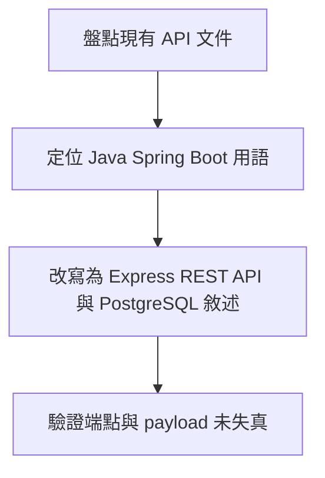
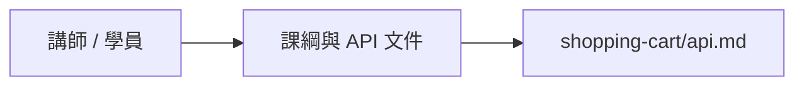
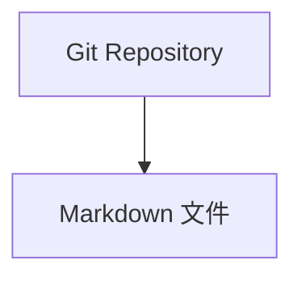
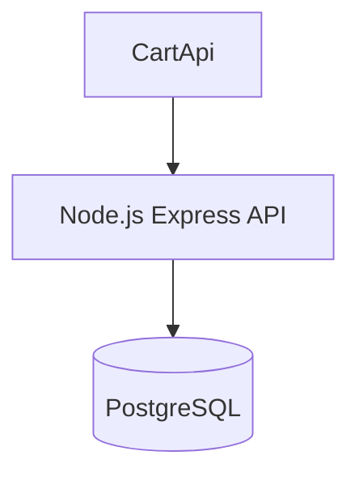
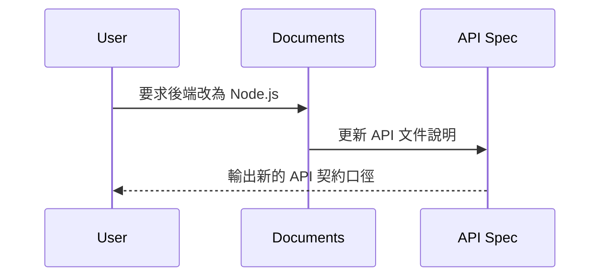
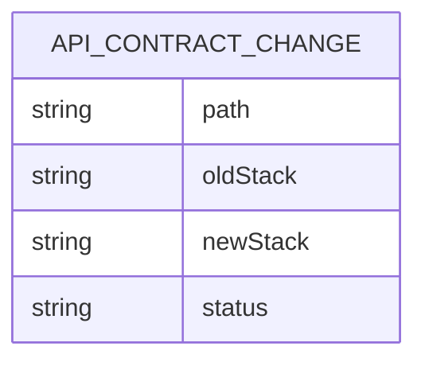
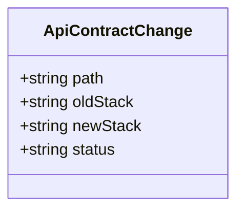
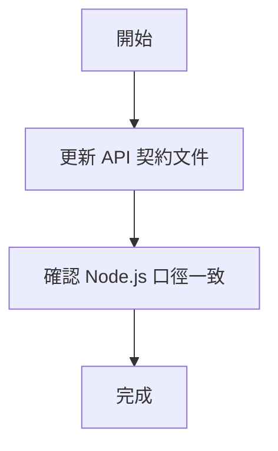
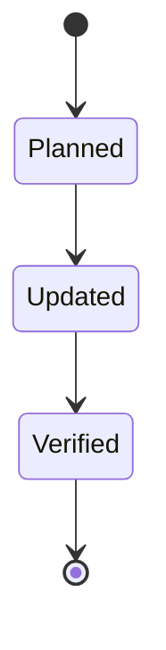

# Claude Code 課綱與 Shopping Cart 文件 API 規格

## 1. 架構與選型
- 本輪不新增可執行 API，而是調整文件中的 API 設計口徑。
- `shopping-cart/api.md` 需統一為 Node.js `Express` 版本的 RESTful API。
- 啟動、測試、資料儲存與驗證案例都需同步改成 `npm` / `Vitest` / `Supertest` / `PostgreSQL`，並補上 Docker Compose 啟動資料庫的說明。
- 教學圖更新屬靜態資產回填，不涉及 API 契約變更；但需維持既有 Markdown 路徑穩定。

## 2. 資料模型
- `ApiContractChange`
  - `path`
  - `oldStack`
  - `newStack`
  - `status`

## 3. 關鍵流程


## 4. 虛擬碼
```text
read shopping-cart/api.md
replace backend implementation notes with Node.js + PostgreSQL stack
keep route semantics stable while simplifying runtime and testing instructions
```

## 5. 系統脈絡圖


## 6. 容器/部署概觀


## 7. 模組關係圖（Backend / Frontend）


## 8. 序列圖


## 9. ER 圖


## 10. 類別圖（後端關鍵類別）


## 11. 流程圖


## 12. 狀態圖

