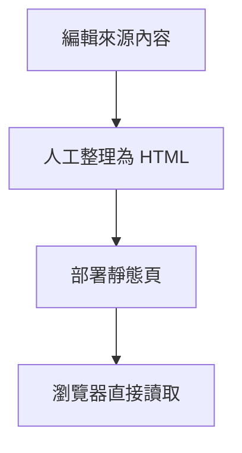
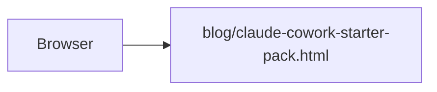
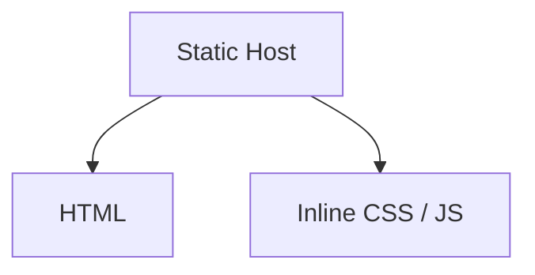
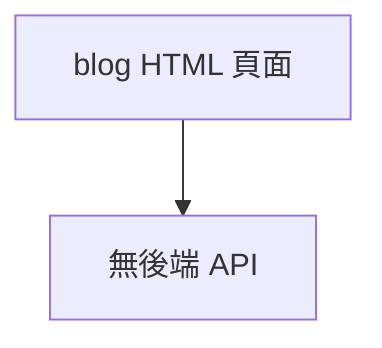
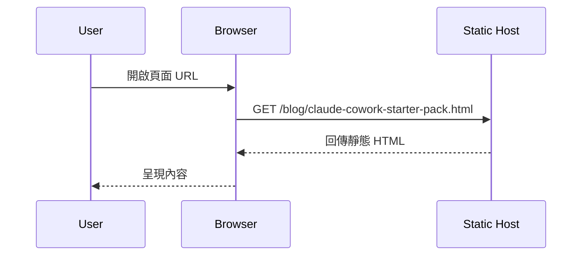
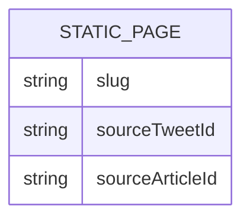
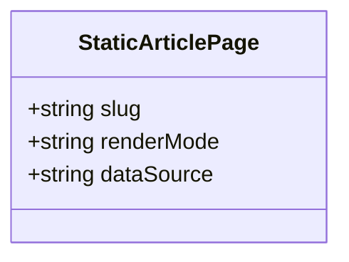
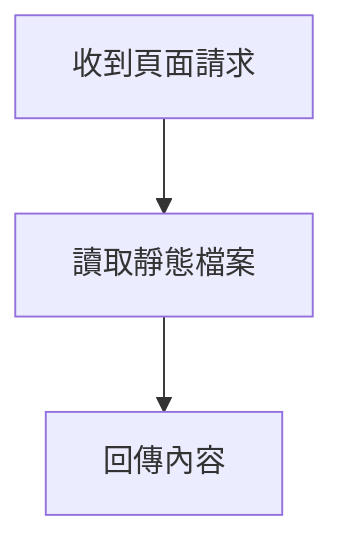
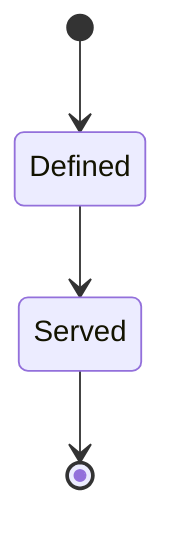

# Blog API 規格

## 1. 架構與選型
- 本次 `Claude Cowork Starter Pack` 教學頁屬於純靜態內容頁，不新增後端服務、API Gateway 或資料儲存。
- 專案仍以靜態 HTML 發佈，因此 API 文件的主要用途是明確記錄「無新增 API」，避免後續誤判需要串接資料源。

## 2. 資料模型
- `StaticArticlePage`
  - `slug`
  - `sourceTweetId`
  - `sourceArticleId`
  - `renderMode`: `static`
  - `dataSource`: `manual-curation`

## 3. 關鍵流程


## 4. 虛擬碼
```text
if request is for claude-cowork-starter-pack page:
  serve static html file from blog directory
no network fetch or runtime api call is required
```

## 5. 系統脈絡圖


## 6. 容器/部署概觀


## 7. 模組關係圖（Backend / Frontend）


## 8. 序列圖


## 9. ER 圖


## 10. 類別圖（後端關鍵類別）


## 11. 流程圖


## 12. 狀態圖


---

## Claude Code Skills Lessons 備註
- `blog/claude-code-skills-lessons.html` 與前一篇同樣為純靜態頁，不新增 API。
- 內容資料來源為人工整理後直接寫入 HTML，瀏覽器不會在執行階段向外部服務抓取文章內容。

## Claude Cowork AI 員工軍團頁備註
- `blog/claude-cowork-ai-workforce.html` 為純靜態教學頁，不新增 API。
- 頁面內容於編輯階段寫入 HTML，執行階段不對外抓取文章全文。

## Claude Code Skills 精簡策略頁備註
- `blog/claude-code-skills-shortlist.html` 為純靜態教學頁，不新增 API。
- 頁面內容於編輯階段寫入 HTML，執行階段不對外抓取文章全文。
