# Blog 前端規格

## 1. 架構與選型
- 前端採用原生 HTML、CSS、JavaScript 單頁檔案模式，維持 `blog` 目錄既有結構。
- 新文章頁延續現有 `blog` 的 Cyber / Glassmorphism 視覺語言，沿用 Google Fonts：`Orbitron`、`Rajdhani`、`IBM Plex Mono`。
- 內容來源以 `x/2031755971265974632/article.md` 與其對應圖片為基礎，轉為適合閱讀的長文頁。

## 2. 資料模型
- `ArticleMeta`
  - `slug`: `claude-skills-course`
  - `sourceTweetId`: `2031755971265974632`
  - `title`
  - `subtitle`
  - `author`
  - `publishDate`
  - `tags[]`
  - `stats[]`
- `ArticleSection`
  - `id`
  - `label`
  - `heading`
  - `body`
  - `media[]`

## 3. 關鍵流程
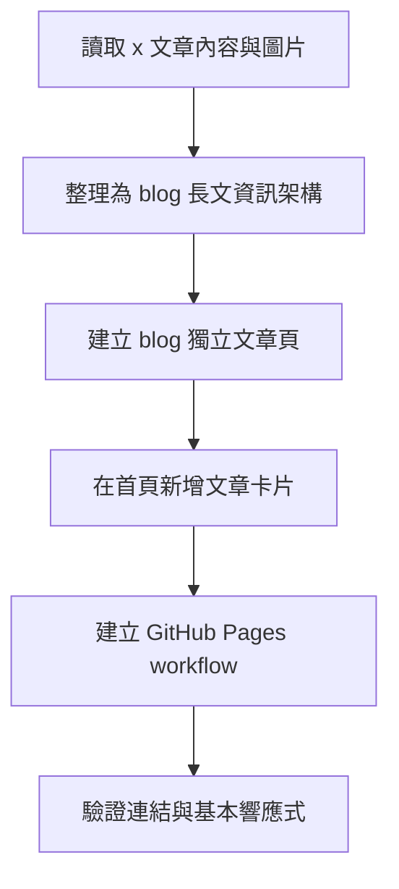

## 4. 虛擬碼
```text
load article markdown and images
group article content into readable sections
build hero, quick stats, section nav, content blocks
render images inline with article sections
add article card to blog index
configure GitHub Pages to deploy only blog directory
verify local links and theme toggle behavior
```

## 5. 系統脈絡圖
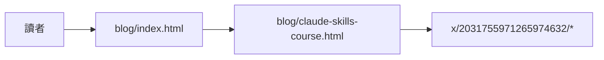

## 6. 容器/部署概觀
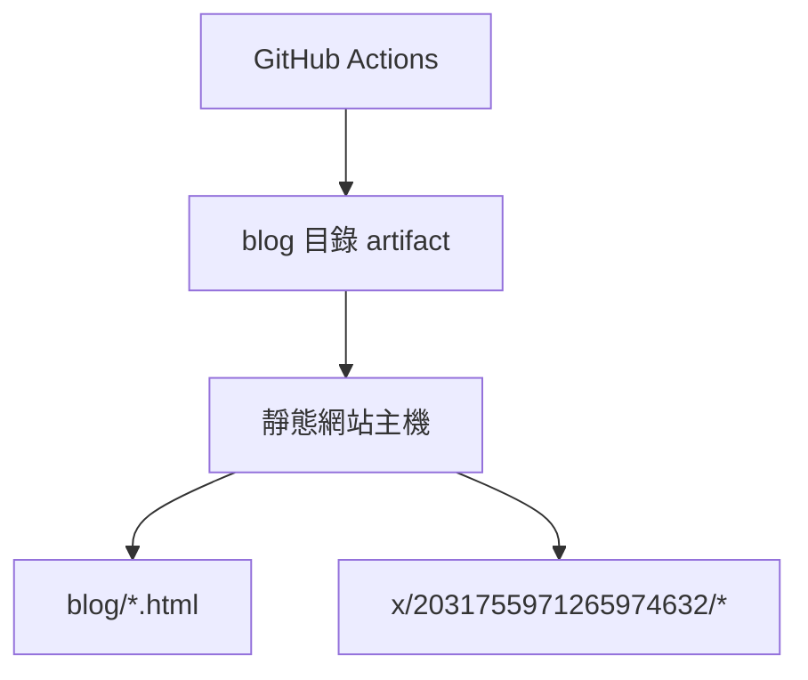

## 7. 模組關係圖（Frontend）
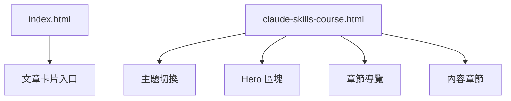

## 8. 序列圖
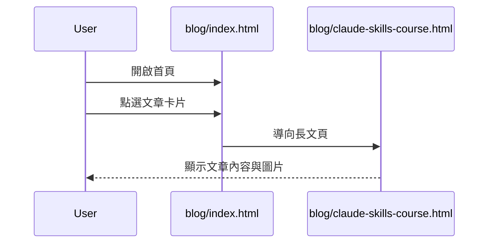

## 9. ER 圖
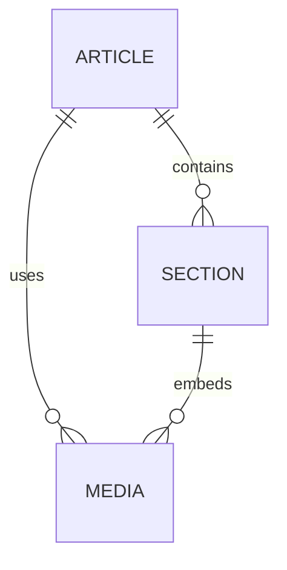

## 10. 類別圖（前端資料結構）
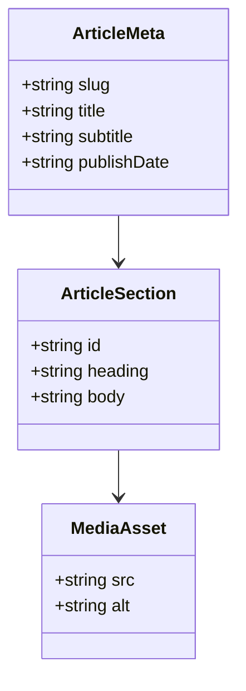

## 11. 流程圖
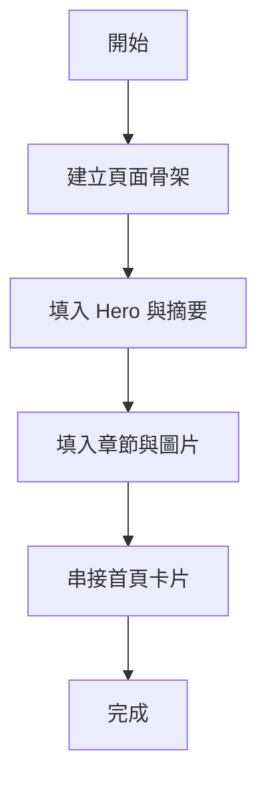

## 12. 狀態圖
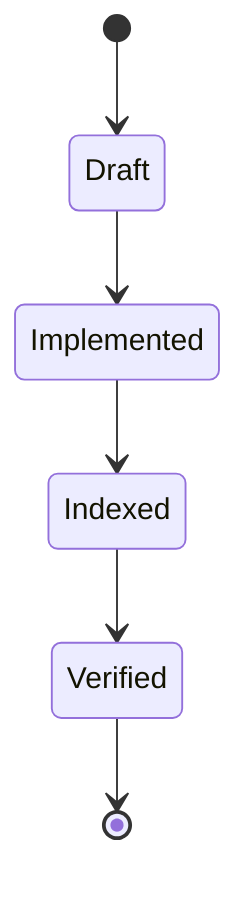

---

# Blog 前端規格：Claude Cowork Starter Pack 教學頁

## 1. 架構與選型
- 前端維持 `blog/` 目錄下的原生 HTML、CSS、JavaScript 單檔頁面模式，不引入額外建置工具。
- 新頁面採用與 `blog/index.html` 同源的 Cyber / Glassmorphism 視覺語言，但主題聚焦在 `Claude Cowork` 工作流與外掛生態。
- 內容來源以 `https://x.com/coreyganim/status/2033206539595461070` 對應的 X Article metadata 為主，並補充 Corey Ganim 近期公開貼文中可驗證的 Cowork / agent workflow 訊息，整理為教學化結構。

## 2. 資料模型
- `ArticleMeta`
  - `slug`: `claude-cowork-starter-pack`
  - `sourceTweetId`: `2033206539595461070`
  - `sourceArticleId`: `2033203065709350912`
  - `title`
  - `subtitle`
  - `author`
  - `publishDate`
  - `tags[]`
  - `learningOutcomes[]`
- `StarterPackSection`
  - `id`
  - `label`
  - `heading`
  - `summary`
  - `cards[]`
- `WorkflowCard`
  - `title`
  - `description`
  - `bullets[]`
  - `accent`

## 3. 關鍵流程
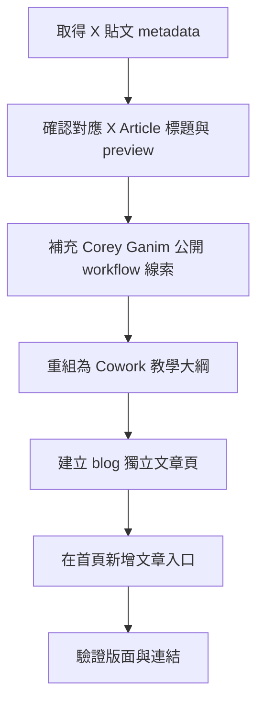

## 4. 虛擬碼
```text
load verified source metadata from tweet syndication endpoint
extract article title, preview text, author, publish date, cover image info
derive teachable modules: setup, plugins, skills, workflow, execution cadence
build standalone HTML with hero, quick-start checklist, architecture map, workflow cards, faq
link page from blog index with updated stats and article count
verify navigation, theme toggle, responsive layout, and file references
```

## 5. 系統脈絡圖
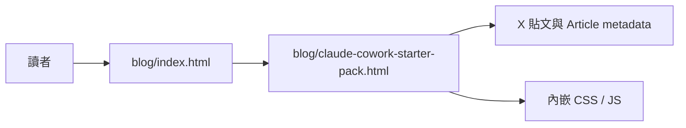

## 6. 容器/部署概觀
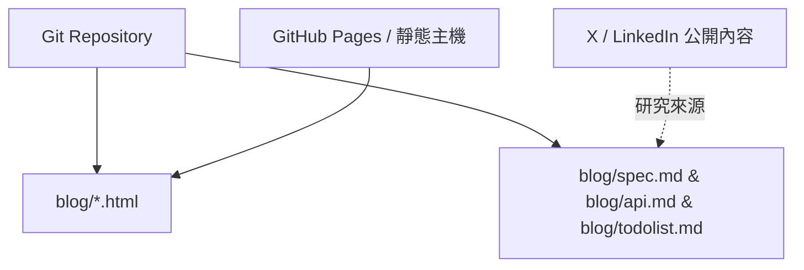

## 7. 模組關係圖（Frontend）
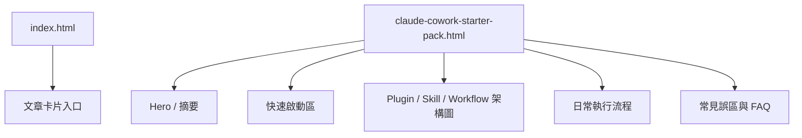

## 8. 序列圖
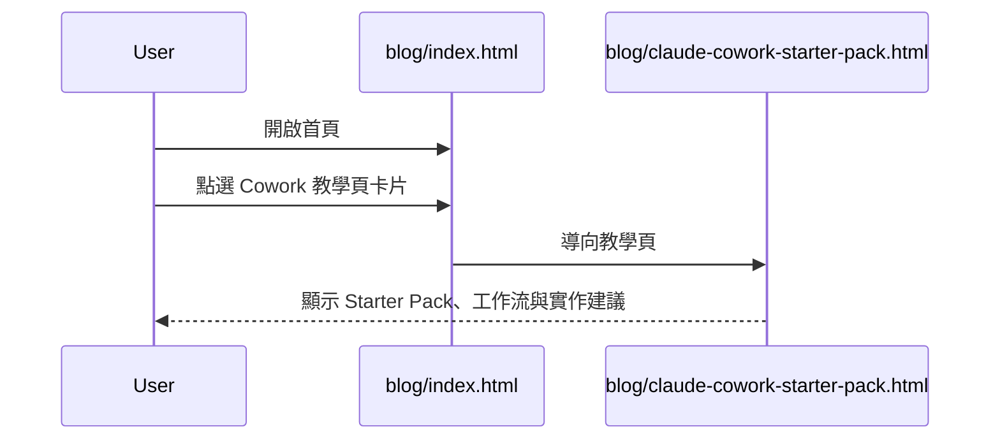

## 9. ER 圖
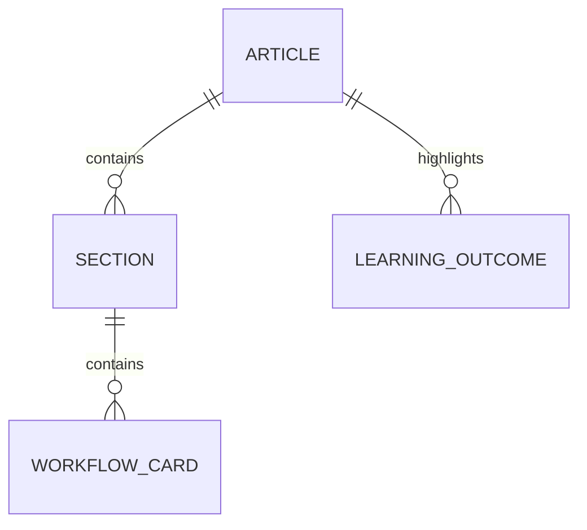

## 10. 類別圖（前端資料結構）
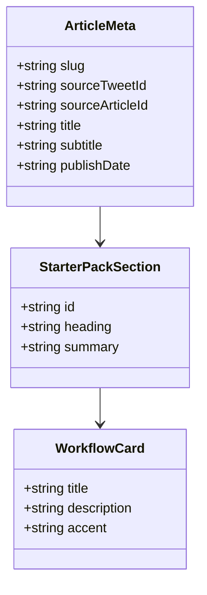

## 11. 流程圖
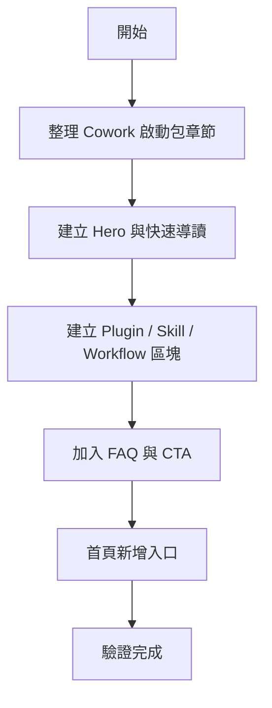

## 12. 狀態圖
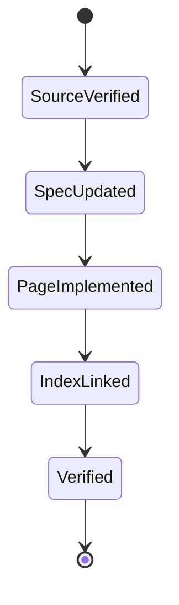

---

# Blog 前端規格：Claude Code Skills 精簡策略教學頁

## 1. 架構與選型
- 前端維持 `blog/` 目錄下的原生 HTML、CSS、JavaScript 單檔頁面模式。
- 新頁面延續既有 cyber / glassmorphism 風格，但主題聚焦在 `Skills 篩選`、`高價值技能保留`、`避免技能膨脹`。
- 內容來源以 `https://x.com/cnyzgkc/status/2034432870455140746` 對應的 X Article metadata 為主，重組成「實測很多 skills 後如何保留真正有效的 10 類能力」教學頁。

## 2. 資料模型
- `ArticleMeta`
  - `slug`: `claude-code-skills-shortlist`
  - `sourceTweetId`: `2034432870455140746`
  - `sourceArticleId`: `2034304992845455360`
  - `title`
  - `subtitle`
  - `author`
  - `publishDate`
  - `tags[]`
  - `criteria[]`
- `CuratedSection`
  - `id`
  - `heading`
  - `summary`
  - `cards[]`
- `SkillGroupCard`
  - `title`
  - `description`
  - `bullets[]`
  - `accent`

## 3. 關鍵流程
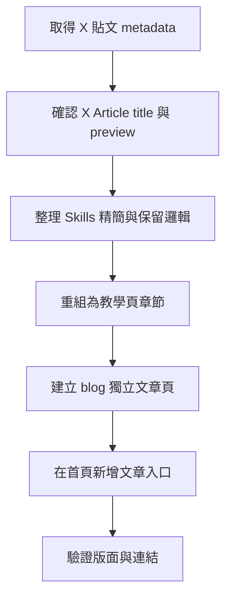

## 4. 虛擬碼
```text
load tweet metadata from syndication endpoint
extract title, preview, author, publish date, article id
derive sections: why too many skills fail, selection criteria, top skill groups, maintenance strategy, pitfalls
build static html article with hero, criteria cards, shortlist groups, workflow, faq
update blog index card list and counts
verify anchors, source links, and theme toggle
```

## 5. 系統脈絡圖
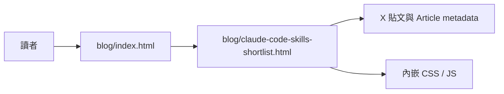

## 6. 容器/部署概觀
```mermaid
flowchart TD
  GitRepo[Git Repository] --> BlogFolder[blog/*.html]
  GitRepo --> Docs[blog/spec.md & blog/api.md & blog/todolist.md]
  StaticHost[GitHub Pages / 靜態主機] --> BlogFolder
  SourceSystem[X 公開 metadata] -.研究來源.-> Docs
```

## 7. 模組關係圖（Frontend）
```mermaid
flowchart TD
  Index[index.html] --> Card[文章卡片入口]
  ShortlistPage[claude-code-skills-shortlist.html] --> Hero[Hero / 摘要]
  ShortlistPage --> Criteria[篩選標準]
  ShortlistPage --> Groups[技能類型分組]
  ShortlistPage --> Maintenance[維護策略]
  ShortlistPage --> FAQ[常見誤區]
```

## 8. 序列圖
```mermaid
sequenceDiagram
  participant U as User
  participant I as blog/index.html
  participant P as blog/claude-code-skills-shortlist.html
  U->>I: 開啟首頁
  U->>I: 點選 Skills Shortlist 卡片
  I->>P: 導向教學頁
  P-->>U: 顯示 Skills 篩選與保留策略
```

## 9. ER 圖
```mermaid
erDiagram
  ARTICLE ||--o{ SECTION : contains
  SECTION ||--o{ SKILL_GROUP_CARD : contains
  ARTICLE ||--o{ CRITERION : highlights
```

## 10. 類別圖（前端資料結構）
```mermaid
classDiagram
  class ArticleMeta {
    +string slug
    +string sourceTweetId
    +string sourceArticleId
    +string title
    +string publishDate
  }
  class CuratedSection {
    +string id
    +string heading
    +string summary
  }
  class SkillGroupCard {
    +string title
    +string description
    +string accent
  }
  ArticleMeta --> CuratedSection
  CuratedSection --> SkillGroupCard
```

## 11. 流程圖
```mermaid
flowchart TD
  A[開始] --> B[整理 Skills Shortlist 章節]
  B --> C[建立 Hero 與摘要]
  C --> D[建立篩選標準與技能分組]
  D --> E[加入 FAQ 與 CTA]
  E --> F[首頁新增入口]
  F --> G[驗證完成]
```

## 12. 狀態圖
```mermaid
stateDiagram-v2
  [*] --> SourceVerified
  SourceVerified --> SpecUpdated
  SpecUpdated --> PageImplemented
  PageImplemented --> IndexLinked
  IndexLinked --> Verified
  Verified --> [*]
```

---

# Blog 前端規格：Claude Cowork AI 員工軍團教學頁

## 1. 架構與選型
- 前端維持 `blog/` 目錄下的原生 HTML、CSS、JavaScript 單檔頁面模式，不額外引入建置工具。
- 新頁面沿用既有 cyber / glassmorphism 視覺語言，但內容主題切換成 `AI 員工軍團`、`角色分工`、`Cowork 工作流`。
- 內容來源以 `https://x.com/imaxichuhai/status/2034259904853074033` 對應的 X Article metadata 為主，並根據 preview 中可驗證資訊整理成中文工作流教學頁。

## 2. 資料模型
- `ArticleMeta`
  - `slug`: `claude-cowork-ai-workforce`
  - `sourceTweetId`: `2034259904853074033`
  - `sourceArticleId`: `2034256530124701696`
  - `title`
  - `subtitle`
  - `author`
  - `publishDate`
  - `tags[]`
  - `roles[]`
- `WorkflowSection`
  - `id`
  - `heading`
  - `summary`
  - `cards[]`
- `RoleCard`
  - `title`
  - `description`
  - `bullets[]`
  - `accent`

## 3. 關鍵流程
```mermaid
flowchart TD
  A[取得 X 貼文 metadata] --> B[確認 X Article title 與 preview]
  B --> C[整理 AI 員工軍團主題脈絡]
  C --> D[重組為工作流教學頁章節]
  D --> E[建立 blog 獨立文章頁]
  E --> F[在首頁新增文章入口]
  F --> G[驗證版面與連結]
```

## 4. 虛擬碼
```text
load tweet metadata from syndication endpoint
extract title, preview, author, publish date, article id
derive sections: why cowork fails, role design, delegation loop, daily operations, pitfalls
build standalone html with hero, role cards, workflow timeline, faq
update blog index article count and card list
verify anchors, theme toggle, and source references
```

## 5. 系統脈絡圖
```mermaid
flowchart LR
  Reader[讀者] --> BlogIndex[blog/index.html]
  BlogIndex --> WorkforcePage[blog/claude-cowork-ai-workforce.html]
  WorkforcePage --> SourceMeta[X 貼文與 Article metadata]
  WorkforcePage --> LocalStyles[內嵌 CSS / JS]
```

## 6. 容器/部署概觀
```mermaid
flowchart TD
  GitRepo[Git Repository] --> BlogFolder[blog/*.html]
  GitRepo --> Docs[blog/spec.md & blog/api.md & blog/todolist.md]
  StaticHost[GitHub Pages / 靜態主機] --> BlogFolder
  SourceSystem[X 公開 metadata] -.研究來源.-> Docs
```

## 7. 模組關係圖（Frontend）
```mermaid
flowchart TD
  Index[index.html] --> Card[文章卡片入口]
  WorkforcePage[claude-cowork-ai-workforce.html] --> Hero[Hero / 摘要]
  WorkforcePage --> Roles[角色分工]
  WorkforcePage --> Workflow[協作流程]
  WorkforcePage --> Ops[營運節奏]
  WorkforcePage --> FAQ[常見誤區]
```

## 8. 序列圖
```mermaid
sequenceDiagram
  participant U as User
  participant I as blog/index.html
  participant P as blog/claude-cowork-ai-workforce.html
  U->>I: 開啟首頁
  U->>I: 點選 Cowork 教學頁卡片
  I->>P: 導向教學頁
  P-->>U: 顯示 AI 員工軍團與工作流內容
```

## 9. ER 圖
```mermaid
erDiagram
  ARTICLE ||--o{ SECTION : contains
  SECTION ||--o{ ROLE_CARD : contains
  ARTICLE ||--o{ ROLE : highlights
```

## 10. 類別圖（前端資料結構）
```mermaid
classDiagram
  class ArticleMeta {
    +string slug
    +string sourceTweetId
    +string sourceArticleId
    +string title
    +string publishDate
  }
  class WorkflowSection {
    +string id
    +string heading
    +string summary
  }
  class RoleCard {
    +string title
    +string description
    +string accent
  }
  ArticleMeta --> WorkflowSection
  WorkflowSection --> RoleCard
```

## 11. 流程圖
```mermaid
flowchart TD
  A[開始] --> B[整理 AI 員工軍團章節]
  B --> C[建立 Hero 與摘要]
  C --> D[建立角色卡與協作流程]
  D --> E[加入 FAQ 與 CTA]
  E --> F[首頁新增入口]
  F --> G[驗證完成]
```

## 12. 狀態圖
```mermaid
stateDiagram-v2
  [*] --> SourceVerified
  SourceVerified --> SpecUpdated
  SpecUpdated --> PageImplemented
  PageImplemented --> IndexLinked
  IndexLinked --> Verified
  Verified --> [*]
```

---

# Blog 前端規格：Claude Code Skills Lessons 教學頁

## 1. 架構與選型
- 前端維持 `blog/` 目錄下的原生 HTML、CSS、JavaScript 單檔頁面模式，不引入額外前端框架。
- 新頁面延續 `blog/` 現有長文頁的 cyber / glassmorphism 風格，但視覺主題聚焦在 `Skills`、`extensions`、`workflow patterns`。
- 內容來源以 `https://x.com/trq212/status/2033949937936085378` 對應的 X Article metadata 為主，並結合已公開可驗證的 Claude Skills 脈絡，重組成「How We Use Skills」教學頁。

## 2. 資料模型
- `ArticleMeta`
  - `slug`: `claude-code-skills-lessons`
  - `sourceTweetId`: `2033949937936085378`
  - `sourceArticleId`: `2033772621536591872`
  - `title`
  - `subtitle`
  - `author`
  - `publishDate`
  - `tags[]`
  - `principles[]`
- `LessonSection`
  - `id`
  - `heading`
  - `summary`
  - `cards[]`
- `PatternCard`
  - `title`
  - `description`
  - `bullets[]`
  - `accent`

## 3. 關鍵流程
```mermaid
flowchart TD
  A[取得 X 貼文 metadata] --> B[確認 X Article title 與 preview]
  B --> C[整理 Skills 主題脈絡與最佳實踐]
  C --> D[重組為教學頁章節]
  D --> E[建立 blog 獨立文章頁]
  E --> F[在首頁新增文章卡片]
  F --> G[驗證版面與連結]
```

## 4. 虛擬碼
```text
load tweet metadata from syndication endpoint
extract title, preview, author, publish date, article id
derive teachable sections: why skills, design rules, composition patterns, failure modes, distribution
build static html article with hero, principle cards, skill anatomy, workflow, faq
update blog index counts and article card
verify section anchors, theme toggle, and source references
```

## 5. 系統脈絡圖
```mermaid
flowchart LR
  Reader[讀者] --> BlogIndex[blog/index.html]
  BlogIndex --> SkillsPage[blog/claude-code-skills-lessons.html]
  SkillsPage --> SourceMeta[X 貼文與 Article metadata]
  SkillsPage --> LocalStyles[內嵌 CSS / JS]
```

## 6. 容器/部署概觀
```mermaid
flowchart TD
  GitRepo[Git Repository] --> BlogFolder[blog/*.html]
  GitRepo --> Docs[blog/spec.md & blog/api.md & blog/todolist.md]
  StaticHost[GitHub Pages / 靜態主機] --> BlogFolder
  SourceSystem[X 公開 metadata] -.研究來源.-> Docs
```

## 7. 模組關係圖（Frontend）
```mermaid
flowchart TD
  Index[index.html] --> Card[文章卡片入口]
  SkillsPage[claude-code-skills-lessons.html] --> Hero[Hero / 摘要]
  SkillsPage --> Principles[Skills 核心原則]
  SkillsPage --> Anatomy[Skill 結構與組合]
  SkillsPage --> Patterns[實戰設計模式]
  SkillsPage --> FAQ[常見問題]
```

## 8. 序列圖
```mermaid
sequenceDiagram
  participant U as User
  participant I as blog/index.html
  participant P as blog/claude-code-skills-lessons.html
  U->>I: 開啟首頁
  U->>I: 點選 Skills 教學頁卡片
  I->>P: 導向教學頁
  P-->>U: 顯示 Skills 原則與設計方式
```

## 9. ER 圖
```mermaid
erDiagram
  ARTICLE ||--o{ SECTION : contains
  SECTION ||--o{ PATTERN_CARD : contains
  ARTICLE ||--o{ PRINCIPLE : highlights
```

## 10. 類別圖（前端資料結構）
```mermaid
classDiagram
  class ArticleMeta {
    +string slug
    +string sourceTweetId
    +string sourceArticleId
    +string title
    +string publishDate
  }
  class LessonSection {
    +string id
    +string heading
    +string summary
  }
  class PatternCard {
    +string title
    +string description
    +string accent
  }
  ArticleMeta --> LessonSection
  LessonSection --> PatternCard
```

## 11. 流程圖
```mermaid
flowchart TD
  A[開始] --> B[整理 Skills 教學章節]
  B --> C[建立 Hero 與摘要]
  C --> D[建立原則卡片與模式區]
  D --> E[加入 FAQ 與 CTA]
  E --> F[首頁新增入口]
  F --> G[驗證完成]
```

## 12. 狀態圖
```mermaid
stateDiagram-v2
  [*] --> SourceVerified
  SourceVerified --> SpecUpdated
  SpecUpdated --> PageImplemented
  PageImplemented --> IndexLinked
  IndexLinked --> Verified
  Verified --> [*]
```
