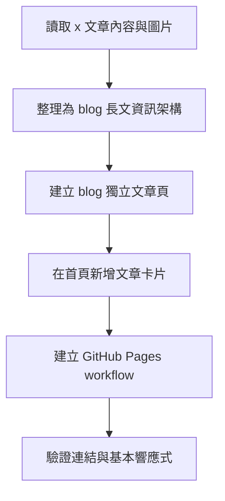
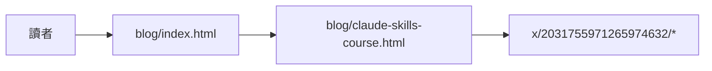
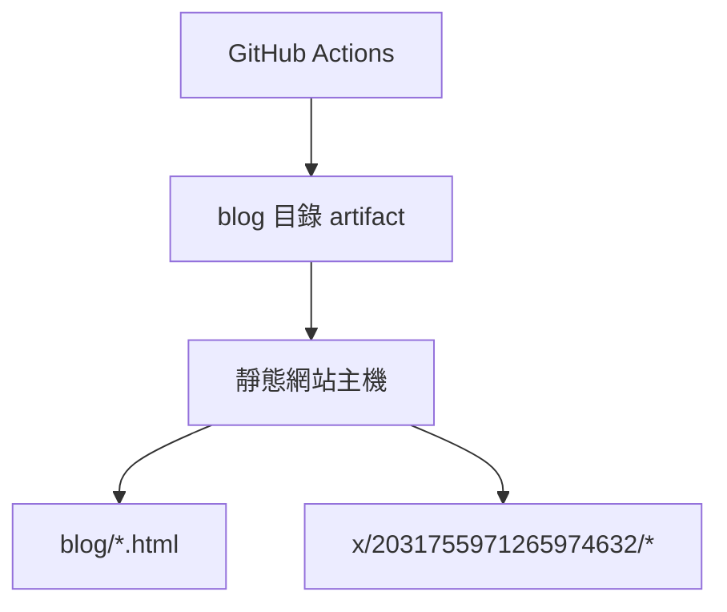
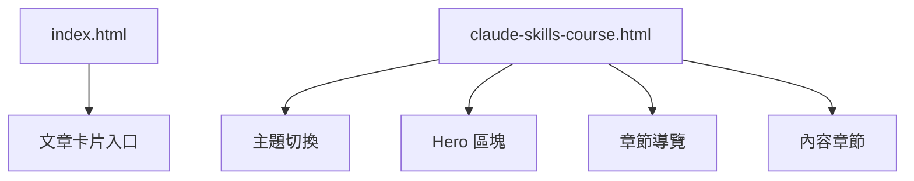
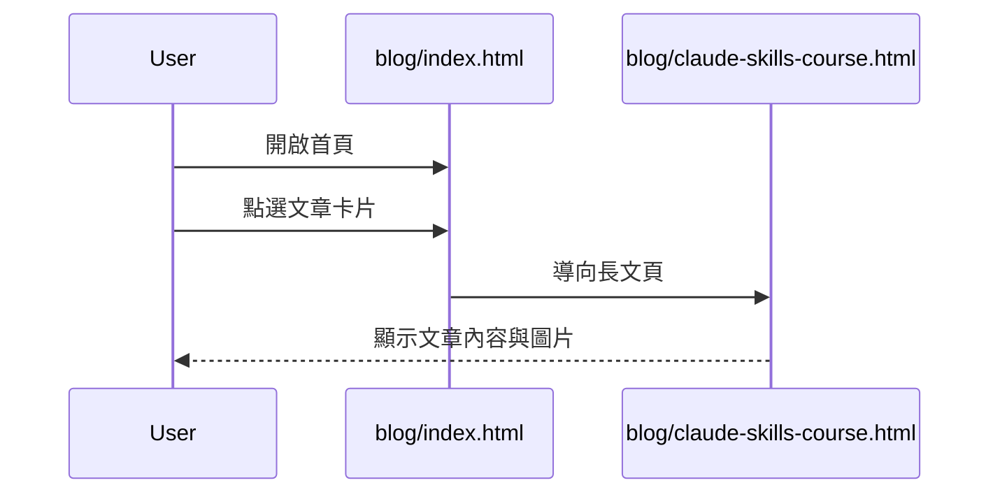
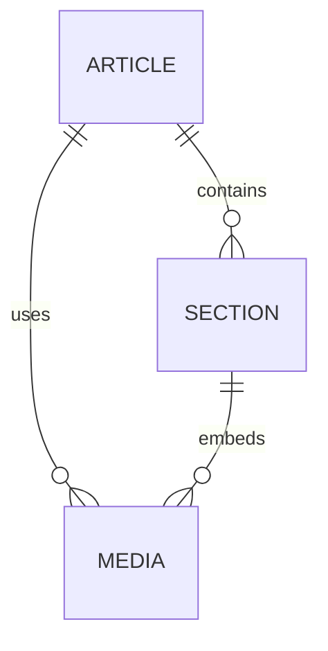
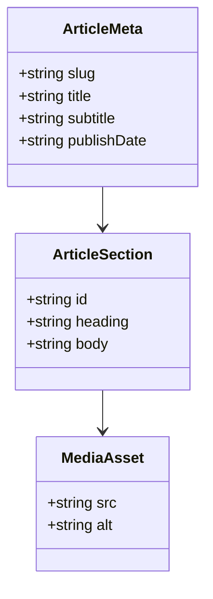
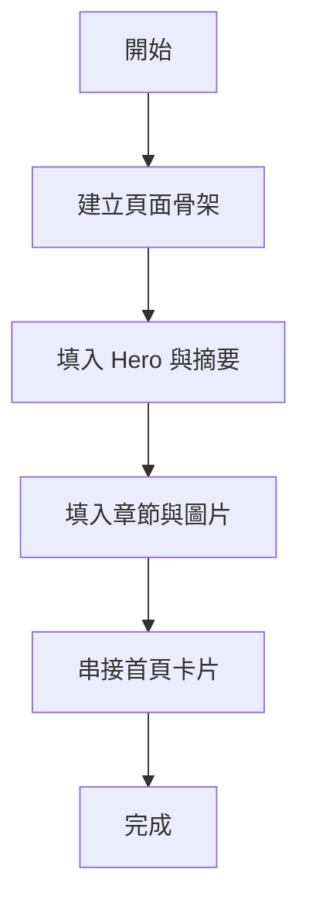
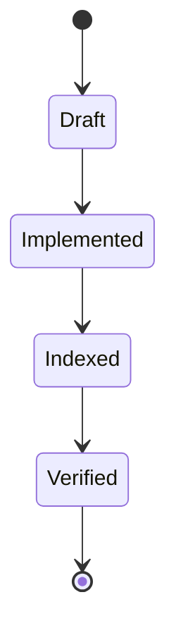

# Blog 前端規格

## 1. 架構與選型
- 前端採用原生 HTML、CSS、JavaScript 單頁檔案模式，維持 `blog` 目錄既有結構。
- 新文章頁延續現有 `blog` 的 Cyber / Glassmorphism 視覺語言，沿用 Google Fonts：`Orbitron`、`Rajdhani`、`IBM Plex Mono`。
- 內容來源以 `x/2031755971265974632/article.md` 與其對應圖片為基礎，轉為適合閱讀的長文頁。

## 2. 資料模型
- `ArticleMeta`
  - `slug`: `claude-skills-course`
  - `sourceTweetId`: `2031755971265974632`
  - `title`
  - `subtitle`
  - `author`
  - `publishDate`
  - `tags[]`
  - `stats[]`
- `ArticleSection`
  - `id`
  - `label`
  - `heading`
  - `body`
  - `media[]`

## 3. 關鍵流程


## 4. 虛擬碼
```text
load article markdown and images
group article content into readable sections
build hero, quick stats, section nav, content blocks
render images inline with article sections
add article card to blog index
configure GitHub Pages to deploy only blog directory
verify local links and theme toggle behavior
```

## 5. 系統脈絡圖


## 6. 容器/部署概觀


## 7. 模組關係圖（Frontend）


## 8. 序列圖


## 9. ER 圖


## 10. 類別圖（前端資料結構）


## 11. 流程圖


## 12. 狀態圖

