# Claude Code：全端專案實作與 AI 開發工作流

**課程定位**：講師將帶領學員以一個真實的全端專案為主線，完整展示如何把 Claude Code 放進日常開發流程。課程聚焦在版本控制、文件驅動、SDD/TDD 開發紀律、Skill 設計、背景 Agent、多模式操作與高效率除錯，讓學員學會一套可以直接搬進工作的做法。

---

## 🛒 課程主專案：購物車系統（Shopping Cart）

本課程所有範例、實作與示範，均圍繞同一個**購物車系統**主線展開。專案涵蓋商品瀏覽、加入購物車、數量管理與結帳表單，讓學員在真實情境中體驗 SDD、TDD、Playwright 驗證、Skill 製作與背景 Agent 的完整工作流。

**技術棧**：

- **後端**：Node.js 20 + Express + PostgreSQL（Docker 啟動）
- **前端**：React + Vite

**核心實體**：

- `Product`（商品）
- `Cart`（購物車）
- `CartItem`（購物車明細）

**功能範圍**：

1. 使用者可瀏覽商品並加入購物車
2. 加入相同商品自動合併數量
3. 數量改為 0 則自動移除
4. 購物車合計由伺服器計算（不接受客戶端傳入）
5. 結帳時填收件資料後清空購物車

---

## 第 1 段：Git、GitHub 與 Claude Code 起手式（60 mins）

**目標**：先建立正確的開發起手式，讓學員理解 Claude Code 不是取代版本控制，而是強化版本控制與專案治理。

### 📦 本章工具一覽（先看清單，再進細節）

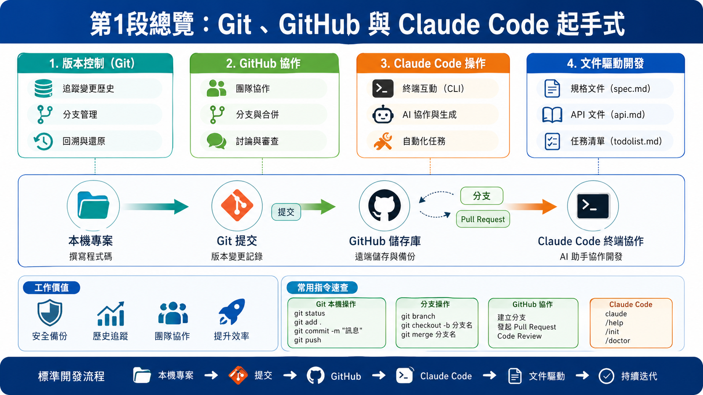

> 本章會用到以下 7 個工具——**詳細安裝方式分散在 1-1 / 1-2 / 1-3 / 1-4 各小節**，本表先讓你掌握全貌，避免學到中途才發現缺工具。

| # | 工具                                 | 用途                                            | 安裝段落 | 必要性  |
| - | ------------------------------------ | ----------------------------------------------- | -------- | ------- |
| 1 | **Claude Code（CLI）**         | 主角；終端機 AI 編程工具                        | 1-1      | ⭐ 必裝 |
| 2 | **Node.js v20+**               | 前端 React/Vite 開發（CLI 本身不需要 Node.js）  | 1-1      | ⭐ 必裝 |
| 3 | **VS Code + Claude Code 插件** | 圖形化操作介面（與 CLI 二選一或並用）           | 1-2      | 🔵 推薦 |
| 4 | **Docker Desktop**             | 用 AI 控制 Docker 安裝與啟動 PostgreSQL         | 1-3      | ⭐ 必裝 |
| 5 | **Git**                        | 版本控制                                        | 1-4      | ⭐ 必裝 |
| 6 | **GitHub CLI（gh）**           | 從終端機操作 GitHub（建 repo / 開 PR）          | 1-4      | ⭐ 必裝 |
|   |                                      |                                                 |          |         |

**終端機環境**（不需安裝，但要知道用哪個）：

* **Windows**：PowerShell 7+ 或 Windows Terminal
* **macOS**：Terminal.app 或 iTerm2

#### 🗂 PostgreSQL 檢視工具快速參考（雙平台對照）

| 平台              | 安裝方式                                                   | 驗證方式                                      |
| ----------------- | ---------------------------------------------------------- | --------------------------------------------- |
| **Windows** | 安裝[DBeaver](https://dbeaver.io/) 或 TablePlus               | 能連上 `localhost:5432` 的 `shoppingcart` |
| **macOS**   | `brew install --cask dbeaver-community` 或使用 TablePlus | 能連上 `localhost:5432` 的 `shoppingcart` |

**為什麼資料庫選 PostgreSQL**：更貼近真實專案，能自然帶到 schema、constraint、migration 與連線管理等實務議題。

**為什麼強調 Docker**：學員不需手動安裝 PostgreSQL，本課示範如何直接用自然語言讓 Claude 生成 `docker-compose.yml`、啟動容器、驗證 healthy、回填後端設定。

### 1-1 環境安裝、登入與操作模式（20 mins）

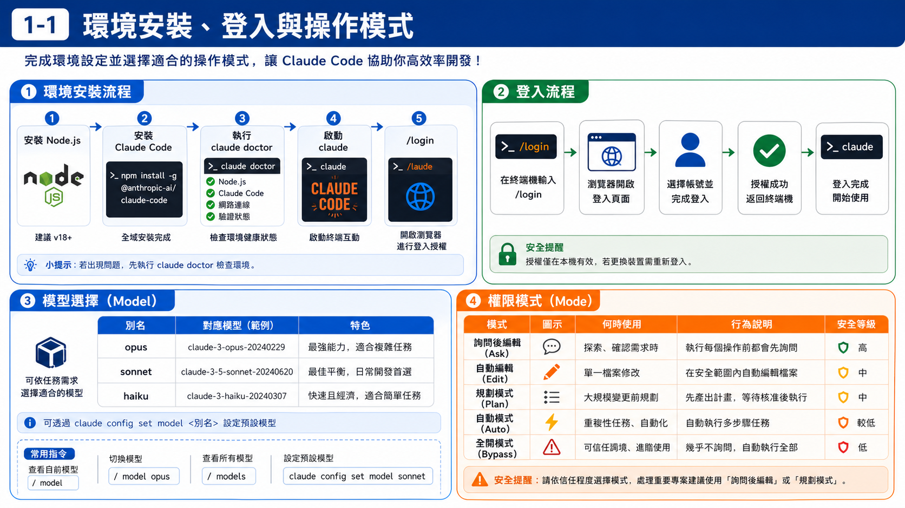

* **Claude Code 安裝與登入**（雙平台對照，**Native Install 為官方推薦**）：

  | 平台              | 推薦安裝指令                                        | 其他方式                                                            |
  | ----------------- | --------------------------------------------------- | ------------------------------------------------------------------- |
  | **Windows** | `irm https://claude.ai/install.ps1 \| iex`        | `winget install Anthropic.ClaudeCode` / npm（需 Node.js v20+）     |
  | **macOS**   | `curl -fsSL https://claude.ai/install.sh \| bash` | `brew install --cask claude-code` / npm（需 Node.js v20+）         |

  > ⚠️ **Windows 注意**：Native Install 需先安裝 [Git for Windows](https://git-scm.com/downloads/win)（Claude Code 內部使用 Git Bash 執行命令）。
  >
  > 💡 **自動更新**：Native Install 與 WinGet 安裝的版本會在背景自動更新，Homebrew / npm 需手動執行升級。
  >
  > 🔧 **npm 備用安裝**：若偏好 npm 管理工具版本，執行 `npm install -g @anthropic-ai/claude-code`（需 Node.js v20+）。

  * 安裝後共用：`claude --version` 確認版本 → `claude doctor` 健檢 → `claude` 啟動並依瀏覽器提示登入。
  * 介紹 `/login`、模型切換與基本指令：`@` 參照檔案、`/help`、`/init`。
* **訂閱方案與費用**：

  | 方案            | 定位         | Claude Code 預設模型 | 備註                    |
  | --------------- | ------------ | -------------------- | ----------------------- |
  | Pro             | 個人開發者   | Sonnet 4.6           | 含 Claude Code 基本用量 |
  | Max 5x / 20x    | 重度個人用戶 | Opus 4.7             | 用量為 Pro 的 5x / 20x  |
  | Team Standard   | 團隊協作     | Sonnet 4.6           | 含管理控制台            |
  | Team Premium    | 團隊重度使用 | Opus 4.7（預設）     | Opus 1M 上下文已含      |
  | Enterprise      | 企業合規     | Opus 4.7（可設定）   | SSO、自訂政策、合規 API |
  | API（按量付費） | 開發者整合   | 自選                 | 依 token 計費           |


  * **API 用量成本**：平均約 **$6／開發者／天**，90% 使用者每日低於 $12；月平均 **$100–200／人**（使用 Sonnet 4.6）。
  * **額度重置規則**：達到用量上限後，**每 5 小時重置一次**（非固定時間點）。超出部份可開啟「Extra Usage」以 API 計費延續使用，每日上限 $2,000。
* **可用模型與選擇策略**：

  | 別名                          | 對應模型                   | 適合場景               |
  | ----------------------------- | -------------------------- | ---------------------- |
  | `sonnet`                    | Claude Sonnet 4.6          | 日常編程（性價比最高） |
  | `opus`                      | Claude Opus 4.7            | 複雜架構決策、多步推理 |
  | `haiku`                     | Claude Haiku 4.5           | 簡單子任務、Agent 分工 |
  | `opusplan`                  | 規劃用 Opus，執行切 Sonnet | 大型任務兼顧品質與成本 |
  | `sonnet[1m]` / `opus[1m]` | 同上 + 100 萬 token 上下文 | 超大型程式碼庫         |


  * **模型切換**：session 中用 `/model <別名>`，啟動時用 `--model <別名>`，或在 `/config` 設定預設。
  * **Effort 等級**：`/effort low/medium/high/max` 調整推理深度，預設 `medium`；提示詞中加 `ultrathink` 可單次觸發 high effort。
* **VS Code 插件 vs CLI 模式差異**：

  | 面向       | VS Code 插件              | CLI（Terminal）    |
  | ---------- | ------------------------- | ------------------ |
  | 啟動方式   | 側邊欄面板 / Ctrl+Shift+C | `claude` 指令    |
  | 檔案參照   | 自動感知當前開啟檔案      | 需明確 `@` 參照  |
  | 適合場景   | UI 開發、邊寫邊問         | 自動化任務、長流程 |
  | 上下文感知 | 與編輯器同步              | 從終端機角度操作   |
* **五種權限／操作模式**（VS Code 插件選單 + CLI 對應）：

  | 模式     | VS Code 名稱       | CLI 對應                                                                         | 說明                                                                                                                                 |
  | -------- | ------------------ | -------------------------------------------------------------------------------- | ------------------------------------------------------------------------------------------------------------------------------------ |
  | 逐步確認 | Ask before edits   | 預設互動模式（`default`）                                                      | 每次編輯前詢問，適合探索與學習                                                                                                       |
  | 自動編輯 | Edit automatically | `--permission-mode acceptEdits`                                                | 自動接受檔案編輯，不需手動確認每次修改                                                                                               |
  | 規劃模式 | Plan mode          | `--permission-mode plan`                                                       | 只讀不寫：探索程式碼、提出計畫，再切換模式執行；session 內可用 `/plan` 前綴觸發                                                    |
  | 自動模式 | Auto mode          | `--permission-mode auto --enable-auto-mode`                                    | 由背景 classifier 模型審核每個操作，合法才自動執行，無需手動確認；**需 Team / Enterprise / API 方案 + Sonnet 4.6 或 Opus 4.7** |
  | 全開模式 | Bypass permissions | `--permission-mode bypassPermissions`（或 `--dangerously-skip-permissions`） | 跳過所有權限提示，適合已隔離的容器／CI 環境，**需謹慎使用**                                                                    |


  > **如何開啟 Auto 與 Bypass 模式（深入版）**
  >

  **Auto Mode 啟用前提**：

  - **方案限制**：需 **Team / Enterprise / API** 方案（個人 Pro / Max 不可用）
  - **模型限制**：僅 **Sonnet 4.6 或 Opus 4.7**（不支援 Haiku、claude-3 系列、Bedrock / Vertex / Foundry 等第三方供應商）
  - **組織層級**：Team 與 Enterprise 需由管理員先在 Claude Code admin settings 啟用

  **Auto Mode CLI 啟用方式**：

  ```bash
  # 方法 1：啟用後可用 Shift+Tab 循環切換（推薦）
  claude --enable-auto-mode

  # 方法 2：啟動時直接以 auto 為預設模式
  claude --permission-mode auto

  # 方法 3：非互動腳本執行
  claude -p "refactor the auth module" --permission-mode auto
  ```

  進入 session 後，按 **Shift+Tab** 循環切換：`default → acceptEdits → plan → auto`。

  **Bypass Mode（⚠️ 危險）**：

  Bypass 會**停用所有權限提示與安全檢查**，工具呼叫立即執行。**僅 `.git`、`.vscode`、`.idea` 與部分 `.claude` 子目錄的寫入仍會提示**（這個灰色地帶是為了避免破壞版控與工具設定）。

  > ⚠️ **警告**：此模式對提示詞注入（prompt injection）**完全無保護**，僅應在隔離環境（容器、VM、devcontainer）中使用。
  >

  ```bash
  # 兩種等效寫法
  claude --permission-mode bypassPermissions
  claude --dangerously-skip-permissions

  # 讓 bypass 出現在 Shift+Tab 循環中但不作為起始模式
  claude --allow-dangerously-skip-permissions --permission-mode plan
  ```

  **VS Code / Desktop 啟用**：在擴充套件設定中勾選「**Allow dangerously skip permissions**」，兩個模式才會出現在底部模式選單。

  **Auto vs Bypass 對照（決策依據）**：

  | 項目       | **Auto Mode**      | **Bypass Mode** |
  | ---------- | ------------------------ | --------------------- |
  | 權限提示   | 無（除非 fallback 觸發） | 無（少數目錄仍提示）  |
  | 安全檢查   | 分類器審查每個指令       | **完全沒有**    |
  | Token 使用 | 較高（分類器呼叫成本）   | 標準                  |
  | 適用場景   | 長時間任務、減少中斷     | 僅限隔離容器 / VM     |
  | 風險等級   | 中等                     | **高**          |

  > **黃金建議**：除非確實在沙盒環境中，否則**優先選擇 Auto Mode 取代 Bypass Mode**。Auto Mode 由分類器在背景阻擋越權或可疑行為（如 `curl | bash`、生產環境部署、強制推送），保有安全層；Bypass Mode 則完全裸奔。
  >

  **管理員控制**：組織管理員可透過 managed settings 全面禁用：

  - 禁用 Bypass：`permissions.disableBypassPermissionsMode: "disable"`
  - 禁用 Auto：`disableAutoMode: "disable"`

  * **`--print` 非互動模式**：`claude -p "..."` 單次輸出後退出，適合腳本整合與管道操作（獨立於上述權限模式之外）。

### 1-2 介面導覽：CLI vs VS Code 插件、設定與 CLAUDE.md（15 mins）

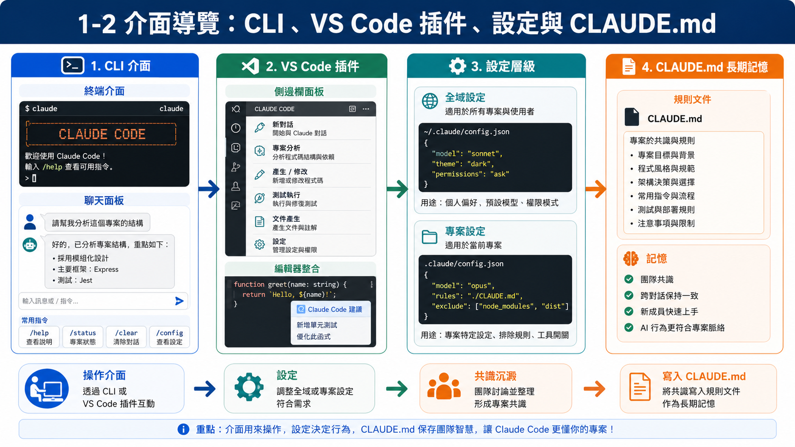

> **目標**：讓學員在第一次開啟 Claude Code 後就能找到方向——知道介面在哪、設定怎麼改、以及如何把「共識」寫進 CLAUDE.md 讓 Claude 永遠記住。

#### CLI 介面導覽

* **啟動**：在終端機執行 `claude`，進入互動式 TUI。

  * **Windows**：PowerShell 7+（推薦）或 Windows Terminal
  * **macOS**：Terminal.app 或 iTerm2（推薦）
* **基本佈局**：

  * 上方顯示目前對話上下文（token 用量、模型名稱）
  * 中間為對話區
  * 下方為輸入提示列，支援多行輸入（Shift+Enter 換行）
* **常用快捷鍵**：

  * `Ctrl+C`：中斷當前輸出
  * `Shift+Tab`：循環切換操作模式（Ask / Edit / Plan 等）
  * `↑ ↓`：瀏覽歷史指令
* **重要 CLI 參數速覽**：

  | 參數                              | 說明                     |
  | --------------------------------- | ------------------------ |
  | `--model <別名>`                | 啟動時指定模型           |
  | `--permission-mode acceptEdits` | 自動接受檔案編輯         |
  | `--print "..."`                 | 非互動單次輸出（腳本用） |
  | `--resume`                      | 恢復上次 session         |

#### VS Code 插件介面導覽

* **安裝**：在 VS Code 擴充套件市集搜尋「**Claude Code**」並安裝。
* **開啟方式**：點 Claude 圖示。
* **介面區塊**：
  * **Chat 面板**：主要對話區，可直接 `@` 參照當前開啟的檔案。
  * **底部狀態列**：顯示目前模式（Ask / Edit / Plan / Auto / Bypass），點擊可切換。
  * **Diff 預覽**：Claude 提出修改時，右側會顯示 diff，可逐行接受或拒絕。
* **與 CLI 的關鍵差異**：
  * VS Code 插件自動感知目前開啟的檔案，無需手動 `@`。
  * Inline 建議直接嵌入編輯器，適合邊看邊改的 UI 開發流。

#### 設定層級：Global vs Project

| 層級                        | 位置                               | 適合放什麼                                 |
| --------------------------- | ---------------------------------- | ------------------------------------------ |
| **Global（全域）**    | `~/.claude/settings.json`        | 個人偏好（預設模型、語言、顏色主題）       |
| **Global CLAUDE.md**  | `~/.claude/CLAUDE.md`            | 跨所有專案的個人慣例（語言風格、常用格式） |
| **Project（專案）**   | `<專案根>/.claude/settings.json` | 專案限定的工具允許清單、MCP server         |
| **Project CLAUDE.md** | `<專案根>/CLAUDE.md`             | 本專案的架構規範、禁止行為、技術棧說明     |

> **優先級**：Project 設定 > Global 設定。相同 key 以 Project 為準。

* **開啟設定**：CLI 中執行 `/config` 進入互動式設定選單，也可直接編輯 JSON 檔案。

#### CLAUDE.md 怎麼寫（實機示範）

> `CLAUDE.md` 是 Claude 每次啟動都會自動讀取的「共識契約」——把規則寫在這裡，就不用每次對話重複說明。

**購物車專案的 CLAUDE.md 範例**：

```markdown
# Shopping Cart 專案規範

## 技術棧
- 後端：Node.js 20 + Express + PostgreSQL
- 前端：React 18 + Vite + TypeScript
- 測試：Vitest + Supertest（後端）、Playwright（E2E）

## 命名規範
- API 路徑：小寫 kebab-case（/api/cart-items）
- 後端模組：檔名 kebab-case；函式與變數 camelCase
- React 元件：PascalCase；hooks：use 前綴

## 禁止行為
- 禁止在 Node.js 程式碼中 hardcode secret key 或直接信任客戶端傳入金額
- 禁止直接修改 spec.md，需先與人類確認

## 常用指令
- 啟動後端：`npm run server`
- 啟動前端：`cd frontend && npm run dev`
- 執行測試：`npm run test:server`
```

**寫法重點**：

1. **架構規範**：把會反覆說的「合計由伺服器算」等規則寫進去，Claude 就不會忘。
2. **禁止行為**：明確寫出「禁止」，比說「盡量避免」更有效。
3. **常用指令**：讓 Claude 知道正確的啟動與測試指令，避免猜錯。
4. **技術棧版本**：指定版本，避免 Claude 使用已棄用的 API。

* **初始化捷徑**：在新專案執行 `/init`，Claude 會掃描專案結構後自動生成初版 `CLAUDE.md`，再由人工審閱補充。

#### 長期記憶三件套：CLAUDE.md / /memory / @path

> **核心觀念**：Claude 每次 session 都是全新的，所有「你希望它下次還記得」的東西都必須寫進磁碟，否則對話一結束就消失。

| 機制                     | 用途                                                     | 關鍵特性                                                                                                            |
| ------------------------ | -------------------------------------------------------- | ------------------------------------------------------------------------------------------------------------------- |
| **`CLAUDE.md`**  | 專案根目錄的 Markdown，每次 session 開始自動載入         | 寫入編碼規範、架構決定、工具偏好；**`/compact` 後會從磁碟重新注入**，一次性指示寫對話、長期規則寫 CLAUDE.md |
| **`/memory`**    | 開啟 memory 編輯器，瀏覽 Claude 自動記下的學習筆記       | Claude 會根據你的糾正自動累積學習；**檔案超過 200 行會降低遵循度**，需定期整理                                |
| **`@path`** 匯入 | 在 CLAUDE.md 內以 `@docs/coding-style.md` 引入其他檔案 | 把細節拆到獨立檔案，避免 CLAUDE.md 本身過長                                                                         |

**實務注意事項**：

- 巢狀的 CLAUDE.md（子目錄的）**不會**在 `/compact` 後自動重載——只有當 Claude 再次讀取該目錄下的檔案時才會重新載入。
- 若發現某個指示在 `/compact` 後「失憶」了，通常是它只存在於對話中，解方是把它搬進 `CLAUDE.md`。
- 不要把「一次性任務細節」（例：今天要改某個 bug）塞進 `CLAUDE.md`，那該寫在對話裡。

### 1-3 Docker 安裝與 AI 操作資料庫（5 mins）

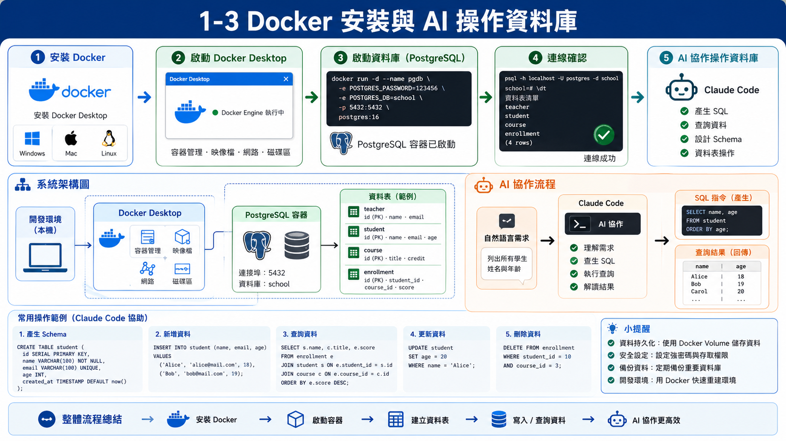

* **Docker 安裝（雙平台對照）**：

  | 平台              | 安裝方式                                                                                                                                  | 驗證指令                       |
  | ----------------- | ----------------------------------------------------------------------------------------------------------------------------------------- | ------------------------------ |
  | **Windows** | 下載[Docker Desktop for Windows](https://www.docker.com/products/docker-desktop) 並安裝（需 WSL 2 後端）                                     | PowerShell：`docker version` |
  | **macOS**   | `brew install --cask docker` 或下載 [Docker Desktop for Mac](https://www.docker.com/products/docker-desktop)（區分 Apple Silicon / Intel） | Terminal：`docker version`   |


  > 安裝後皆須**啟動 Docker Desktop 應用程式**，再回到終端機驗證。
  >
* **用 Claude Code 操作 Docker**：不需背 Docker 指令，直接用自然語言叫 Claude 產出 `docker-compose.yml`、啟動 PostgreSQL、檢查容器狀態，並同步回填 Node.js 連線設定。
* **本課主線依賴 Docker 啟資料庫**：後端採 `Node.js + Express + PostgreSQL`，資料庫統一由 Docker Compose 啟動，讓學員練習「用 AI 控制基礎設施」。
* **本節示範 Prompt（主軸）**：

  * 「請幫我建立 `docker-compose.yml`，包含 PostgreSQL 16，資料庫名稱 `shoppingcart`、帳號 `admin`、密碼 `secret`，並附上 healthcheck。」
  * 「請幫我執行 `docker compose up -d`，確認容器 healthy，並產出對應 Node.js `.env` 與資料庫連線程式。」
* **課堂可見產出**：

  * `docker-compose.yml`
  * `docker ps` / `docker compose ps` 顯示 healthy
  * Node.js 端的 `DATABASE_URL` 或等價連線設定

### 1-4 Git 常用操作與 gh CLI 協作模式（20 mins）

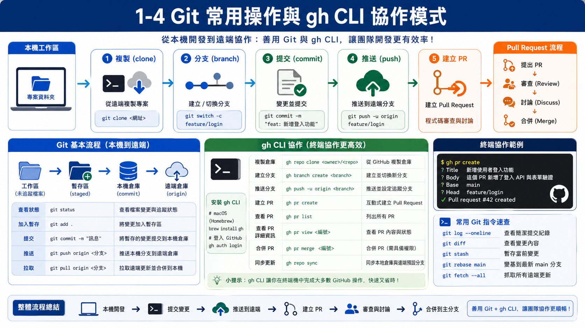

* **Git 與 GitHub CLI 安裝（雙平台對照）**：

  | 工具                       | Windows                                                                                                       | macOS                                                                               |
  | -------------------------- | ------------------------------------------------------------------------------------------------------------- | ----------------------------------------------------------------------------------- |
  | **Git**              | 下載[Git for Windows](https://git-scm.com/download/win) → 預設安裝（勾「Git Bash Here」與「Use Git from CMD」） | `brew install git` 或 `xcode-select --install`（macOS 內建 Xcode CLT 已含 Git） |
  | **GitHub CLI（gh）** | 下載[gh_*_windows_amd64.msi](https://github.com/cli/cli/releases) → 執行 .msi 預設安裝                          | `brew install gh`                                                                 |


  * **首次設定（兩平台共用指令）**：

    ```bash
    # 設定全局 Git 帳號（替換成你的 GitHub 資訊）
    git config --global user.name "Your Name"
    git config --global user.email "your.email@example.com"

    # gh 首次認證（會跳轉瀏覽器驗證）
    gh auth login
    ```
  * **驗證安裝（兩平台共用）**：在 PowerShell（Windows）或 Terminal（Mac）執行：

    ```bash
    git --version
    gh --version
    gh auth status
    ```
* **Git 常用 5 個操作**：

  * `git status`、`git add`、`git commit`、`git push`、`git pull` 的實務用途。
  * 不深入原理，直接示範 Claude Code 如何幫你寫 commit message、整理 diff、決定 staging 範圍。
  * 核心觀念：讓 AI 成為你最強的 Git 協作者，而不是取代版控紀律。
* **AI 互動示範**：

  > 不需要死背指令——直接用自然語言告訴 Claude 你要做什麼，Claude 會產出並執行對應的 git / gh 指令。
  >

  **示範 1（gh）：建立 GitHub Repo**

  > 💬 Prompt：「請幫我在 GitHub 建立一個名為 `shopping-cart` 的公開 repo，描述為『Claude Code 課程實作專案』，並把目前這個資料夾推送上去當第一個 commit。」
  >

  Claude 會自動：

  1. 執行 `git init` + `git add .` + `git commit`（若尚未初始化）
  2. 執行 `gh repo create shopping-cart --public --source . --remote origin --push`
  3. 回報 repo 網址

  **示範 2（git）：Commit 目前修改並開新分支繼續開發**

  > 💬 Prompt：「請把目前所有修改整理成一個 commit，commit message 依照 Conventional Commits 格式，然後開一條新分支 `feature/add-to-cart` 讓我繼續開發。」
  >

  Claude 會自動：

  1. 分析 `git diff` 判斷本次變動類型與範圍
  2. 執行 `git add .` + `git commit -m "feat(cart): 新增加入購物車功能"`
  3. 執行 `git checkout -b feature/add-to-cart`
  4. 回報目前分支狀態，可繼續在新分支上開發

---

## 第 2 段：全端主線實作（105 mins）

**目標**：從規格先行（SDD）出發，用全端專案實作完整展示 Claude Code 如何參與設計、撰寫、測試、修正與整合，而不是只做片段生成。

### 2-1 SDD 規格先行：與 Claude 共同撰寫 spec.md（15 mins）

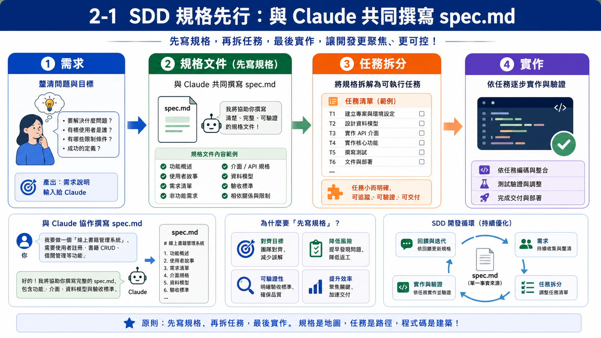

* **什麼是 SDD（Specification-Driven Development）**：

  * 先寫規格、再寫程式的開發紀律。
  * 規格不是給人看的文件，而是「你與 Claude 的共識契約」。
* **Claude Code 的 SDD 做法**：

  1. 用自然語言描述需求 → 讓 Claude 產出 `spec.md`（含資料模型、API 端點、頁面行為）。
  2. 與 Claude 確認規格細節，達成共識後才開始開發。
  3. 每次任務前 `@spec.md` 讓 Claude 取得完整上下文，不重複解釋。
  4. 規格變更時先更新 `spec.md`，再讓 Claude 依新規格調整程式。
* **實機示範**：講師輸入購物車需求描述，讓 Claude 產出完整 `spec.md`——學員確認規格符合預期後，後續所有開發（TDD、前端、除錯）均以此為基準。

### 2-2 後端生成、TDD 先行與自主修正循環（30 mins）

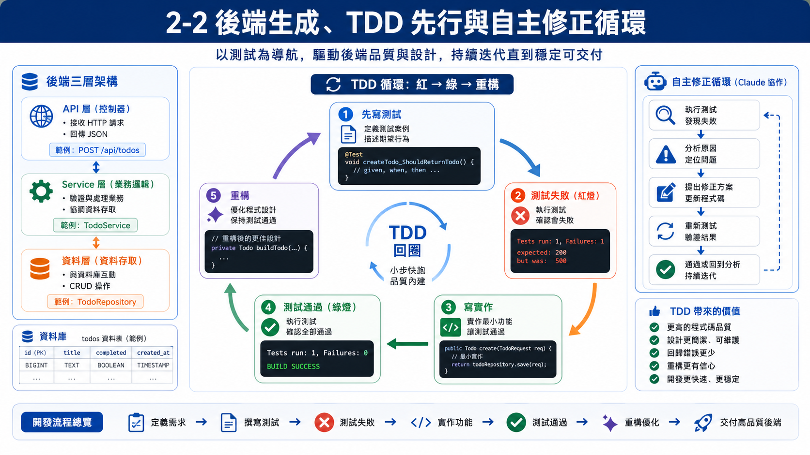

* **TDD 概念（2 分鐘快講）**：

  * Red → Green → Refactor 三循環的實際意義。
  * 為什麼 AI 開發特別適合 TDD：Claude 不「猜測」需求，測試就是最精確的規格說明。
* **Claude Code 的 TDD 做法**：
* Prompt 範本：「請先針對 `cartService.ts` 的購物車邏輯撰寫 `Vitest` 測試，**不要實作**，等我確認後再開始。測試場景包含：(1) 加入新商品 → 新增一筆 CartItem；(2) 加入相同商品 → 已有的 CartItem 數量 +1，不重複新增；(3) 數量改為 0 → 自動移除；(4) 合計計算正確；(5) 結帳後購物車清空。」

  * 確認測試意圖後，下指令開始實作 → 執行 `npm test` → 看到 RED。
  * 示範 Claude 讀錯誤 → 修正程式 → 再次執行直到全部 GREEN 的完整閉環。
  * 搭配 Auto Mode：讓 Claude 自主跑完「測試 → 修正 → 再測試」迴圈，不需每步確認。
    * **啟動方式**：`claude --enable-auto-mode`，按 Shift+Tab 切到 auto；或直接 `claude --permission-mode auto`。
    * **為什麼這裡選 Auto 而非 Bypass**：TDD 迴圈需執行 `npm test` 與檔案修改，Auto 由分類器把關每個指令（阻擋 `curl | bash`、強制推送等可疑行為），保留安全層；Bypass 在本機開發環境裸奔，風險過高。
    * **前提提醒**（呼應 1-1）：需 Team / Enterprise / API 方案 + Sonnet 4.6 或 Opus 4.7。
* **根據 spec.md 生成後端骨架**：
* 建立 `Express` 專案、`productsRepo.ts` / `cartRepo.ts`、`cartService.ts`、`products.routes.ts` / `cart.routes.ts` 與 DTO / schema 驗證。

### 2-3 前端鷹架與 API 串接（15 mins）

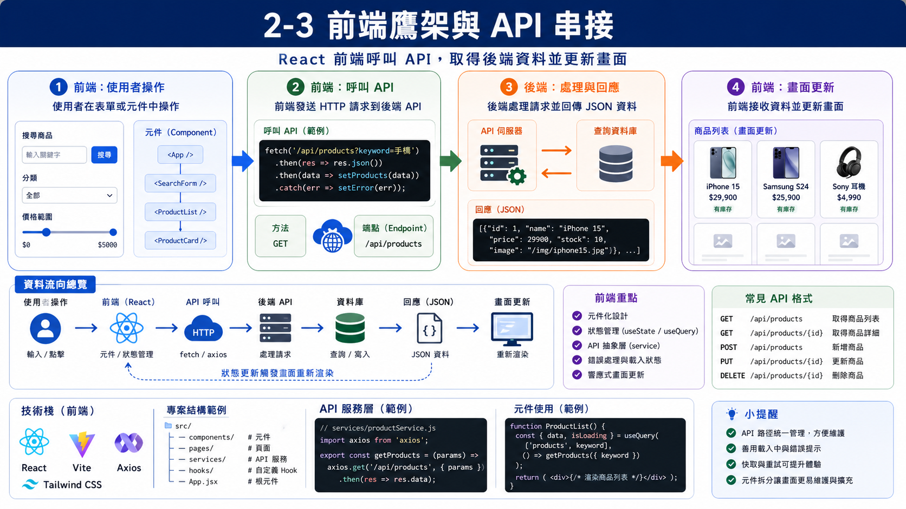

* **建立前端主畫面**：

  * 以 React + Vite 建立商品列表頁（分類篩選 + 商品卡片）、購物車抽屜（CartDrawer）與結帳頁。
  * 先以 `mockProducts.ts` 假資料跑起 UI，確認視覺層後再切換串接 API。
  * 展示如何讓 Claude 配合 `spec.md` 快速落 UI，而不是隨意生成。
* **前後端整合**：
* 將假資料改為串接 Node.js API（`GET /api/products`、`POST /api/cart/items`）。
* 示範同時 `@src/server/routes/cart.routes.ts @cartApi.ts`，讓 Claude 一次理解串接上下文。

### 2-4 Context 管理、會話控制與真實除錯（35 mins）

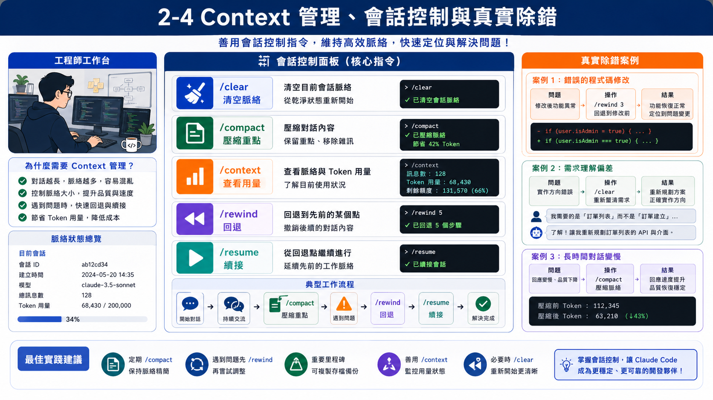

> **本節定位**：除錯之所以困難，不只是「找不到 bug」，更常是「Claude 在錯誤的上下文中打轉」。本節同步教兩件事：(1) 如何主動管理 Context 避免 context rot；(2) 透過購物車三個真實 bug 把 context 指令套用到實戰。

#### 為什麼要管理 Context（5 mins）

> Claude Code 的 **context window** 是它的「工作記憶」——所有對話、讀過的檔案、工具輸出、MCP 回應都會不斷累積在裡面。

**三個關鍵事實**：

- **Context 有限且邊際遞減**：塞越多 ≠ 效果越好。無關內容會讓 Claude 注意力分散，產生所謂的 **context rot**（上下文腐化）。
- **徵兆**：session 開了一段時間後，Claude 變慢、重複問已經回答過的問題、建議跟先前實作衝突的作法。
- **主動管理 > 被動等待**：在「階段邊界」主動壓縮或清除，比等系統自動觸發好——自動觸發常打斷任務節奏。

#### Context 三大操作指令（10 mins）

| 指令                | 用途                                                                       | 使用時機                                          |
| ------------------- | -------------------------------------------------------------------------- | ------------------------------------------------- |
| `/clear`          | 完全清空對話歷史，開始全新 session（檔案不受影響）                         | 切換到**無關的新任務**，最乾淨的選項        |
| `/compact`        | 將對話歷史壓縮成摘要，保留關鍵資訊繼續使用                                 | 一個階段完成但**需要保留脈絡**繼續下一步時  |
| `/compact <指令>` | 帶指示的壓縮，例：`/compact focus on the API layer`                      | 想明確告訴 Claude 壓縮時**保留哪些重點**    |
| `/context`        | 顯示彩色網格，告訴你 context 被什麼佔用（檔案、對話、系統 prompt、MCP 等） | 覺得變慢或想在 compact 前先**診斷空間去向** |

**三者差異一句話**：

- `/clear` = 砍掉重練（連續性為零）
- `/compact` = 壓縮成摘要（保留脈絡但變精簡）
- `/context` = 只看不動（診斷工具）

**MCP 的隱藏成本**：每個連線中的 MCP server 都會注入工具定義到 context 裡，很容易佔掉幾千 token 卻沒在用。定期用 `/context` 檢查，把閒置的用 `/mcp` 關掉。

#### 會話狀態控制：`/rewind` 與 `/resume`（10 mins）

這組指令處理「時間軸」層面的 context 操作——跨 session 取回、在 session 內回滾。

| 指令        | 作用                                                         | 對 Context 的影響                                          |
| ----------- | ------------------------------------------------------------ | ---------------------------------------------------------- |
| `/resume` | 瀏覽並恢復之前的 session（按上下鍵選，或用搜尋框找）         | **載入舊 context**，把當時的對話歷史重新裝回工作記憶 |
| `/rewind` | 回滾到對話中的某個時間點（也可用 `Esc` 連按兩下觸發）      | **選擇性刪除 context**：可分開處理對話與程式碼       |
| `/rename` | 幫當前 session 取個可讀名稱（例：`/rename auth-refactor`） | 不影響 context 內容，方便日後 `/resume` 時找到           |
| `/fork`   | 從當前點分支出去試另一種作法                                 | 兩個方案都保留，可比較                                     |

**`/rewind` 的五個選項（最需要懂）**：按 `Esc Esc` 進入 rewind 模式，用上鍵捲到想回去的點，按 Enter 後出現：

| 選項                                    | 行為                                     | 教學示範時機                                  |
| --------------------------------------- | ---------------------------------------- | --------------------------------------------- |
| **Restore code and conversation** | 程式碼跟對話都回滾                       | 整段方向錯誤時，最徹底                        |
| **Restore conversation**          | 只回滾對話，**程式碼保留**         | 想保留 Claude 改好的檔案但重新討論            |
| **Restore code**                  | 只回滾檔案，**對話保留**（極實用） | Claude 改壞了但**推理過程還想留著參考** |
| **Summarize from here**           | 把這個點之後的內容壓縮成摘要             | 探索完成、要進下一階段                        |
| **Never mind**                    | 取消                                     | —                                            |

**四種「清除/回退」工具的關鍵差異**：

- `/clear` = 全部砍光，從零開始
- `/compact` = 壓縮成摘要，保留重點但失真
- `/rewind` = **時光機**，精準回到某時刻，且能分別處理程式碼和對話
- `/resume` = 從**不同 session** 把舊 context 叫回來

#### 購物車三個真實整合錯誤實戰（10 mins）

> **教學設計**：以下三個 bug 不只示範除錯，更示範「在不同 bug 情境下選對 context 指令」。

| Bug                            | 症狀                                       | 使用的 Context 指令                                                                     | 為什麼這樣選                                                          |
| ------------------------------ | ------------------------------------------ | --------------------------------------------------------------------------------------- | --------------------------------------------------------------------- |
| **CORS 錯誤**            | React 呼叫 Express API 時 console 出現紅字 | `/bug` 切除錯模式 → 修完後 `/compact focus on cart API contract`                   | bug 解掉就壓縮，避免錯誤訊息與探索路徑佔住 context                    |
| **badge 不即時更新**     | 加入購物車後數字沒變，reload 才對          | 同時 `@CartContext.tsx @CartBadge.tsx` 後直接除錯                                     | 兩個檔小、上下文剛好夠                                                |
| **數量修改後合計未刷新** | 拉 `-` `+` 後小計沒變                  | Claude 走錯方向 →`Esc Esc` → **Restore code only**（保留對話脈絡）→ 重新引導 | 對話中已分析過 5 種可能性，砍掉太可惜，只退回檔案讓 Claude 換方向重做 |

**關鍵觀念**：

- slash commands 的價值不在「知道名稱」，而在「知道什麼時機切換工作模式」。
- 除錯的 context 越乾淨，Claude 越能聚焦——別讓十條無關 console log 把工作記憶塞滿。

### 2-5 Playwright E2E 測試：安裝、設定與實機驗證（10 mins）

> **本節定位**：Vitest 驗單元邏輯、Supertest 驗 API 端點，但「使用者點按鈕 → 購物車 badge 即時更新」這類端到端行為只有 Playwright 才能驗到。本節教兩件事：(1) 在專案中安裝並設定 `@playwright/test`；(2) 開啟 Playwright MCP 讓 Claude 自主控制瀏覽器執行驗證。

#### Playwright 在課程中的兩種角色

| 角色 | 工具 | 誰在操作 | 用途 |
| ---- | ---- | -------- | ---- |
| **E2E 測試程式** | `@playwright/test` | 開發者撰寫、CI 執行 | 寫測試腳本，自動化驗收購物車核心流程 |
| **MCP 瀏覽器控制** | Playwright MCP server | Claude Code 自主操作 | 讓 Claude 開瀏覽器、截圖、點按鈕、確認 badge 數字 |

#### 安裝

```bash
# E2E 測試（@playwright/test）
npm init playwright@latest
# 精靈依序選：TypeScript → 測試目錄輸入 e2e → 下載瀏覽器選 Yes

# Playwright MCP（讓 Claude 自主操作瀏覽器）
claude mcp add playwright npx @playwright/mcp@latest
```

#### 購物車核心 E2E 測試（示範撰寫）

* **Prompt 範本**：「請根據 `@spec.md` 為購物車寫 Playwright E2E 測試，存到 `e2e/cart.spec.ts`，場景包含：(1) 首頁顯示商品列表；(2) 點「加入購物車」→ badge 數字 +1；(3) 開購物車抽屜 → 確認品項與數量；(4) 數量改為 0 → 品項自動移除；(5) 點結帳 → 購物車清空。**不要實作**，等我確認場景後再開始。」

```typescript
// e2e/cart.spec.ts（Claude 產出範例）
import { test, expect } from '@playwright/test';

test('加入商品後 badge 即時更新', async ({ page }) => {
  await page.goto('http://localhost:5173');
  await page.getByTestId('add-to-cart-1').click();
  await expect(page.getByTestId('cart-badge')).toHaveText('1');
});
```

#### 執行測試

```bash
# 啟動前後端（測試需要真實伺服器）
npm run server &
cd frontend && npm run dev &

# 執行 E2E（有頭模式，可看到瀏覽器動作）
npx playwright test --headed

# 無頭模式（CI 環境）
npx playwright test

# 只跑購物車測試
npx playwright test e2e/cart.spec.ts

# 產出 HTML 報告
npx playwright show-report
```

#### Playwright MCP 使用方式

* 執行 `claude mcp add playwright npx @playwright/mcp@latest` 後重啟 Claude Code，側邊欄 MCP 狀態顯示 `playwright ✓` 即完成。
* **Prompt 範本**：「請用 Playwright MCP 開瀏覽器到 `http://localhost:5173`，點第一個商品的加入購物車按鈕，截圖確認 badge 數字是否變為 1。」
* Claude 會自主控制瀏覽器、截圖回傳、說明結果——這就是 **Verification Harness 的視覺層**。

#### E2E 測試與 Auto Mode 的搭配

* 修完 bug 後，可讓 Claude 在 Auto Mode 下自主跑 `npx playwright test` → 讀取輸出 → 判斷是否通過 → 必要時自動修正。
* 與 2-2 的 Vitest TDD 迴圈合用：「單元通過 + E2E 通過」才算真正的 GREEN。

---

## 第 3 段：自動化、Skill 與背景 Agent（75 mins）

**目標**：讓學員看到 Claude Code 不只會寫程式，還能自動操作畫面、將規則無程式化為 Skill，以及把耗時長任務交給背景 Agent。

### 3-1 agent-browser：用 CLI 自動操作瀏覽器並產生 SOP（15 mins）

> **定位**：`agent-browser` 是 Vercel Labs 開源的 CLI 工具，專為 AI Agent 設計。它採用**無障礙樹（Accessibility Tree）**而非原始 DOM，大幅降低 token 消耗，讓 Claude 可以用自然語言驅動完整的瀏覽器操作，並自動整理成 Markdown SOP 文件。

#### 工具選擇：agent-browser vs Playwright MCP

| 面向             | **agent-browser**（本節）                  | **Playwright MCP**（第 2 段）    |
| ---------------- | ------------------------------------------ | -------------------------------- |
| 安裝方式         | `npm install -g agent-browser`           | `.claude/settings.json` MCP 設定 |
| 元素定位         | Accessibility Tree → `@ref` 語意標籤     | Accessibility Tree               |
| 執行方式         | 獨立 CLI，任何終端機可跑                   | 在 Claude Code 對話中呼叫        |
| 輸出格式         | `--json` 直接供 Agent 解析               | 工具回傳結構化結果               |
| 持久化 Profile   | ✅ `--profile` 保存登入狀態               | ❌ 每次 session 需重新登入        |
| 適合場景         | 批次 SOP 生成、CI 自動化、跨 session 操作 | 開發中 UI 驗證、即時除錯         |

#### 安裝

```bash
# 安裝 CLI（Node.js 20+ 前提）
npm install -g agent-browser

# 安裝瀏覽器驅動（Playwright 底層）
agent-browser install
```

> 兩平台（Windows / macOS）指令相同，均需 Node.js 20+。

#### 核心工作流程

每次瀏覽器自動化遵循固定模式：

```bash
# 1. 開啟頁面
agent-browser open https://localhost:5173

# 2. 取得可互動元素清單（含 @ref）
agent-browser snapshot -i
# 輸出範例：
# @e1 [button] "加入購物車"
# @e2 [input] placeholder="收件人姓名"
# @e3 [button] "確認結帳"

# 3. 用 @ref 操作元素
agent-browser click @e1
agent-browser fill @e2 "王小明"
agent-browser press Enter

# 4. 頁面變化後重新 snapshot（@ref 會失效）
agent-browser snapshot -i

# 5. 取得畫面截圖
agent-browser screenshot --annotate   # --annotate 標注元素編號
```

> **重要**：點擊連結或提交表單後 `@ref` 即失效，必須重新執行 `snapshot -i` 取得新的 ref。

#### 示範 Prompt：購物車結帳流程 SOP

> 💬「請用 agent-browser 開啟 `http://localhost:5173`，依序操作購物車結帳流程：(1) snapshot 取得頁面元素；(2) 點擊第一個商品的加入購物車按鈕並截圖；(3) 開購物車抽屜確認品項並截圖；(4) 進入結帳頁，填入收件人資訊後點確認並截圖；(5) 確認結帳成功畫面並截圖。最後將每步操作指令、截圖說明整理成 `docs/checkout-sop.md`。」

Claude 會依序執行：

1. `agent-browser open http://localhost:5173`
2. `agent-browser snapshot -i --json` → 解析 `@ref` 對應關係
3. 每個關鍵步驟 `agent-browser click @eN` / `agent-browser fill @eN "..."` + `agent-browser screenshot --annotate`
4. 整理操作記錄，產出含截圖說明的 `checkout-sop.md`

#### SOP 產出範例（checkout-sop.md 結構）

```markdown
# 購物車結帳 SOP

## 步驟 1：加入商品
指令：`agent-browser click @e1`
說明：點擊商品卡片的「加入購物車」按鈕
截圖：

## 步驟 2：確認購物車
指令：`agent-browser click @e3`（購物車圖示）
說明：開啟側邊抽屜，確認品項與數量
截圖：
...
```

#### 企業應用場景

| 情境                  | 說明                                       |
| --------------------- | ------------------------------------------ |
| **系統操作手冊** | 內部系統上線後，自動截圖各功能操作流程     |
| **新人培訓手冊** | 逐步截圖 + 說明，產出申請/註冊流程文件     |
| **QA Bug 復現**  | 自動重現步驟並截圖，直接貼入 issue ticket  |
| **CI 自動驗收**  | GitHub Actions 無頭模式執行，驗證關鍵流程  |

* **意義**：一個 Prompt 可取代手動操作 + 截圖 + 紀錄 + 整理，SOP 文件與程式碼同步維護在 repo 中。

### 3-2 用 `skill-creator` 製作企業資安規範檢查 Skill（25 mins）

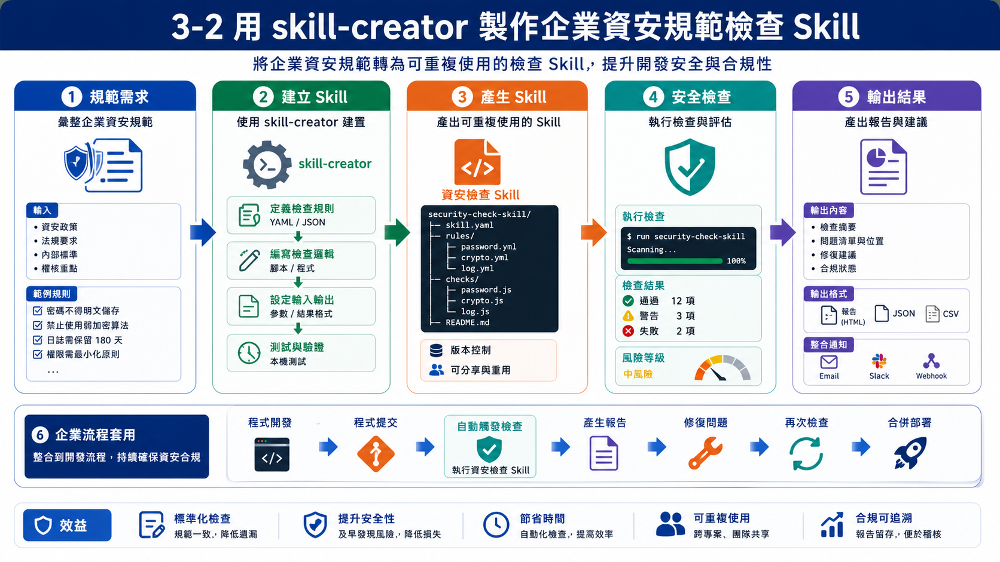

* **企業情境設定**：

  * 假設團隊有一套電商資安規範：禁止硬編碼敏感資訊、購物車合計不可由客戶端傳入、結帳端點必須驗證身份。
* **技能拆解方法**：

  * 示範如何把規範整理成 Skill 的輸入、檢查清單、輸出格式與建議修正模板。
* **實機展示**：
* 讓 Claude 協助產出 `security-check.skill.md`（購物車電商版）：檢查項目包含 session ID 是否可被偽造、`totalAmount` 是否防止客戶端傳入、`/checkout` 是否有收件資料驗證。用此 Skill 立即掃描 `src/server/routes/cart.routes.ts` 與 `src/server/services/cartService.ts`，預計發現 `🔴` 高風險項目後現場修正。
* **Hooks 實戰：送 PR 前強制資安掃描**：

  * **觸發情境**：工程師執行 `gh pr create` 時，`PreToolUse` hook 自動攔截，先跑資安掃描腳本；若有 🔴 高風險項目，以非零 exit code 封鎖 PR 建立，讓資安問題無法流入主線。

  * **`.claude/settings.json` 設定結構**：

    ```json
    {
      "hooks": {
        "PreToolUse": [
          {
            "matcher": "Bash",
            "hooks": [
              {
                "type": "command",
                "command": "node scripts/security-check.js"
              }
            ]
          }
        ]
      }
    }
    ```

    > Hook 以 stdin 接收工具輸入（JSON 格式），`security-check.js` 解析後判斷是否為 `gh pr create`；若不是則直接 exit 0 放行，若是則執行掃描。

  * **製作 Hook 的示範 Prompt**：

    > 💬「請在 `.claude/settings.json` 的 `PreToolUse` hook 新增一條規則：攔截所有 Bash 工具呼叫中包含 `gh pr create` 的指令，執行 `scripts/security-check.js`。該腳本需從 stdin 讀取工具輸入 JSON，確認指令含 `gh pr create` 後掃描 `src/server/routes/cart.routes.ts` 與 `src/server/services/cartService.ts`，套用下列資安規則：（1）禁止硬編碼 API 金鑰或密碼；（2）`totalAmount` 不可直接由客戶端傳入；（3）`/checkout` 路由必須有身份驗證 middleware。若有任何 🔴 風險則列出清單並以 exit code 1 中止；否則印出 ✅ 通過，允許繼續建立 PR。請同時產出 `scripts/security-check.js` 的完整程式碼。」

  * **教學重點**：hooks 的本質是「把人工習慣寫成系統強制」——不再依賴工程師記得跑檢查，而是在工具執行層自動攔截，無法被跳過。`PreToolUse` 回傳非零 exit code 時，Claude 會中止該工具呼叫並顯示 hook 輸出，學員可直接看到被攔截的效果。

### 3-3 開發輔助技能分類導覽（15 mins）

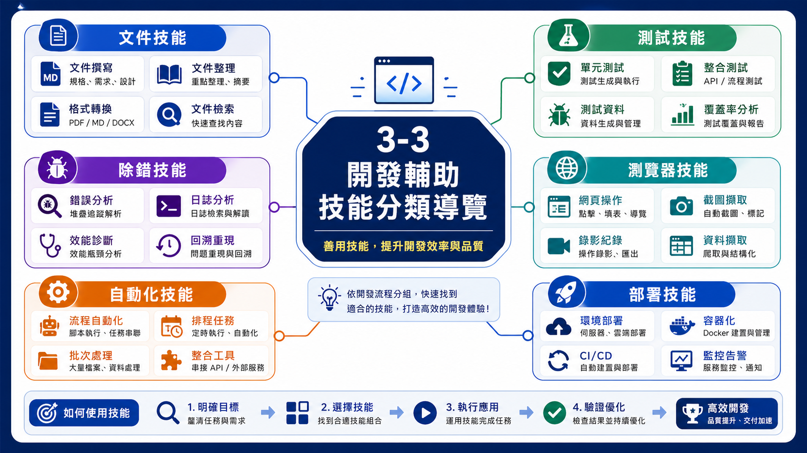

| 類別               | 技能                                                     | 使用時機                                            |
| ------------------ | -------------------------------------------------------- | --------------------------------------------------- |
| 開發輔助           | `skill-creator`                                        | 把重複流程固化成可重用工具                          |
| 開發輔助           | `firecrawl`                                            | 爬文件、查最新 API、補充 Claude 知識截止後的資料    |
| **開發紀律** | **`superpowers:brainstorming`**                  | 任何創意 / 新功能 / 規格發想前必跑                  |
| **開發紀律** | **`superpowers:writing-plans`**                  | 把 spec 拆成 2-5 分鐘 bite-sized tasks 的實作計畫   |
| **開發紀律** | **`superpowers:test-driven-development`**        | 強制 Red → Green → Refactor，鎖死「先測試後實作」 |
| **開發紀律** | **`superpowers:systematic-debugging`**           | 任何 bug / 測試失敗時，強制系統化假設驗證           |
| **開發紀律** | **`superpowers:verification-before-completion`** | 宣稱「完成」前強制執行驗證命令、看真實證據          |
| **開發紀律** | **`superpowers:requesting-code-review`**         | 完成主要功能、合併前自動產出 review 請求            |
| **開發紀律** | **`superpowers:finishing-a-development-branch`** | 整合完成、要 PR 收尾時的標準流程                    |
| 文件               | `docx`                                                 | 產出規格文件、結案報告                              |
| 文件               | `pdf`                                                  | 閱讀與摘要 PDF 規格書或技術文件                     |
| 前端               | `reactcomponents`                                      | 快速生成符合專案風格的 React 元件                   |
| 前端               | `web-perf`                                             | 效能分析與優化建議                                  |
| 前端               | `ui-ux-pro-max`                                        | 精品 UI/UX 設計紀律：確立視覺主角、大膽餘白系統、WCAG 無障礙對比，系統性杜絕 AI 生成感 |
| 測試               | `webapp-testing` + Playwright MCP                      | UI 自動化驗證、E2E 測試、瀏覽器自動化控制           |
| AI 整合            | `claude-api`                                           | 在應用程式中呼叫 Claude API，實作 AI 功能           |
| AI 整合            | `agents-sdk`                                           | 建立多代理工作流，協同多個 Agent 完成複雜任務       |

* **判斷原則**：何時「叫 Skill」vs 何時「直接下 prompt」——Skill 適合有固定流程、需重複使用的任務。
* **`superpowers` 系列定位**：這是一整套「強制紀律」技能，第 4 段 4-3 會集中講完整管線（spec → TDD → e2e → PR）。先在這裡知道有這套，等下一段就能組合使用。
* **`ui-ux-pro-max` 補充**：與 `reactcomponents`（產出元件）不同，`ui-ux-pro-max` 的核心是「設計紀律」——觸發後 Claude 會先批評現狀三個問題，再依**主角優先（每個 section 只一個主角）→ 刪除優先（迷惑時先刪再說）→ 餘白系統（section 間距 ≥ 112 px）→ WCAG 對比（Lighthouse Accessibility 100%）**的鐵律提出改善方案。適合在設計稿評審、Landing Page 或購物車前端視覺 review 時呼叫，避免輸出「全元素等重、過度裝飾」的 AI 生成感頁面。

### 3-4 深入講解 `/agent` 背景長任務（20 mins）

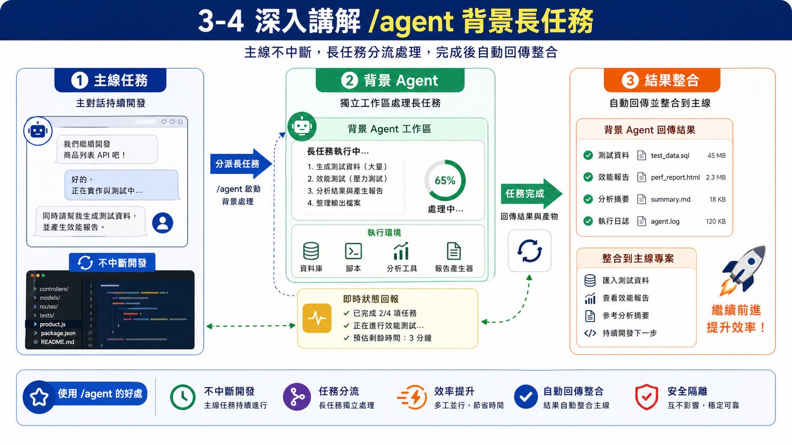

* **適合交給背景 Agent 的工作**：

  * 假資料生成、資料清理、大量網頁搜尋、log 分析、規格比對。
* **不干擾主線的工作法**：
* 示範 Prompt：「/agent：請按照 @spec.md 的 Product 資料模型，生成 30 筆符合台灣電商風格的商品假資料（3C / 服飾 / 食品各 10 筆），name 與 description 要像真實電商文案，輸出到 `src/server/seeds/seed-products.json`，並產出 `seedProducts.ts` 在啟動時自動載入，完成後回報筆數。」

  * Agent 在背景執行時，主線繼續改結帳頁面 UI，互不干擾。
  * 說明如何定義任務邊界（不得修改 `CartService`）、預期輸出格式與回報格式。
* **Git Worktrees 與平行 Session**：

  * 介紹 git worktree 讓多個 Agent 在不同分支同時工作，互不干擾。
  * 適合場景：主線 Agent 繼續改購物車 UI，另一個 Agent 在 `feature/coupon` 分支開發優惠券功能。
* **進階觀念**：

  * `/agent` 的價值是把耗時與高噪音工作切出去，而不是把所有工作都丟出去。

---

## 第 4 段：Review、程式優化與收尾（39 mins）

**目標**：建立一套寫完程式後的自我審查與優化流程，讓 Claude Code 變成可長期維護的工程夥伴。

### 4-1 `/review` 與 `/simplify` 內建品質指令（10 mins）

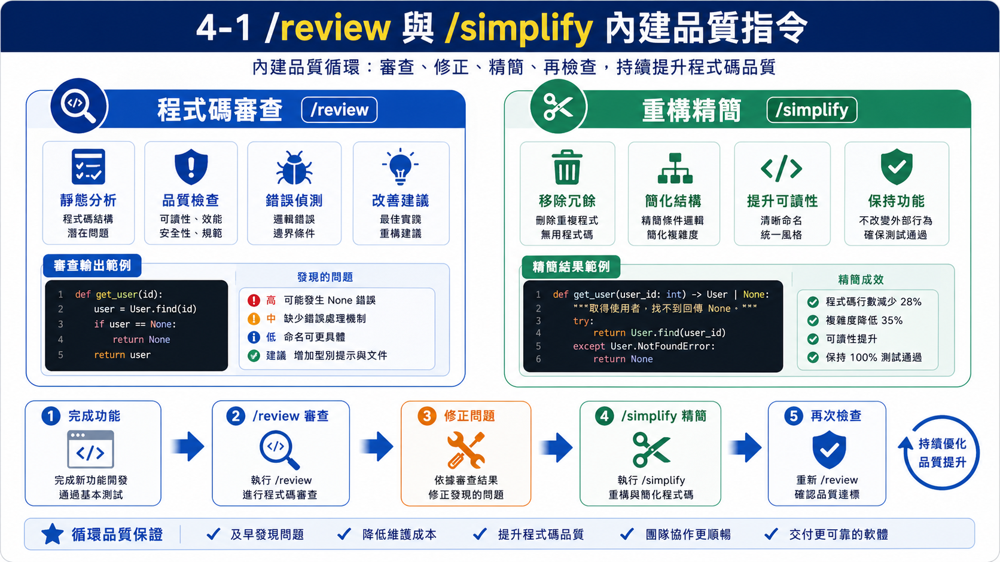

* **`/review`（程式碼審查）**：

  * 觸發時機：完成一段功能後、提交 PR 前。
  * 三個審查維度：**正確性**（邏輯 bug、邊界條件）、**安全性**（輸入驗證、注入風險）、**可讀性**（命名、結構）。
* 進階用法：`/review @src/server/services/cartService.ts` 針對特定檔案審查；課程示範 Claude 找出「`addItem()` 未處理 `quantity <= 0` 輸入」與「金額驗算邏輯沒有統一由伺服器端封裝」兩個問題。

  * 展示：Claude 給出 review 結果後，如何用 follow-up prompt 追問細節或直接要求修正。
* **`/simplify`（重構精簡）**：

  * 觸發時機：功能通過測試後，進行重構階段。
  * Claude 會找出：過度設計的抽象、重複代碼、可合併的判斷條件。
  * 強調：`/simplify` 不改邏輯，只改結構，配合 TDD 確保重構後測試仍通過。
  * 示範完整收尾迴圈：`/review` → `/simplify` → 再 `/review` → 確認無誤。

### 4-2 slash commands 完整工作流總覽（17 mins）

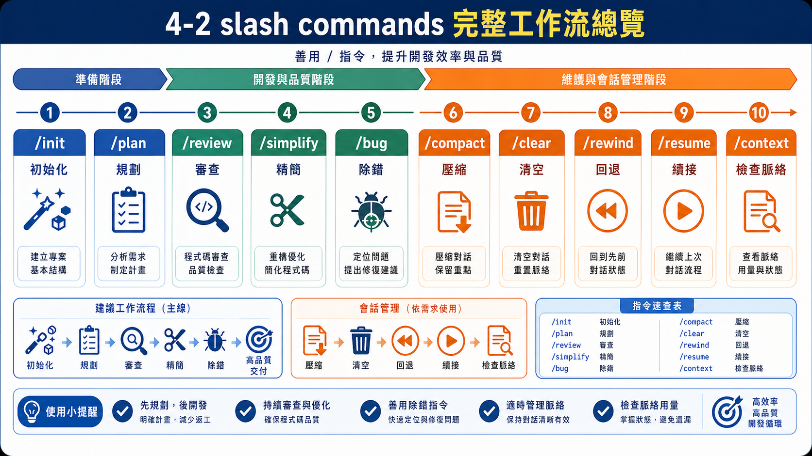

* **常用指令與最佳時機**（依開發工作流順序）：

  * `/init`：在專案一開始定義規則與技術棧。
  * `/plan`：大任務開始前讓 Claude 先規劃，避免直接亂改。
  * `/review`：品質把關，PR 前必跑。
  * `/simplify`：功能完成後的重構精簡。
  * `/bug`：聚焦抓 bug，切換除錯上下文。
  * `/compact`：長任務中段或除錯後壓縮上下文。
  * `/clear`：開始新任務前清空脈絡。
  * `/rewind`：當推理走偏時快速回退。
  * `/resume`：跨天接續上次 session。
  * `/rename`：幫 session 命名，方便日後 resume 找回。
  * `/context`：診斷 context 空間用量。
* **四個經典 Context 工作流組合**（記下來直接用）：

  **A. Review-then-Rollback（審查後決定去留）**

  ```
  /diff          # 看 Claude 改了什麼
     ↓
  不滿意？
     ↓
  Esc Esc → Restore code only（保留對話脈絡當參考）
  ```

  **B. 階段交接（Phase Handoff）**

  ```
  完成第一階段 → /compact focus on the API contract and remaining tasks
              → 繼續第二階段（context 變輕但重點還在）
  ```

  **C. Context 體檢**

  ```
  /context（看總覽）→ 發現 MCP 佔 40%？→ /mcp（停用沒用到的）→ /context（再確認）
  ```

  **D. 跨天接續工作**

  ```
  下班前：/rename cart-checkout-day1 → /compact（留乾淨摘要）
  隔天：  /resume → 搜尋「cart-checkout」→ 繼續做
  ```
* **黃金守則**（5 條口訣）：

  - 🟢 **開新任務前先 `/clear`**——比你想像中更能救回應品質
  - 🟡 **階段切換時 `/compact`**——不要等自動觸發
  - 🔵 **覺得卡就 `/context`**——看哪裡在吃空間
  - 🟣 **一次性指示寫對話、長期規則寫 `CLAUDE.md`**
  - 🔴 **Claude 走錯路就 `/rewind`**——比手動還原檔案快十倍
* **收尾流程**：

  * 讓 Claude 整理 diff、生成 commit message。
  * 搭配 `gh pr create` 發出 PR，Claude 自動生成 PR 說明（含本次購物車功能的改動摘要）。
  * 回顧整堂課的工作流：規格（SDD `spec.md`）→ 開發（TDD `CartService`）→ 測試（Playwright badge 驗證）→ 假資料（`/agent` 生成商品）→ review / simplify → 版本控制（gh）。

### 4-3 superpowers：spec → TDD → e2e 完整開發控管管線（12 mins）

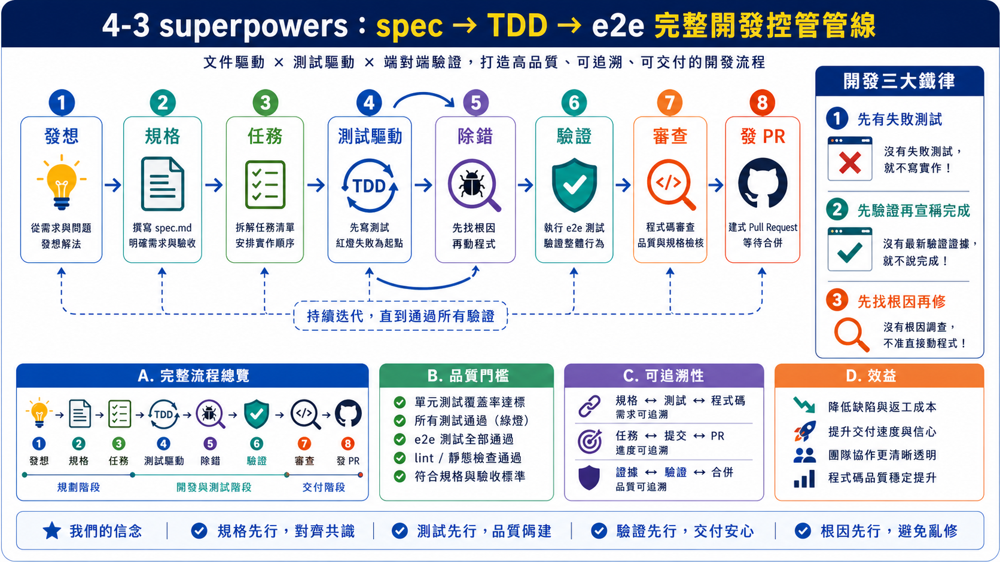

> **本節定位**：前面教的是「Claude 能做什麼」，這節教「**怎麼強迫 Claude 守紀律**」。`superpowers` 是 Claude Code 生態系中的第三方 Skill 套件，把開發紀律寫成一整套**強制執行的 Skill**——不是建議、不是參考，是 Iron Law。
>
> **與課程主軸的對應**：你的 SDD `spec.md`、TDD `CartService`、Playwright e2e 在前面已示範完整流程；本節把這個流程**升級成可重複、可審計、不會偷懶的紀律管線**。

#### 安裝

```bash
claude plugin install superpowers
```

安裝後技能會出現在可用 Skill 清單中，依名稱呼叫即可（例：`superpowers:test-driven-development`）。

#### 為什麼需要紀律技能

AI 寫程式最大的風險不是「寫錯」，而是「**自信地寫錯然後說已經完成**」。常見失控模式：

- 沒寫測試就改程式，跑了一次「看起來對」就宣稱完成
- 改完 bug 沒重新跑測試，只看程式碼「應該對」就 commit
- Review 沒做就直接 PR，寄望人類事後找問題

`superpowers` 用 **Iron Laws**（鐵律）強制 Claude 守紀律——這些技能在 SKILL.md 中明寫「Violating the letter of the rules is violating the spirit of the rules」，讓 Claude 沒有「就這一次例外」的空間。

#### 三條 Iron Laws（背下來、貼在牆上）

> 🔴 **Iron Law 1（TDD）**：`NO PRODUCTION CODE WITHOUT A FAILING TEST FIRST`
> ——沒有失敗測試就不准寫實作程式。先寫了？刪掉重來，不准「拿來參考」。
>
> 🔴 **Iron Law 2（Verification）**：`NO COMPLETION CLAIMS WITHOUT FRESH VERIFICATION EVIDENCE`
> ——沒有當下執行驗證指令的證據，不准說「完成」「通過」「修好了」。
>
> 🔴 **Iron Law 3（Debugging）**：`NO FIXES WITHOUT ROOT CAUSE INVESTIGATION FIRST`
> ——沒有找到根本原因就不准動程式。禁止「試試看」式除錯，每個修正都需要先確立假設並驗證。

#### spec → TDD → e2e → PR 完整管線對應

| 開發階段           | 課程實踐                              | superpowers 技能                   | 強制做的事                                                                                       |
| ------------------ | ------------------------------------- | ---------------------------------- | ------------------------------------------------------------------------------------------------ |
| **發想**     | 商討購物車功能範圍                    | `brainstorming`                  | 任何創意 / 新功能前必跑，先發散再收斂，避免直接跳實作                                            |
| **規格**     | 寫 `spec.md`                        | `writing-plans`                  | 把 spec 拆成**2-5 分鐘 bite-sized tasks**，存到 `docs/superpowers/plans/YYYY-MM-DD-*.md` |
| **執行**     | 開始實作 `CartService`              | `executing-plans`                | 一個 task 一個 commit，跑完才能進下一個，禁止跳步                                                |
| **TDD**      | Vitest 測 `cartService.ts` 五個場景 | `test-driven-development`        | 強制 Red → Green → Refactor；**沒看到測試失敗 = 不知道測試在測什麼**                     |
| **除錯**     | CORS / badge / 合計三個 bug           | `systematic-debugging`           | 強制系統化假設驗證，禁止「亂試運氣」式除錯                                                       |
| **e2e 驗收** | Playwright 驗 badge 即時更新          | `verification-before-completion` | 宣稱完成前**必須當場執行驗證指令**，貼出真實輸出                                           |
| **Review**   | 完成 CartService + Controller         | `requesting-code-review`         | 自動產出結構化 review 請求（含改動範圍、測試結果、風險點）                                       |
| **PR 收尾**  | 推到 `feature/add-to-cart` 開 PR    | `finishing-a-development-branch` | 標準收尾流程：跑全測試、整理 commit、生 PR body、檢查 CI                                         |

#### 完整流程圖（背下這條鏈就贏了）

```
brainstorming           writing-plans              executing-plans
    ↓                        ↓                          ↓
（發散收斂）  →  （拆 bite-sized tasks）  →  （一 task 一 commit）
                                                       ↓
test-driven-development  ←─────────────────  systematic-debugging
        ↓                                              ↑
（Red → Green → Refactor）        ←  bug 出現        ──┘
        ↓
verification-before-completion
        ↓
（跑驗證、看真實輸出，禁止「看起來對」）
        ↓
requesting-code-review  →  finishing-a-development-branch  →  PR
```

#### 實機示範：套到購物車的 CartService

> 💬 **示範 Prompt**：「請使用 `superpowers:writing-plans` 技能，根據 `@spec.md` 為 `CartService` 產出實作計畫，存到 `docs/superpowers/plans/2026-04-22-cart-service.md`。每個 task 限 2-5 分鐘、一 task 一 commit、TDD 先行。」
>
> 接下來：「請使用 `superpowers:executing-plans` 執行該計畫，每個 task 結束時用 `superpowers:verification-before-completion` 確認，禁止使用『should』『probably』。」

學員會看到：

1. Claude 不再跳步——每個 task 都是「寫測試 → 跑測試確認失敗 → 寫實作 → 跑測試確認通過 → commit」
2. Claude 不再亂宣稱完成——每個段落結束都會跑指令貼輸出
3. Plan 文件本身就是審計軌跡，等於 spec → 實作的可追溯記錄

#### 關鍵觀念

* `superpowers` 不取代 `/review` `/simplify`，而是**讓它們真正被執行**——前者是觸發紀律的開關，後者是紀律執行後的精修。
* 對企業團隊特別有價值：**Iron Laws 是可審計的契約**，當 Claude 違反規則時你可以指著 SKILL.md 說「你違反了 Iron Law 1」，遠比「你怎麼又這樣做」有效。

---

## 第 5 段：Harness Engineering：你一直在做的事，現在有了名字（23 mins）

> **本節定位**：這是課程的「概念整合」收尾節點。學員在前四段已接觸 CLAUDE.md、Hooks、/agent、Git Worktrees、TDD 迴圈、/review 與 /simplify——本節幫助他們理解這些實踐共同構成一套 Harness，並提供升級 Harness 的心智模型。

### 5-1 Harness Engineering 是什麼（8 mins）

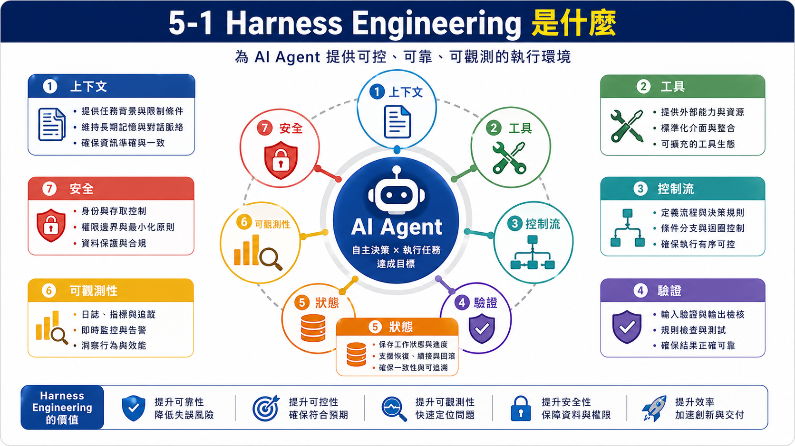

* 馬具比喻：AI 模型是千里馬，Harness 是韁繩、馬鞍、車轅的整套配備——把馬的力量引導成生產力。
* 工程定義：**圍繞 Agent 的執行與治理層**，包含工具協調、狀態管理、權限邊界、錯誤恢復、可觀測性與人類審批閘門。
* 關鍵數據：LangChain 在不換模型的情況下只優化 Harness，Agent 在 Terminal Bench 2.0 的得分從 52.8% 躍升至 66.5%；OpenAI 三人團隊靠 Harness Engineering 在五個月內交付 100 萬行生產程式碼。

#### Harness Engineering 的七種常見類型

> **業界尚無單一權威分類**，以下是綜合 Anthropic、LangChain、LangGraph、AutoGen、Devin 等社群實務整理出的最常見 7 大類，每一類都在回答一個明確問題：

| 類型                                          | 中文                | 管的核心問題                    | 業界代表實作                                                                                           |
| --------------------------------------------- | ------------------- | ------------------------------- | ------------------------------------------------------------------------------------------------------ |
| **Context Harness**                     | 上下文 Harness      | Agent**看到什麼**？       | Claude `CLAUDE.md` / `AGENTS.md`、Cursor Rules、RAG 檢索增強、`@import`                          |
| **Tool Harness**                        | 工具 Harness        | Agent**能用什麼工具**？   | MCP server、OpenAI function calling、LangChain Tools、自訂 slash commands、權限白名單                  |
| **Control Flow Harness**                | 控制流 Harness      | Agent**怎麼決策與執行**？ | Plan Mode、Auto Mode、Hooks（PreToolUse / PostToolUse）、LangGraph、ReAct pattern                      |
| **Verification Harness**                | 驗證 Harness        | Agent**做對沒**？         | TDD 迴圈、CI/CD、`/review`、`/simplify`、Devin auto-test、SWE-bench eval                           |
| **State Harness**（aka Memory Harness） | 狀態 / 記憶 Harness | Agent**記得什麼**？       | `/compact`、`/rewind`、`/resume`、MemGPT、ChromaDB、OpenAI Assistant Memory                      |
| **Observability Harness**               | 可觀測性 Harness    | Agent**在做什麼**？       | `/context`、`/cost`、`/stats`、LangSmith、Helicone、Phoenix tracing                              |
| **Safety Harness**（aka Guardrails）    | 安全 Harness        | Agent**不能做什麼**？     | 權限模式（Auto / Bypass）、classifier 分類器、沙盒隔離、NeMo Guardrails、LlamaGuard、Constitutional AI |

> 🔸 **第 8 類（進階／選配）：Multi-Agent Orchestration Harness（多代理編排 Harness）**——管 Agent **怎麼協作**？業界代表：Subagent、Git Worktrees 平行 Agent、CrewAI、AutoGen、Anthropic Multi-Agent Research。當你從「單 Agent」走向「Agent 團隊」時才需要。

#### 三個診斷問題：你的 Harness 缺哪一類？

回去盤點團隊現況時，照順序問這三題就能快速定位缺口：

1. **Claude 一直忘記某個規則嗎？** → 缺 Context Harness（沒寫進 `CLAUDE.md`）
2. **Claude 做出來品質不穩定嗎？** → 缺 Verification Harness（沒有 TDD 或 `/review` 守門）
3. **Claude 偶爾會做出危險動作嗎？** → 缺 Safety Harness（沒設權限模式或 sandbox）

> **觀察心法**：完整的 Harness 不是一次到位，**七類由弱到強逐步補齊**——大多數團隊只會卡在 Context 與 Verification 兩類，先補這兩個就能解掉 80% 問題。

### 5-2 課程實踐 ↔ Harness 類型對應（5 mins）

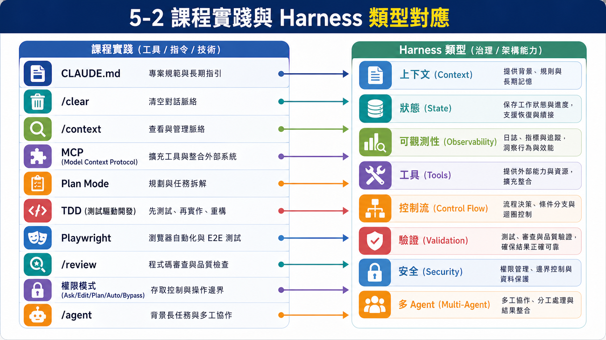

> **教學設計**：把 5-1 的七種類型套到課程實踐上，讓學員一眼看到「我學的每個招式各屬於哪一類 Harness」，回去就能用 7 類分類法盤點團隊缺口。

| 課程中做過的事                                                                                                        | 對應的 Harness 組件                                  | 主要 Harness 類型                                                    |
| --------------------------------------------------------------------------------------------------------------------- | ---------------------------------------------------- | -------------------------------------------------------------------- |
| `CLAUDE.md`（「合計伺服器計算」「合併不重複」）、`spec.md`、`@import`                                           | 靜態上下文層（Single Source of Truth）               | **Context Harness**                                            |
| `/clear` `/compact` `/rewind` `/resume` 管理對話記憶                                                          | 動態狀態管理                                         | **State / Memory Harness**                                     |
| `/context` `/cost` `/stats` 診斷空間用量                                                                        | 執行可見性                                           | **Observability Harness**                                      |
| MCP server 編排（Playwright、firecrawl）、自訂 Skill                                                                  | 工具能力擴充                                         | **Tool Harness**                                               |
| Plan Mode → 確認 `spec.md` → 實作；Auto Mode 自主 TDD 迴圈                                                        | 決策流控制                                           | **Control Flow Harness** + Human-in-the-Loop                   |
| `PreToolUse` Hook 觸發 `security-check` Skill                                                                     | 架構約束與自動驗證閘門                               | **Control Flow Harness**（架構約束）                           |
| Vitest TDD 迴圈（`cartService.ts` 合計 / 合併 / 清空測試）                                                          | 錯誤恢復與回饋迴路                                   | **Verification Harness**                                       |
| Playwright MCP 驗證購物車 badge 更新                                                                                  | 自動化驗收                                           | **Verification Harness**                                       |
| `/review` + `/simplify` CartService                                                                               | 熵管理（防止程式碼庫劣化）                           | **Verification Harness**（熵管理子類）                         |
| 權限模式（Auto Mode 分類器把關 / Bypass 沙盒）                                                                        | 動作授權邊界                                         | **Safety Harness**                                             |
| `/agent` 生成 30 筆商品假資料 + Git Worktrees 平行 Agent                                                            | 工具協調層、並行 Agent 隔離                          | **Multi-Agent Orchestration Harness**（進階）                  |
| **`superpowers` 套組（brainstorming → writing-plans → TDD → verification → review → finishing-branch）** | **強制紀律：Iron Laws 把規則升級成可審計契約** | **Verification + Control Flow + Context Harness 三類同時強化** |

> **核心洞察 1**：你從課程第一天就在做 Harness Engineering，只是現在有了名字與框架。
> **核心洞察 2**：這堂課七大類**全部覆蓋到了**——多數團隊只實作其中 2-3 類就上線，真正能拉開差距的是「七類齊備且持續演化」。

### 5-3 三大支柱的工程意涵（5 mins）

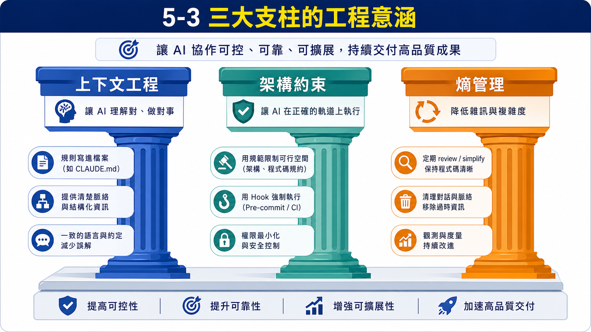

1. **上下文工程（Context Engineering）**：`CLAUDE.md` 是靜態上下文；CI 測試結果、日誌、其他 Agent 進度是動態上下文。Agent 存取不到的資訊等於不存在——文件必須住在 repo 裡。
2. **架構約束（Architectural Constraints）**：越多約束，決策疲勞越少，Token 利用率越高。用 Hooks 把約束機械性強制執行，而不是靠「善意」。
3. **熵管理（Entropy Management）**：AI 生成的程式碼庫會隨時間劣化（文件與程式碼不一致、命名風格混亂）。定期用 `/review`、`/simplify` 或排程 Agent 執行「清理迴圈」。

### 5-4 你的 Harness 升級路徑（5 mins）

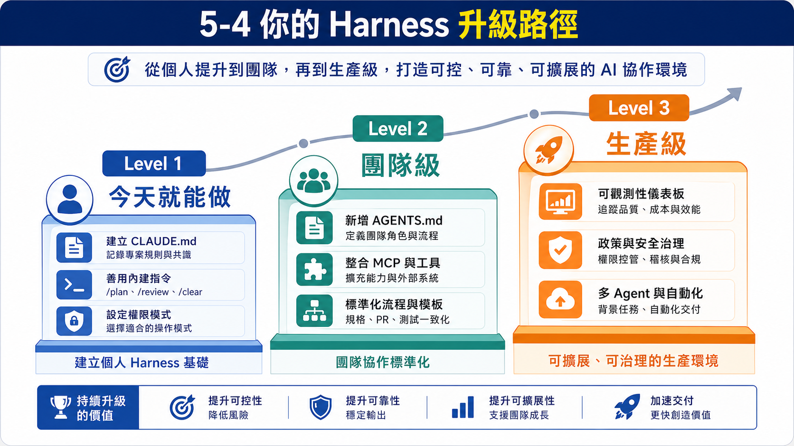

| 層級                            | 時間    | 核心工作                                                                                    |
| ------------------------------- | ------- | ------------------------------------------------------------------------------------------- |
| **Level 1（今天就能做）** | 30 分鐘 | 建立 `CLAUDE.md`，寫清架構規範、禁止動作、命名規則，設定 pre-commit hook 執行 lint + test |
| **Level 2（1-2 天）**     | 1-2 天  | 新增 `AGENTS.md`（團隊級約定），CI 強制架構約束，定義 Agent 生成 PR 的審查清單            |
| **Level 3（生產級）**     | 1-2 週  | 死循環偵測中間件、可觀測性 Dashboard、熵管理 Agent 排程、Harness A/B 測試                   |

* **陷阱提示**：
  * `CLAUDE.md` 是 Harness 核心——每次 Agent 犯錯，就更新它，把它當程式碼一樣維護。
  * 不要過度設計控制流：Harness 要設計成「可拆卸」的，當模型變聰明後能輕鬆移除不必要的控制邏輯。
  * 從嚴格約束開始，隨著 Agent 表現成熟再放寬，而不是反過來。

---

## 課程總結

### 一句話收束

> 這堂課的核心**不是**「AI 幫你寫更多 code」，而是「**你如何設計一條更穩定的開發工作流**」——讓 Claude 變成可預測、可治理、可長期維護的工程夥伴，而不是看心情產出的副駕駛。

### 你在這 4 小時學會的四種能力

| 能力               | 核心招式                                                                                                                                                                                | 來自的段落         |
| ------------------ | --------------------------------------------------------------------------------------------------------------------------------------------------------------------------------------- | ------------------ |
| **共識能力** | 用 SDD 寫 `spec.md` 與 `CLAUDE.md`，把「你與 Claude 的共識契約」寫進磁碟，避免每次重新解釋                                                                                          | 1-2、2-1           |
| **紀律能力** | TDD 三循環（Red → Green → Refactor）+ Auto Mode 自主迴圈 +**superpowers Iron Laws**（沒測試不寫程式、沒驗證不宣稱完成、沒找到根因不動程式），讓測試成為 Claude 不會偏離的軌道 | 2-2、4-3           |
| **治理能力** | Context 主動管理（`/clear` `/compact` `/context` `/rewind`）+ 權限模式選擇（Auto vs Bypass），決定 Claude 的「記憶」與「動作授權」                                              | 1-1、1-2、2-4、4-2 |
| **延伸能力** | Skill 把規則固化、`/agent` 把長任務切出去、Playwright MCP 讓 Claude 自主驗證 UI、Git Worktrees 平行作業                                                                               | 3-1～3-4           |

### 三個關鍵心智轉變

1. **從「下指令」到「設定環境」**：寫 `CLAUDE.md` > 重複下 prompt；建 Skill > 一次性教學；定義 Hooks > 事後補救。
2. **從「被動清理 context」到「主動管理 context」**：在階段邊界 `/compact`、無關任務前 `/clear`、走偏方向 `/rewind`，而不是等 Claude 變慢才反應。
3. **從「全部自己做」到「分流任務」**：主線用 Plan / Edit 模式精修核心邏輯；長噪音任務丟 `/agent`；可重複流程做成 Skill；想自治就上 Auto Mode（在分類器把關下）。

### 明天上班就能做的三件事

- 🟢 **30 分鐘**：在你手上的專案根目錄建立 `CLAUDE.md`，寫清架構規範、禁止行為、技術棧版本、常用指令——Claude 從此不會忘。
- 🟡 **下一次卡住時**：先按 `/context` 看 context 被誰吃了，再決定要 `/compact` 還是 `/clear`，而不是直接重開 session。
- 🔴 **下一次 Claude 走錯方向**：按 `Esc Esc` → 選 **Restore code only**，保留對話分析脈絡，只退回檔案重做——比手動 `git checkout` 快十倍。

### 收束到 Harness Engineering

你在第 5 段學到：上面這些做法不是零散技巧，而是**圍繞 Agent 的執行與治理層**的具體實踐。`CLAUDE.md` 是靜態上下文層、TDD 迴圈是錯誤恢復層、Hooks 是架構約束層、`/review` + `/simplify` 是熵管理層、Plan Mode 是 Human-in-the-Loop 閘門——你不是在「用 AI 寫程式」，你是在**設計一套讓 AI 持續產出高品質程式碼的系統**。

> **這就是 Harness Engineering——你一直在做的事，現在有了名字。**

### 課後行動清單

- [ ] 為當前專案建立 `CLAUDE.md`（含技術棧、禁止行為、常用指令）
- [ ] 把一個重複流程做成 Skill（資安檢查 / Code review / 文件生成擇一）
- [ ] 為一個長噪音任務（如資料生成、log 分析）開一個 `/agent` 試水
- [ ] 在 PR 流程加入 `/review` + `/simplify` 的固定收尾
- [ ] 練習 `/rewind` 的五個選項，特別是 **Restore code only**
- [ ] 評估你的方案是否能用 Auto Mode（Team / Enterprise / API + Sonnet 4.6 以上）
- [ ] 安裝 `superpowers` plugin，至少跑過一次 `writing-plans` + `test-driven-development` + `verification-before-completion` 完整管線
- [ ] 把三條 Iron Laws 寫進團隊 `CLAUDE.md`，把紀律從「個人習慣」升級成「團隊契約」

---

> **最後提醒**：Claude 會持續變強，但能拉開差距的不是「會用哪個指令」，而是「**有沒有把工作流設計成可長期維護的 Harness**」。這堂課給你的不是 100 個技巧，而是一套可以持續演化的心智模型。
