# The Ultimate Beginner's Guide to Claude（2026 年 3 月）

> 作者：AI Edge（[@aiedge_](https://x.com/aiedge_)）
> 發布日期：2026-03-05
> 原文連結：https://x.com/aiedge_/status/2029233676111008061
> 觀看數：338 萬 | 書籤：19,192 | 喜歡：4,749

---

## 前言

這是掌握 Claude 的唯一指南。

Anthropic 上週推出了迄今最佳的 Claude 功能套件。如果你還在用 ChatGPT，這就是壓垮它的最後一根稻草。

作者使用 Claude 超過一年，親歷每一次重大工具發布——Claude Skills、Cowork、Opus 4+——大概累積了 100 小時以上的測試經驗。

> 與其重複學習曲線，不如用這份指南直接跳到成果，解鎖即時生產力。就算你跟作者一樣用了很久，這份指南一樣有價值。

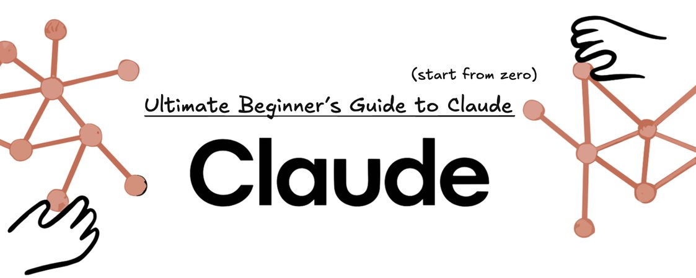

---

## 目錄

- [Section I：Claude 介紹](#section-i-claude-介紹)
- [Section II：Prompt 工程大師班 & 上下文管理](#section-ii-prompt-工程大師班--上下文管理)
- [Section III：模型選擇矩陣](#section-iii-模型選擇矩陣)
- [Section IV：基本工具與功能](#section-iv-基本工具與功能)
- [Section V：進階工具——Claude Code、Cowork 等](#section-v-進階工具claude-codecowork-等)
- [結語](#結語)

---

## Section I：Claude 介紹

簡單來說，把 Claude 想成「真正能做事的 AI」。

它聽起來像人、能理解細微差異，最重要的是，Anthropic 注入了一套真正能執行任務的工具。

**其他工具告訴你怎麼做，Claude 直接幫你做。**

### 開始使用

在進入操作教學前，你需要先建立 Claude 帳號。建議使用付費方案。

**定價方案簡述：**

| 方案 | 說明 |
|------|------|
| 免費 | 基本功能，可使用 Haiku |
| Pro | 每月付費，解鎖更多模型與功能 |
| 進階方案 | 解鎖 Claude Code、Cowork 等進階工具 |

### 介面說明

建立帳號後，建議截圖保存介面說明圖（適合完全初學者）。

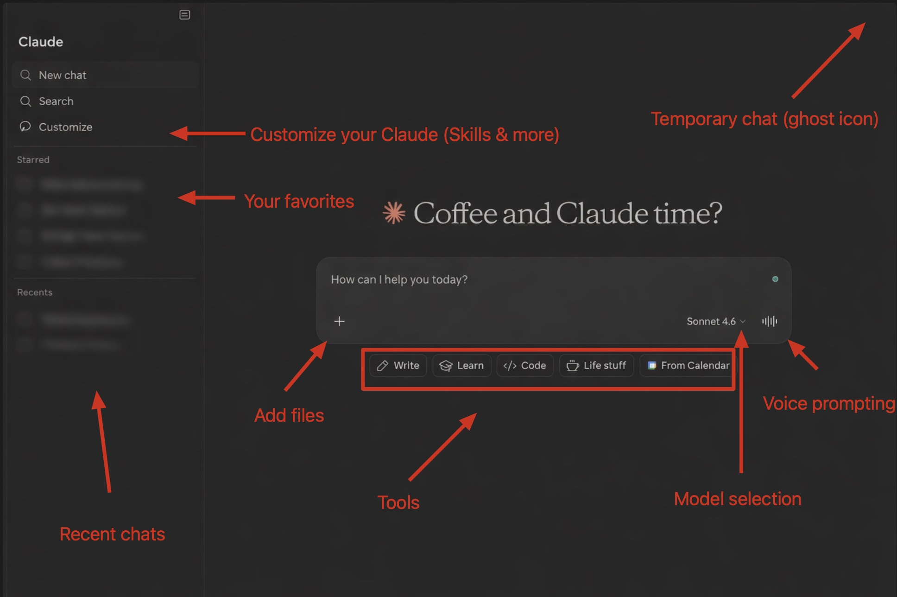

---

## Section II：Prompt 工程大師班 & 上下文管理

> 垃圾輸入（prompt）= 垃圾輸出（回覆）

**糟糕的 prompt 是使用任何 AI 工具最常見的錯誤 #1。**

學好 Prompt 工程的好處：省 token（降低成本/用量）、省時間（不需反覆重問）。

Anthropic 已告訴我們如何獲得頂級回覆，有兩種有效的 prompt 結構可選。

---

### 初學者：3 段式 Prompt 公式

每個強力的 Claude prompt 包含三個元素，疊加使用，輸出品質從普通變成真正有用：

**1. 設定舞台（Set the stage）**
- 你的角色是什麼？目標是什麼？在提問前先給 Claude 背景脈絡。
- 範例：*「我正在為針對 Z 世代的行銷登陸頁建立網站。」*

**2. 定義任務（Define the task）**
- 你想要 Claude 執行什麼具體動作？直接且精確。
- 範例：*「撰寫有競爭力的文案，並建立 [xyz] 區塊。」*

**3. 指定規則（Specify the rules）**
- 格式、語氣、長度、風格——告訴 Claude 你想要的輸出形式。
- 範例：*「字數控制在 500 字以內。」*

用這三個元素建構你的 prompt，輸出品質將超越 90% 的使用者。

---

### 進階者：Anthropic 10 步驟 Prompt 結構

Anthropic 的進階 10 步驟 prompt 結構（詳細內容請參考延伸閱讀）。

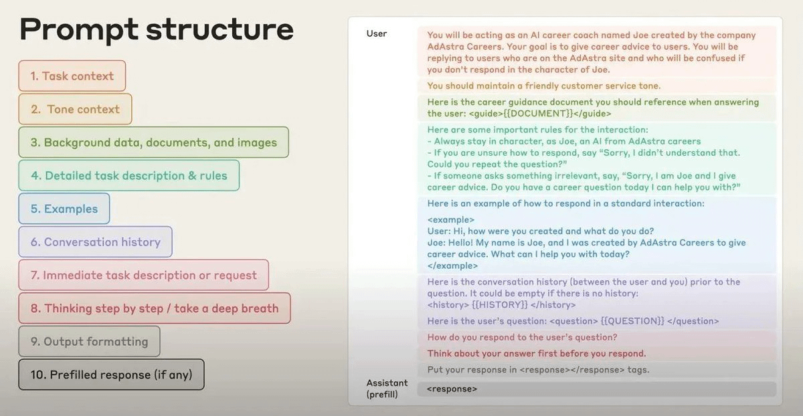

**延伸閱讀：** [How to Prompt Claude for Elite Outputs（1 月 29 日）](https://x.com/aiedge_/status/2016553316851896790)

---

### 上下文管理技巧

- 對話變長時（Claude 變慢），告訴 Claude「compact（壓縮）」對話並移到新聊天
- 適時附加檔案
- 設定輸出限制（例：只用 500 字、用簡潔的條列式）

**TLDR：** 給予背景、指定任務、設定規則，必要時附加情境檔案。

---

## Section III：模型選擇矩陣

了解 Claude 基本用法後，接下來要知道各模型的使用時機。

### Claude Sonnet 4.6——日常主力

- 快速、能幹、成本效益高
- 寫作、分析、腦力激盪、通用任務——Sonnet 全都能應付
- **80% 的對話都應該在這裡進行**，作者幾乎所有事情都從 Sonnet 開始

### Claude Opus 4.6——深度思考者

- Claude 最智能的模型
- 更深層的推理，擅長複雜的多步驟問題
- 適用場景：財務分析、長篇研究、複雜程式碼，或任何需要 Claude 深度思考的任務
- 可開啟「Extended Thinking（延伸思考）」，讓 Claude 在給出答案前展示推理過程——像是看著它大聲思考
- **取捨：** 速度較慢，消耗更多配額，勿用於簡單任務

### Claude Haiku 4.5——速度王

- 最快、最便宜的模型
- 快速查詢、簡單分類、輕量編輯
- 免費方案可用
- 類比：不要用大鐵錘掛一個畫框
- 作者個人在 Claude Chrome 擴充功能中使用 Haiku

---

## Section IV：基本工具與功能

以下是幾個必須設定的核心工具，讓 Claude 完整發揮能力。

### 1. Connectors（連接器）

讓 Claude 連接到你最愛的工具。

作者每天幾乎都用：**Notion、Slack、Google Calendar** 連接。

設定路徑：`Settings → Connectors`

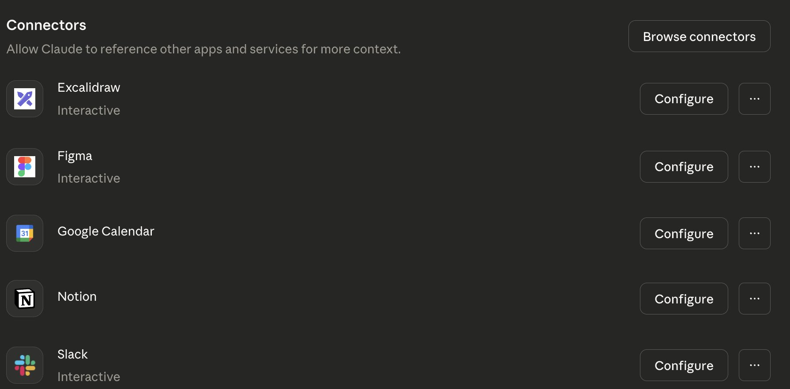

---

### 2. Claude in Chrome（Chrome 擴充功能）

**大多數人完全不知道這個存在。**

讓 Claude 以 Chrome 擴充功能形式存在於你的瀏覽器中。

下載連結：[Chrome Web Store - Anthropic](https://chromewebstore.google.com/publisher/anthropic/u308d63ea0533efcf7ba778ad42da7390)

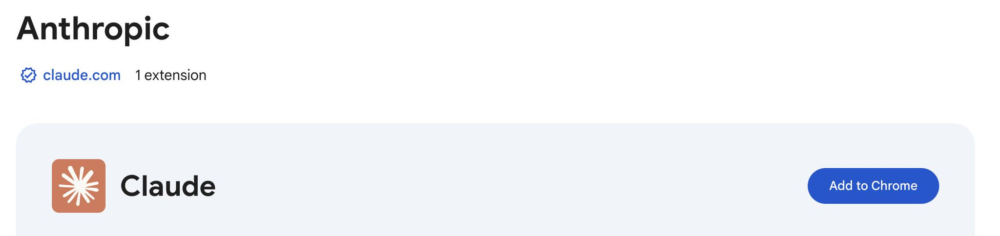

---

### 3. Custom Styling（自訂風格）

在主介面選擇「Use Style」，可從預設風格選擇或建立自訂風格，客製化 Claude 書面回覆的各種要素。

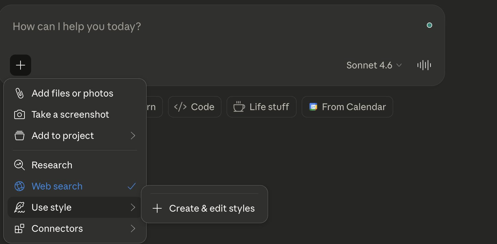

---

### 4. Projects（專案）

Projects 是 Claude 內部的專屬工作中心。

- 上傳一次你的檔案、文件和資源
- 之後執行多少次對話都行，全部共享相同背景
- 每次開新聊天，Claude 都已了解背景

**設定一次，裡面的每次對話都懂你的目標。**

---

### 5. Research Mode（研究模式）

作者最愛的 Claude 功能之一。

- 你提出問題，Claude 不會立即回答，而是深入探索
- 拆解你的查詢、搜尋數十至數百個來源、交叉比對，最後回傳附有引用的完整報告
- 耗時視複雜度而定：5 到 45 分鐘不等

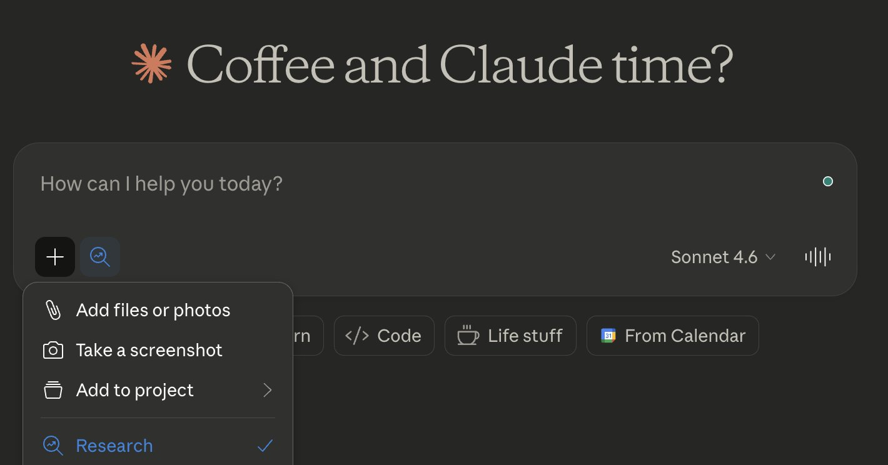

---

### 6. Claude App（桌面應用程式）

要使用下一節的進階工具，需要下載專用的 Claude 桌面應用程式。

安裝說明：[support.claude.com - Installing Claude Desktop](https://support.claude.com/en/articles/10065433-installing-claude-desktop)

---

## Section V：進階工具——Claude Code、Cowork 等

以下是重量級功能，**這些工具將真正改變你的工作方式。**

### 1. Claude Cowork

- 僅在下載版 Claude app 可用（無 Web 版）
- 允許 Claude 在背景自主存取檔案並執行任務
- 可排程任務、建立 Plug-ins，並觀看 Claude 執行複雜任務

> 作者將於下週發布完整 Cowork 指南，目前只需知道它的存在，以及它驚人的強大。

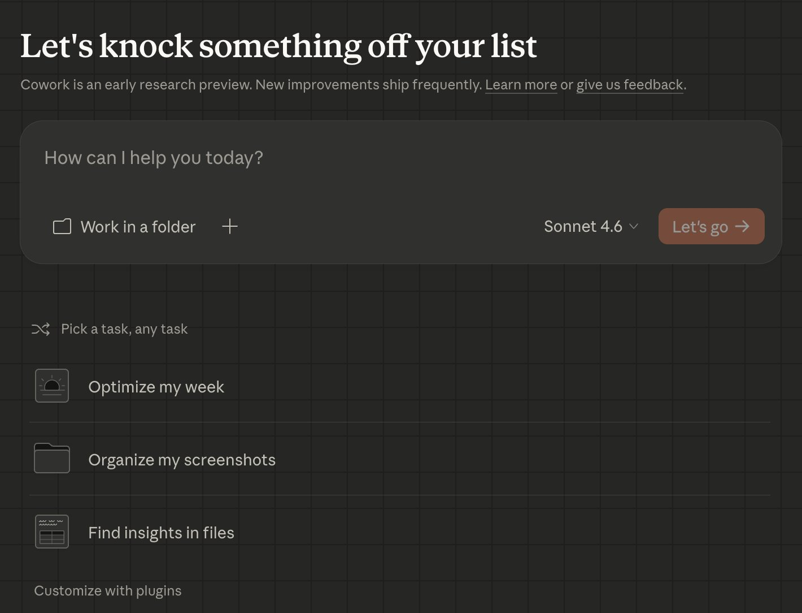

---

### 2. Claude Code

**Claude Code 是目前市場上最強大的 AI 程式碼工具。**

- 寫程式碼、建網站、處理錯誤——文字意義上的「任何事」
- 這是進階工具，但如果你是開發者且還沒在用，你應該開始用了

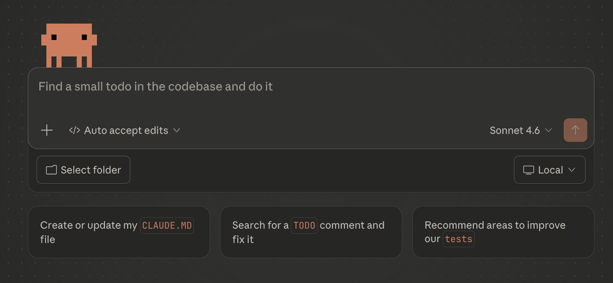

---

### 3. Claude Skills（Claude 技能）

路徑：`主頁 → Customize → Skills`

把 Claude Skills 想成是**給 Claude 的可重複指令與工作流程**。

不再需要一遍又一遍輸入相同的 prompt——把它做成 Skill，Claude 就知道該怎麼做。

**實際範例：**
- 假設你每天都在分析試算表數據
- 一般情況：每次都要重新 prompt Claude：「分析這個試算表並尋找 XYZ。」
- 使用 Skill：只需 prompt「使用我的 Spreadsheet Analyzer Skill」，同樣流程自動執行，每次都完全照你的要求

**最棒的是：Claude 可以幫你建立這些 Skills——只需請它為 [插入工作流程] 建立一個 Skill。**

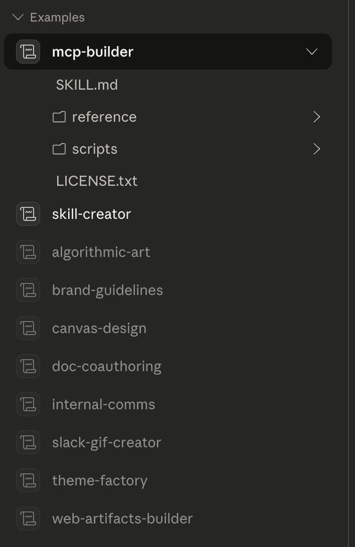

**延伸閱讀：** [How to Deploy Claude Skills Effectively（1 月 27 日）](https://x.com/aiedge_/status/2015822565500194961)

---

### 4. Cowork Plug-ins（外掛程式）

路徑：`Cowork → Customize → Plug-ins`

把 Plug-ins 想成**員工職位**。

| 比較 | 說明 |
|------|------|
| **Skill** | 處理一個可重複任務——單一 prompt、工作流程或指令集 |
| **Plug-in** | 打包自動化整個「職位」所需的一切，多個 Skills 組合成一個自動化功能 |

**實際範例（電子報）：**
安裝一個 Content Writer Plug-in，它已了解你的品牌聲音、格式化每期內容、彙整相關新聞，並提交一份準備發布的草稿。

不需要每次從頭訓練 Claude，因為職位角色已經定義好了。

Anthropic 已內建 10+ 個可立即使用的 Plug-ins，涵蓋法律、行銷、財務等領域。

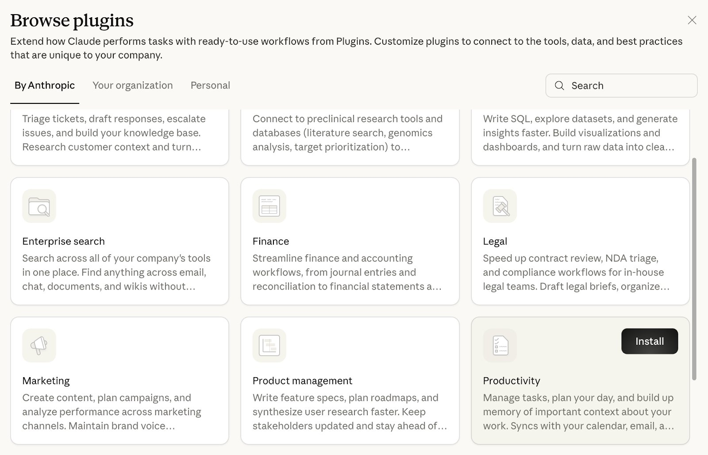

---

## 結語

希望你覺得這篇文章有幫助。

如果覺得有用，請按讚/轉發，讓更多人看到 💙

歡迎在留言處分享你的 Claude 初學者技巧——相信對其他人也很有幫助。

---

*原文連結：[https://x.com/aiedge_/status/2029233676111008061](https://x.com/aiedge_/status/2029233676111008061)*
