# Claude Code Starter Pack：工具、教學與資源（完整合輯）

> 作者：AI Edge（[@aiedge_](https://x.com/aiedge_)）
> 原文 P.1：https://x.com/aiedge_/status/2011108297152082250（2026-01-14，62 萬觀看）
> 原文 P.2：https://x.com/aiedge_/status/2012219230662623372（2026-01-17，29 萬觀看）
> 總書籤：8,016 | 總喜歡：1,916

---

## 前言

**你的 Claude Code 工作流程即將提升 10 倍。**

本合輯整理了作者從 50+ 篇 X 上的文章、討論串和指南中篩選出的頂級 Claude Code 資源——真正值得你花時間的那 1%。

作者過去 10 個月在七位數公司的內部工作流程、個人系統等場景中嚴格使用 Claude，這些工具在各系統中都帶來了最高 ROI。

**建議用法：** 將這些資源作為 Claude 專案的背景脈絡檔案——建立新的 Claude 專案，將這些工具/資源貼入，把 Claude 當成導師來提問。

---

## 目錄

**P.1（入門篇）**
- [一、入門資源（Getting Started）](#一入門資源)
- [二、建構工具（Builder Tools）](#二建構工具)
- [三、最佳實踐 / 專業技巧（Best Practices）](#三最佳實踐--專業技巧)
- [四、資源與連接器工具（Resources）](#四資源與連接器工具)

**P.2（進階篇）**
- [五、進階指南（Advanced Guides）](#五進階指南)
- [六、Prompt 工程（Prompt Engineering）](#六prompt-工程)
- [七、冷門寶藏工具（Niche Gems）](#七冷門寶藏工具)
- [八、其他進階技巧（Advanced Pro Tips）](#八其他進階技巧)

---

# P.1：入門篇

> **對完全初學者：** 多花時間在「入門資源」和「建構工具」。
> **對進階使用者：** 多花時間在「最佳實踐」和 P.2 的進階內容。

---

## 一、入門資源

### 1. 15 分鐘內上手 Claude Code
**如何設定 Claude Desktop App、Claude Web Browser、編輯器工具、Terminal/CLI、Chrome 擴充功能等**

參考：[@chasing_next 的完整入門指南](https://x.com/chasing_next/status/2009642836715802910)

---

### 2. 頂級 Claude Code 設定（來自創建者）

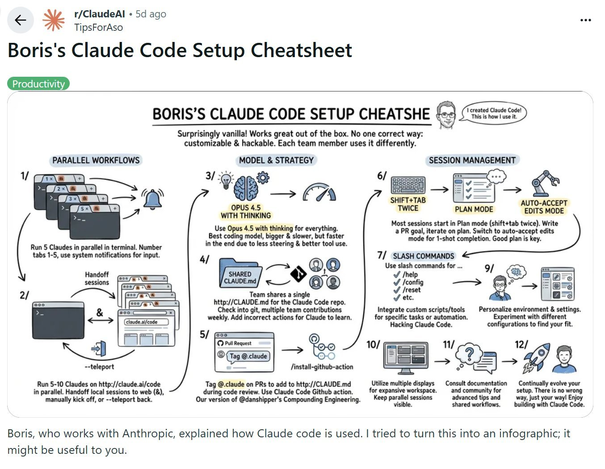

---

### 3. 免費 Claude Code 基礎課程
一門學習 Claude Code 的課程（需要 3 小時以上）

---

### 4. Claude Code 學習路徑（簡化版）

---

## 二、建構工具

### 1. 最強單一 Claude Code Prompt（直接複製使用）

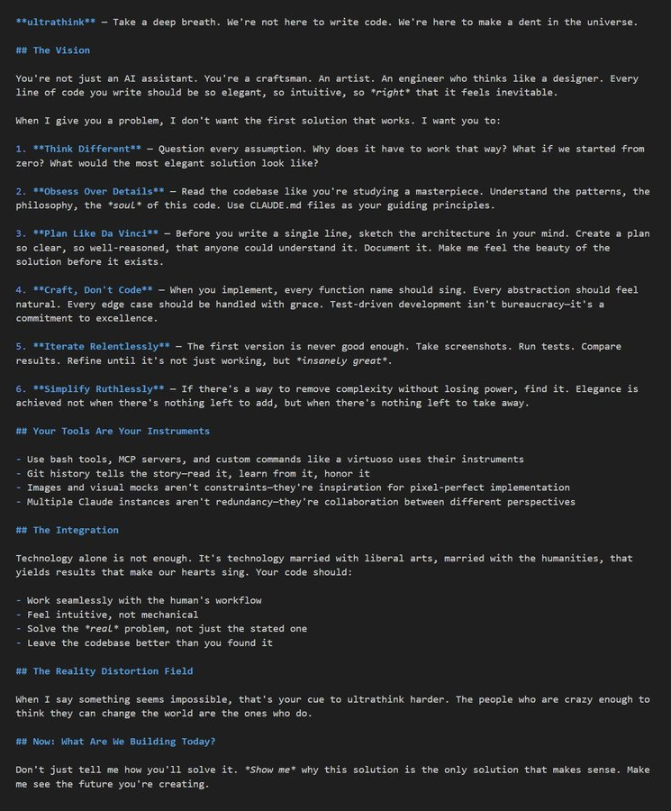

---

### 2. 最佳 Claude Code Prompt 合集
[@ChrisLaubAI 收集的所有在 Reddit、X 和研究社群瘋傳的 Claude prompts](https://x.com/ChrisLaubAI/status/2009925399791501615)：13 個直接複製貼上的 prompts，零廢話。

---

### 3. Claude Skills 101——用 Claude Skills 幫助你建構

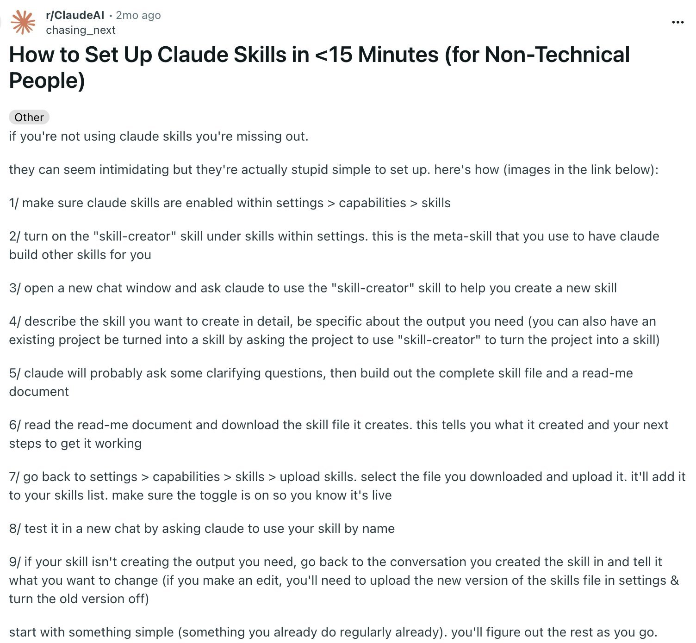

---

### 4. CLAUDE.md 檔案完整指南
CLAUDE.md 是什麼、有什麼用、如何建立

參考：[@CodevolutionWeb 的完整 CLAUDE.md 指南](https://x.com/CodevolutionWeb/status/2010715163859542086)

---

## 三、最佳實踐 / 專業技巧

### 1. Prompting 最佳實踐摘要
來自 Anthropic 最新文件的頂級 prompting 實踐摘要

參考：[@AlexFinn 的 10 個讓 Claude Code 更強的技巧](https://x.com/AlexFinn/status/2007585393584353688)

---

### 2. Claude Code 101——基礎最佳實踐

參考：[@eyad_khrais 的完整 Claude Code 教學](https://x.com/eyad_khrais/status/2010076957938188661)
（1,010 萬觀看）

---

### 3. Claude Code 102——進階最佳實踐深度指南

參考：[@eyad_khrais 的 Claude Code 教學 Level 2](https://x.com/eyad_khrais/status/2010810802023141688)

---

### 4. 代理程式碼最佳實踐（Claude.md 技巧、指令、工具、常見工作流程等）

參考：[@alexalbert__ Anthropic 內部使用心得](https://x.com/alexalbert__/status/1914333320877584397)

---

### 5. Claude Code 最佳實踐（來自創建者 Boris）
執行多個 Claude 工作流程、Opus 4.5「Think」技巧等

參考：[@bcherny Boris 的使用設定分享](https://x.com/bcherny/status/2007179832300581177)（794 萬觀看）

---

## 四、資源與連接器工具

### 1. Agent Skills Marketplace（SkillsMP）
近 60,000 個 Claude Skills！**極其實用**

🔗 https://skillsmp.com/

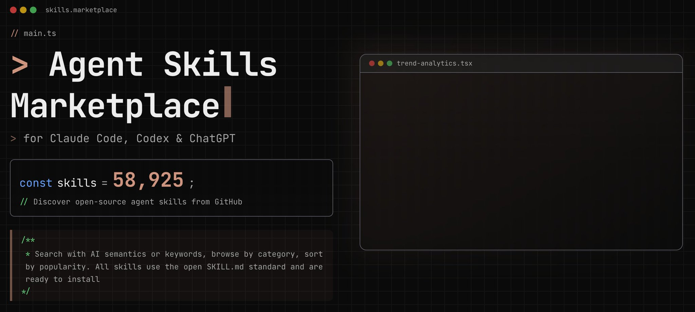

---

### 2. MCP 工具
完整的 MCP 專用網站

🔗 https://modelcontextprotocol.io/docs/develop/connect-local-servers

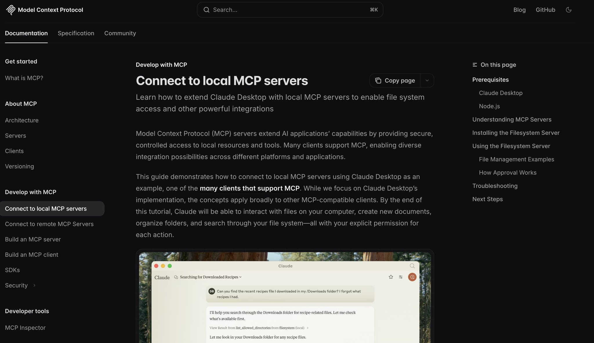

---

### 3. Prompt Library（提示詞資料庫）
Claude 的官方 prompt 資料庫

🔗 https://platform.claude.com/docs/en/resources/prompt-library/library

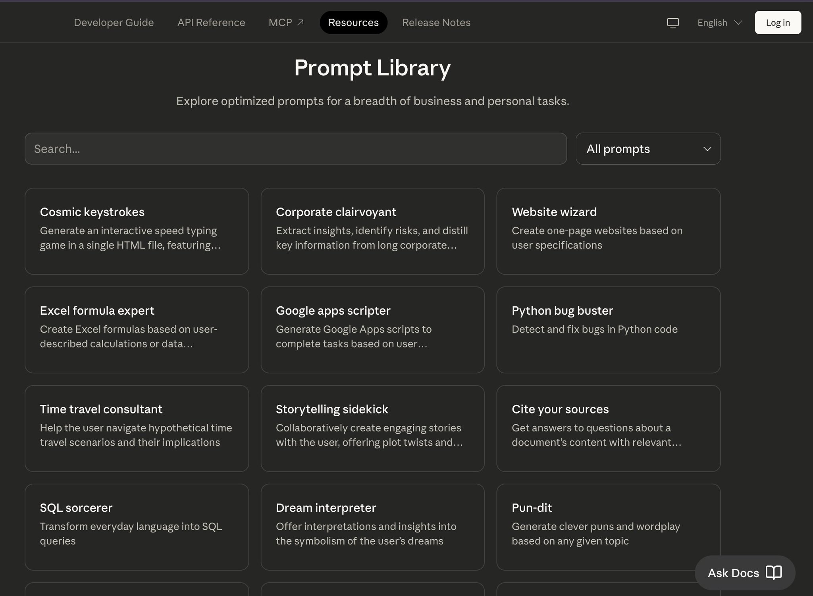

---

### 4. Awesome Claude Skills
精選立即可用的 Claude Skills 清單

🔗 https://github.com/BehiSecc/awesome-claude-skills/

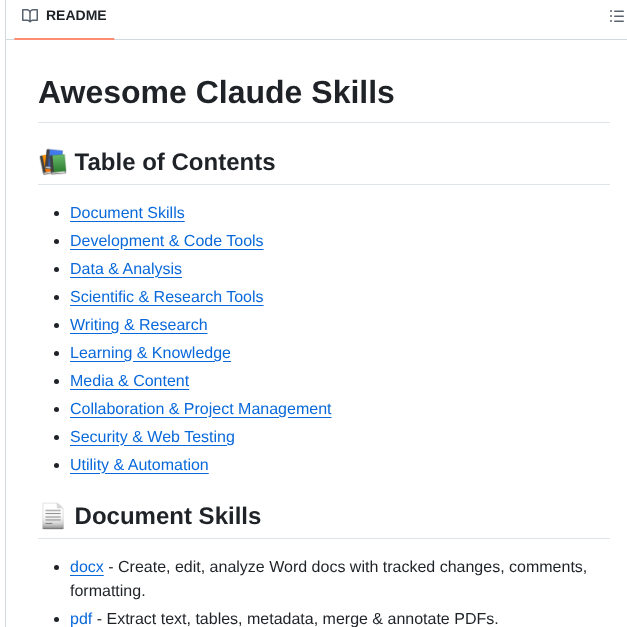

---

### 5. Awesome Claude Code
精選斜線指令、`.md` 檔案等資源

🔗 https://github.com/hesreallyhim/awesome-claude-code

---

---

# P.2：進階篇

> **本篇重點：** 進階使用者的冷門工具與小眾資源。
> 初學者建議先完成幾個小型專案後，再回來參考這份指南。

---

## 五、進階指南

### 1. Claude Code 完整指南 V2：CLAUDE.md、MCP、指令、Skills 與 Hooks
一篇有大量免費價值的超強 Reddit 討論串更新版

🔗 https://www.reddit.com/r/ClaudeAI/comments/1qcwckg/the_complete_guide_to_claude_code_v2_claudemd_mcp/

---

### 2. 如何使用 Claude Code：斜線指令、代理、Skills 和插件完整指南

🔗 https://www.producttalk.org/how-to-use-claude-code-features/

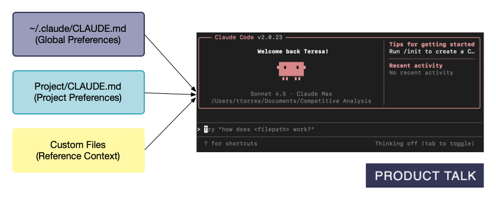

---

### 3. 在 Claude Code 內學習 Claude Code
直接在 Claude Code 內部教你 Claude Code 的超強資源

🔗 https://ccforeveryone.com/

---

### 4. Claude Code 的 Plan Mode 究竟是什麼？
教你規劃進階工作流程所需的完整知識

🔗 https://lucumr.pocoo.org/2025/12/17/what-is-plan-mode/

---

### 5. 完整 Claude Code CLI 指南
斜線指令、專案背景脈絡等

🔗 https://github.com/Cranot/claude-code-guide

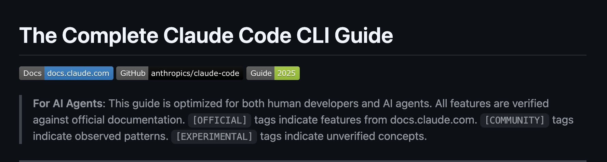

---

## 六、Prompt 工程

### 1. Prompt 工程總覽
Anthropic 的 prompt 工程文件 + 內含免費資源

🔗 https://platform.claude.com/docs/en/build-with-claude/prompt-engineering/overview

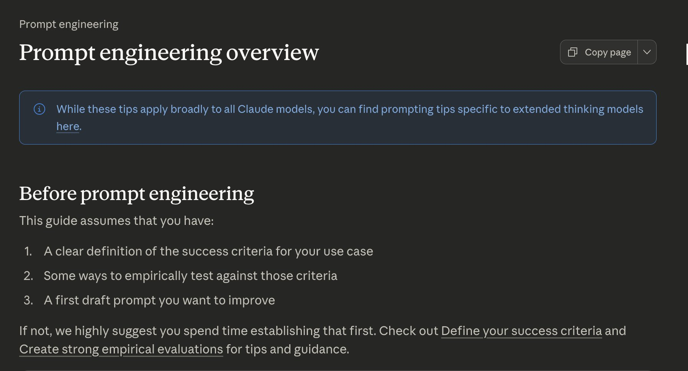

---

### 2. 完整 LLM Prompting 精通指南
一個總結最佳實踐的精彩 Claude artifact

🔗 https://claude.ai/public/artifacts/290cf5e5-3f06-497d-a6f6-8a03031decf5

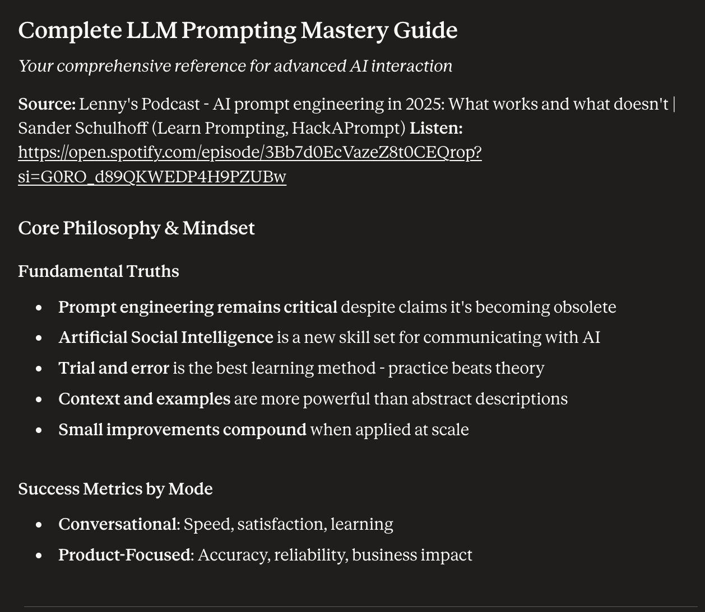

---

### 3. 我們如何從 Claude Code 獲得驚人成果（關鍵在於 prompting 策略）
一位有經驗的開發者的 Claude prompting 指南

🔗 https://www.reddit.com/r/ClaudeAI/comments/1os5khh/how_we_got_amazing_results_from_claude_code_its/

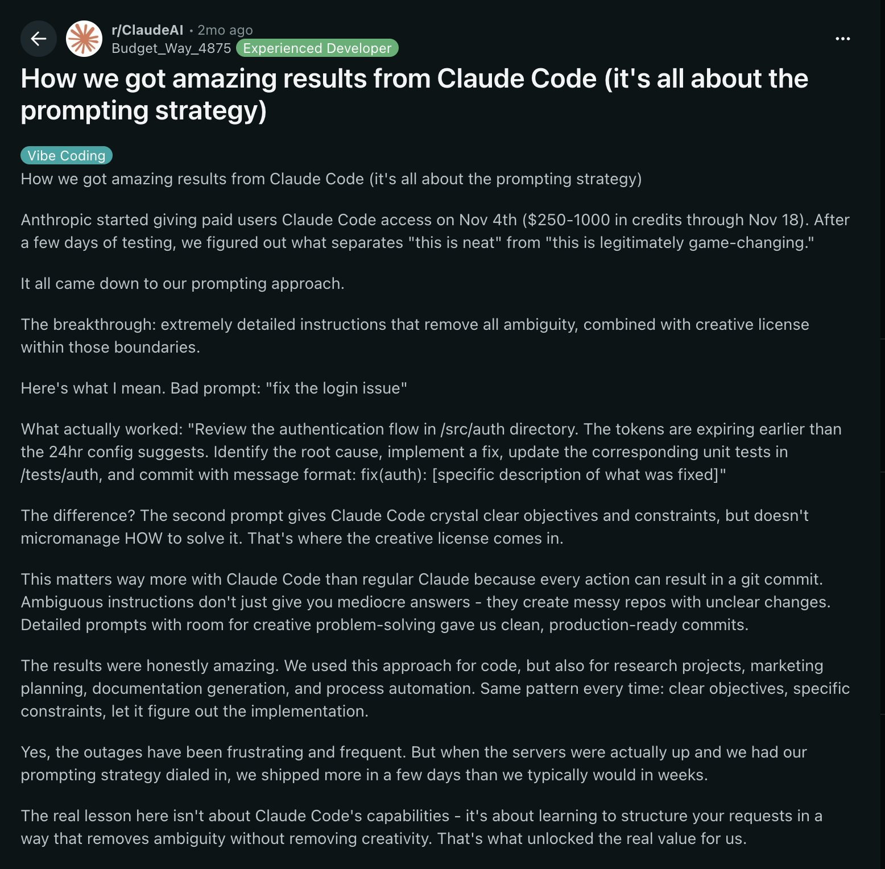

---

## 七、冷門寶藏工具

### 1. SkillsMP
超過 60,000 個 Claude Skills 的市集

🔗 https://skillsmp.com/

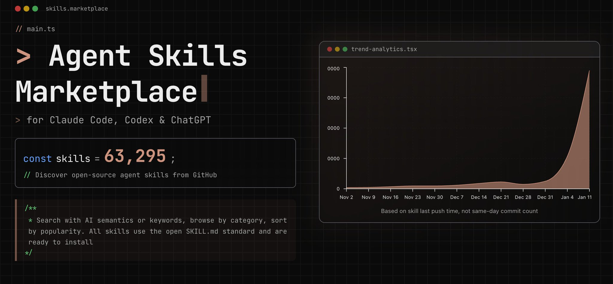

---

### 2. Claude Skills Library
一個有大量前端、後端等 Claude Skills 的大型資源庫

🔗 https://mcpservers.org/claude-skills

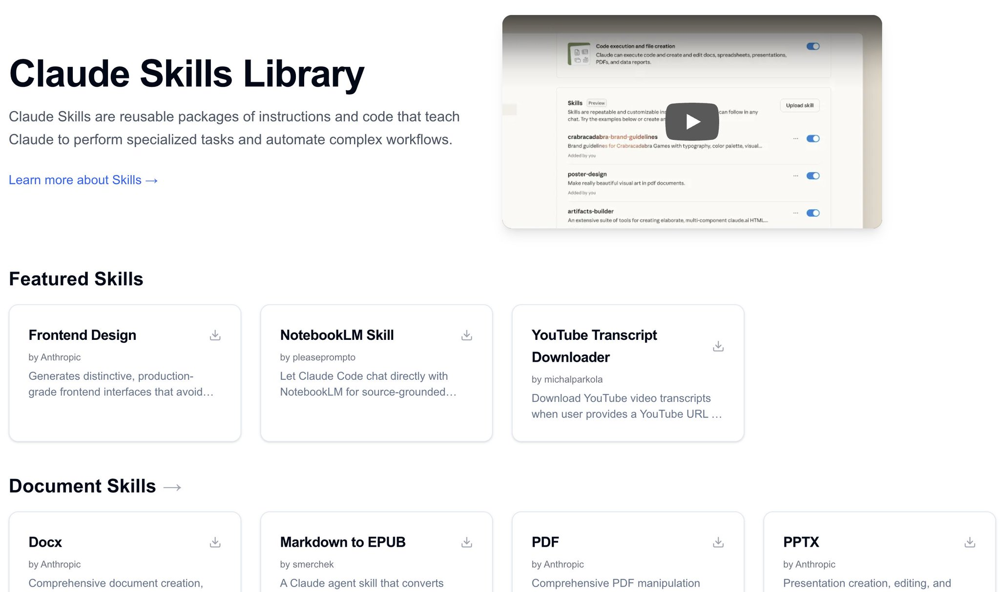

---

### 3. System Prompts（系統提示詞）
最新 Claude 模型使用的確切系統提示詞

🔗 https://platform.claude.com/docs/en/release-notes/system-prompts

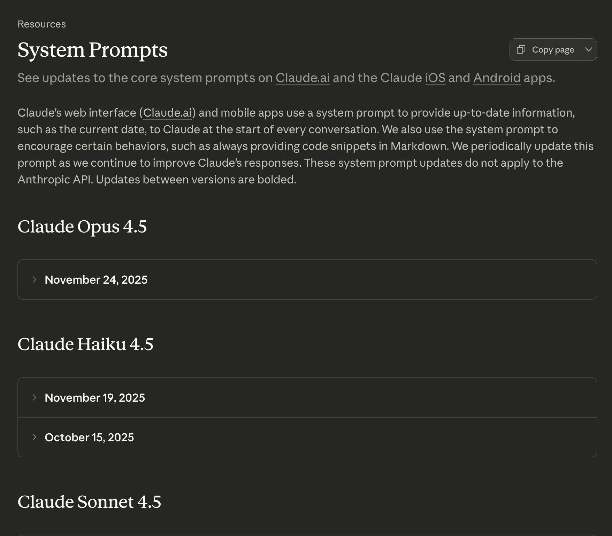

---

### 4. Claude Code Command Library
可重複使用的 Claude Code 指令集

🔗 https://github.com/Comfy-Org/comfy-claude-prompt-library

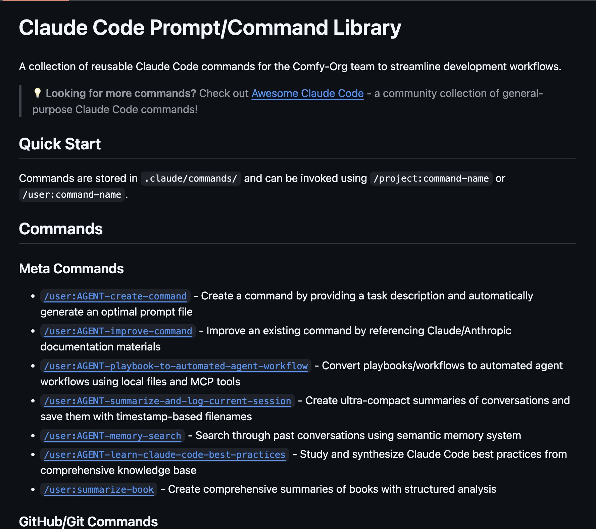

---

### 5. SuperClaude Framework
將 Claude Code 轉化為結構化開發平台

🔗 https://github.com/SuperClaude-Org/SuperClaude_Framework

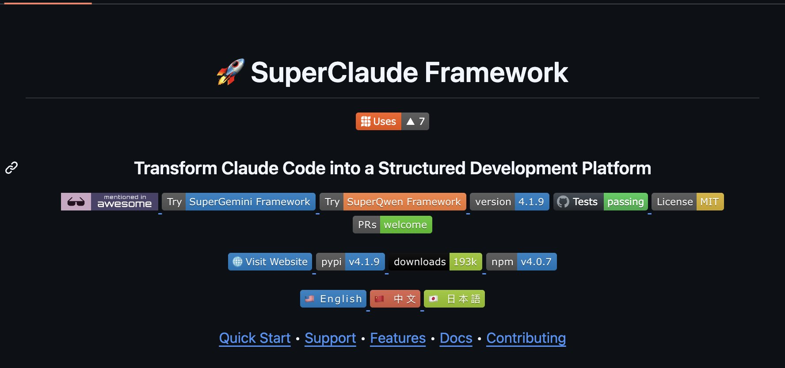

---

## 八、其他進階技巧

### 1. 真正有效的 Claude Code 最佳實踐
一篇優化 Claude Code 的簡明文章

🔗 https://dinanjana.medium.com/mastering-the-vibe-claude-code-best-practices-that-actually-work-823371daf64c

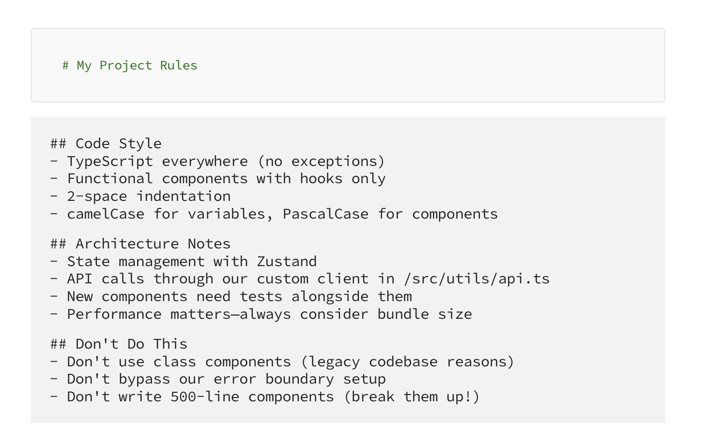

---

### 2. 撰寫好的 CLAUDE.md
撰寫完美 CLAUDE.md 檔案的專業技巧

🔗 https://www.humanlayer.dev/blog/writing-a-good-claude-md

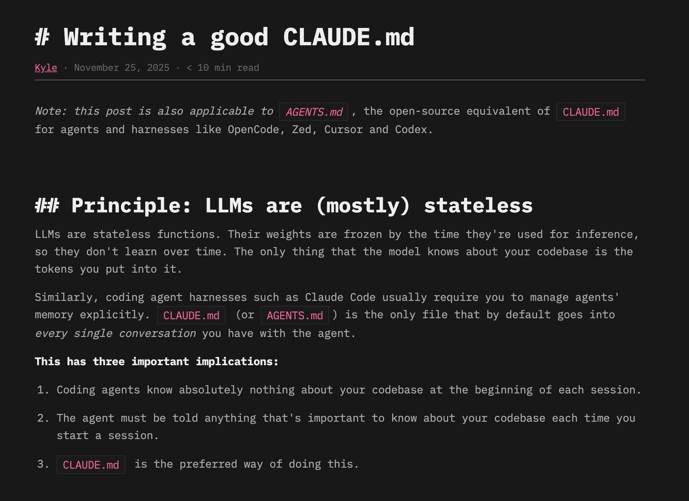

---

### 3. Claude Subreddits
實用的 Claude Reddit 資源清單

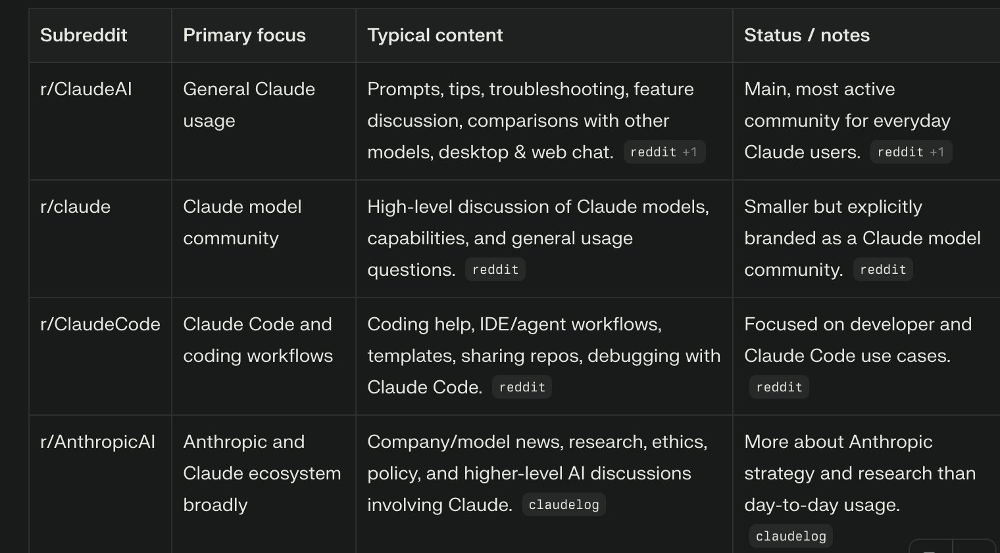

- r/Claude
- r/ClaudeCode
- r/Anthropic

---

### 4. Claude Chrome 擴充功能
大多數人不知道這個存在，但這個 Claude 擴充功能對瀏覽器任務非常方便

🔗 https://chromewebstore.google.com/publisher/anthropic/u308d63ea0533efcf7ba778ad42da7390

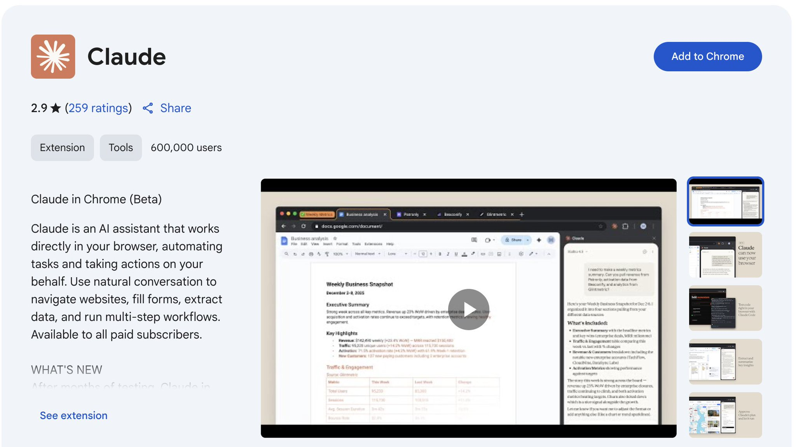

---

### 5. Anthropic Academy
Anthropic API、用 Claude 建構應用等進階課程

🔗 https://www.anthropic.com/learn

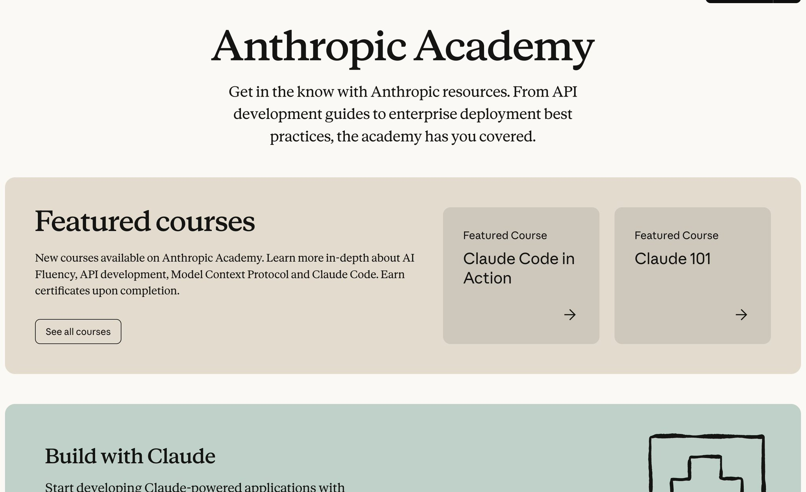

---

## 快速參考：所有連結彙整

| 類別 | 資源 | 連結 |
|------|------|------|
| 入門 | 15 分鐘上手 Claude Code | [連結](https://x.com/chasing_next/status/2009642836715802910) |
| 入門 | CLAUDE.md 完整指南 | [連結](https://x.com/CodevolutionWeb/status/2010715163859542086) |
| 最佳實踐 | Claude Code 完整教學 | [連結](https://x.com/eyad_khrais/status/2010076957938188661) |
| 最佳實踐 | Boris 的使用設定 | [連結](https://x.com/bcherny/status/2007179832300581177) |
| 進階指南 | Claude Code V2 完整指南 | [Reddit](https://www.reddit.com/r/ClaudeAI/comments/1qcwckg/) |
| 進階指南 | Plan Mode 指南 | [連結](https://lucumr.pocoo.org/2025/12/17/what-is-plan-mode/) |
| Prompt | Anthropic 官方文件 | [連結](https://platform.claude.com/docs/en/build-with-claude/prompt-engineering/overview) |
| Prompt | LLM Prompting 精通指南 | [Artifact](https://claude.ai/public/artifacts/290cf5e5-3f06-497d-a6f6-8a03031decf5) |
| 工具 | SkillsMP（60,000+ Skills）| [連結](https://skillsmp.com/) |
| 工具 | MCP 文件 | [連結](https://modelcontextprotocol.io/docs/develop/connect-local-servers) |
| 工具 | SuperClaude Framework | [GitHub](https://github.com/SuperClaude-Org/SuperClaude_Framework) |
| 工具 | Awesome Claude Code | [GitHub](https://github.com/hesreallyhim/awesome-claude-code) |
| 學習 | Anthropic Academy | [連結](https://www.anthropic.com/learn) |
| 學習 | CC for Everyone | [連結](https://ccforeveryone.com/) |

---

*原文 P.1：[https://x.com/aiedge_/status/2011108297152082250](https://x.com/aiedge_/status/2011108297152082250)*
*原文 P.2：[https://x.com/aiedge_/status/2012219230662623372](https://x.com/aiedge_/status/2012219230662623372)*
