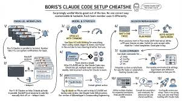

# Claude Code Best Practices：50 個 Claude Code 技巧

> 作者：AI Edge（[@aiedge_](https://x.com/aiedge_)）
> 發布日期：2026-01-24
> 原文連結：https://x.com/aiedge_/status/2014740607248564332
> 觀看數：78.3 萬 | 書籤：4,702 | 喜歡：1,264

---

## 前言

**50 個沒人談論的 Claude Code 使用技巧，幫助你用 Claude 建構更好的東西。**

作者花了 24 小時閱讀全新的 Claude Code 最佳實踐文件，整理出所有最佳實踐，並加入自身使用經驗，編成這份終極清單。

本清單也包含各種 Claude Code 工具與學習資源。


---

## 一、基礎技巧（Tips 41–50）

**50. 明確說明任務框架（Clear Task Framing）**
在做任何事之前，先精確說明你想要 Claude 做什麼。

**49. 重要指令放最前面（Front Load Instructions）**
永遠把最重要的指令放在 prompt 的最頂端。

**48. 給 Claude 一個驗證自己工作的方法**
提供測試、截圖或預期輸出，讓 Claude 可以自我檢查。**這是你能做的最高槓桿操作之一。**

**47. Prompt 結構技巧**
讓以上幾點更實際可行的 prompt 結構：
```
[角色] + [任務] + [背景脈絡]
```

**46. Chrome 擴充功能技巧**
UI 變更可以使用 Claude Chrome 擴充功能來驗證——它會開啟瀏覽器、測試 UI，並持續迭代直到程式碼正常運作。

**45. 先探索，再規劃，再寫程式碼**
研究（此流程可以包含其他 LLM）→ 進入 Plan Mode → 切回正常模式執行程式碼。

**44. 在 prompt 中提供具體背景**
指令越精確越好。Claude 只能推論背景脈絡，無法自行得知。

**43. 假設零背景（Assume Zero Context）**
假設 Claude 對你的專案一無所知，把所有需要的資訊都告訴它。

**42. 豐富背景脈絡（Rich Context）**
使用 `@` 連結檔案、資料和圖片。

**41. CLAUDE.md 技巧**
執行 `/init` 為當前專案生成一個起始用的 `CLAUDE.md` 檔案。

---

## 二、Projects 與 Skills 使用（Tips 31–40）

**40. 專案指令（Project Instructions）**
使用專案級別的指令來定義長期行為，而不是每次重複 prompt。

**39. 專案記憶（Project Memory）**
編輯「Memory」標籤頁，精確控制 Claude 應該記住或忽略什麼（在專案中同樣適用）。

**38. Claude Skills**
把可重複的工作流程做成 Skills，而不是每次重新 prompt。

**37. 從範例建立 Skill**
貼上一個優質輸出，請 Claude 將其轉成可重複使用的 Skill。你甚至可以上傳截圖，讓 Claude 複製並轉成 Skill（建立頂級技能的簡易方法）。

**36. Skill 版本控制**
當你在優化工作流程時，複製並版本化 Skills，而不是直接編輯正在使用的版本。

**35. 專案衛生（Project Hygiene）**
定期清理記憶、檔案和指令，避免偏移（drift）。

**34. 專案背景污染（Context Bleed）**
為不相關的工作流程分開建立專案，防止背景脈絡互相污染。

**33. Claude Skills 資料庫**
超過 80,000 個 Claude Skills 的資料庫：
🔗 https://skillsmp.com/

**32. Claude Skills Library**
一個有即插即用 Skills 等功能的酷炫網站：
🔗 https://mcpservers.org/claude-skills

**31. 專案記憶存放位置**
專案記憶可以存放在以下任一位置：
- `./CLAUDE.md`
- `./.claude/CLAUDE.md`

---

## 三、冷門但實用的小技巧（Tips 21–30，多數人不知道）

**30. 模型堆疊（Model Stacking）**
在開啟 Claude Code 之前，先用其他 LLM 規劃專案並生成進階 mega prompts——這個策略同時也能節省 Plan Mode 的 token 消耗。

**29. 建立自訂子代理（Custom Subagents）**
在 `.claude/agents/` 目錄中定義專門化的助理，Claude 可以將獨立任務委派給這些子代理。

**28. 輸出評分（Output Scoring）**
請 Claude 依據你預先定義的成功標準為自己的回答打分。

**27. 安裝插件（Plugins）**
執行 `/plugin` 瀏覽市集。插件無需任何設定即可新增技能、工具和整合功能。

**26. 在 Claude Code 內學 Claude Code**
一門直接在 Claude Code 內部教你 Claude Code 的課程：
🔗 https://ccforeveryone.com/

**25. Claude 面試你（Claude Interviews）**
對於較大的專案，先讓 Claude 面試你。從最簡短的 prompt 開始，請 Claude 使用 `AskUserQuestion` 工具來訪問你。

**24. 經常糾正（Correct Often）**
隨時糾正 Claude 的方向。當它開始偏軌時，立即停止（用 ESC 停止 Claude 的動作）。

**23. 清除（Clear）**
執行 `/clear` 開始一個乾淨的新工作階段。

**22. 倒帶（Rewind）**
連按兩次 ESC 或執行 `/rewind` 開啟檢查點選單。

**21. 執行多個工作階段（Parallel Sessions）**
有兩種主要方式執行平行工作階段：
- **Claude Desktop：** 以視覺化方式管理多個本地工作階段，每個工作階段都有獨立的 worktree
- **Claude Web：** 在 Anthropic 安全雲端基礎設施的隔離 VM 中執行

---

## 四、除錯、錯誤處理、常見失敗模式（Tips 11–20）

**20. 步驟隔離（Step Isolation）**
只重新執行出錯的步驟，而不是重新生成所有東西。

**19. 錯誤重現（Error Reproduction）**
請 Claude 故意重現失敗，以理解問題所在。

**18. 回滾 Prompts（Rollback Prompts）**
回到上一個已知正常的 prompt，然後一次重新應用一個變更。

**17. CLAUDE.md 過度指定（Over-Specified）**
如果你的 `CLAUDE.md` 太長，Claude 會忽略其中一半——因為重要規則在雜訊中迷失了。

> **修正：** 無情地刪減。如果 Claude 在沒有某條指令的情況下已經做對了，就刪除它，或將其轉換成 hook。

**16. 別犯這個錯誤——任務混雜**
你開始一個任務，然後問 Claude 一個不相關的問題，再回到第一個任務。背景脈絡充斥著不相關的資訊。

> **修正：** 在不相關任務之間執行 `/clear`。

**15. 過度糾正（Over-Correcting）**
Claude 做錯了，你糾正它，它還是錯，你再糾正。背景被失敗方案污染了。

> **修正：** 在兩次糾正失敗後，執行 `/clear` 並根據所學撰寫更好的初始 prompt。

**14. 逐步重播（Step-by-Step Replay）**
請 Claude 逐行解說它如何生成這個答案。

**13. 無限探索問題（The Infinite Exploration）**
你請 Claude「調查」某事而沒有限定範圍。Claude 讀了數百個檔案，把背景填滿了。

> **修正：** 嚴格限定調查範圍，或使用子代理，讓探索不消耗主背景。

**12. 除錯專案（Debugging Project）**
建立一個專門用來除錯程式碼的 AI 專案（Grok 4 Heavy 擅長除錯）。

**11. 上下文視窗管理（Context Window Management）**
Claude 的上下文視窗填滿速度很快。隨著這種情況發生，Claude 可能開始忘記早期的指令。

參考這個頁面解決這個問題：
🔗 https://code.claude.com/docs/en/costs#reduce-token-usage

---

## 五、最終技巧（Tips 1–10）

**10. Notion 資料庫**
將你的 Notion 資料庫連接到 Claude，儲存你最好且最常用的 prompts。

**9. 在 Action 中學習 Claude Code**
Anthropic 的學習資源：
🔗 https://www.anthropic.com/learn

**8. Claude 課程**
Coursera 上的課程：
🔗 https://www.anthropic.com/learn

**7. Boris 的設定**
Claude Code 創建者如何最大化利用 Claude Code：



**6. Claude Code 最佳實踐文件**
最新官方文件：
🔗 https://code.claude.com/docs/en/best-practices

**5. 安全自主模式（Safe Autonomous Mode）**
使用 `claude --dangerously-skip-permissions` 略過所有權限檢查，讓 Claude 不中斷地工作。適合修正 lint 錯誤或生成樣板程式碼等工作流程。

**4. 慢慢來，穩扎穩打（Slow & Steady）**
慢下來。特別是在建構嚴肅的工作流程時。

> **規劃。規劃。規劃。然後，執行。**

**3. Claude 超能力（Claude Superpowers）**
一個 Claude Code 超能力的 GitHub Repo：
🔗 https://github.com/obra/superpowers

**2. Hooks**
適合那些每次都必須執行、零例外的動作。

**1. 如何擴展 Claude Code**
Anthropic 的官方指南：
🔗 https://code.claude.com/docs/en/features-overview

---

## 快速參考索引

| 分類 | Tips 編號 |
|------|-----------|
| 基礎技巧 | 41–50 |
| Projects & Skills | 31–40 |
| 冷門實用技巧 | 21–30 |
| 除錯與錯誤處理 | 11–20 |
| 最終技巧與資源 | 1–10 |

---

*原文連結：[https://x.com/aiedge_/status/2014740607248564332](https://x.com/aiedge_/status/2014740607248564332)*
