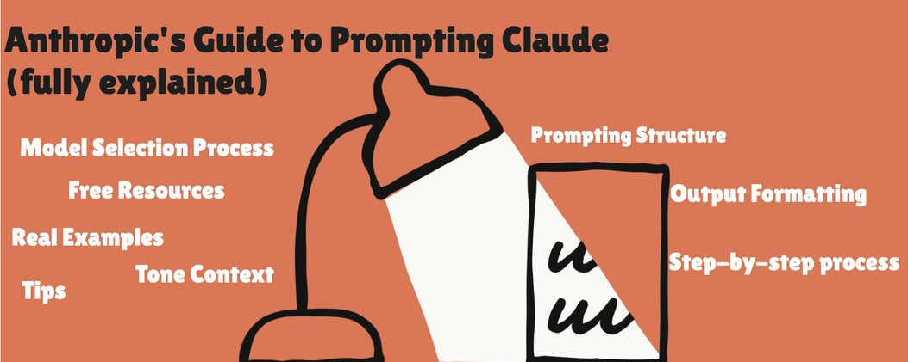
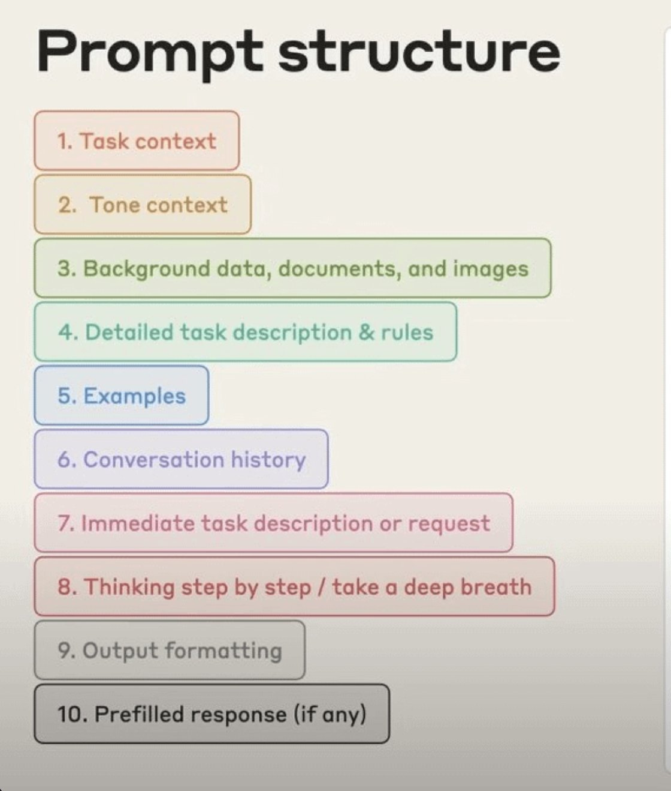
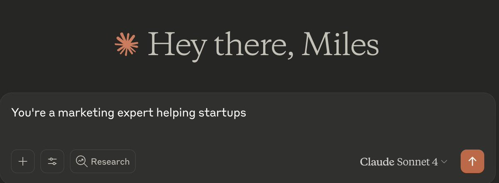
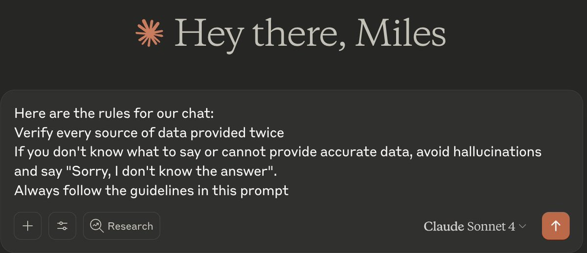
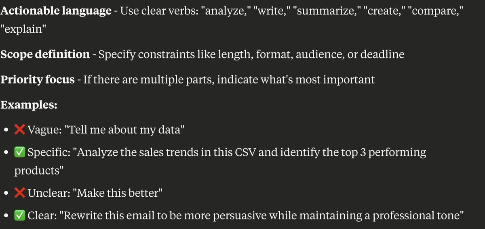
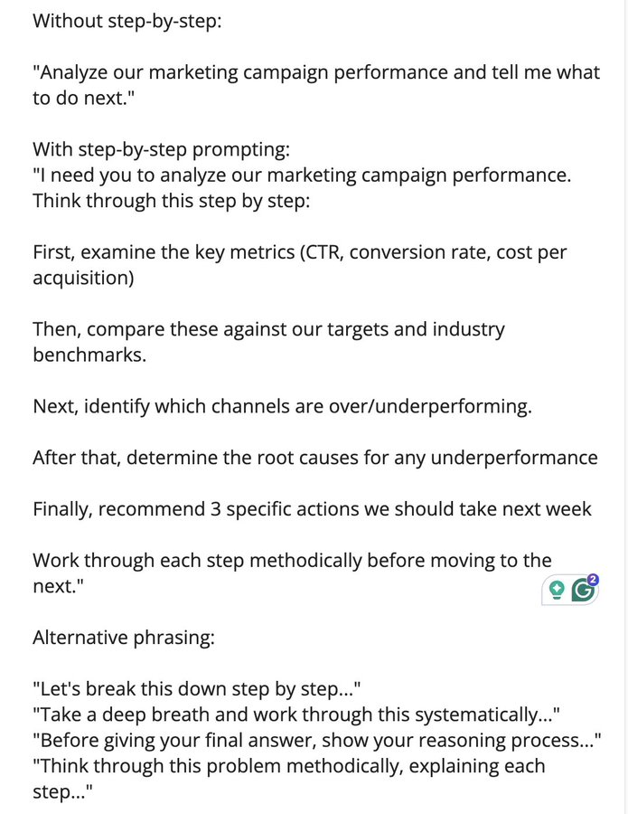
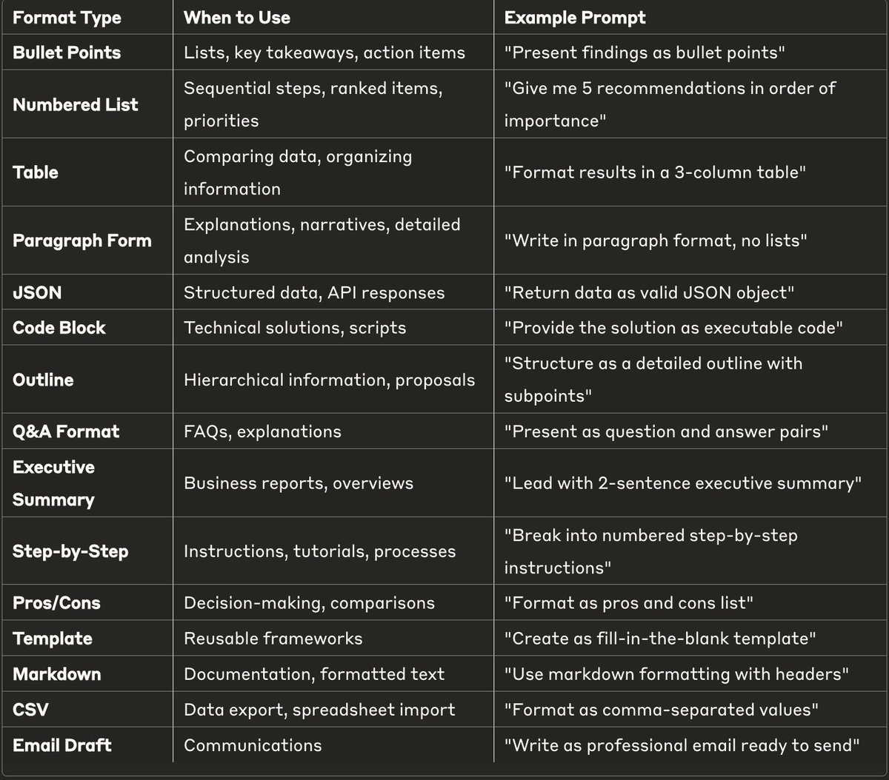
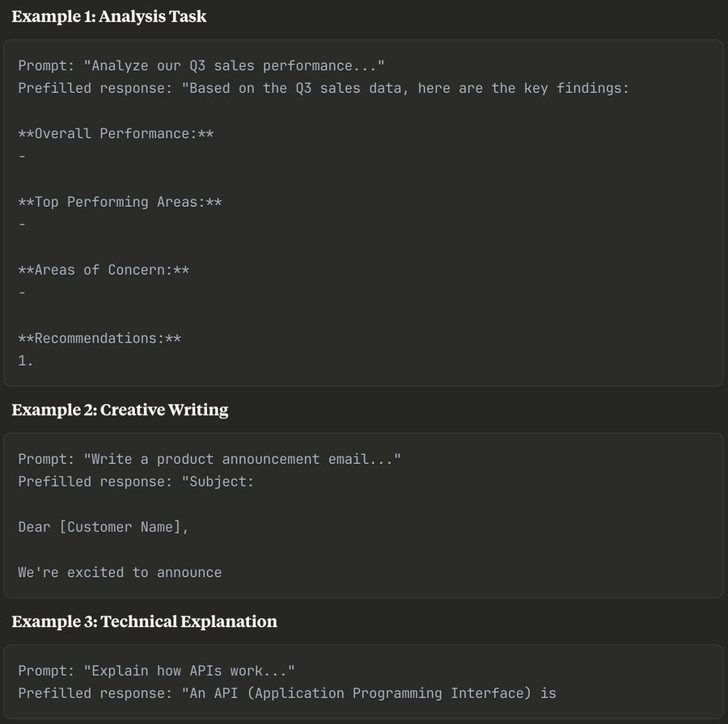
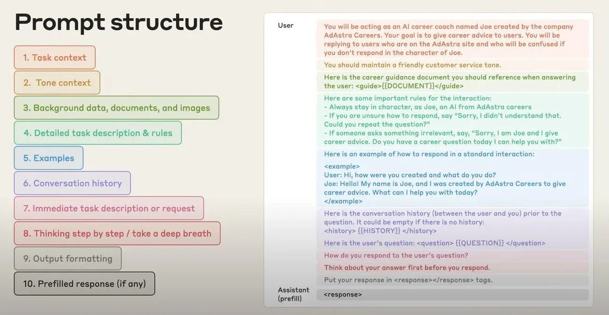

# How to Prompt Claude for Elite Outputs（Anthropic 官方提示指南）

> 作者：AI Edge（[@aiedge_](https://x.com/aiedge_)）
> 發布日期：2026-01-29
> 原文連結：https://x.com/aiedge_/status/2016553316851896790
> 觀看數：26.6 萬 | 書籤：2,715 | 喜歡：809

---

## 前言

**如何透過 Anthropic 的官方指南從 Claude 獲得頂級輸出**

Anthropic 最近發布了一份關於 Prompt 工程的大師課程。

這個內部框架旨在提供頂級 AI 回應，如果你經常使用 Claude，**你需要將這個框架加入你的提示工具包。**

Anthropic 的最佳提示結構遵循 **10 個步驟**，但在深入步驟說明之前，我們需要先談談模型選擇。



---

## 模型選擇流程——4.5 系列

**Opus 4.5**
Anthropic 最智慧的模型。最適合複雜推理、深度分析、程式開發任務，以及需要真正智慧能力的工作。

**Sonnet 4.5**
平衡的主力模型。比 Opus 更快、成本更低，但仍具備強大推理能力。最適合大多數日常任務。

**Claude Haiku 4.5**
速度之星。最快且最便宜。最適合高量、直觀的任務——作者特別喜歡在 Claude Chrome 擴充功能中使用這個選項進行快速回覆。

---

## Prompting 結構

以下是 Anthropic 推薦的提示結構：



讓我們逐步分解，並附上實際範例。

---

### 1. 任務背景脈絡（Task Context）

這可以說是任何提示中**最關鍵的部分**。

把這個部分想像成：設定角色 + 手頭上的任務。

範例：



---

### 2. 語氣脈絡（Tone Context）

這個步驟定義了與 LLM 的**溝通風格**（例如：專業、輕鬆、溫暖）。

你使用的確切語氣內容取決於你正在提示的模型。

結合「任務背景脈絡 + 語氣脈絡」的範例：


---

### 3. 背景資料（Background Data）

背景資料在任何需要詳細回答的提示中都至關重要。

想想：上傳 PDF、檔案、背景資訊檔。

範例：使用這份文件 [插入文件] 來執行上述的任務 + 語氣背景。

---

### 4. 詳細任務說明與規則（Detailed Task Description & Rules）

現在是時候用適當的限制條件/指引來**擴展你的任務/目標**了。

範例：



---

### 5. 範例（Examples）

作者最好的 LLM 輸出結果**始終包含具體範例**供模型參考。

如果你已經獲得了想要的輸出結果，並希望 LLM 參考它，在提示中使用這個標籤：

```
<example>
[你的範例內容]
</example>
```

---

### 6. 對話歷史（Conversation History）

大多數人不知道這一點，但你實際上可以告訴大多數 LLM 去**參考對話歷史**（如果你沒有想要輸出結果的範例，這是一個很好的替代方案）。

只需在提示中加入這句話：

> *「回顧我們之前談到過這個主題的對話……」*

或在提示中使用 `<HISTORY>` 標籤來插入之前的對話歷史。

---

### 7. 即時任務說明（Immediate Task Description）

這是你希望 AI **現在就執行**的事情。

它與更廣泛的任務背景（第一步）不同，因為這是即時的行動項目。

**專業技巧：使用動詞**

來自 Claude 本身的動詞速查表：



---

### 8. 深度思考（Deep Thinking）

啟用深度思考是解決**複雜任務的關鍵**。

它促使模型進行推理，大幅提高輸出準確性。

在 Claude 等 LLM 中，插入如「Think Deeply（深度思考）」等迷你提示，可以觸發模型的深度推理能力。

有無「思考提示」的對比：



---

### 9. 輸出格式（Output Formatting）

在發送提示之前，[@AnthropicAI](https://x.com/AnthropicAI) 建議**指定你想要的確切輸出格式**。

作者常用條列式（簡潔、快速），但你可以自由選擇以下任何一種輸出格式：



---

### 10. 預填回應（Prefilled Response）

最後，[@AnthropicAI](https://x.com/AnthropicAI) 建議**使用預填回應**（如果有的話）。這是組織資料和手頭任務的好方法。

這不是必需的，更像是提示結構上的錦上添花。

以下幾個範例：



---

## 整合所有元素

因此，為了獲得最佳的 Claude 回應，你的提示應該盡可能包含更多的拼圖：

```
[任務背景] + [語氣背景] + [背景資料] + [詳細任務說明] + [範例] + [對話歷史] + [即時行動] + [深度思考] + [輸出格式] + [預填回應]
```

Anthropic 的完整圖表很好地把所有 10 個提示結構的拼圖整合在一起。

你可以在下方看到顏色編碼的區段：



雖然這個寫提示的過程看起來很長，但其實不必如此。

作者強烈建議**將這個詳細的提示建構過程自動化**。

一種方式是根據這些原則 vibe-code 一個提示生成器。
你輸入一個提示，網站/應用程式/儀表板就會根據這 10 個原則將其轉化為詳細的提示。

另一個選項是建立一個 LLM 提示生成器專案。
只需將這篇文章作為背景脈絡檔案，每當你向專案發送文字時，LLM 就會將其轉換為詳細的提示。

---

## 工具與資源

除了上述的提示結構之外，以下提示資源將幫助你獲得頂級輸出：

| 資源 | 連結 |
|------|------|
| Anthropic Prompt 工程總覽文件 | [platform.claude.com/docs/en/build-with-claude/prompt-engineering/overview](https://platform.claude.com/docs/en/build-with-claude/prompt-engineering/overview) |
| Anthropic 互動式 Prompt 工程指南 | [github.com/anthropics/prompt-eng-interactive-tutorial](https://github.com/anthropics/prompt-eng-interactive-tutorial) |
| Anthropic Prompt 工程 PDF 指南 | [www-cdn.anthropic.com/62df988c101af71291b06843b63d39bbd600bed8.pdf](https://www-cdn.anthropic.com/62df988c101af71291b06843b63d39bbd600bed8.pdf) |
| Anthropic Prompt Library（提示詞資料庫）| [platform.claude.com/docs/en/resources/prompt-library/library](https://platform.claude.com/docs/en/resources/prompt-library/library) |
| Awesome Claude Prompts | [github.com/langgptai/awesome-claude-prompts](https://github.com/langgptai/awesome-claude-prompts) |

---

## 結語

如果你讀到這裡，感謝你的閱讀，希望你從這份指南中獲得了價值。

作者每週在這個帳號上傳 3 篇 100% 手寫文章（無 AI 生成內容）——如果你喜歡這篇文章，請務必追蹤 [@aiedge_](https://x.com/aiedge_)，不要錯過任何即將發布的內容。

請為這篇文章按讚/轉發 💙

---

*原文連結：[https://x.com/aiedge_/status/2016553316851896790](https://x.com/aiedge_/status/2016553316851896790)*
