# How to Deploy Claude Skills Effectively（完整指南）

> 作者：AI Edge（[@aiedge_](https://x.com/aiedge_)）
> 發布日期：2026-01-27
> 原文連結：https://x.com/aiedge_/status/2015822565500194961
> 觀看數：30.8 萬 | 書籤：2,288 | 喜歡：747

---

## 前言

這是讓你的生產力提升 10 倍的唯一指南（含 prompt 範例）。

**Claude Skills 是 2026 年最大的生產力解鎖工具。**

設定簡單、部署容易，可無縫融入你的現有系統。

作者自發布以來持續使用 Claude Skills，在過去 3 個月中，每天都離不開 Claude Skills 工作流程。

> 如果你能掌握這份指南，你的生產力將大幅提升。不要只是把它加入書籤，讓這篇文章成為你這週真正付諸實行的一篇 Claude 教學。

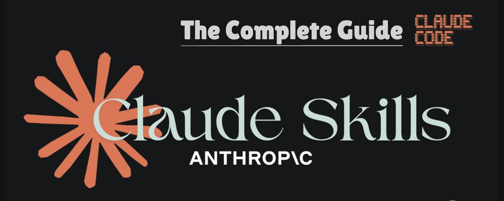

---

## 目錄

- [I：什麼是 Claude Skills？](#i-什麼是-claude-skills)
- [II：建立](#ii-建立)
- [III：部署](#iii-部署)
- [IV：優化](#iv-優化)
- [V：真實工作流程 + Mega Prompt](#v-真實工作流程--mega-prompt)
- [VI：Skill 工具資源](#vi-skill-工具資源)

---

## I：什麼是 Claude Skills？

一句話說明：**Claude Skills 是預先載入的指令集（Markdown 檔案格式）。**

意思是，在任何對話中，你都可以呼叫「Skills」*指令*讓 Claude 遵循。

與其在多個聊天視窗反覆撰寫完美的 prompt/背景/指令，不如把這一切打包成可重複使用的 Skill，隨時呼叫。

**範例：** 一個「Brand Voice Skill」，裡面包含你公司的所有資訊。

> 「嘿 Claude，使用我的 Brand Voice Skill 幫我建立一份關於 [X] 的文件。」

Claude Skills 的可能性是無窮無盡的。

---

## II：建立

如何建立 Claude Skills？

**整體流程：啟用 Skills → 提示 Claude 建立 → 提供背景**

讓我們逐步說明。

> 在嘗試執行 Skill 檔案之前，請確認你使用的是 Pro（每月 $20）或以上方案。

---

### 步驟 1：啟用 Skills

路徑：`Settings → Capabilities → 啟用「Code execution & file creation」`

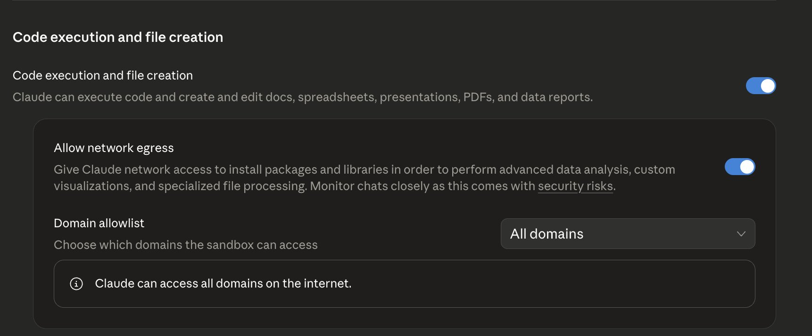

從這個頁面往下滾動到「Example Skills」，開啟「**skill-creator**」。

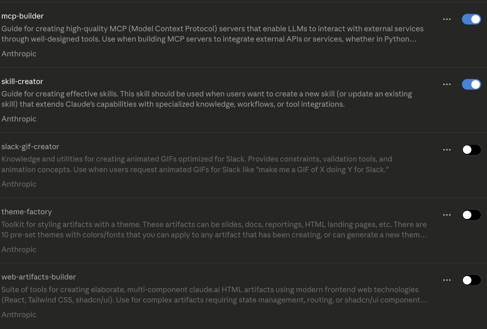

這是 Anthropic 預先安裝的 Claude Skill，專門幫助你建立個人自訂技能。

簡單說，就是**用來建立技能的技能**。確保它已啟用。

---

### 步驟 2：提示 Claude 建立

啟用後，在新聊天中開始提示 Claude 建立技能。

要觸發正確的技能建立，你可以說：

> 「**使用 Skill Creator 幫我建立一個關於 [X] 的 Skill**」

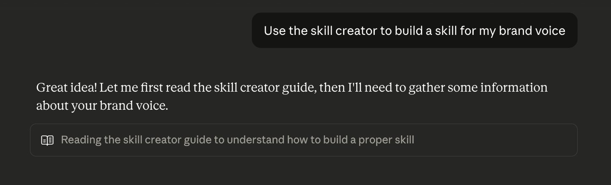

Claude 會讀取 skill creator 指南（我們剛才啟用的），並開始執行你的 skill 檔案。

---

### 步驟 3：提供背景

在 Claude 完整執行工作流程之前，它可能會提出一些澄清問題。

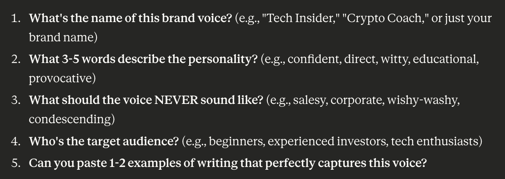

**提供的背景越多，效果越好。**

*（後面會講解如何優化技能建立和真正打造出好用的技能——這只是基本流程說明）*

---

## III：部署

回答完澄清問題後，Claude 會開始執行並回傳幾份文件。

根據技能的複雜度，Claude 可能會回傳指引文件和其他附件。

你可以選擇下載這些額外檔案，但最重要的是最頂端那份有「**Copy to your skills**」選項的檔案——這就是你的新 Skill。

建議先審查這份檔案，確認輸出內容符合你的期望。若不滿意，告訴 Claude 進行調整（後面會講解正確的調整方法）。

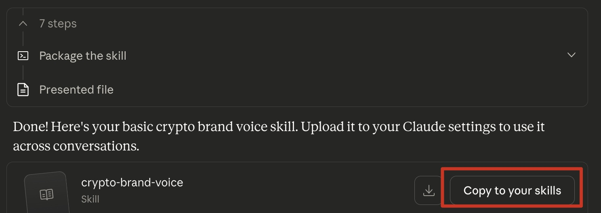

完成後，你就可以開始使用你的新 Skill 了。

方式很簡單——開啟新聊天，告訴 Claude 使用你的技能：

> 「**使用我的 brand voice skill 來 [X]。**」

Claude 會讀取指令並執行任務。

---

## IV：優化

任何人都能建立 Claude Skill，流程很簡單——你剛才已經看到了。而這種簡單性是把雙面刃。

如果任何人都能在 5 分鐘內做出一個技能，90% 以上的輸出品質都會很差。

本節教你如何建立**真正有用**的頂級 Skills，而不只是一堆爛掉的隨機 Markdown 文字檔。

---

### 提示技巧（Prompting）

**提示技巧是你打造頂級 Skills 最應該掌握的首要槓桿點。**

如前所述，你在技能建立 prompt 中提供的背景越多，效果越好。

**推薦做法：** 使用 GPT5.2 進行完整的語音提示會話（傾倒背景、限制條件、你想要這個技能做到的一切）。

把語音背景（數百字）整理成一份主要 prompt，再把那個主要 prompt 貼入 Claude。

這個方法比在 Claude 聊天框裡淺層文字提示有效無數倍。

---

### 真實範例

不要只是告訴 Claude「根據 XYZ 建立品牌聲音」。

**給它真實範例，讓它自行分析。**

貼上 10 封電郵、10 則推文、過去的文件等，讓它在提到建立技能之前先做深度分析。

> **專業技巧：** 使用 AI 幫助取得真實範例。例如，如果你要建立 Twitter 品牌聲音，讓 Grok 爬取你的個人頁面。

---

### 提問

提示 Claude：

> 「**問我 50 個關於這個 Skill 的問題，以幫助你建立最好的 Skill。**」

---

### 精煉

把 Claude 的第一個 Skill 輸出視為草稿。

閱讀整份檔案，寫下你想改的地方，再提示 Claude 做出那些修改。

必要時建立 3 個以上的 Skill 檔案版本。

雖然這個過程看起來很費心，但記住——一旦建立了技能，它是你未來幾個月都會用到的資產，所以值得做對。

---

## V：真實工作流程 + Mega Prompt

以下是幫助你入門的真實工作流程，同時展示可能性有多廣。

> *把圖片複製到任何 LLM，請它把文字回傳給你。*

---

### 1. Brand Voice——建立聲音/語氣/寫作風格

適合：需要一致品牌表達的創作者和企業

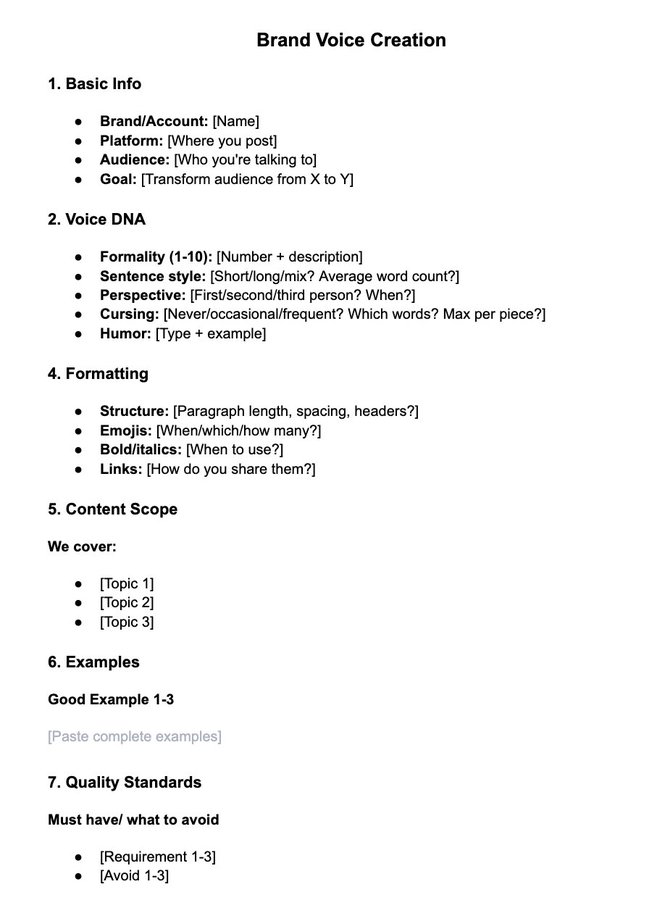

---

### 2. PDF Generator——將任何文字轉成格式精良的 PDF

適合：需要快速產出專業文件的使用者

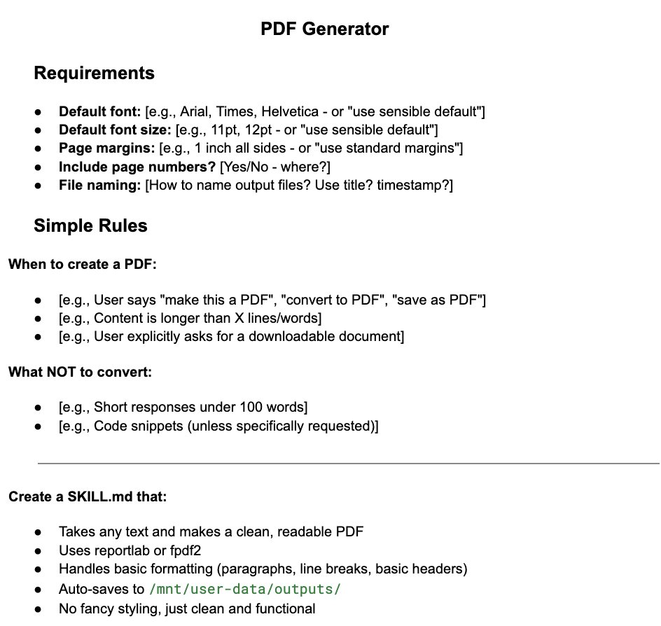

---

### 3. Document Summarizer——幾秒內摘要任何文字

適合：需要快速消化大量資訊的使用者

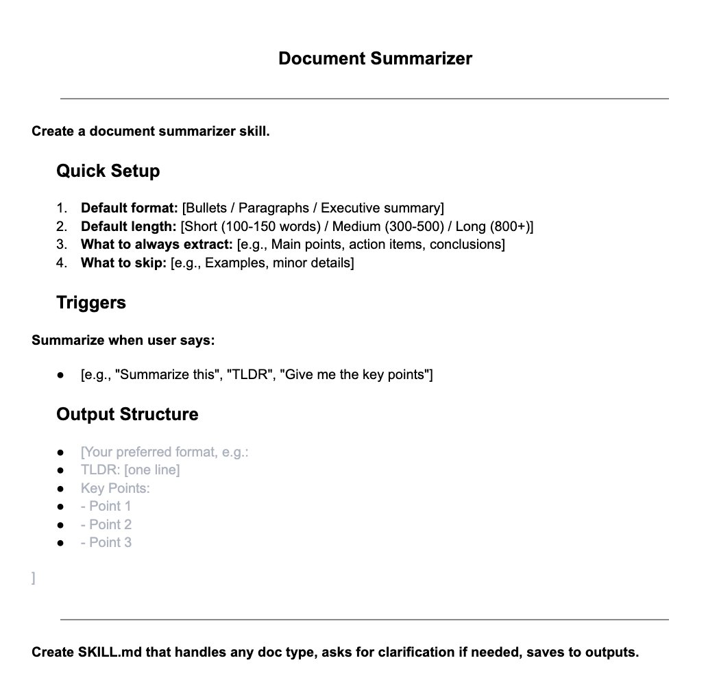

---

### 4. Meeting Transcripts Cleaner——清理會議逐字稿

適合：每天需要處理大量會議記錄的工作者

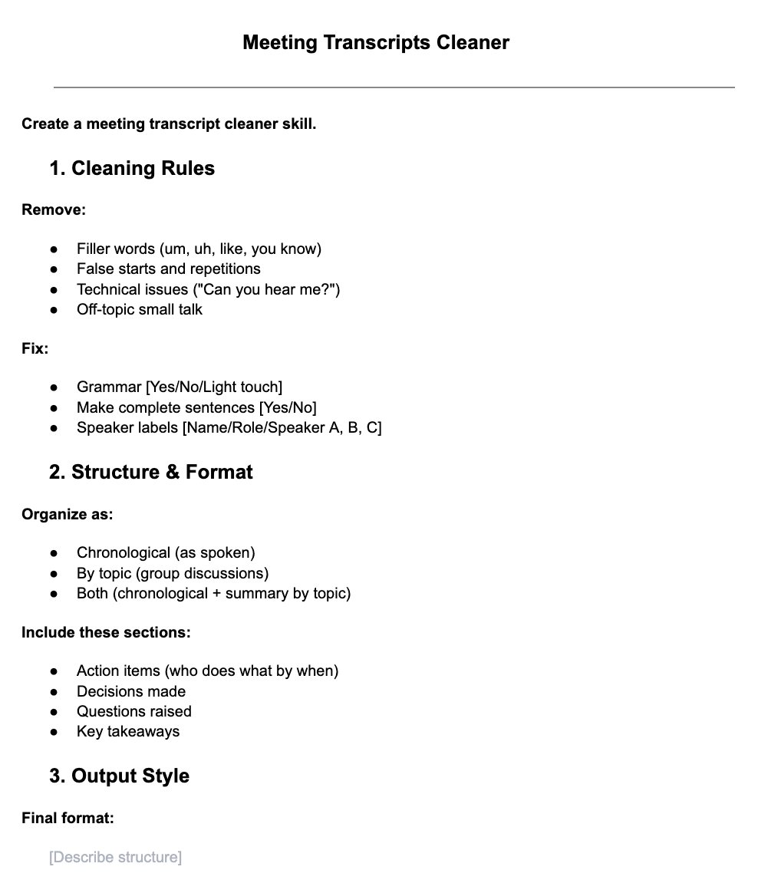

---

以上只是入門的幾個提示模板。如你所見，利用這些指令模板自動化你的工作生活，可能性真的是無窮無盡的。

---

## VI：Skill 工具資源

以下是幫助你使用 Claude Skills 建構的工具：

---

### SkillsMSP

超過 80,000 個 Claude Skills 可供下載的市集

🔗 https://skillsmp.com/

> **注意：** 部分檔案可能有惡意程式——安裝前請務必檢查。

---

### Claude Skills 官方文件

Anthropic 官方關於使用 Claude Skills 的文件（建議閱讀）

🔗 https://platform.claude.com/docs/en/agents-and-tools/agent-skills/overview

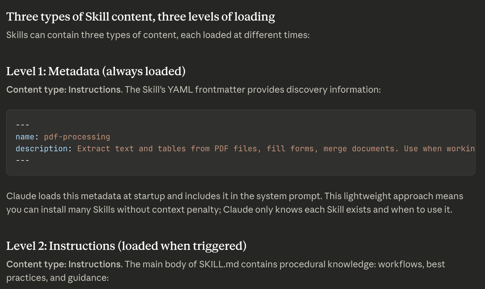

---

### Awesome Claude Skills

精選實用 Claude Skills 清單

🔗 https://github.com/ComposioHQ/awesome-claude-skills

---

## 結語

感謝你讀到這裡。希望你從這份指南中提取了價值。

如果有用，歡迎追蹤 [@aiedge_](https://x.com/@aiedge_) 讓 AI 幫助你改變生活。

如果你有任何有用的 Claude Skills 技巧（建議、工具等），歡迎在留言中分享——相信其他人也會覺得有幫助。

請按讚/轉發這篇文章 💙

---

*原文連結：[https://x.com/aiedge_/status/2015822565500194961](https://x.com/aiedge_/status/2015822565500194961)*
