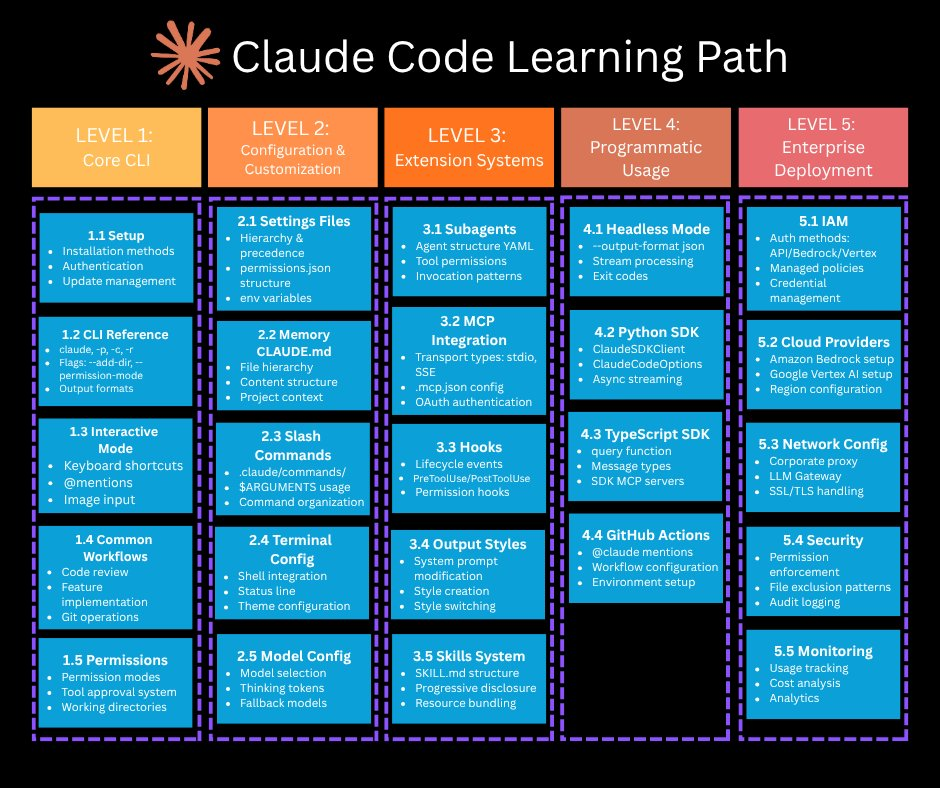
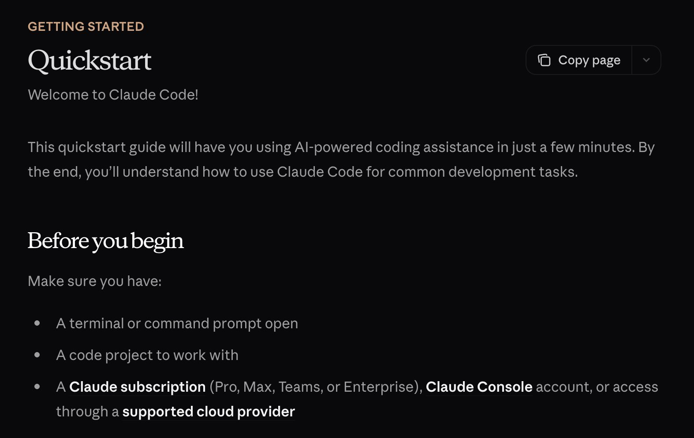
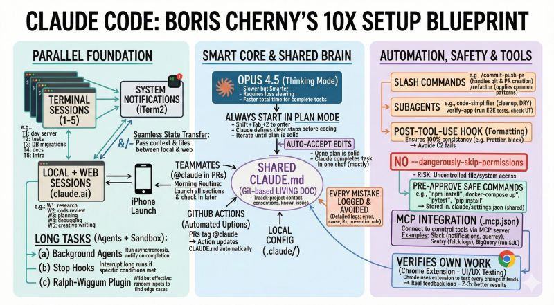
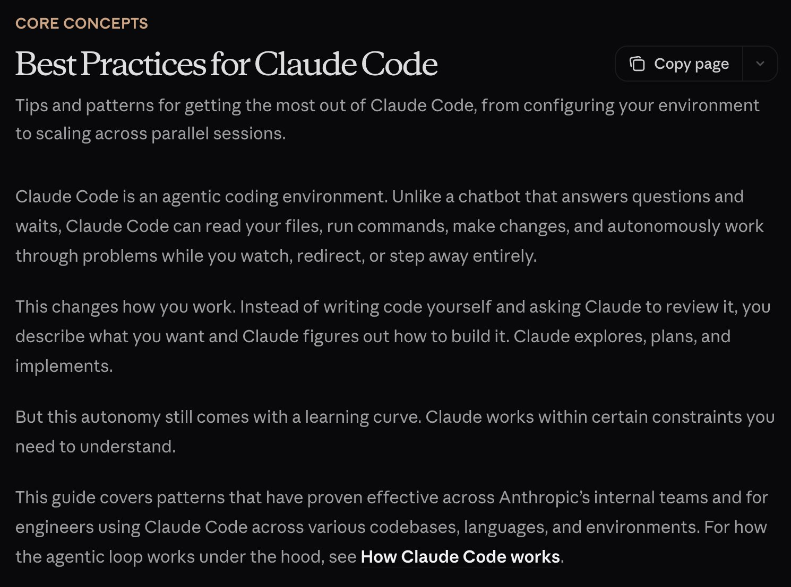
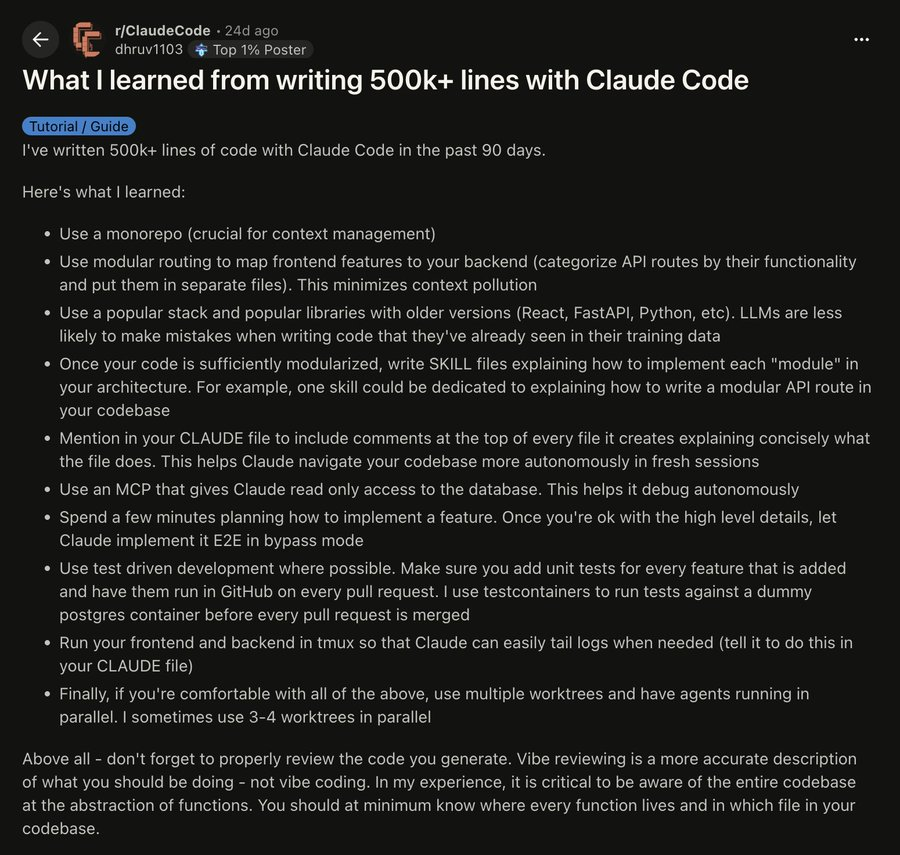
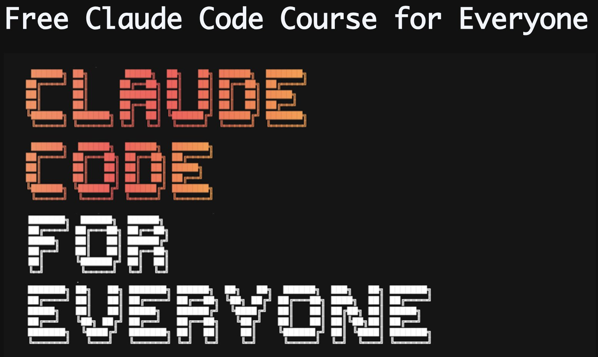
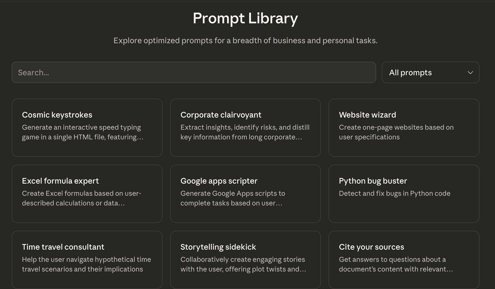
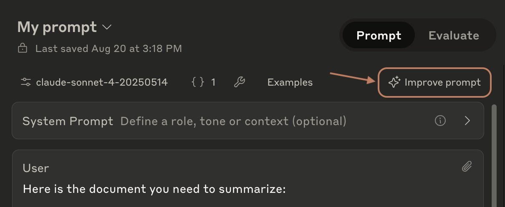
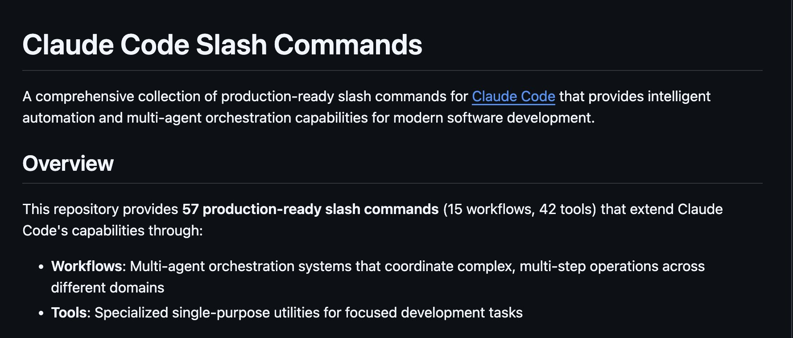
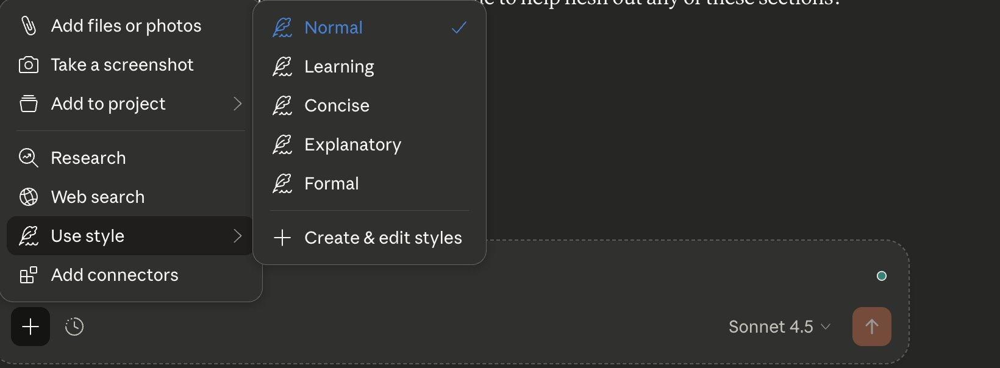

# Ultimate Claude Starter Pack：指南、工具與資源完整合輯

> 作者：AI Edge（[@aiedge_](https://x.com/aiedge_)）
> 發布日期：2026-02-05
> 原文連結：https://x.com/aiedge_/status/2019153204869738897
> 觀看數：10.9 萬 | 書籤：1,271 | 喜歡：527

---

## 前言

**我將每一個改變人生的 Claude 資源整合到一個地方。**

入門指南、最佳實踐、工具、專業技巧等——全部在這裡。

任何使用 Claude 工具進行建構的人都應該收藏這篇文章。

---

## 目錄

- [一、終極指南](#一終極指南)
- [二、最佳實踐與專業技巧](#二最佳實踐與專業技巧)
- [三、有價值的 Claude 工具與資源](#三有價值的-claude-工具與資源)
- [四、沒人談論的低調技巧](#四沒人談論的低調技巧)
- [五、常見陷阱（及修正方法）](#五常見陷阱及修正方法)

---

## 一、終極指南

實用的指南、文章與內容資源。

### 1. Claude Code 學習路徑（學習 Claude Code 101）

來自 [@dani_avila7](https://x.com/@dani_avila7) 在 X 上的分享

---

### 2. 15 分鐘內精通 Claude Skills

來自 [@chasing_next](https://x.com/@chasing_next) 在 X 上的分享

---

### 3. Claude Skills 最佳化

詳情參考 Claude Skills 優化相關資源。

---

### 4. Claude Code 2.0 指南

從這裡開始：

🔗 https://sankalp.bearblog.dev/my-experience-with-claude-code-20-and-how-to-get-better-at-using-coding-agents/

---

### 5. Claude 快速入門（Quickstart）

適合從未接觸過 Claude 的初學者。

🔗 https://code.claude.com/docs/en/quickstart

---

### 6. Claude：逐步初學者指南

🔗 https://www.belmont.edu/data/_files/claude-a-step-by-step-beginners-guide.pdf

---

## 二、最佳實踐與專業技巧

### 1. Boris 的 Claude Code 設定

Claude Code 創建者如何最佳化他的設定（速查表）。

---

### 2. Boris 的 Claude Code 技巧 V2（已加入新技巧）

Boris 更新版的使用技巧，涵蓋最新功能和使用心得。

---

### 3. 100 個綜合 Claude 技巧（來自實際使用經驗）

匯集各方實際使用者的寶貴心得，共 100 條實用技巧。

---

### 4. Claude Code 最佳技巧

🔗 https://www.builder.io/blog/claude-code

---

### 5. 核心概念：Claude Code 最佳實踐（官方）

🔗 https://code.claude.com/docs/en/best-practices

---

### 6. Claude 技巧——來自 Reddit 上有豐富經驗的使用者

---

## 三、有價值的 Claude 工具與資源

作者最喜歡的章節——你會想要收藏這篇文章，以免遺失。

### 1. Claude Code for Everyone

一門直接在 Claude Code 內部教你 Claude Code 的課程。

🔗 https://ccforeveryone.com/

---

### 2. Prompt Library（提示詞資料庫）

Anthropic 的官方 Claude 提示詞資料庫。

🔗 https://platform.claude.com/docs/en/resources/prompt-library/library

---

### 3. Prompt Optimizer（提示詞最佳化工具）

提示詞改進工具透過自動化分析和增強，幫助你快速迭代和改進提示詞（由 Anthropic 提供）。

🔗 https://platform.claude.com/docs/en/build-with-claude/prompt-engineering/prompt-improver

---

### 4. Claude Directory

一個一站式的 Claude 目錄平台。

🔗 https://www.claudedirectory.co/

---

### 5. Claude Skills Marketplace

超過 **128,000 個** Claude Skills 可立即安裝（請謹慎使用）。

🔗 https://skillsmp.com/

---

### 6. Claude Code Marketplace

插件、工具等更多資源。

🔗 https://claudemarketplaces.com/

---

## 四、沒人談論的低調技巧

### 1. Claude Reddit 社群

加入這些社群（尋求幫助、建議等）：

- [r/ClaudeCode](https://www.reddit.com/r/ClaudeCode)
- [r/Claude](https://www.reddit.com/r/Claude)
- [r/Anthropic](https://www.reddit.com/r/Anthropic)

---

### 2. Claude Code 斜線指令（Slash Commands）

在 GitHub 上，你可以找到大量免費的 Claude 自動化斜線指令。

🔗 https://github.com/wshobson/commands

---

### 3. Claude Cowork

作者認為 Cowork 被嚴重低估——對於一般使用者來說，它可能是市面上最好的 AI 工具。

建議在電腦上建立一個專用的資料夾給 Cowork 使用（只授予該資料夾的存取權限，而非所有資料夾）。

---

### 4. Token 使用策略

節省 Token 使用的模型選擇矩陣：

- **Haiku 4.5**：切換到這個用於大多數任務（80%+ 的任務）
- **Sonnet 4.5**：僅用於「中等」難度任務（10% 的任務）
- **Opus 4.5**：僅在絕對必要時使用（最後的 10% 任務）

---

### 5. Claude in Chrome（擴充功能）

一種輕鬆存取 Claude 的方式。

幾乎沒有人下載這個擴充功能，但它非常好用。

---

### 6. 風格選擇（Style Selection）

在主要的 Claude 聊天框中，你會找到「Use Style（使用風格）」選項。

點擊它。

現在你可以改變 Claude 的自然回應結構——簡潔、學習模式，甚至建立自訂的回應風格。

---

## 五、常見陷阱（及修正方法）

### 1. 停止錯誤地提示 Claude

大多數人的提示方式是錯的——要理解正確的提示結構。

---

### 2. 背景傾倒（Context Dumping）

當你把大量背景脈絡一次性倒入 Claude 時，它可能會忘記較早/之前的背景。

> **修正：** 始終逐步「滴灌式」地輸入背景脈絡。
>
> 這將減少你的幻覺問題並提高輸出質量。

---

### 3. 重複提示（Repetitive Prompting）

如果你發現自己一遍又一遍地發送相同的提示，你有兩個選擇：

- **a)** 建立一個 Claude Skill
- **b)** 建立一個 Notion 資料庫來儲存提示詞（你甚至可以讓 Claude 幫你完成這件事）

---

### 4. 沒有規則（No Rules）

你必須主動為 Claude 設定限制條件。

> **修正：** 使用 `CLAUDE.md` 來定義嚴格的程式碼風格規則、專案限制等。
>
> 設定邊界是避免 Claude 胡亂發揮、完成其他無關任務並消耗 Token 使用量的方法。

---

## 結語

希望你覺得這篇文章有幫助。

如果有的話，請務必追蹤 [@aiedge_](https://x.com/aiedge_) 獲取更多類似的 AI 內容。

如果你有任何 Claude 工具、資源或建議，請在下方留言——我相信其他讀者也會覺得很有價值。

最後，請為這篇文章按讚/轉發以示支持 💙

---

## 快速參考：所有連結彙整

| 類別 | 資源 | 連結 |
|------|------|------|
| 指南 | Claude Code 快速入門 | [連結](https://code.claude.com/docs/en/quickstart) |
| 指南 | Claude Code 2.0 指南 | [連結](https://sankalp.bearblog.dev/my-experience-with-claude-code-20-and-how-to-get-better-at-using-coding-agents/) |
| 指南 | 逐步初學者指南（PDF）| [連結](https://www.belmont.edu/data/_files/claude-a-step-by-step-beginners-guide.pdf) |
| 最佳實踐 | Claude Code 官方最佳實踐 | [連結](https://code.claude.com/docs/en/best-practices) |
| 最佳實踐 | Builder.io Claude Code 技巧 | [連結](https://www.builder.io/blog/claude-code) |
| 工具 | Claude Code for Everyone | [連結](https://ccforeveryone.com/) |
| 工具 | Prompt Library（官方）| [連結](https://platform.claude.com/docs/en/resources/prompt-library/library) |
| 工具 | Prompt Optimizer（官方）| [連結](https://platform.claude.com/docs/en/build-with-claude/prompt-engineering/prompt-improver) |
| 工具 | Claude Directory | [連結](https://www.claudedirectory.co/) |
| 工具 | Claude Skills Marketplace | [連結](https://skillsmp.com/) |
| 工具 | Claude Code Marketplace | [連結](https://claudemarketplaces.com/) |
| 技巧 | Slash Commands（GitHub）| [連結](https://github.com/wshobson/commands) |

---

*原文連結：[https://x.com/aiedge_/status/2019153204869738897](https://x.com/aiedge_/status/2019153204869738897)*
