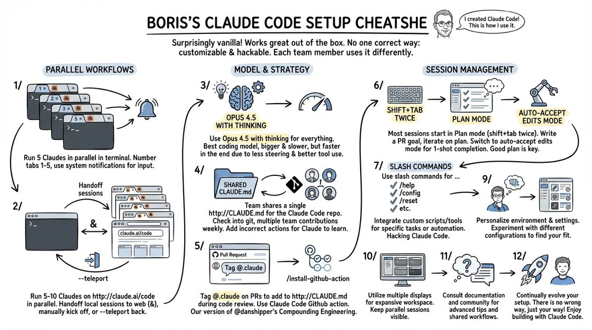

# 50 個被低估的 Claude 實用技巧

> 作者：AI Edge（[@aiedge_](https://x.com/aiedge_)）
> 發布日期：2026-01-22
> 原文連結：https://x.com/aiedge_/status/2014009389427101949
> 觀看數：18.6 萬 | 書籤：1,345 | 喜歡：448

---

## 前言

**50 個沒人談論的 Claude 使用技巧（實用建議）**

涵蓋：Claude Code 技巧、Cowork 工作流程、Anthropic 隱藏資源、進階使用者秘技等。

速射風格，開始！


---

## 一、Claude 通用技巧（Tips 41–50）

**50. CLAUDE.md 檔案**
在專案根目錄建立一個 Markdown 檔案，填入專案規則、偏好設定和背景脈絡。**Claude 每次工作階段都會自動讀取這個檔案。** 大多數使用者根本不知道這個功能存在。

**49. Settings → Privacy → Export Data**
一個簡單快速的方法，可以把你的 Claude 資料/專案/聊天記錄匯出到其他 LLM（作者常在 ChatGPT 和 Claude 之間這樣操作）。

**48. Settings → Connectors**
這是你直接在 Claude 中使用最愛工具的方式。作者個人每天都使用 Google Calendar 和 Notion Connector。

**47. 專案記憶（Project Memory）**
在 Claude 專案內部，你會找到一個「memory」標籤頁。在這裡你可以編輯/修改你希望 Claude 記住的確切內容。

**46. 頂級 UI 設計**
當你看到喜歡的 UI 設計，截圖並提示 Claude 建立一個能複製該精確設計方案的 Skill。

**45. 避免 Claude 囉嗦**
在任何聊天中，點擊「+」和「Style」，把 Claude 的風格設定為「Concise（簡潔）」。

**44. Haiku 4.5**
這是 Claude 最新且最快的模型——個人認為是日常任務最好的 Claude 模型（在 Chrome 擴充功能裡快速回覆時特別好用）。

**43. Claude Chrome 擴充功能**
大多數人不知道這個功能存在。讓 Claude 住在你的側邊欄，並控制你的瀏覽器執行任務的簡便方式。

**42. PDF 建立**
Opus/Sonnet 是目前最好、最穩定的 PDF 生成 LLM，沒有之一。作者常用來建立專案背景檔案、把圖片/文字轉成 PDF 格式等。

**41. Claude App**
下載 Claude Mac 應用程式（如果適用）。它會在頂部選單欄新增一個 Claude 助理，讓你隨時輕鬆與 Claude 對話（類似 Chrome 擴充功能）。在 Pro 或以上方案，也能使用 Cowork。

---

## 二、Claude Code 技巧（Tips 31–40）

**40. Plan Mode（規劃模式）**
按 `Shift + Tab` 進入「Plan」模式。這是規劃專案時你應該使用的模式。

**39. Doctor 指令**
`/doctor` 可以診斷環境問題、缺少的依賴和設定問題。**東西壞掉時先執行這個。**

**38. Claude Code：代理程式碼最佳實踐指南**
Anthropic 的官方指南：
🔗 https://www.anthropic.com/engineering/claude-code-best-practices

**37. 學習 slash 指令**
強烈建議學習斜線指令。GitHub 資源庫：
🔗 https://github.com/wshobson/commands

**36. 逐步解決（Solve Step by Step）**
Claude 模型在長期任務方面表現相當不錯，但並不完美。**所有建構任務都要一步一步來。**

**35. 規則（Rules）**
建立一個 `.md` 檔案，寫下你想讓程式碼合作夥伴遵循的「規則」。

**34. Compact 指令**
學習手動執行 `/compact`。

**33. MCP**
深入了解 MCP 連接。如果 Claude 做不到某件事，MCP 連接很可能能夠幫上忙。

**32. Claude Skills**
作者最喜歡的 Claude 功能。擁有 60,000+ Skills 的市集：
🔗 https://skillsmp.com/categories

**31. 給所有人的 Claude Code**
一門在 Claude Code 內部教你 Claude Code 的課程：
🔗 https://ccforeveryone.com/

---

## 三、Prompt 技巧（Tips 21–30）

**30. 格式化技巧（Formatting Hacks）**
Claude 對以下格式回應非常好：
```
[角色] + [任務] + [背景] + [限制條件] + [問題]
```

**29. Notion 技巧**
如果你已設定 Notion Connector，應該建立一個「Prompt Library」，自動發送你最常用的 Claude prompts。然後可以把這個 Notion Prompt Library 資料庫連接到其他 LLM。

**28. Extended Thinking（延伸思考）**
用於所有進階工作流程/任務（確保開啟此功能）。

**27. "先思考"模式（"Think First" Pattern）**
作者把這條放在所有專案指令中：
> *「Think deeply about all requests...（對所有請求進行深度思考……）」*

**26. 角色賦予（Role Assignment）**
基本技巧，但確實有效：「You are a [插入角色]。」

**25. Prompt Library（提示詞資料庫）**
Anthropic 的實用 prompt 資料庫：
🔗 https://platform.claude.com/docs/en/resources/prompt-library/library

**24. Prompting 最佳實踐**
Anthropic 針對最新 Claude 模型的 prompting 指南（你可以把這個插入 Claude 專案，讓它教你如何 prompt）：
🔗 https://platform.claude.com/docs/en/build-with-claude/prompt-engineering/claude-4-best-practices

**23. JSON / XML / Markdown**
這些都是有效 prompting 的絕佳檔案格式。

**22. 互動式 Prompt 製作器**
一個幫助你優化 prompt 的公開 Claude artifact：
🔗 https://claude.ai/public/artifacts/3796db7e-4ef1-4cab-b70c-d045778f23ec

**21. Hard Stop（硬性停止）**
管理 Claude 使用限制的簡單方法：告訴 Claude「在 \_\_ 時硬性停止。」

---

## 四、Claude Cowork 技巧（Tips 11–20）

**20. Claude Cowork 桌面清理**
使用新的 Claude Cowork 對整個桌面進行深度清理（資料夾存取）。

**19. 批次重新命名（Batch Rename）**
用一致的規則重新命名檔案，例如 `YYYY-MM-DD` 格式。

**18. 用量技巧（Usage Tip）**
Cowork 會快速消耗點數。先用 Sonnet 4.5 的標準聊天來規劃，**然後**再切換到 Cowork 執行。

**17. 用資料夾隔離存取**
建立一個專用的「Cowork」資料夾，只授予 Claude 存取該目錄的權限，而不是整個 Documents 資料夾。

**16. 清理技巧（Clean Up Tip）**
如果使用 Cowork 永久刪除檔案，確保在 prompt 末尾加上「Confirm with me before deleting...（刪除前先與我確認……）」——Claude 自然會這樣做，但多一道預防措施是合理的。

**15. Claude in Chrome**
啟用此功能，讓 Claude 透過 Claude Desktop 處理瀏覽器中的工作。

**14. 多執行緒（Multiple Threads）**
Cowork 可以同時執行多個任務。你可以在不同執行緒並行啟動研究專案、文件格式化工作和資料分析。

**13. 安全小提示**
Claude Cowork 可能執行破壞性操作，例如刪除檔案。**執行代理前務必備份重要資料。**

**12. 教導 Skills**
Cowork 可以透過示範來學習。錄製你的瀏覽器操作，教 Claude 自訂工作流程/技能。

**11. Cowork 安全指南**
Anthropic 的 Cowork 安全指南，務必閱讀：
🔗 https://support.claude.com/en/articles/13364135-using-cowork-safely

---

## 五、最佳實踐與最終技巧（Tips 1–10）

**10. Boris（Claude Code 創建者）的 Claude 設定**



**9. CLAUDE.md 指南**
一份關於如何撰寫 `CLAUDE.md` 檔案的優秀指南：
🔗 https://www.humanlayer.dev/blog/writing-a-good-claude-md

**8. Claude Subreddits**
在這裡隨時掌握最新的 Claude 技巧：
- r/Claude
- r/ClaudeCode
- r/Anthropic

**7. 用量技巧——原型開發**
我們都知道 Claude 在撰寫程式碼時會消耗多少 token，在原型開發階段這是一大痛點。

> **做法：** 原型開發時改用 Google AI Studio，只有在 Google AI Studio 已寫好大部分/全部程式碼之後，再切換到 Claude。

**6. 用量技巧——清除上下文**
如果 Claude 在 3 次以上嘗試後仍然混亂，清除上下文並重新說明。否則只是在浪費 token。

**5. 工作階段日誌（Session Logs）**
建立一本「Claude 日誌」——一種回顧過去工作階段、查看哪些 prompt 有效的方式。這是隨時間進步的方法。

**4. Ralph 插件（Ralph Plug-in）**
一個讓 Claude 在自主循環中運行的工具。

相關討論串（[@damianplayer](https://x.com/damianplayer/status/2013338667964604909)）：
> *「昨晚我有一個做到一半的工作流程，沒有精力繼續了。所以我啟動了 Ralph，合上筆電去睡覺。今天早上，6 個更新，一切正常運作。我一行程式碼都沒寫。」*

**3. 付費方案（Paid Plans）**
如果現在有一個值得付費的 AI 工具，那就是 Claude。儘快升級到付費方案（你永遠不知道 Anthropic 何時會因需求量提高價格）。

**2. ChatGPT → Claude 語音提示法**
透過 ChatGPT 語音輸入 prompt，然後把逐字稿匯出到 Claude。這個方法比在 Claude 文字框裡淺層 prompting 並浪費 token 要好上無數倍。

**1. 模型堆疊（Model Stacking）**
與上一個技巧類似——Claude 與其他模型搭配使用時效果最佳。

> **範例：** 用 Grok 爬取 X 的資料，再匯入 Claude。

**結合多個工具的優勢，你能得到最好的 Claude 輸出。**

---

## 快速參考索引

| 分類 | Tips 編號 |
|------|-----------|
| Claude 通用技巧 | 41–50 |
| Claude Code | 31–40 |
| Prompting 技巧 | 21–30 |
| Claude Cowork | 11–20 |
| 最佳實踐與資源 | 1–10 |

---

## 結語

感謝你讀到這裡，希望這些技巧對你有價值。

如果喜歡這種直擊重點的內容風格，歡迎追蹤 [@aiedge_](https://x.com/@aiedge_) 獲取每週更新。

請按讚/轉發這篇文章 💙

---

*原文連結：[https://x.com/aiedge_/status/2014009389427101949](https://x.com/aiedge_/status/2014009389427101949)*
