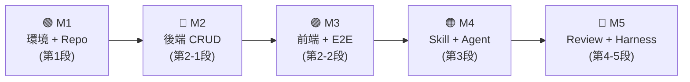
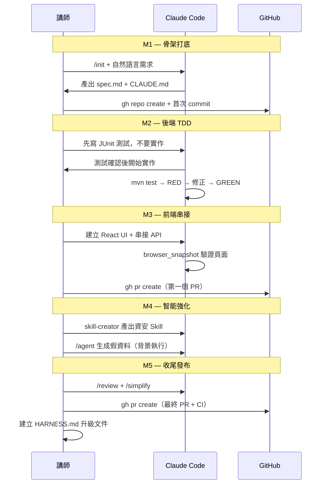

# 🚀 AI Issue Tracker — 貫穿課程的漸進式作品實作計畫

> **作品定位**：本計畫以 **AI 問題追蹤與客服系統 (AI Issue Tracker)** 為主線，
> 將整個 3.5 小時課程拆成 **5 個 Milestone**，每段課程結束時學員都能得到一個
> 「可執行、可展示」的作品版本，最終集齊所有模組形成完整的全端專案。

---

## 作品全貌速覽



| Milestone | 課程對應 | 時間目標 | 可展示成果 |
|---|---|---|---|
| **M1** — 骨架打底 | 第 1 段（50 min） | 完成於 T+50 min | Repo + CLAUDE.md + spec.md |
| **M2** — 後端完工 | 第 2-1 段（25 min） | 完成於 T+75 min | Spring Boot API 全部 GREEN |
| **M3** — 全端串接 | 第 2-2 段（25 min） | 完成於 T+100 min | React 頁面 + E2E 自動驗證 |
| **M4** — 智能強化 | 第 3 段（60 min） | 完成於 T+160 min | 資安 Skill + 假資料 Agent |
| **M5** — 收尾發布 | 第 4-5 段（45 min） | 完成於 T+205 min | PR 發出 + Harness 升級文件 |

---

## Milestone 1：骨架打底（第 1 段）

> **目標**：讓 Repo、CLAUDE.md、spec.md 三位一體，建立與 Claude 的「共識基礎」

### 📋 任務清單

- [ ] 安裝 Claude Code、執行 `claude doctor` 確認環境
- [ ] 用 `gh repo create ai-issue-tracker --public` 建立遠端 Repo
- [ ] 執行 `/init` 讓 Claude 感知專案，初始化 `CLAUDE.md`
- [ ] 在 `CLAUDE.md` 補充技術棧規則與禁止行為
  ```markdown
  ## 技術棧
  - 後端：Spring Boot 3 + JPA + H2
  - 前端：React + Vite
  - 測試：JUnit 5（後端）/ Playwright MCP（前端）

  ## 禁止行為
  - 不得硬編碼任何敏感資訊（密碼、Token）
  - 不得跳過權限驗證層
  ```
- [ ] 用自然語言描述需求 → Claude 產出 `spec.md`
  - 包含：Ticket / User / Comment 資料模型
  - 包含：REST API 端點清單
  - 包含：頁面行為描述（列表頁、詳情頁、新增頁）
- [ ] 與 Claude 對齊 `spec.md` 細節，達成共識後 commit

### 🎯 M1 結束產出

```
ai-issue-tracker/
├── CLAUDE.md          ← AI 共識契約
├── spec.md            ← 專案規格書
└── README.md          ← 自動生成
```

### 🛠 本段 Claude Code 技巧對應

| 示範技巧 | 用途 |
|---|---|
| `/init` | 感知專案，初始化 CLAUDE.md |
| `@spec.md` 指令 | 讓 Claude 每次都帶著完整規格上下文 |
| `gh repo create` | 終端機一鍵建立 Repo，不開瀏覽器 |
| Plan Mode | 只分析不修改，讓 Claude 先提規格建議 |

---

## Milestone 2：後端完工（第 2-1 段）

> **目標**：用 TDD 先行方式完成 Spring Boot 後端，並讓測試全部 GREEN

### 📋 任務清單

- [ ] Spring Boot 3 專案骨架建立（Maven）
  ```
  src/main/java/com/example/issuetracker/
  ├── entity/     ← Ticket, User, Comment
  ├── repository/ ← JPA Repositories
  ├── service/    ← 商業邏輯
  └── controller/ ← REST 端點
  ```
- [ ] **TDD 先寫測試**（Prompt 範本）
  > 「請先依據 @spec.md 針對 Ticket CRUD 撰寫 JUnit 5 測試，**不要實作程式碼**，等我確認後再開始。」
- [ ] 確認測試意圖後，讓 Claude 開始實作
- [ ] 執行 `mvn test` → 觀察 RED（有測試失敗是正常的）
- [ ] 讓 Claude 讀錯誤訊息 → 自動修正 → 再次執行（Auto Mode 示範）
- [ ] 所有測試 GREEN → commit
- [ ] `gh issue view` 模擬從 GitHub Issue 讀需求後開發

### 🎯 M2 結束產出

- `GET /api/tickets` — 取得所有 Ticket（含分頁）
- `POST /api/tickets` — 新增 Ticket
- `GET /api/tickets/{id}` — 取得單筆
- `PUT /api/tickets/{id}` — 更新狀態（OPEN / IN_PROGRESS / CLOSED）
- `DELETE /api/tickets/{id}` — 刪除
- **所有 JUnit 測試 GREEN** ✅

### 🛠 本段 Claude Code 技巧對應

| 示範技巧 | 用途 |
|---|---|
| TDD Prompt 範本 | 明確指示「先測試，不要實作」 |
| Auto Mode | 讓 Claude 自主跑完 測試→修正→再測試 閉環 |
| `@` 跨檔參照 | `@spec.md @IssueService.java` 讓 Claude 同時理解規格與程式碼 |
| `/compact` | 修完 bug 後壓縮長對話，避免 context 被雜訊吃掉 |

---

## Milestone 3：全端串接（第 2-2 段）

> **目標**：完成 React 前端並透過 Playwright MCP 讓 Claude 自動驗證畫面

### 📋 任務清單

- [ ] 建立 React + Vite 前端專案
  ```
  frontend/
  ├── src/
  │   ├── pages/
  │   │   ├── TicketList.tsx   ← 案件列表頁
  │   │   └── TicketDetail.tsx ← 案件詳情頁
  │   ├── components/
  │   │   ├── TicketCard.tsx
  │   │   └── StatusBadge.tsx
  │   └── api/
  │       └── ticketApi.ts     ← API 呼叫封裝
  ```
- [ ] 先用假資料把 UI 跑起來（快速完成視覺層）
- [ ] 將假資料切換為串接 Spring Boot API
  - 示範：同時 `@` 參照後端 Controller 與前端 api.ts，讓 Claude 一次理解串接點
- [ ] 示範常見整合錯誤處理：
  - CORS 錯誤 → Claude 分析設定並修正
  - 分頁格式不一致 → Claude 調整前端 parser
- [ ] **Playwright MCP 畫面驗證**
  > 「請用 playwright 打開 localhost:3000，驗證 Ticket 列表有正確顯示資料。」
  - Claude 呼叫 `browser_snapshot` 分析頁面無障礙樹
  - Claude 回報結構分析結果或發現的 bug
- [ ] 讓 Claude 產出 Playwright E2E 測試腳本
  ```typescript
  // e2e/ticket-list.spec.ts
  test('票單列表正確顯示', async ({ page }) => {
    await page.goto('http://localhost:3000')
    await expect(page.locator('[data-testid="ticket-list"]')).toBeVisible()
    await expect(page.locator('.ticket-card')).toHaveCount(5)
  })
  ```
- [ ] commit + `gh pr create`（Claude 自動生成 PR 說明）

### 🎯 M3 結束產出

```
✅ 列表頁：顯示所有 Ticket，含狀態 Badge、分頁
✅ 詳情頁：顯示 Ticket 內容 + 留言串
✅ 新增頁：表單送出後即時更新列表
✅ Playwright E2E 測試腳本（可納入 CI）
✅ 第一個 PR 發出（含 Claude 生成的 PR 說明）
```

### 🛠 本段 Claude Code 技巧對應

| 示範技巧 | 用途 |
|---|---|
| Playwright MCP `browser_snapshot` | Claude 自主讀取頁面結構（非截圖） |
| `/bug` | 切出除錯上下文，聚焦分析 CORS 等錯誤 |
| `/rewind` | 探索方向錯了時快速回退 |
| `gh pr create` | 搭配 Claude 自動生成完整 PR 說明 |

---

## Milestone 4：智能強化（第 3 段）

> **目標**：用 Skill + 背景 Agent 讓系統具備「企業可用」的品質護欄

### 📋 任務清單

**4-1 企業資安規範 Skill**
- [ ] 設計資安規範 Skill 輸入格式（以目前專案程式碼為輸入）
- [ ] 用 `skill-creator` 讓 Claude 協助產出資安檢查 Skill：
  ```markdown
  ## 檢查清單
  - [ ] 是否有硬編碼密碼/Token
  - [ ] 外部 HTTP 請求是否有例外處理
  - [ ] Controller 是否缺少 @PreAuthorize 或 @Secured
  - [ ] DAO 層是否有 SQL injection 風險
  ```
- [ ] 立即套用 Skill 掃描 `TicketService.java`
- [ ] 根據報告修正程式碼（若有問題）
- [ ] 說明 `PreToolUse` Hook 可在寫入檔案前自動觸發此 Skill

**4-2 背景 Agent 生成假資料**
- [ ] 定義 Agent 任務邊界與輸出格式
  > 「/agent：請按照 @spec.md 的資料模型，生成 20 筆符合真實情境的 Ticket 測試資料（JSON 格式），輸出到 src/test/resources/seed-data.json」
- [ ] 主線繼續開發（示範不被 Agent 打斷）
- [ ] Agent 回報後將假資料套入 Spring Boot DataInitializer
- [ ] （進階選項）介紹 Git Worktrees 多 Agent 平行工作

### 🎯 M4 結束產出

```
✅ security-check.skill.md — 企業資安規範 Skill（可重用）
✅ seed-data.json — 20 筆真實情境假資料（Agent 生成）
✅ DataInitializer.java — 啟動時自動載入假資料
```

### 🛠 本段 Claude Code 技巧對應

| 示範技巧 | 用途 |
|---|---|
| `skill-creator` | 把企業規範固化成可重用 Skill |
| `/agent` | 背景長任務，不干擾主線開發 |
| `PreToolUse` Hook | 機械化強制資安檢查 |
| Git Worktrees | 多 Agent 在不同分支平行工作 |

---

## Milestone 5：收尾發布（第 4-5 段）

> **目標**：完成最終品質審查、發出正式 PR，並建立 Harness 升級文件

### 📋 任務清單

**5-1 程式碼品質審查**
- [ ] `/review @src/service/TicketService.java`
  - 正確性：邊界條件、邏輯 Bug
  - 安全性：輸入驗證、注入風險
  - 可讀性：命名、結構
- [ ] 根據 review 結果修正程式碼
- [ ] `/simplify @src/service/TicketService.java`（重構精簡，不改邏輯）
- [ ] 再次執行 `mvn test` 確認所有測試仍 GREEN
- [ ] 完整收尾迴圈：`/review` → `/simplify` → 再 `/review` → 確認無誤

**5-2 版本控制收尾**
- [ ] Claude 整理 diff，生成語意化 commit message
- [ ] `gh pr create` — Claude 自動生成包含所有 Milestone 的 PR 說明
- [ ] `gh pr checks` 追蹤 CI 狀態

**5-3 Harness 升級文件**
- [ ] 在 `CLAUDE.md` 加入 Harness Level 2 設定
  ```markdown
  ## AGENTS.md 參照
  - 所有 Agent 任務需定義明確的輸出格式與邊界
  - Background Agent 禁止修改主線分支

  ## CI 強制約束
  - 每次 PR 必須通過：JUnit 全 GREEN + ESLint + Playwright E2E
  ```
- [ ] 產出 `HARNESS.md` — 記錄本專案的 Harness 升級路徑

### 🎯 M5 結束產出（完整作品）

```
ai-issue-tracker/
├── CLAUDE.md               ← Level 2 Harness 設定
├── HARNESS.md              ← 升級路徑文件
├── spec.md                 ← 規格書（全程共識基礎）
├── security-check.skill.md ← 資安 Skill
├── backend/
│   └── src/
│       ├── main/java/...   ← Spring Boot 全功能後端
│       └── test/java/...   ← JUnit 全 GREEN
├── frontend/
│   ├── src/...             ← React 全端 UI
│   └── e2e/...             ← Playwright E2E 測試
└── .github/
    └── workflows/ci.yml    ← CI 管道（含 E2E）
```

### 🛠 本段 Claude Code 技巧對應

| 示範技巧 | 用途 |
|---|---|
| `/review` | 三維度品質把關（正確性/安全性/可讀性） |
| `/simplify` | 功能完成後的重構精簡 |
| `gh pr create` | 搭配 Claude 自動生成完整 PR 說明 |
| Harness 升級路徑 | Level 1 → 2 → 3 的具體行動清單 |

---

## 課程工作流全景回顧



---

## 每段 Checkpoint 自我驗收清單

| Checkpoint | 驗收標準 |
|---|---|
| **M1 完成** | `claude doctor` 全通 ✅ / `spec.md` 有資料模型 + API 端點 ✅ / Repo 已 push ✅ |
| **M2 完成** | `mvn test` 全 GREEN ✅ / Postman 測試 CRUD 端點回應正常 ✅ |
| **M3 完成** | React 頁面在 localhost:3000 正常顯示資料 ✅ / E2E 腳本存在 ✅ / 第一個 PR 發出 ✅ |
| **M4 完成** | `security-check.skill.md` 存在 ✅ / `seed-data.json` 有 20 筆資料 ✅ |
| **M5 完成** | `/review` 無高嚴重性問題 ✅ / 最終 PR + CI 通過 ✅ / `HARNESS.md` 存在 ✅ |

---

> 💡 **設計原則**：每個 Milestone 都是**獨立可展示**的——就算課程只進行到 M2，學員也能帶回一個完整的後端服務。這確保學員在任何學習節奏下都有具體的成就感與帶回家的作品。
