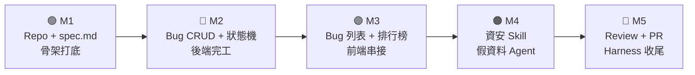
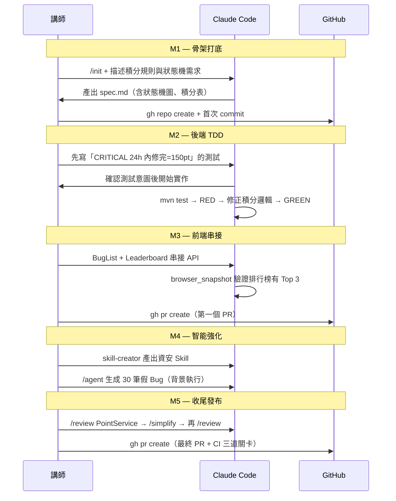

# 🐛 Bug 獵人積分系統 — 課程漸進式實作計畫

> **作品**：一個讓開發者透過「修 Bug」賺取積分、互相競爭的遊戲化 Bug 追蹤平台
> **技術棧**：Spring Boot 3 + JPA + H2（後端）/ React + Vite（前端）/ JUnit 5 + Playwright MCP（測試）

---

## 作品全貌



| Milestone | 課程段落 | 時間目標 | 可展示成果 |
|---|---|---|---|
| **M1** — 骨架打底 | 第 1 段 50min | T+50 | Repo + CLAUDE.md + spec.md |
| **M2** — 後端完工 | 第 2-1 段 25min | T+75 | Bug CRUD + 積分狀態機 全 GREEN |
| **M3** — 全端串接 | 第 2-2 段 25min | T+100 | Bug 列表 + 排行榜 + E2E 驗證 |
| **M4** — 智能強化 | 第 3 段 60min | T+160 | 資安 Skill + 30 筆假 Bug |
| **M5** — 收尾發布 | 第 4-5 段 45min | T+205 | PR 通過 + Harness 升級文件 |

---

## Milestone 1：骨架打底（第 1 段）

> **做出來的東西**：一個帶有清晰規格的 Git Repo，Claude 看到 spec.md 就知道整個系統長什麼樣

### 📋 任務清單

- [ ] `claude doctor` 確認環境、安裝 Claude Code
- [ ] `gh repo create bug-hunter --public` 建立遠端 Repo
- [ ] `/init` 初始化 `CLAUDE.md`，補充以下規則：
  ```markdown
  ## 技術棧
  - 後端：Spring Boot 3 + Spring Data JPA + H2
  - 前端：React + Vite + TypeScript
  - 測試：JUnit 5 / Playwright MCP

  ## 禁止行為
  - 不得硬編碼 JWT Secret 或任何密碼
  - 所有狀態流轉必須經過 BugService，不可在 Controller 直接改狀態
  - 積分計算邏輯只能在 PointService 中執行
  ```
- [ ] 自然語言描述需求 → Claude 產出 `spec.md`，內容包含：

**資料模型**
```
Bug: id / title / description / severity(CRITICAL|HIGH|MEDIUM|LOW)
     status(OPEN|CLAIMED|IN_REVIEW|FIXED|REJECTED)
     pointBounty / reporter(User) / claimedBy(User) / createdAt

User: id / username / email / totalPoints / monthlyPoints / badges[]

Fix: id / bug(Bug) / fixer(User) / fixDescription / pointsEarned / createdAt
```

**積分規則**
```
CRITICAL=100pt / HIGH=50pt / MEDIUM=20pt / LOW=5pt
24h 內修完：+50% / 連續 3 Bug：+20% 加成
```

**狀態機**
```
OPEN → CLAIMED → IN_REVIEW → FIXED（發積分）
                           → REJECTED（不發積分）
CLAIMED → OPEN（放棄認領）
```

- [ ] 確認 spec.md 內容後 commit + push

### 🎯 M1 結束產出

```
bug-hunter/
├── CLAUDE.md   ← 技術棧規則 + 積分規則邊界
├── spec.md     ← 完整資料模型 + 狀態機 + API 清單
└── README.md
```

### 🛠 Claude Code 技巧

| 技巧 | 示範點 |
|---|---|
| `gh repo create` | 終端機一鍵建 Repo |
| `/init` | 感知專案、初始化 CLAUDE.md |
| Plan Mode | 先讓 Claude 提 spec 草稿，不直接寫程式 |
| `@spec.md` | 每次任務前帶入完整規格上下文 |

---

## Milestone 2：後端完工（第 2-1 段）

> **做出來的東西**：Spring Boot 後端，所有積分邏輯和狀態機都有測試保護

### 📋 任務清單

**TDD 先行（Prompt 範本）**
> 「請先依據 @spec.md 針對以下場景撰寫 JUnit 5 測試，**不要實作程式碼**：
> 1. OPEN 的 Bug 可以被認領，認領後變 CLAIMED
> 2. CRITICAL Bug 24h 內修完，積分應為 150（100 基礎 + 50% 加成）
> 3. CLAIMED 的 Bug 不能被其他人認領
> 4. IN_REVIEW → FIXED 後，fixer 的 totalPoints 和 monthlyPoints 都要增加
> 等我確認測試意圖後再開始實作。」

- [ ] 確認測試後，Claude 建立 Spring Boot 骨架：
  ```
  src/main/java/com/example/bughunter/
  ├── entity/        ← Bug.java / User.java / Fix.java
  ├── repository/    ← BugRepository / UserRepository
  ├── service/
  │   ├── BugService.java    ← 狀態流轉邏輯
  │   └── PointService.java  ← 積分計算（加成、連續獎勵）
  ├── controller/    ← BugController / LeaderboardController
  └── dto/           ← BugRequest / BugResponse / FixRequest
  ```
- [ ] `mvn test` → RED（預期有失敗）
- [ ] Auto Mode：讓 Claude 自主「讀錯誤 → 修正 → 再測試」直到 GREEN
- [ ] 全部 GREEN 後 commit

### 🎯 M2 結束產出（可用 Postman 驗證）

| 端點 | 功能 |
|---|---|
| `POST /api/bugs` | 新增 Bug，自動換算 pointBounty |
| `GET /api/bugs` | 列表（可過濾 status / severity） |
| `GET /api/bugs/{id}` | 詳情 |
| `PUT /api/bugs/{id}/claim` | 認領（OPEN → CLAIMED） |
| `PUT /api/bugs/{id}/submit` | 提交修復（CLAIMED → IN_REVIEW） |
| `PUT /api/bugs/{id}/approve` | 審核通過（IN_REVIEW → FIXED + 發積分） |
| `PUT /api/bugs/{id}/reject` | 打回（IN_REVIEW → REJECTED） |
| `GET /api/leaderboard` | 排行榜（?period=month\|all） |

**JUnit 測試全 GREEN ✅**

### 🛠 Claude Code 技巧

| 技巧 | 示範點 |
|---|---|
| TDD Prompt 範本 | 「先寫測試，**不要實作**，等確認再開始」 |
| Auto Mode | 自主完成 測試→修正→GREEN 閉環 |
| `/compact` | 跑完一輪 RED→GREEN 後壓縮對話 |
| `@` 跨檔參照 | `@spec.md @BugService.java` 同時理解規格與程式 |

---

## Milestone 3：全端串接（第 2-2 段）

> **做出來的東西**：React 頁面可以看 Bug 列表、認領 Bug、查排行榜，Playwright 自動驗證正確性

### 📋 任務清單

- [ ] 建立 React + Vite 前端：
  ```
  frontend/src/
  ├── pages/
  │   ├── BugList.tsx        ← 列表頁（篩選 + 分頁）
  │   ├── BugDetail.tsx      ← 詳情頁（提交修復表單）
  │   ├── BugNew.tsx         ← 新增 Bug 頁
  │   └── Leaderboard.tsx    ← 排行榜（月榜 / 總榜）
  ├── components/
  │   ├── BugCard.tsx        ← 顯示嚴重度 Badge + 懸賞積分
  │   ├── StatusBadge.tsx    ← OPEN/CLAIMED/FIXED 顏色標籤
  │   └── PointsBar.tsx      ← 積分動態條
  └── api/
      └── bugApi.ts          ← 所有 fetch 封裝
  ```
- [ ] 先用假資料跑起 UI（確認視覺層）
- [ ] 切換為串接 Spring Boot API
  - 同時 `@BugController.java @bugApi.ts` 讓 Claude 理解串接點
- [ ] **整合錯誤示範**：
  - CORS 錯誤 → Claude 分析並加 `@CrossOrigin` 或設定 WebMvcConfigurer
  - 排行榜分頁格式不一致 → Claude 調整前端 parser
- [ ] **Playwright MCP 驗證**（重點示範）：
  > 「請用 playwright 打開 localhost:5173，
  > 1. 驗證 Bug 列表有至少 5 筆資料
  > 2. 點擊第一筆 OPEN 的 Bug，確認有「認領」按鈕
  > 3. 驗證排行榜頁面有顯示前三名的使用者名稱」
- [ ] Claude 產出 Playwright E2E 腳本：
  ```typescript
  // e2e/bug-list.spec.ts
  test('Bug 列表顯示且可認領', async ({ page }) => {
    await page.goto('http://localhost:5173')
    await expect(page.locator('[data-testid="bug-card"]')).toHaveCount(5)
    await page.locator('[data-testid="bug-card"]').first().click()
    await expect(page.locator('[data-testid="claim-btn"]')).toBeVisible()
  })

  test('排行榜顯示 Top 3', async ({ page }) => {
    await page.goto('http://localhost:5173/leaderboard')
    await expect(page.locator('[data-testid="rank-1"]')).toBeVisible()
  })
  ```
- [ ] `gh pr create`（Claude 自動生成 PR 說明）

### 🎯 M3 結束產出

```
✅ BugList：顯示所有 Bug，含嚴重度 Badge、懸賞積分、狀態顏色
✅ BugDetail：顯示完整描述 + 提交修復表單
✅ Leaderboard：月榜 / 總榜 Tab，Top 10 開發者
✅ Playwright E2E 測試腳本 2 支（可納入 CI）
✅ 第一個 PR 發出（含 Claude 生成 PR 說明）
```

### 🛠 Claude Code 技巧

| 技巧 | 示範點 |
|---|---|
| Playwright `browser_snapshot` | Claude 自主讀頁面結構，不是截圖 |
| `/bug` | 切除錯模式，聚焦分析 CORS |
| `/rewind` | 串接方向錯時快速回退 |
| `gh pr create` | 搭配 Claude 生成完整 PR 說明 |

---

## Milestone 4：智能強化（第 3 段）

> **做出來的東西**：資安 Skill 可掃描任何 Bug 相關 Service，Agent 自動生成 30 筆假 Bug

### 📋 任務清單

**4-1 企業資安規範 Skill**

用 `skill-creator` 產出 `security-check.skill.md`：
```markdown
# 資安規範檢查 Skill

## 輸入
- 要檢查的 Java 檔案

## 檢查清單
- [ ] JWT Token 有無硬編碼在程式碼中
- [ ] /claim 和 /approve 端點有無驗證當前使用者身份
- [ ] BugService 的狀態流轉有無繞過驗證的可能
- [ ] 積分計算結果有無負值邊界保護
- [ ] SQL 查詢有無使用 @Param 防注入

## 輸出格式
- 🔴 高風險：立即修正
- 🟡 中風險：建議修正
- 🟢 通過：符合規範
```

- [ ] 立即套用 Skill 掃描 `BugService.java` 和 `PointService.java`
- [ ] 根據報告修正（例如：補上認領時的使用者驗證）
- [ ] 說明 `PreToolUse` Hook：未來可在每次儲存 `.java` 時自動觸發此 Skill

**4-2 背景 Agent 生成假資料**

> 「/agent：請按照 @spec.md 的 Bug 資料模型，生成 30 筆符合真實情境的假 Bug 資料（JSON），
> 嚴重度分佈：CRITICAL 5 筆、HIGH 10 筆、MEDIUM 10 筆、LOW 5 筆，
> title 要用真實的 Bug 描述（不要 test1 test2），
> 輸出到 src/test/resources/seed-bugs.json」

- [ ] 主線繼續開發（示範不被 Agent 打斷）
- [ ] Agent 完成後套入 `DataInitializer.java`，啟動自動載入

### 🎯 M4 結束產出

```
✅ security-check.skill.md — 資安規範 Skill（可重用於其他專案）
✅ seed-bugs.json — 30 筆真實情境假資料，分佈合理
✅ DataInitializer.java — 啟動時自動載入假 Bug + 假 User
```

### 🛠 Claude Code 技巧

| 技巧 | 示範點 |
|---|---|
| `skill-creator` | 把企業規範固化成可重用工具 |
| `/agent` | 背景長任務，主線不中斷 |
| `PreToolUse` Hook | 寫入 .java 前自動觸發資安掃描 |
| Git Worktrees（選） | 多 Agent 平行工作在不同分支 |

---

## Milestone 5：收尾發布（第 4-5 段）

> **做出來的東西**：乾淨的程式碼 + 通過 CI 的最終 PR + Harness 升級文件

### 📋 任務清單

**5-1 程式碼品質審查**

- [ ] `/review @src/service/PointService.java`
  - 正確性：邊界條件（積分為負？連續計數邏輯？）
  - 安全性：輸入驗證（bugId 不存在？userId 不合法？）
  - 可讀性：積分加成邏輯命名是否清晰
- [ ] 修正 review 找到的問題
- [ ] `/simplify @src/service/PointService.java`（重構精簡，不改邏輯）
- [ ] `mvn test` 確認仍全 GREEN
- [ ] 完整收尾迴圈：`/review` → `/simplify` → 再 `/review` → 確認無誤

**5-2 版本控制收尾**

- [ ] Claude 整理 diff，生成語意化 commit message
- [ ] `gh pr create`（Claude 生成含所有 Milestone 說明的 PR body）
- [ ] `gh pr checks` 追蹤 CI 狀態

**5-3 Harness 升級文件**

- [ ] `CLAUDE.md` 加入 Level 2 設定：
  ```markdown
  ## Agent 邊界規則
  - 背景 Agent 禁止修改 PointService（積分核心）
  - 狀態流轉變更必須先更新 spec.md 再實作

  ## CI 強制約束
  - PR 合併前必須通過：JUnit GREEN + ESLint + Playwright E2E 2 支
  ```
- [ ] 產出 `HARNESS.md`：記錄本專案 Level 1 → 2 的升級歷程

### 🎯 M5 結束產出（完整作品）

```
bug-hunter/
├── CLAUDE.md               ← Level 2 Harness 規則
├── HARNESS.md              ← 升級歷程記錄
├── spec.md                 ← 規格書（含積分規則、狀態機）
├── security-check.skill.md ← 資安 Skill
├── backend/
│   └── src/
│       ├── main/           ← Spring Boot (Bug / User / Fix / Point)
│       └── test/           ← JUnit 全 GREEN（含積分邊界測試）
├── frontend/
│   ├── src/                ← React (BugList / BugDetail / Leaderboard)
│   └── e2e/                ← Playwright 2 支 E2E 腳本
└── .github/
    └── workflows/ci.yml    ← JUnit + ESLint + Playwright 三道關卡
```

---

## 課程工作流全景



---

## Checkpoint 驗收清單

| Checkpoint | 驗收標準 |
|---|---|
| **M1** | `spec.md` 包含狀態機圖 ✅ / 積分規則表完整 ✅ / Repo 已 push ✅ |
| **M2** | `mvn test` 全 GREEN ✅ / `/api/bugs/{id}/approve` 正確發積分 ✅ |
| **M3** | 排行榜有顯示月榜 Top 3 ✅ / E2E 腳本 2 支存在 ✅ / 第一個 PR 發出 ✅ |
| **M4** | `security-check.skill.md` 存在 ✅ / `seed-bugs.json` 30 筆分佈合理 ✅ |
| **M5** | `PointService.java` review 無高風險問題 ✅ / CI 三道全通 ✅ / `HARNESS.md` 存在 ✅ |

---

> 💡 **學員帶回家的是什麼**：
> 一個真的可以跑的遊戲化 Bug 追蹤平台 + 一套可以直接搬進工作的 Claude Code 開發工作流。
