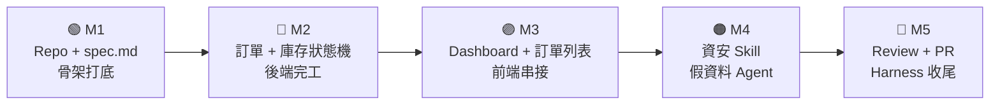
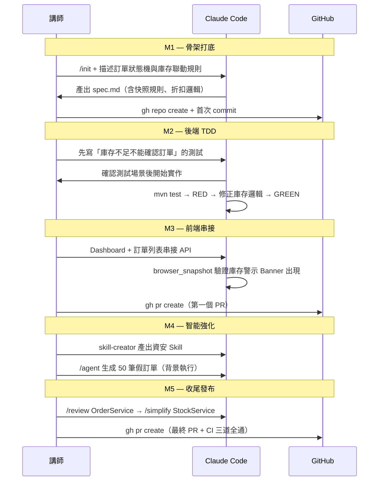

# 📦 訂單 + 庫存管理系統 — 課程漸進式實作計畫

> **作品**：讓小型團隊管理商品、下訂單、追蹤出貨、監控庫存的訂單管理系統  
> **技術棧**：Spring Boot 3 + JPA + H2（後端）/ React + Vite + TypeScript（前端）/ JUnit 5 + Playwright MCP（測試）

---

## 作品全貌



| Milestone | 課程段落 | 時間目標 | 可展示成果 |
|---|---|---|---|
| **M1** — 骨架打底 | 第 1 段 50min | T+50 | Repo + CLAUDE.md + spec.md |
| **M2** — 後端完工 | 第 2-1 段 25min | T+75 | 訂單狀態機 + 庫存聯動 全 GREEN |
| **M3** — 全端串接 | 第 2-2 段 25min | T+100 | Dashboard + 訂單列表 + E2E 驗證 |
| **M4** — 智能強化 | 第 3 段 60min | T+160 | 資安 Skill + 50 筆假訂單 Agent |
| **M5** — 收尾發布 | 第 4-5 段 45min | T+205 | PR 通過 CI + Harness 升級文件 |

---

## Milestone 1：骨架打底（第 1 段）

> **做出來的東西**：有完整業務規則的 spec.md，Claude 看完就能開始寫程式

### 📋 任務清單

- [ ] `claude doctor` 確認環境、安裝 Claude Code
- [ ] `gh repo create order-manager --public` 建立遠端 Repo
- [ ] `/init` 初始化 `CLAUDE.md`，補充以下規則：

```markdown
## 技術棧
- 後端：Spring Boot 3 + Spring Data JPA + H2
- 前端：React + Vite + TypeScript
- 測試：JUnit 5 / Playwright MCP

## 核心規則（不可違反）
- 庫存扣減只能在 OrderService.confirmOrder() 中執行
- 金額計算：unitPrice 必須在下單時從 Product.price 快照，不受日後改價影響
- 庫存歸還只能在訂單從 CONFIRMED → CANCELLED 時觸發，PENDING → CANCELLED 不扣所以不還
- 不得硬編碼任何 JWT Secret 或資料庫密碼
```

- [ ] 自然語言描述需求 → Claude 產出 `spec.md`，包含：

**資料模型**
```
Product: id / name / description / price / stock / minStock / category / outOfStock

Order: id / orderNumber(自動產生 #0001) / customer(User)
       status: PENDING→CONFIRMED→SHIPPED→DELIVERED / CANCELLED
       totalAmount(自動計算) / items[] / createdAt

OrderItem: order / product / quantity / unitPrice(下單快照)

User: id / username / email / role(ADMIN|CUSTOMER)
```

**關鍵業務規則**
```
確認訂單：stock -= quantity（每個 item 都要扣）
           stock < quantity → 拋出 InsufficientStockException
取消訂單：status==CONFIRMED → stock 歸還
           status==PENDING  → 無庫存動作
庫存警示：stock < minStock → 回應附帶 stockAlert: true
售完禁購：stock == 0 → outOfStock=true，拋出 OutOfStockException
金額快照：totalAmount = Σ(item.quantity × item.unitPrice)
折扣規則：totalAmount > 5000 → 自動套用 9 折
```

- [ ] 確認 spec.md 正確後 commit + push

### 🎯 M1 結束產出

```
order-manager/
├── CLAUDE.md   ← 技術棧 + 核心不可違反規則
├── spec.md     ← 完整資料模型 + 狀態機 + API 清單 + 業務規則
└── README.md
```

### 🛠 Claude Code 技巧

| 技巧 | 示範點 |
|---|---|
| `gh repo create` | 終端機一鍵建 Repo，不開瀏覽器 |
| `/init` | 感知專案、初始化 CLAUDE.md |
| Plan Mode | 讓 Claude 先提 spec 草稿、確認後才開始寫程式 |
| `@spec.md` | 每次任務前帶入完整規格上下文 |

---

## Milestone 2：後端完工（第 2-1 段）

> **做出來的東西**：Spring Boot 後端，庫存聯動和金額計算都有 JUnit 測試保護

### 📋 任務清單

**TDD 先行（Prompt 範本）**
> 「請先依據 @spec.md 針對以下場景撰寫 JUnit 5 測試，**不要實作程式碼**：
> 1. 確認訂單時，Product.stock 應正確扣減（含多品項）
> 2. 庫存不足時，confirmOrder() 應拋出 InsufficientStockException，且庫存不變
> 3. 取消一筆 CONFIRMED 訂單後，庫存應歸還；取消 PENDING 訂單庫存不變
> 4. 下單後改變 Product.price，原訂單的 totalAmount 不受影響（快照驗證）
> 5. totalAmount > 5000 時，計算結果應為原價 ×0.9
> 等我確認測試場景後再開始實作。」

- [ ] 確認測試後，Claude 建立 Spring Boot 骨架：

```
src/main/java/com/example/ordermanager/
├── entity/
│   ├── Product.java
│   ├── Order.java        ← @Enumerated status 欄位
│   ├── OrderItem.java    ← unitPrice 快照欄位
│   └── User.java
├── repository/           ← JPA Repositories
├── service/
│   ├── OrderService.java  ← confirmOrder / cancelOrder（含庫存聯動）
│   ├── StockService.java  ← 庫存扣減 / 歸還 / 警示邏輯
│   └── PriceService.java  ← 金額計算 + 折扣
├── controller/
│   ├── ProductController.java
│   ├── OrderController.java
│   └── ReportController.java
├── dto/                   ← OrderRequest / OrderResponse / OrderItemDto
└── exception/
    ├── InsufficientStockException.java
    └── OutOfStockException.java
```

- [ ] `mvn test` → RED（預期失敗）
- [ ] Auto Mode：讓 Claude 自主「讀錯誤 → 修正 → 再測試」直到 GREEN
- [ ] 全部 GREEN 後 commit

### 🎯 M2 結束產出（可用 Postman 驗證）

| 端點 | 功能 |
|---|---|
| `GET /api/products` | 商品列表（可過濾 `?outOfStock=false`） |
| `POST /api/products` | 新增商品（ADMIN） |
| `PUT /api/products/{id}` | 調整價格 / 庫存（ADMIN） |
| `POST /api/orders` | 下訂單（含多品項 items[]） |
| `GET /api/orders` | 訂單列表（ADMIN 全部 / 客戶自己） |
| `PUT /api/orders/{id}/confirm` | 確認訂單（扣庫存） |
| `PUT /api/orders/{id}/ship` | 出貨 |
| `PUT /api/orders/{id}/deliver` | 確認送達 |
| `PUT /api/orders/{id}/cancel` | 取消（自動退庫存） |
| `GET /api/reports/inventory` | 庫存現況 + 警示清單 |
| `GET /api/reports/sales` | 月銷售報表（`?year=&month=`） |

**JUnit 5 測試全 GREEN ✅（含庫存邊界、快照、折扣）**

### 🛠 Claude Code 技巧

| 技巧 | 示範點 |
|---|---|
| TDD Prompt 範本 | 「先寫測試，**不要實作**，等確認再開始」 |
| Auto Mode | 自主完成 測試→修正→GREEN 閉環，不需每步確認 |
| `/compact` | 跑完一輪 RED→GREEN 後壓縮對話 |
| `@` 跨檔參照 | `@spec.md @OrderService.java` 同時理解規格與程式 |

---

## Milestone 3：全端串接（第 2-2 段）

> **做出來的東西**：可操作的 React 介面，Playwright 自動驗證庫存警示 Banner 正確出現

### 📋 任務清單

- [ ] 建立 React + Vite 前端：

```
frontend/src/
├── pages/
│   ├── Dashboard.tsx      ← 統計卡 + 庫存警示 + 最新訂單
│   ├── ProductList.tsx    ← 商品卡片 + 庫存進度條
│   ├── OrderNew.tsx       ← 選商品 → 填數量 → 即時計算金額
│   ├── OrderList.tsx      ← 狀態篩選 + 一鍵操作按鈕
│   └── InventoryReport.tsx ← 庫存 Bar Chart + 警示清單
├── components/
│   ├── StockBadge.tsx     ← 庫存量 / 警示 / 售完三種狀態
│   ├── StatusTag.tsx      ← PENDING/CONFIRMED/SHIPPED 顏色標籤
│   ├── OrderSummary.tsx   ← 訂單金額明細 + 折扣提示
│   └── AlertBanner.tsx    ← 庫存不足警示橫幅
└── api/
    ├── productApi.ts
    └── orderApi.ts
```

- [ ] 先用假資料跑起 UI（確認視覺層）
- [ ] 切換為串接 Spring Boot API
  - 同時 `@OrderController.java @orderApi.ts` 讓 Claude 一次理解串接點
- [ ] **整合錯誤示範**：
  - CORS 錯誤 → Claude 分析並修正 `WebMvcConfigurer`
  - 訂單金額精度問題（`float` vs `BigDecimal`）→ Claude 修正型別
- [ ] **Playwright MCP 驗證**（重點示範）：
  > 「請用 playwright 打開 localhost:5173：
  > 1. 驗證 Dashboard 的庫存警示區塊有顯示至少 1 筆不足警示
  > 2. 前往商品列表，確認有商品顯示「售完」標示
  > 3. 前往訂單列表，點擊第一筆 PENDING 訂單的「確認」按鈕，驗證狀態變為 CONFIRMED」
- [ ] Claude 產出 Playwright E2E 腳本：

```typescript
// e2e/dashboard.spec.ts
test('Dashboard 庫存警示正確顯示', async ({ page }) => {
  await page.goto('http://localhost:5173')
  await expect(page.locator('[data-testid="stock-alert-banner"]')).toBeVisible()
  const alertCount = await page.locator('[data-testid="alert-item"]').count()
  expect(alertCount).toBeGreaterThan(0)
})

// e2e/order-flow.spec.ts
test('確認訂單後狀態更新', async ({ page }) => {
  await page.goto('http://localhost:5173/orders')
  await page.locator('[data-testid="confirm-btn"]').first().click()
  await expect(page.locator('[data-testid="status-tag"]').first())
    .toHaveText('CONFIRMED')
})
```

- [ ] `gh pr create`（Claude 自動生成完整 PR 說明）

### 🎯 M3 結束產出

```
✅ Dashboard：統計卡 + 庫存警示 Banner + 最新 5 筆訂單
✅ 商品列表：庫存進度條 + 售完禁購標示
✅ 訂單列表：狀態篩選 + 確認/出貨/取消操作
✅ Playwright E2E 測試腳本 2 支（可納入 CI）
✅ 第一個 PR 發出（含 Claude 生成的 PR 說明）
```

### 🛠 Claude Code 技巧

| 技巧 | 示範點 |
|---|---|
| Playwright `browser_snapshot` | Claude 自主讀頁面結構，驗證警示 Banner |
| `/bug` | 切除錯模式，聚焦分析 BigDecimal 精度問題 |
| `/rewind` | 串接方向錯時快速回退 |
| `gh pr create` | 搭配 Claude 生成完整 PR 說明 |

---

## Milestone 4：智能強化（第 3 段）

> **做出來的東西**：可重用的資安 Skill + 50 筆符合真實業務情境的假資料

### 📋 任務清單

**4-1 企業資安規範 Skill**

用 `skill-creator` 產出 `security-check.skill.md`：
```markdown
# 資安規範檢查 Skill（訂單管理系統版）

## 輸入
- 要檢查的 Java Service 或 Controller 檔案

## 檢查清單
- [ ] JWT Secret 有無硬編碼在程式碼中
- [ ] /confirm 和 /cancel 端點有無驗證使用者身份（只有 ADMIN 或訂單本人可操作）
- [ ] totalAmount 計算有無可被客戶端傳入偽造的風險
- [ ] 庫存扣減操作有無 @Transactional 保護（防止並發扣超）
- [ ] OrderItem.unitPrice 有無可能被客戶端直接傳入覆蓋（應伺服器端從 Product 讀取）

## 輸出格式
- 🔴 高風險：立即修正
- 🟡 中風險：建議修正
- 🟢 通過：符合規範
```

- [ ] 立即套用 Skill 掃描 `OrderService.java` 和 `OrderController.java`
- [ ] 最常見問題修正示範：`unitPrice` 改為伺服器端從 `Product` 讀取，不接受客戶端傳入
- [ ] 說明 `PreToolUse` Hook：每次寫入 `.java` 自動觸發此 Skill

**4-2 背景 Agent 生成假資料**

> 「/agent：請按照 @spec.md 的資料模型，生成以下假資料並輸出到 src/test/resources/：
> - seed-products.json：20 筆商品，分 3C / 文具 / 辦公用品 3 種 category，
>   其中 3 筆 stock < minStock（觸發警示），1 筆 stock=0（售完）
> - seed-orders.json：50 筆訂單，status 分佈：PENDING 15 筆、CONFIRMED 20 筆、
>   SHIPPED 10 筆、DELIVERED 5 筆，每筆含 1~3 個 OrderItem
> title 和 name 要用真實產品名稱」

- [ ] 主線繼續開發（示範主線不被 Agent 打斷）
- [ ] Agent 完成後套入 `DataInitializer.java`，啟動自動載入

### 🎯 M4 結束產出

```
✅ security-check.skill.md — 訂單系統專用資安 Skill（可重用）
✅ seed-products.json — 20 筆商品，含庫存警示邊界案例
✅ seed-orders.json — 50 筆訂單，status 分佈合理
✅ DataInitializer.java — 啟動時自動載入假資料
```

### 🛠 Claude Code 技巧

| 技巧 | 示範點 |
|---|---|
| `skill-creator` | 把企業規範固化成可重用工具 |
| `/agent` | 背景長任務，主線不中斷 |
| `PreToolUse` Hook | 寫入 .java 前自動觸發資安掃描 |
| Git Worktrees（選） | 多 Agent 平行工作在不同分支 |

---

## Milestone 5：收尾發布（第 4-5 段）

> **做出來的東西**：通過 CI 三道關卡的最終 PR + Harness 升級文件

### 📋 任務清單

**5-1 程式碼品質審查**

- [ ] `/review @src/service/OrderService.java`
  - 正確性：並發扣庫存有無競態條件？取消邏輯覆蓋所有狀態？
  - 安全性：unitPrice 快照有無漏洞？ADMIN 權限有無正確驗證？
  - 可讀性：confirmOrder 方法是否過長需要拆分？
- [ ] 根據 review 結果修正（最常見：補 `@Transactional` 在庫存扣減方法）
- [ ] `/simplify @src/service/StockService.java`（重構精簡庫存判斷邏輯）
- [ ] `mvn test` 確認仍全 GREEN
- [ ] 完整收尾迴圈：`/review` → 修正 → `/simplify` → 再 `/review` → 無高風險項目

**5-2 版本控制收尾**

- [ ] Claude 整理 diff，生成語意化 commit message
- [ ] `gh pr create`（Claude 生成含所有 Milestone 的 PR body）
- [ ] `gh pr checks` 追蹤 CI 狀態

**5-3 Harness 升級文件**

- [ ] `CLAUDE.md` 加入 Level 2 規則：
```markdown
## Agent 邊界規則
- 背景 Agent 禁止修改 OrderService 和 StockService（核心業務邏輯）
- 庫存相關變更必須先更新 spec.md 再實作

## CI 強制約束
- PR 合併前必須通過：JUnit GREEN（含庫存邊界測試）+ ESLint + Playwright E2E
```
- [ ] 產出 `HARNESS.md`：記錄 Level 1 → 2 的升級歷程與決策

### 🎯 M5 結束產出（完整作品）

```
order-manager/
├── CLAUDE.md                ← Level 2 Harness 規則
├── HARNESS.md               ← 升級歷程記錄
├── spec.md                  ← 規格（含狀態機、庫存規則、折扣邏輯）
├── security-check.skill.md  ← 訂單系統資安 Skill
├── backend/
│   └── src/
│       ├── main/            ← Product / Order / OrderItem / Stock / Price
│       └── test/            ← JUnit 全 GREEN（庫存扣減、快照、折扣邊界）
├── frontend/
│   ├── src/                 ← Dashboard / ProductList / OrderList / Report
│   └── e2e/                 ← Playwright 2 支 E2E 腳本
└── .github/
    └── workflows/ci.yml     ← JUnit + ESLint + Playwright 三道關卡
```

---

## 課程工作流全景



---

## Checkpoint 驗收清單

| Checkpoint | 驗收標準 |
|---|---|
| **M1** | `spec.md` 有庫存扣減規則 + 金額快照說明 ✅ / Repo 已 push ✅ |
| **M2** | `mvn test` 全 GREEN ✅ / Postman 測試「庫存不足回 400」正確 ✅ |
| **M3** | Dashboard 庫存警示 Banner 顯示 ✅ / E2E 腳本 2 支存在 ✅ / 第一個 PR 發出 ✅ |
| **M4** | `security-check.skill.md` 存在 ✅ / seed-orders.json 50 筆分佈合理 ✅ |
| **M5** | `OrderService.java` review 無高風險 ✅ / CI 三道全通 ✅ / `HARNESS.md` 存在 ✅ |

---

> 💡 **學員帶回家的是什麼**：
> 一個任何電商後台都看得到相同邏輯的訂單管理系統（庫存、快照、折扣）+ 一套可直接搬進工作的 Claude Code 開發工作流。
