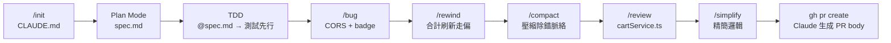

# 🛒 購物車系統 × 課程章節對應重點整理

> **閱讀方式**：左欄是課程教的技巧，右欄是購物車系統的具體示範動作。
> 講師可依此對照，確保每一節都有實際可執行的示範橋段。
>
> **章節編號完全對齊** `claude_code_syllabus.md`（2026-04 版）：60 + 105 + 75 + 39 + 23 = **302 mins**。

---

## 第 1 段：Git、GitHub 與 Claude Code 起手式（60 mins）

> **本章工具一覽**：Claude Code CLI、Node.js 20+、VS Code 插件、Docker Desktop、Git、GitHub CLI、資料庫管理工具（共 7 樣，分散在 1-1 ~ 1-4 安裝）。

---

### 1-1 環境安裝、登入與操作模式（20 mins）

| 課程重點 | 購物車示範動作 |
|---|---|
| Claude Code 雙平台安裝（Win / Mac） | 終端機跑 `claude doctor`，輸出全綠才能進下一步 |
| 訂閱方案與 Auto Mode 限制 | 點出本課示範用 **Pro / Max（Sonnet 4.6）**；Auto Mode 需 Team / Enterprise，Pro 用戶用 acceptEdits 替代 |
| 五種權限／操作模式 | 切到 **Plan Mode**：輸入「幫我設計購物車資料模型」→ 只分析不寫程式 |
| 模型切換與 Effort | `/model opus` 設計 spec.md → `/model sonnet` 進實作；`ultrathink` 一次性提升 effort |

**講師話術**：
> 「Plan Mode 就像叫 Claude 先畫草圖——它不會動你的程式碼，
> 只會告訴你它打算怎麼做。這讓你在 AI 動手之前有機會喊停。」

---

### 1-2 介面導覽：CLI vs VS Code 插件、設定與 CLAUDE.md（15 mins）

| 課程重點 | 購物車示範動作 |
|---|---|
| CLI 佈局與快捷鍵 | 開啟 `claude`，示範 `Shift+Tab` 切操作模式、`/help` 查指令 |
| VS Code 插件介面 | 開啟插件 → 對 `cartService.ts` 直接生成 diff 預覽，逐行接受 |
| Global vs Project 設定 | 在 `~/.claude/settings.json` 設定預設模型；在 `<專案根>/.claude/settings.json` 加 Playwright MCP |
| CLAUDE.md 怎麼寫 | 套入下方「購物車專案 CLAUDE.md 範例」 |
| 長期記憶三件套 | `CLAUDE.md` 寫架構規則 / `/memory` 看自動學習 / `@docs/coding-style.md` 匯入細節 |

**購物車專案 CLAUDE.md 範例（直接套用）**：

```markdown
# Shopping Cart 專案規範

## 技術棧
- 後端：Node.js 20 + Express + PostgreSQL 16
- 前端：React 18 + Vite + TypeScript
- 測試：Vitest + Supertest（後端）、Playwright（E2E）

## 命名規範
- API 路徑：小寫 kebab-case（/api/cart-items）
- 後端檔名：kebab-case；函式：camelCase
- React 元件：PascalCase；hooks：use 前綴

## 禁止行為
- 禁止在 Node.js 程式碼中 hardcode secret key 或直接信任客戶端傳入金額
- 禁止接受客戶端傳入 totalAmount，購物車合計一律由伺服器計算
- 禁止直接修改 spec.md，需先與人類確認

## 常用指令
- 啟動後端：`npm run server`
- 啟動前端：`cd frontend && npm run dev`
- 執行測試：`npm run test:server`
```

**講師話術**：
> 「CLAUDE.md 是『你與 Claude 的共識契約』。把規則寫進這裡，
> Claude 每次 session 都會自動讀取——你就不用每天重複說『合計伺服器算』。」

---

### 1-3 Docker 安裝與 AI 操作資料庫（5 mins）

| 課程重點 | 購物車示範動作 |
|---|---|
| Docker Desktop 雙平台安裝 | `docker version` 檢查；同時開 Docker Desktop 介面確認 daemon 已啟動 |
| 用自然語言請 Claude 操作 Docker | 讓 Claude 直接生成 `docker-compose.yml` |

**示範 Prompt（推薦使用 Compose 版本，方便進版控）**：

```
「請幫我建立 `docker-compose.yml`，包含 PostgreSQL 16，
資料庫名稱 `shoppingcart`、帳號 `admin`、密碼 `secret`，
執行 `docker compose up -d` 並驗證 healthy，
最後幫我補 Node.js `.env` 與資料庫連線設定。」
```

**節點產出**：
- `docker-compose.yml`
- PostgreSQL 容器 healthy 狀態
- Node.js 端 `.env` / `DATABASE_URL` 與資料庫連線程式

> 💡 **教學重點**：學員不需手動安裝資料庫；只要會描述需求，Claude Code 就能把 Docker Compose、PostgreSQL、healthcheck 與 Node.js 連線設定一次補齊。

---

### 1-4 Git 常用操作與 gh CLI 協作模式（20 mins）

| 課程重點 | 購物車示範動作 |
|---|---|
| `git config` + `gh auth login` 雙平台首次設定 | 全班一起跑一次認證，避免後段卡關 |
| `gh repo create` | `gh repo create shopping-cart --public` 終端機一鍵建好 |
| Claude 產生 commit message | 完成 1-2、1-3 的設定後，讓 Claude 讀 diff，輸出 Conventional Commits |
| `gh issue list / view` | 建立 issue「購物車加入相同商品應合併數量」→ 讓 Claude 讀 issue 開發 |
| `gh pr create` | M3 完成後發出第一個 PR，Claude 自動生成 PR body |

**示範橋段**：
```bash
# 建立 Repo
gh repo create shopping-cart --public

# 建立 Issue
gh issue create --title "購物車：加入相同商品應合併數量，不重複新增"

# Claude 讀 Issue 開發
# 在 Claude Code 中：「請根據 gh issue view 1 的需求實作合併邏輯」

# 完成後發 PR
gh pr create
# Claude 自動填入 PR 說明
```

---

## 第 2 段：全端主線實作（105 mins）

> SDD（規格先行）從第 1 段被移到 **2-1**，與 TDD（2-2）形成「規格→測試→實作」的閉環。

---

### 2-1 SDD 規格先行：與 Claude 共同撰寫 spec.md（15 mins）

| 課程重點 | 購物車示範動作 |
|---|---|
| 為什麼先寫 spec.md | 用購物車「合併數量規則」舉例，自然語言含糊，spec.md 才能消除歧義 |
| spec.md 是「共識契約」 | 每次任務前 `@spec.md` → Claude 知道合計怎麼算、結帳做什麼 |
| 規格變更先改文件再改程式 | 課堂中加入新需求「商品數量上限 99」→ 先改 spec.md，再讓 Claude 同步調整 |

**示範 Prompt**：
```
「請用 Plan Mode 根據以下需求，產出購物車系統的 spec.md：
- 使用者可以瀏覽商品（分類 / 搜尋 / 分頁）
- 加入購物車：同商品自動合併數量，上限 99 件
- 修改數量為 0：自動移除該筆明細
- 購物車合計由伺服器計算
- 結帳：填收件資料 → 送出 → 清空購物車
不要寫程式，只需要產出 spec.md 的草稿。」
```

**節點產出**：`spec.md`（資料模型 / 業務規則 / API 端點 / 頁面行為）

---

### 2-2 後端生成、TDD 先行與自主修正循環（30 mins）

| 課程重點 | 購物車示範動作 |
|---|---|
| TDD 為什麼適合 AI 開發 | 「合併數量」規則一句話說不清，寫成測試才精確 |
| TDD Prompt 範本 | 先告訴 Claude 「不要實作」，確認測試後再開始 |
| Auto Mode 閉環 | 讓 Claude 自主跑完 RED → GREEN，不需每步確認；Pro 用戶以 `--permission-mode acceptEdits` 替代 |
| Auto vs Bypass 選擇 | TDD 迴圈一律選 Auto（分類器把關），不在本機開發跑 Bypass |

**TDD Prompt 範本（逐字稿）**：
```
「請先依據 @spec.md 針對 `cartService.ts` 撰寫 Vitest 測試，
不要實作程式碼，等我確認後再開始：

1. 加入新商品：購物車新增一筆 CartItem，quantity=1
2. 加入同一商品：已有的 CartItem.quantity +1，不新增第二筆
3. 修改數量為 0：CartItem 自動被移除
4. 合計計算：商品A(price=100, qty=2) + 商品B(price=50, qty=3)
              → totalAmount 應為 350
5. 結帳後：購物車所有 CartItem 都被刪除

請先只給我測試程式碼。」
```

**Vitest 測試場景對應表**：

| 測試方法名稱 | 對應業務規則 |
|---|---|
| `addNewItem_createsCartItem` | 加入新商品 |
| `addSameItem_mergesQuantity` | 同商品合併（最關鍵） |
| `updateQuantityToZero_removesItem` | 數量=0 自動移除 |
| `calculateTotal_returnsCorrectAmount` | 合計計算 |
| `checkout_clearsAllCartItems` | 結帳後清空 |

**後端骨架**：`Product` / `Cart` / `CartItem` model → Repository → `cartService.ts` → `products.routes.ts` / `cart.routes.ts` → DTO（`CartResponse` / `CheckoutRequest`）。

---

### 2-3 前端鷹架與 API 串接（15 mins）

| 課程重點 | 購物車示範動作 |
|---|---|
| spec.md 驅動 UI | `@spec.md` → Claude 知道有哪些頁面要做（商品列表、抽屜、結帳） |
| 假資料先行 | `mockProducts.ts` 讓 UI 先跑起來，不等後端 |
| `@` 跨層參照 | 同時 `@src/server/routes/cart.routes.ts @cartApi.ts` 讓 Claude 看到串接點 |
| 切換假資料 → 真 API | 把 `cartApi.ts` 內的 mock 替換成 `fetch('/api/cart/items')`，CORS 問題留到 2-4 解 |

**串接重點 Prompt**：
```
「@src/server/routes/cart.routes.ts @src/api/cartApi.ts
請把 cartApi.ts 內所有 mock 函式改為呼叫 Express API。
JSON 格式以 CartResponse / CheckoutRequest 為準。
如果型別不一致，請順便補一個 src/types/cart.ts。」
```

---

### 2-4 Context 管理、會話控制與真實除錯（35 mins）

> **本節定位**：Context 管理是新版 syllabus 的一級主題，不再是除錯的附屬。本節同時練「指令選用」與「真實 bug 應對」。

#### 為什麼要管理 Context（5 mins）

- Context 有限且邊際遞減（context rot）
- 徵兆：Claude 變慢、重複問已答過的問題、建議和先前實作衝突
- **主動管理 > 被動等待**：在階段邊界主動 `/compact`，比等系統自動觸發更不打斷節奏

#### Context 三大操作指令（10 mins）— 對購物車除錯的選用

| 指令 | 用途 | 購物車場景 |
|---|---|---|
| `/clear` | 完全清空對話 | 修完購物車 bug 開始做結帳頁面前 |
| `/compact` | 壓縮對話成摘要 | 解完 CORS 錯誤後，保留「API contract」摘要繼續 |
| `/compact <指令>` | 帶指示的壓縮 | `/compact focus on cart API contract` |
| `/context` | 看 context 用量分布 | 發現 MCP 佔 40% → 關掉沒用到的 |

#### 會話狀態控制：`/rewind` 與 `/resume`（10 mins）

| 指令 | 對 Context 的影響 | 購物車場景 |
|---|---|---|
| `/rewind` | 回到對話某時間點，可分開處理對話與檔案 | Claude 修「合計刷新」改錯方向，按 `Esc Esc` 退回 |
| `/resume` | 跨 session 取回舊對話 | 跨天接續做結帳頁 |
| `/rename` | 命名 session | 下班前 `/rename cart-checkout-day1` |
| `/fork` | 分支試另一種作法 | 想對比「客戶端算合計」vs「伺服器算合計」效能 |

**`/rewind` 五個選項實戰**：在「合計刷新」bug 場景，選 **Restore code only**——保留對話中分析過的 5 種可能性，但檔案退回，讓 Claude 換方向重做。

#### 購物車三個真實整合錯誤實戰（10 mins）

| Bug | 症狀 | 使用的 Context 指令 | 為什麼這樣選 |
|---|---|---|---|
| **CORS 錯誤** | React 呼叫 Express API 時 console 紅字 | `/bug` → 修完後 `/compact focus on cart API contract` | bug 解掉就壓縮，避免錯誤訊息與探索路徑佔住 context |
| **badge 不即時更新** | 加入購物車後數字沒變，reload 才對 | `@CartContext.tsx @CartBadge.tsx` 直接除錯 | 兩檔案小、上下文剛好夠 |
| **數量改後合計沒刷新** | 拉動 [-][+] 後小計沒變 | Claude 走錯方向 → `Esc Esc` → **Restore code only** → 重新引導 | 對話中已分析過 5 種可能性，砍掉太可惜 |

**Slash Command 選用對照（更新版）**：

| 指令 | 購物車示範時機 |
|---|---|
| `/bug` | CORS 錯誤出現時，切出專注除錯模式 |
| `/rewind` | 修合計刷新方向錯了，快速回到上一步 |
| `/compact` | 修完 badge bug 後壓縮垃圾對話 |
| `/clear` | 開始做結帳頁面前，清掉購物車的除錯記憶 |
| `/context` | 修了一陣子覺得卡頓，先看誰吃了空間 |

---

## 第 3 段：自動化、Skill 與背景 Agent（75 mins）

---

### 3-1 agent-browser 技能：自動截圖、錄影與產生 SOP（15 mins）

> 與第 2 段的 Playwright MCP 不同：**Playwright** 用於開發中即時驗證，**agent-browser** 用於完整錄製、紅點游標、產生 SOP 與教學影片。

| 課程重點 | 購物車示範動作 |
|---|---|
| `infsh` CLI 安裝（雙平台共用指令） | `curl -fsSL https://cli.inference.sh \| sh && infsh login` |
| 每步截圖 + 錄影 + 紅點游標 | `record_video: true` + `show_cursor: true` |
| 自動產出 Markdown SOP | 直接落 `checkout-sop.md` 含截圖編號 |

**示範 Prompt（結帳完整流程）**：
```
「請用 agent-browser 開啟 localhost:5173，
啟用錄影與游標顯示，依序操作：
(1) 點擊第一個商品加入購物車
(2) 開啟購物車抽屜確認商品
(3) 點擊結帳並填入收件人資訊
(4) 確認結帳成功畫面
每步截圖並記錄操作，最後整理成 checkout-sop.md 並輸出 .webm 錄影檔。」
```

**企業應用對應**：QA Bug 復現、新人培訓手冊、產品 Demo 影片皆可一個 Prompt 完成。

---

### 3-2 用 `skill-creator` 製作企業資安規範檢查 Skill（25 mins）

**資安 Skill 設計（購物車電商版）**：

```markdown
# security-check.skill.md

## 輸入：Node.js service 或 route 檔案

## 購物車電商常見漏洞檢查清單
- [ ] session ID 有無可被客戶端自定義（應由後端 UUID 產生）
- [ ] totalAmount 有無防止從客戶端傳入（結帳金額不能讓前端說了算）
- [ ] /checkout 有無驗證收件資料（name/email 不能為空）
- [ ] Cart 有無跨 session 存取保護（A 不能看 B 的購物車）
- [ ] 是否有 hardcode 資料庫密碼或 secret key

## 輸出：🔴 高風險 / 🟡 中風險 / 🟢 通過
```

**套用示範**：掃描 `src/server/routes/cart.routes.ts`，預期找到：
> 🔴 `POST /api/cart/checkout` 接受 request body 中的 `totalAmount` 欄位
> 🟡 session 有效期未設定

**Hooks 說明**：
- `PreToolUse` — 每次寫入 `.ts` 後端檔前自動觸發此 Skill
- `PostToolUse` — 寫入後自動跑 `npm run test:server`，與 Skill 形成「寫前檢查 + 寫後驗證」雙閘門

---

### 3-3 開發輔助技能分類導覽（15 mins）

**購物車開發各場景 Skill 選用**：

| 場景 | 選哪個 Skill | 為什麼 |
|---|---|---|
| 掃描電商安全漏洞 | `security-check`（自製） | 固定規範，會重複使用 |
| 查 Express session / cookie 實務寫法 | `firecrawl` | 需要即時文件 |
| 產出《購物車系統規格書》DOCX | `docx` | 輸出格式固定 |
| 快速生成符合設計系統的商品卡片元件 | `reactcomponents` | 有風格規範可套用 |
| 結帳頁效能優化（LCP / TBT） | `web-perf` | 自動跑 Lighthouse 並給建議 |
| Playwright UI 自動化驗證 | `webapp-testing` | E2E 標準工具 |
| 臨時問「`useContext` 怎麼用」 | 直接問 Claude | 一次性探索，不需 Skill |

**`superpowers` 紀律技能組（先在這裡認識，4-3 集中講）**：

| 階段 | 技能 |
|---|---|
| 發想 | `superpowers:brainstorming` |
| 規格拆解 | `superpowers:writing-plans` |
| 執行 | `superpowers:executing-plans` |
| TDD | `superpowers:test-driven-development` |
| 除錯 | `superpowers:systematic-debugging` |
| 完成驗證 | `superpowers:verification-before-completion` |
| Review | `superpowers:requesting-code-review` |
| 收尾 | `superpowers:finishing-a-development-branch` |

---

### 3-4 深入講解 `/agent` 背景長任務（20 mins）

**這節重點示範**：把「生成 30 筆商品假資料」這件枯燥但必要的事交給背景 Agent。

**Agent 任務 Prompt**：
```
/agent「請按照 @spec.md 的 Product 資料模型，
生成 30 筆符合台灣電商風格的商品假資料：
- 3C 10 筆（耳機、鍵盤、滑鼠、手機殼等，price 500~30000）
- 服飾 10 筆（Uniqlo 台灣常見商品風格，price 300~3000）
- 食品 10 筆（台灣特產、零食、飲品，price 50~500）
name 和 description 要像真實電商文案，rating 介於 3.5~5.0
輸出到 src/test/resources/seed-products.json
同時產出 `seedProducts.ts`，在應用程式啟動時自動載入資料
完成後回報：生成了幾筆、各 category 各幾筆
※ 任務邊界：禁止修改 `cartService.ts` 或任何 route handler。」
```

**主線同時在做**：對話框右邊繼續改結帳頁面 UI。

**Git Worktrees 進階示範**：在 `feature/coupon` 分支同時派一個 Agent 開發優惠券功能，主線繼續做 UI——**兩個 Agent 在不同 worktree，互不干擾**。

**講師話術**：
> 「你看，Agent 在背景生成假資料，我這邊繼續改結帳表單。
> 等它回報完成，我再把資料拉進來——這就是 /agent 的價值：
> 把高噪音、跟你當下任務無關的工作切出去，不打斷你的心流。」

---

## 第 4 段：Review、程式優化與收尾（39 mins）

---

### 4-1 `/review` + `/simplify`（10 mins）

**完整收尾迴圈（購物車版）**：

```
Step 1 — review 最複雜的 Service：
/review @src/server/services/cartService.ts

預期 Claude 發現：
→ 正確性：addItem() 沒有處理 quantity <= 0 的輸入（防呆）
→ 安全性：calculateTotal() 使用 float 可能有精度問題（應用 BigDecimal）
→ 可讀性：addItem() 含商品查詢 + 合併判斷 + 存檔三件事，建議拆開

Step 2 — 修正後 simplify：
/simplify @src/server/services/cartService.ts
→ Claude 把 addItem() 拆成 findOrCreateCartItem() + save()

Step 3 — 驗證重構沒壞測試：
npm run test:server → 全 GREEN ✅

Step 4 — 再 review 確認：
/review @src/server/services/cartService.ts
→ 無高嚴重性問題 ✅
```

**重點**：`/simplify` 不改邏輯，只改結構——配合 TDD 確保重構後測試仍通過。

---

### 4-2 Slash Commands 完整工作流總覽（17 mins）

**購物車完整開發工作流**：



**四個經典 Context 工作流組合（套到購物車）**：

| 組合 | 購物車場景 |
|---|---|
| **A. Review-then-Rollback** | `/diff` 看 Claude 改的合計邏輯 → 不滿意 → `Esc Esc → Restore code only` |
| **B. 階段交接（Phase Handoff）** | M2 後端完成 → `/compact focus on the API contract and remaining tasks` → 進 M3 前端 |
| **C. Context 體檢** | 修 bug 卡 30 分鐘 → `/context` 發現 Playwright MCP 佔 40% → `/mcp` 暫停 |
| **D. 跨天接續工作** | 下班前 `/rename cart-checkout-day1 + /compact` → 隔天 `/resume` 找回 |

**黃金守則 5 條**（背下來直接用）：
- 🟢 開新任務前先 `/clear`
- 🟡 階段切換時 `/compact`，不要等自動觸發
- 🔵 覺得卡就 `/context` 看誰吃空間
- 🟣 一次性指示寫對話、長期規則寫 `CLAUDE.md`
- 🔴 Claude 走錯路就 `/rewind`，比手動還原快十倍

**收尾動作（逐字稿）**：
```
讓 Claude 做：
「請整理目前所有修改的 diff，
給我一個符合 Conventional Commits 格式的 commit message」

→ feat: implement cart with shopping cart core features
  - add product listing with category filter and search
  - add cart item merge logic for duplicate products
  - add checkout with form validation and cart cleanup
  - add Playwright E2E tests for cart badge update

git add .
git commit -m "[上面的訊息]"
gh pr create  ← 貼 Claude 生成的 PR body
gh pr checks  ← 確認 Vitest + ESLint + Playwright 三道全過
```

---

### 4-3 superpowers：spec → TDD → e2e 完整開發控管管線（12 mins）

> **本節定位**：前面教「Claude 能做什麼」，這節教「**怎麼強迫 Claude 守紀律**」。

#### 三條 Iron Laws（背下來、貼在牆上）

> 🔴 **Iron Law 1（TDD）**：`NO PRODUCTION CODE WITHOUT A FAILING TEST FIRST`
> 🔴 **Iron Law 2（Verification）**：`NO COMPLETION CLAIMS WITHOUT FRESH VERIFICATION EVIDENCE`
> 🔴 **Iron Law 3（Evidence）**：`Evidence before claims, always`（禁用「應該」「大概」「看起來」）

#### 套到購物車的完整管線

| 開發階段 | 購物車示範動作 | superpowers 技能 |
|---|---|---|
| **發想** | 商討「優惠券折扣應如何套到合計」 | `brainstorming` |
| **規格** | 把「合計 + 優惠券」拆成 2-5 分鐘 task 寫進 `docs/superpowers/plans/2026-04-22-cart-discount.md` | `writing-plans` |
| **執行** | 一個 task 一個 commit，跑完才能進下一個 | `executing-plans` |
| **TDD** | 折扣計算測試 Red → Green → Refactor | `test-driven-development` |
| **除錯** | 折扣後合計算錯，強制系統化假設驗證 | `systematic-debugging` |
| **e2e 驗收** | Playwright 驗 badge + 合計顯示折扣後金額 | `verification-before-completion` |
| **Review** | 自動產出含改動範圍 + 風險點的 review 請求 | `requesting-code-review` |
| **PR 收尾** | 跑全測試、整理 commit、生 PR body | `finishing-a-development-branch` |

#### 實機示範 Prompt

```
「請使用 superpowers:writing-plans 技能，根據 @spec.md
為 `cartService.ts` 的折扣功能產出實作計畫，
存到 docs/superpowers/plans/2026-04-22-cart-discount.md。
每個 task 限 2-5 分鐘、一 task 一 commit、TDD 先行。」

→（人類審核計畫）

「請使用 superpowers:executing-plans 執行該計畫，
每個 task 結束時用 superpowers:verification-before-completion 確認，
禁止使用『should』『probably』。」
```

**學員會看到的差異**：
1. 不再跳步——每個 task 都「寫測試 → 確認失敗 → 寫實作 → 確認通過 → commit」
2. 不再亂宣稱完成——每個段落結束都會跑指令貼輸出
3. Plan 檔本身就是審計軌跡

---

## 第 5 段：Harness Engineering（23 mins）

---

### 5-1 Harness Engineering 是什麼（8 mins）

- **比喻**：AI 模型是千里馬，Harness 是韁繩、馬鞍、車轅——把馬力導成生產力。
- **數據**：LangChain 不換模型，只優化 Harness，Terminal Bench 2.0 從 52.8% → 66.5%。
- **七種類型**：Context / Tool / Control Flow / Verification / State / Observability / Safety（+ 第 8 類進階：Multi-Agent Orchestration）。

**三個診斷問題（回去盤點團隊用）**：
1. Claude 一直忘記某規則嗎？→ 缺 Context Harness
2. 品質不穩嗎？→ 缺 Verification Harness
3. 偶爾做出危險動作嗎？→ 缺 Safety Harness

---

### 5-2 課程實踐 ↔ Harness 類型對應（5 mins）

| 購物車做過的事 | 對應 Harness 類型 |
|---|---|
| `CLAUDE.md`（合計伺服器算 / 合併不重複）、`spec.md`、`@import` | **Context Harness** |
| `/clear` `/compact` `/rewind` `/resume` 管理對話記憶 | **State / Memory Harness** |
| `/context` `/cost` `/stats` 診斷空間用量 | **Observability Harness** |
| Playwright MCP、firecrawl、自製 `security-check` Skill | **Tool Harness** |
| Plan Mode、Auto Mode、`PreToolUse` Hook 觸發 Skill | **Control Flow Harness** + Human-in-the-Loop |
| Vitest TDD 迴圈（合計 / 合併 / 清空測試） | **Verification Harness** |
| Playwright MCP 驗證購物車 badge 更新 | **Verification Harness**（自動化驗收） |
| `/review` + `/simplify` `cartService.ts` | **Verification Harness**（熵管理） |
| Auto Mode（分類器把關）/ Bypass（沙盒隔離） | **Safety Harness** |
| `/agent` 生成 30 筆商品 + Git Worktrees 平行 Agent | **Multi-Agent Orchestration**（進階） |
| **`superpowers` 套組（brainstorming → finishing-branch）** | **Verification + Control Flow + Context 三類同時強化** |

> **核心洞察**：你從第一天就在做 Harness Engineering，只是現在有了名字與框架。

---

### 5-3 三大支柱的工程意涵（5 mins）

| 支柱 | 購物車對應 |
|---|---|
| **上下文工程** | `CLAUDE.md` / `spec.md` 是靜態上下文；CI 測試結果、`/agent` 進度回報是動態上下文 |
| **架構約束** | `PreToolUse` Hook 觸發 `security-check`；Auto Mode 分類器；CLAUDE.md 的「禁止行為」 |
| **熵管理** | `/review` `/simplify` 定期跑 `cartService.ts`；Skill 把規範固化避免每次重講 |

---

### 5-4 你的 Harness 升級路徑（5 mins）

| 層級 | 時間 | 購物車對應 |
|---|---|---|
| **Level 1（今天就做）** | 30 分鐘 | 寫好 `CLAUDE.md` + 設定 pre-commit hook 跑 `npm run test:server` |
| **Level 2（1-2 天）** | 1-2 天 | 加 `AGENTS.md` 團隊級約定 + CI 強制架構約束（合計只能伺服器算） |
| **Level 3（生產級）** | 1-2 週 | 死循環偵測中間件、可觀測性 Dashboard、熵管理 Agent 排程跑 `/review` |

**陷阱提示**：
- `CLAUDE.md` 是 Harness 核心——Claude 每次犯錯就更新它，當程式碼一樣維護
- 不要過度設計控制流——Harness 要可拆卸，模型變強就移除多餘控制邏輯
- 從嚴格約束開始，隨 Agent 表現成熟再放寬

---

## 快速對照表（講師備課用）

| 節次 | 購物車關鍵操作 | 指令 / 工具 |
|---|---|---|
| 1-1 | `claude doctor` + Plan Mode 示範 | `claude doctor` / `Shift+Tab` |
| 1-2 | CLAUDE.md 範例填入 + VS Code 插件 diff 預覽 | `/init` / `/config` |
| 1-3 | 用 AI 控制 Docker 啟動 PostgreSQL | `docker compose up -d` |
| 1-4 | `gh repo create` + Claude 寫 commit | `gh repo create` / `gh pr create` |
| 2-1 | 自然語言需求 → `spec.md` | Plan Mode + `@spec.md` |
| 2-2 | TDD：「合併數量」測試先寫 | TDD Prompt + Auto Mode |
| 2-3 | 假資料 → 真 API 切換 | `@src/server/routes/cart.routes.ts @cartApi.ts` |
| 2-4 | CORS / badge / 合計三個 bug + 五種 `/rewind` 選項 | `/bug` / `/rewind` / `/compact` / `/context` |
| 3-1 | agent-browser 結帳全流程錄影 + SOP | `infsh` + `record_video: true` |
| 3-2 | 資安 Skill 掃 `cart.routes.ts` | `skill-creator` + `PreToolUse` Hook |
| 3-3 | 各場景 Skill 選用 + superpowers 預告 | `firecrawl` / `docx` / `reactcomponents` |
| 3-4 | `/agent` 生成 30 筆商品 + Git Worktrees | `/agent` / `git worktree` |
| 4-1 | `/review` + `/simplify` `cartService.ts` | `/review` / `/simplify` |
| 4-2 | 完整工作流回顧 + 最終 PR + 五條黃金守則 | `gh pr create` + `gh pr checks` |
| 4-3 | superpowers 三條 Iron Laws + 折扣功能管線示範 | `superpowers:writing-plans` 等 |
| 5-1 | Harness 7 大類 + 三個診斷問題 | （概念課） |
| 5-2 | 購物車 ↔ Harness 對應表 | （概念課） |
| 5-3 | 三大支柱：上下文 / 架構約束 / 熵管理 | （概念課） |
| 5-4 | Harness Level 1/2/3 升級路徑 | CLAUDE.md / AGENTS.md |
