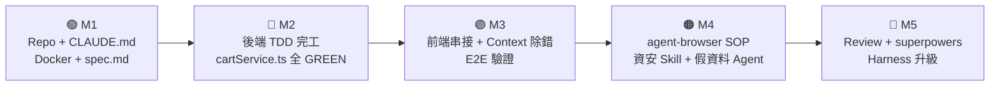

# 🛒 購物車系統 — 課程漸進式實作計畫（5 Milestones）

> **作品**：商品瀏覽 + 購物車管理 + 結帳表單的前後端系統
> **範圍**：不含訂單狀態機與庫存扣減，聚焦購物車核心流程
> **技術棧**：Node.js 20 + Express + PostgreSQL 16（Docker Compose） / React 18 + Vite + TypeScript / Vitest + Supertest + Playwright MCP + agent-browser

---

## 作品全貌



| Milestone | 課程對應 | 累計時間 | 可展示成果 |
|---|---|---|---|
| **M1** — 骨架打底 | 第 1 段（60 min） | T+60 | Repo + CLAUDE.md + Docker PostgreSQL + spec.md 雛型 |
| **M2** — 後端完工 | 第 2-1、2-2 段（45 min） | T+105 | spec.md 完整版 + 購物車 CRUD + 合計計算全 GREEN |
| **M3** — 全端串接 | 第 2-3、2-4 段（50 min） | T+155 | 前端串接完成 + 三個 bug 修復 + Playwright E2E |
| **M4** — 智能強化 | 第 3 段（75 min） | T+230 | agent-browser SOP + 資安 Skill + 30 筆商品假資料 |
| **M5** — 收尾發布 | 第 4-5 段（62 min） | T+292 | review + superpowers 折扣管線 + Harness 文件 |

> **總時長**：60 + 105 + 75 + 39 + 23 = **302 mins**（含課堂緩衝），實作節點累計 T+292，預留 10 min 給 Q&A 與課末總結。

---

## 核心資料模型

```
Product（商品）
├── id, name, description
├── price, category（3C / 服飾 / 食品）
├── imageUrl
└── rating（1~5，測試資料帶入）

Cart（購物車）
├── id, sessionId   ← 未登入用 session ID（後端 UUID 產生）
└── items[]

CartItem（購物車明細）
├── cart, product
└── quantity        ← 上限 99 件

CheckoutRequest（結帳表單資料）
└── name, email, phone, address, cartId
```

---

## 業務規則

```
加入購物車：同商品再次加入 → 數量 +1，不重複新增（上限 99）
修改數量：  quantity = 0 → 自動移除
合計計算：  Σ (quantity × price)，伺服器計算（前端不可傳入 totalAmount）
結帳送出：  驗證欄位不為空 → 清空購物車 → 回傳確認訊息
            （不做庫存扣減、不產生訂單記錄）
```

---

## Milestone 1：骨架打底（第 1 段，60 min）

### 📋 任務清單

#### 1-1 環境安裝、登入與操作模式（20 min）
- [ ] 雙平台執行 `claude doctor`
- [ ] 確認訂閱方案——Pro / Max 用 acceptEdits，Team / Enterprise 才有 Auto Mode
- [ ] 切換 Plan Mode，輸入「幫我設計購物車資料模型」→ Claude 只分析不寫程式
- [ ] 切換模型：`/model opus` 設計、`/model sonnet` 實作

#### 1-2 介面導覽 + CLAUDE.md（15 min）
- [ ] `/init` 初始化 `CLAUDE.md` 並填入下方範本
- [ ] 在 `<專案根>/.claude/settings.json` 加入 Playwright MCP server
- [ ] 確認 Global vs Project 設定優先級（Project 為準）

```markdown
# Shopping Cart 專案規範

## 技術棧
- 後端：Node.js 20 + Express + PostgreSQL 16
- 前端：React 18 + Vite + TypeScript
- 測試：Vitest + Supertest（後端）、Playwright（E2E）

## 核心規則
- 購物車合計由伺服器計算，禁止接受客戶端傳入 totalAmount
- 同一商品加入購物車時合併數量，不重複新增 CartItem
- session ID 由後端 UUID 產生，不接受客戶端自定義
- 商品數量上限 99 件

## 禁止行為
- 禁止在 Node.js 程式碼中 hardcode secret key 或直接信任客戶端傳入金額
- 禁止直接修改 spec.md，需先與人類確認

## 常用指令
- 啟動後端：`npm run server`
- 啟動前端：`cd frontend && npm run dev`
- 啟動資料庫：`docker compose up -d`
- 執行測試：`npm run test:server`
```

#### 1-3 Docker 安裝與 AI 操作資料庫（5 min）
- [ ] `docker version` 雙平台驗證
- [ ] 讓 Claude 產出 `src/server/app.ts`、`src/server/db.ts`
- [ ] 讓 Claude 同步建立 PostgreSQL 初始化腳本與 seed 資料
- [ ] `docker compose up -d` 並驗證 healthy，再啟動 `npm run server`

#### 1-4 Git 與 gh CLI（20 min）
- [ ] `git config --global user.name/email` 全域設定
- [ ] `gh auth login` 完成 OAuth
- [ ] `gh repo create shopping-cart --public`
- [ ] 把 `CLAUDE.md`、`src/server/app.ts`、`src/server/db.ts` 全部 commit + push
- [ ] 建立 Plan Mode 草稿版 `spec.md`（M2 補完）

### 🎯 M1 結束產出

```
shopping-cart/
├── CLAUDE.md            ← 技術棧 + 核心規則 + 禁止行為
├── src/server/app.ts    ← Express 入口
├── docker-compose.yml   ← PostgreSQL 16
├── spec.md              ← 草稿版（M2 補完）
└── README.md
```

---

## Milestone 2：後端完工（第 2-1、2-2 段，45 min）

### 📋 任務清單

#### 2-1 SDD 規格先行（15 min）
- [ ] 用 Plan Mode 產出完整 `spec.md`（資料模型 / 業務規則 / API 端點 / 頁面行為）
- [ ] 與 Claude 來回確認規格（合併數量、合計公式、結帳清空）
- [ ] commit `spec.md` 完整版

#### 2-2 後端生成、TDD 先行（30 min）

**TDD 先行 Prompt 範本**：
> 「請先依據 @spec.md 針對以下場景撰寫 Vitest 測試，**不要實作**：
> 1. 加入商品：購物車新增一筆 CartItem，quantity = 1
> 2. 加入同一商品：已存在的 CartItem.quantity +1，不新增第二筆
> 3. 修改數量為 0：自動移除此 CartItem
> 4. 合計計算：2 種商品各 quantity 不同，totalAmount 正確
> 5. 結帳送出：購物車被清空（CartItem 全部刪除）
> 等我確認測試場景後再開始實作。」

- [ ] 確認測試後建立後端骨架：

```
src/server/
├── entity/
│   ├── product.ts
│   ├── cart.ts
│   └── cartItem.ts
├── repository/
├── services/
│   ├── productService.ts       ← 查詢、篩選、搜尋
│   └── cartService.ts          ← addItem / updateQuantity / checkout
├── routes/
│   ├── products.routes.ts
│   └── cart.routes.ts
└── dto/
├── cartResponse.ts         ← 含 items[] + totalAmount
└── checkoutRequest.ts      ← 收件資料驗證
```

- [ ] `npm run test:server` → RED
- [ ] 啟動 Auto Mode（`claude --enable-auto-mode`）讓 Claude 跑完 RED → GREEN 閉環
  - **Pro / Max 學員**：改用 `--permission-mode acceptEdits` 替代
- [ ] 全部 GREEN 後 commit

### 🎯 M2 結束產出（API 清單）

| 端點 | 功能 |
|---|---|
| `GET /api/products` | 商品列表（`?category=3C&search=耳機&page=0`） |
| `GET /api/products/{id}` | 商品詳情 |
| `GET /api/cart` | 取得購物車（含 items 和 totalAmount） |
| `POST /api/cart/items` | 加入商品（自動合併同商品） |
| `PUT /api/cart/items/{itemId}` | 修改數量（0 自動移除） |
| `DELETE /api/cart/items/{itemId}` | 移除商品 |
| `DELETE /api/cart` | 清空購物車 |
| `POST /api/cart/checkout` | 送出結帳資料 → 清空購物車 |

**Vitest / Supertest 全 GREEN ✅**

---

## Milestone 3：全端串接（第 2-3、2-4 段，50 min）

### 📋 任務清單

#### 2-3 前端鷹架與 API 串接（15 min）
- [ ] 建立 React + Vite 前端骨架：

```
frontend/src/
├── pages/
│   ├── ProductList.tsx    ← 商品列表 + 分類 Tab + 搜尋列
│   ├── ProductDetail.tsx  ← 商品詳情 + 加入購物車
│   └── Checkout.tsx       ← 結帳表單 + 訂單摘要
├── components/
│   ├── CartDrawer.tsx     ← 右側購物車抽屜（含小計）
│   ├── CartBadge.tsx      ← 導覽列購物車數量 badge
│   ├── ProductCard.tsx    ← 商品卡片
│   └── QuantityInput.tsx  ← 數量調整 [-] n [+]
├── context/
│   └── CartContext.tsx    ← 全域購物車狀態管理
└── api/
    ├── productApi.ts
    └── cartApi.ts
```

- [ ] 用 `mockProducts.ts` 假資料先跑起 UI
- [ ] 同時 `@src/server/routes/cart.routes.ts @src/api/cartApi.ts` 切換到真 API

#### 2-4 Context 管理 + 三個真實 bug（35 min）

**整合除錯示範**：

| Bug | 症狀 | 處理方式 |
|---|---|---|
| **CORS 錯誤** | React 呼叫 API console 紅字 | `/bug` → 修完 `/compact focus on cart API contract` |
| **badge 不即時更新** | 加入購物車後數字沒變 | `@CartContext.tsx @CartBadge.tsx` 找根因 |
| **數量改後合計沒刷新** | 拉動 [-][+] 後小計沒變 | `Esc Esc` → **Restore code only**，保留對話脈絡換方向 |

- [ ] 解完三個 bug 後跑一次 `/context`，看誰吃了空間
- [ ] **Playwright MCP 驗證**（讓 Claude 主動驗）：
  > 「請用 playwright 打開 localhost:5173：
  > 1. 確認商品列表顯示至少 6 筆商品
  > 2. 點擊第一筆商品的『加入購物車』→ 驗證導覽列 badge 從 0 變為 1
  > 3. 再點一次同一商品 → badge 變為 2（數量合併而非新增）
  > 4. 點擊購物車圖示，確認抽屜打開且顯示正確商品和金額」
- [ ] 讓 Claude 產出 E2E Playwright 腳本（`e2e/cart.spec.ts`）

**E2E 腳本（讓 Claude 產出）**：
```typescript
// e2e/cart.spec.ts
test('加入相同商品應合併數量', async ({ page }) => {
  await page.goto('http://localhost:5173')

  const addBtn = page.locator('[data-testid="add-to-cart"]').first()
  await addBtn.click()
  await expect(page.locator('[data-testid="cart-badge"]')).toHaveText('1')

  await addBtn.click()  // 同一商品再加一次
  await expect(page.locator('[data-testid="cart-badge"]')).toHaveText('2')

  await page.locator('[data-testid="cart-icon"]').click()
  const cartItems = page.locator('[data-testid="cart-item"]')
  await expect(cartItems).toHaveCount(1)  // 只有 1 種商品（數量=2）
  await expect(page.locator('[data-testid="item-quantity"]')).toHaveText('2')
})
```

- [ ] 進 M4 前先 `/compact focus on remaining UX work` 壓縮 context
- [ ] `gh pr create`（Claude 生成 PR 說明）

### 🎯 M3 結束產出

```
✅ 商品列表：分類 Tab + 搜尋 + 商品卡片
✅ 購物車抽屜：加入 / 修改數量 / 移除 / 小計
✅ 結帳頁：表單 + 訂單摘要 + 送出成功提示
✅ Playwright E2E 腳本（badge 更新 + 數量合併驗證）
✅ 第一個 PR 發出
```

---

## Milestone 4：智能強化（第 3 段，75 min）

### 📋 任務清單

#### 3-1 agent-browser：結帳完整流程錄影 + SOP（15 min）
- [ ] `curl -fsSL https://cli.inference.sh | sh && infsh login`
- [ ] 啟用 `record_video: true` + `show_cursor: true`
- [ ] 一個 Prompt 完成：點商品 → 開抽屜 → 填結帳資料 → 確認成功
- [ ] 產出 `docs/sop/checkout-sop.md`（含截圖編號）+ `.webm` 錄影

#### 3-2 用 skill-creator 製作資安 Skill（25 min）

```markdown
# security-check.skill.md（購物車版）
## 檢查清單
- [ ] session ID 有無可被客戶端自定義（應由後端 UUID 產生）
- [ ] totalAmount 有無防止客戶端傳入偽造
- [ ] /checkout 有無基本的 request body 驗證（name/email 不為空）
- [ ] Cart 是否會跨 session 洩漏（A 的購物車不能被 B 存取）
- [ ] 是否有 hardcode 資料庫密碼或 secret key
```

- [ ] 套用掃描 `src/server/routes/cart.routes.ts` + `src/server/services/cartService.ts`
- [ ] 預期 🔴 高風險：`POST /api/cart/checkout` 接受客戶端 `totalAmount`
- [ ] 設定 `PreToolUse` Hook：寫入 `.ts` 後端檔前自動觸發此 Skill

#### 3-3 開發輔助技能分類導覽（15 min）
- [ ] 對照課程「Skill 選用對照表」實際試跑：
- `firecrawl` 查 Express session / cookie 最新實務
  - `docx` 把 `spec.md` 輸出成《購物車規格書.docx》
  - `web-perf` 跑一次結帳頁 Lighthouse
- [ ] 預告 superpowers 套組（M5 集中講）

#### 3-4 `/agent` 背景生成 30 筆商品（20 min）

> 「/agent：請按照 @spec.md 的 Product 資料模型，
> 生成 30 筆符合台灣電商風格的商品假資料：
> - 3C 10 筆（耳機、鍵盤、滑鼠、手機配件等）
> - 服飾 10 筆（Uniqlo 風格，含尺寸描述）
> - 食品 10 筆（台灣特產、零食、飲品）
> - name 和 description 要像真實電商文案
> - price 要合理（3C $500~$30000、服飾 $300~$3000、食品 $50~$500）
> - rating 介於 3.5~5.0
> - 輸出到 src/test/resources/seed-products.json
> 同時生成對應的 `seed-products.sql` 或 `seedProducts.ts`，在 PostgreSQL 初始化時自動載入
> ※ 任務邊界：禁止修改 `cartService.ts` 或任何 route handler」

- [ ] 主線同時繼續調整結帳頁 UI（示範 Agent 不影響主線）
- [ ] **Git Worktrees 進階示範**：在 `feature/coupon` 分支派另一個 Agent 開發優惠券（為 M5 superpowers 鋪陳）

### 🎯 M4 結束產出

```
✅ docs/sop/checkout-sop.md + checkout.webm（agent-browser 產出）
✅ security-check.skill.md（電商資安規範）
✅ PreToolUse Hook 設定完成
✅ seed-products.json（30 筆台灣電商風格商品）
✅ seed-products.sql / seedProducts.ts（初始化載入）
✅ feature/coupon worktree（為 M5 折扣管線預留）
```

---

## Milestone 5：收尾發布（第 4-5 段，62 min）

### 📋 任務清單

#### 4-1 `/review` + `/simplify`（10 min）
- [ ] `/review @src/server/services/cartService.ts`
  - 正確性：addItem 有沒有處理 quantity <= 0
  - 安全性：合計用 float / BigDecimal？
  - 可讀性：addItem 是否職責過重
- [ ] `/simplify @src/server/services/cartService.ts`（拆出 `findOrCreateCartItem()`）
- [ ] `npm run test:server` 確認仍全 GREEN
- [ ] 再 `/review` 一次確認無高嚴重性問題

#### 4-2 Slash Commands 完整工作流總覽（17 min）
- [ ] 跑一遍四個經典 Context 工作流組合：
  - **A**：`/diff` 不滿意 → `Esc Esc → Restore code only`
  - **B**：階段交接 `/compact focus on the API contract`
  - **C**：`/context` 體檢 → 關閉沒用的 MCP
  - **D**：`/rename + /compact + /resume` 跨天接續
- [ ] 讓 Claude 整理全部 diff → 產 Conventional Commits commit message
- [ ] `gh pr create` + `gh pr checks` 驗 CI 三道全過

#### 4-3 superpowers：跑一次完整管線（12 min）

> **示範主題**：把 `feature/coupon`（M4 預留）用 superpowers 管線完成。

- [ ] `superpowers:writing-plans` 把折扣需求拆 2-5 分鐘 task → `docs/superpowers/plans/2026-04-22-cart-discount.md`
- [ ] 人類審計畫
- [ ] `superpowers:executing-plans` 一 task 一 commit、TDD 先行
- [ ] `superpowers:test-driven-development` 強制 Red → Green → Refactor
- [ ] `superpowers:verification-before-completion` 跑指令貼真實輸出
- [ ] `superpowers:requesting-code-review` 自動產 review 請求
- [ ] `superpowers:finishing-a-development-branch` 標準收尾、PR body、CI

#### 5-1 ~ 5-4 Harness Engineering（23 min）
- [ ] 對照課程的 7 大 Harness 類型 → 在 `HARNESS.md` 列出本專案實踐
- [ ] 寫下本專案的「Level 1 → Level 2」升級項目
- [ ] CLAUDE.md 升級：把三條 Iron Laws 寫進去（`NO PRODUCTION CODE WITHOUT...`）

### 🎯 M5 結束產出（完整作品）

```
shopping-cart/
├── CLAUDE.md                       ← 含 Iron Laws 的完整版
├── HARNESS.md                      ← 7 大 Harness 類型對應 + 升級路徑
├── spec.md                         ← 購物車完整規格
├── docker-compose.yml              ← PostgreSQL 16
├── docs/
│   ├── sop/checkout-sop.md         ← agent-browser 產出
│   └── superpowers/plans/
│       └── 2026-04-22-cart-discount.md  ← writing-plans 產出
├── .claude/
│   ├── settings.json               ← Playwright MCP + Hooks
│   └── skills/
│       └── security-check.skill.md ← 電商資安 Skill
├── src/
│   ├── server/                     ← Node.js + Express 後端
│   │   ├── entity/                 ← Product / Cart / CartItem / Coupon
│   │   ├── services/               ← cartService / productService
│   │   └── routes/                 ← cart.routes / products.routes
│   └── test/resources/
│       └── seed-products.json      ← 30 筆商品假資料
├── frontend/src/                   ← ProductList / CartDrawer / Checkout
├── e2e/                            ← Playwright 腳本
└── .github/workflows/ci.yml        ← Vitest + ESLint + Playwright
```

---

## Checkpoint 驗收清單

| Checkpoint | 驗收標準 |
|---|---|
| **M1** | `claude doctor` 全綠 ✅ / Docker PostgreSQL healthy ✅ / CLAUDE.md 含禁止行為與技術棧 ✅ / Repo push ✅ |
| **M2** | spec.md 含業務規則（合併、合計、清空） ✅ / `npm run test:server` 全 GREEN ✅ / 8 條 API 端點實測通過 ✅ |
| **M3** | 三個 bug 修復 ✅ / badge 數字正確更新 ✅ / Playwright E2E 腳本通過 ✅ / 第一個 PR 發出 ✅ |
| **M4** | checkout-sop.md + .webm 產出 ✅ / `security-check` Skill 找到 🔴 風險 ✅ / seed-products.json 30 筆 ✅ / Git Worktrees `feature/coupon` 建立 ✅ |
| **M5** | `/review` 無高風險 ✅ / superpowers 折扣管線跑完（plan + 一 task 一 commit + 真實驗證） ✅ / HARNESS.md 含 7 類對應 ✅ / CI 三道全通 ✅ |

---

## 講師備課提醒

- **時間配置**：M1=60 / M2=45 / M3=50 / M4=75 / M5=62 = **292 min**，留 10 min 給 Q&A 與課末總結，總長 302 min。
- **訂閱方案差異**：Auto Mode 僅 Team / Enterprise / API + Sonnet 4.6 以上可用，Pro / Max 學員以 `--permission-mode acceptEdits` 替代，**M2 開課前先說明**避免現場卡關。
- **Docker 必須課前先裝**：M1 只有 5 min 給 Docker，現場安裝會嚴重壓縮其他環節，務必課前公告。
- **superpowers 安裝**：`claude plugin install superpowers`，建議 M4 結尾或 M5 前的休息時間預先安裝。
