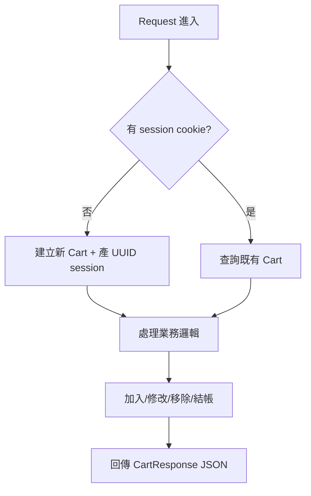
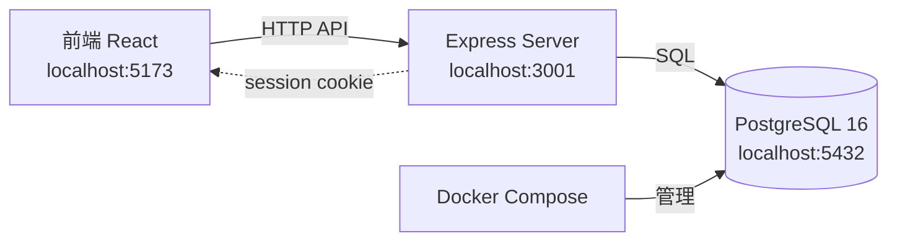
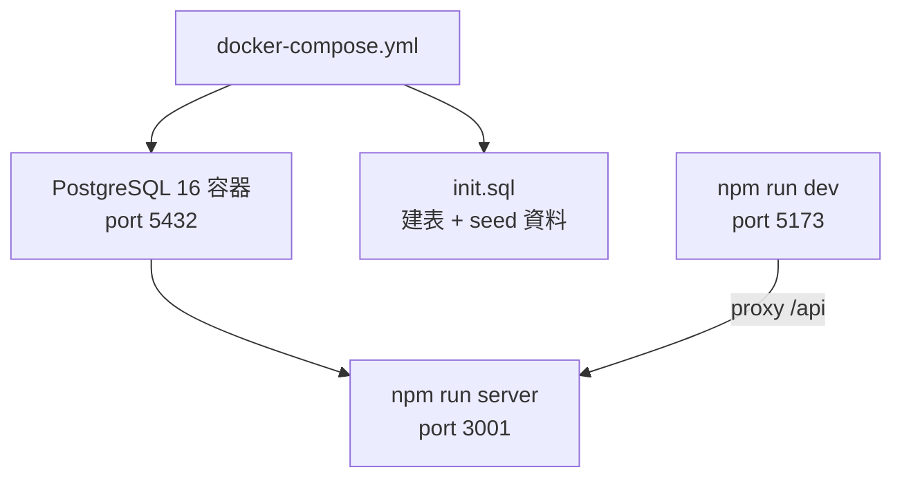
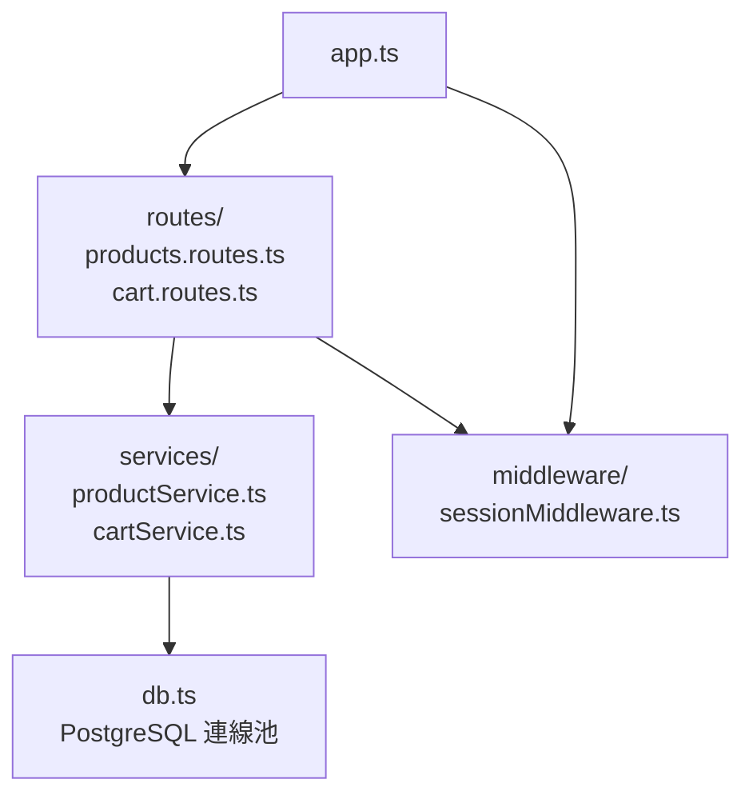
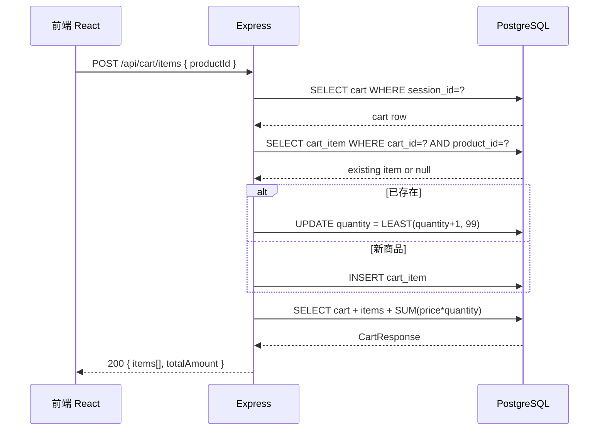
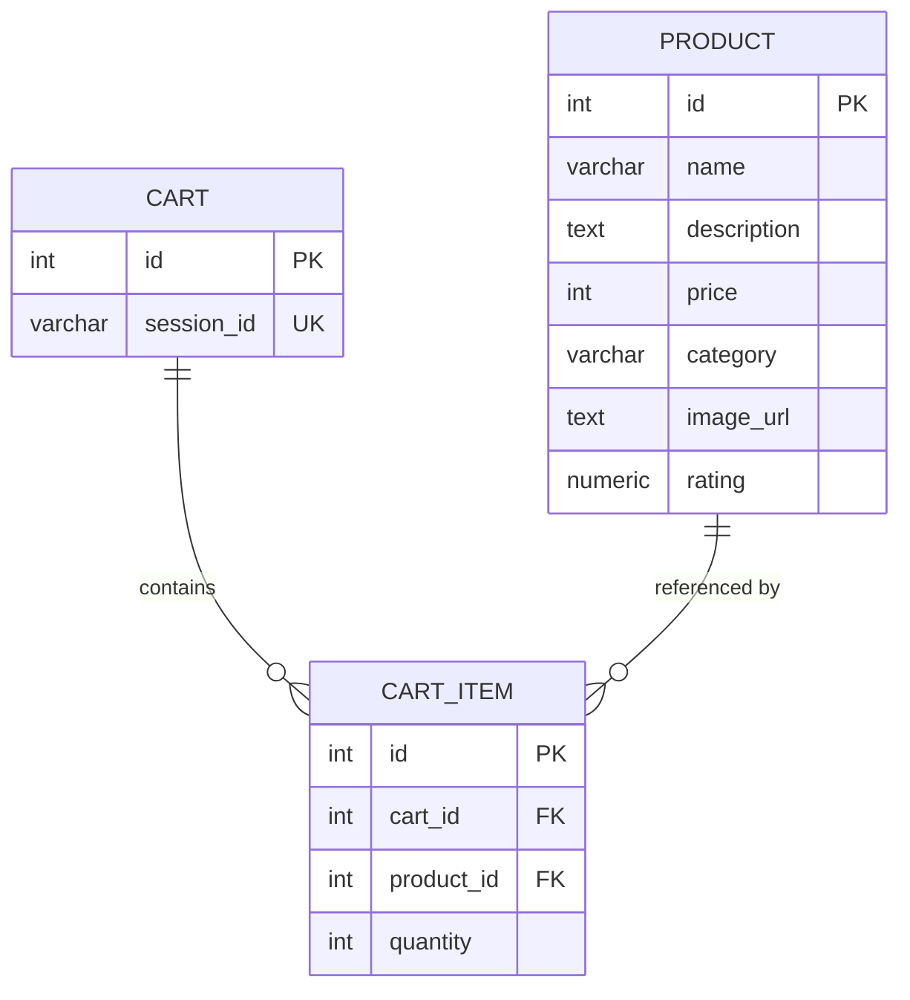
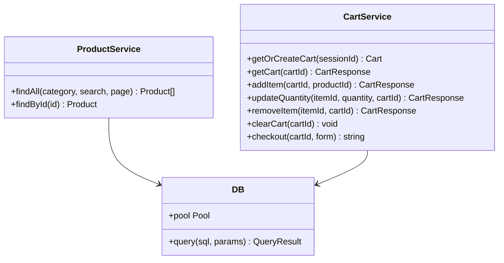
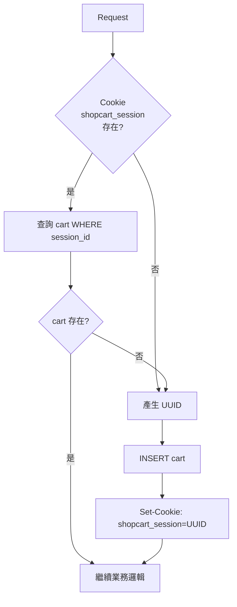
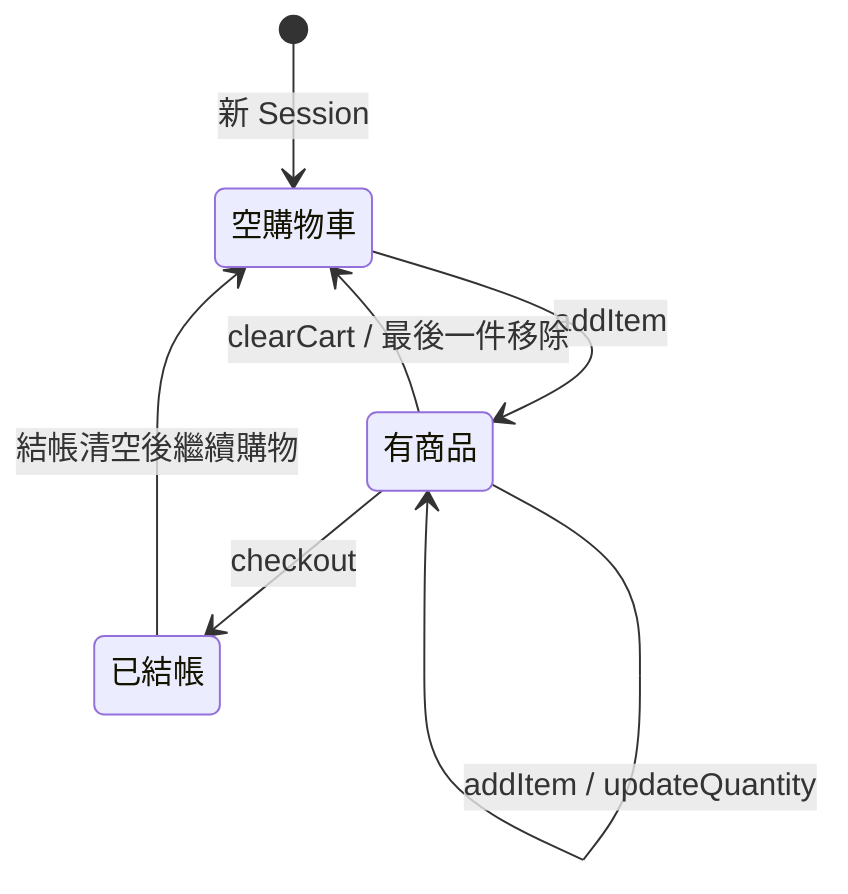

# 購物車系統後端規格文件

## 1. 架構與選型

| 層級 | 技術 | 版本 | 理由 |
| --- | --- | --- | --- |
| Runtime | Node.js | 20 LTS | 課程主線，低門檻 |
| Framework | Express | 4.x | 輕量、易測試 |
| 資料庫 | PostgreSQL | 16（Docker） | 生產級關聯式資料庫 |
| ORM | pg（raw SQL） | 8.x | 避免 ORM 隱藏 SQL 邏輯，課程教學清晰 |
| 測試 | Vitest + Supertest | latest | 快速、與 Vite 生態一致 |
| 語言 | TypeScript | 5.x | 與前端型別共享 |

**核心安全規則（寫入 CLAUDE.md）：**
- `totalAmount` 由伺服器計算，拒絕接受客戶端傳入
- `sessionId` 由後端 UUID 產生，不接受客戶端自定義
- 結帳前驗證收件欄位不為空

---

## 2. 資料模型

```
Product（商品）
├── id           SERIAL PRIMARY KEY
├── name         VARCHAR(200) NOT NULL
├── description  TEXT
├── price        INTEGER NOT NULL          ← 元（整數，避免浮點誤差）
├── category     VARCHAR(20) NOT NULL      ← '3C' | '服飾' | '食品'
├── image_url    TEXT
└── rating       NUMERIC(3,1)

Cart（購物車）
├── id           SERIAL PRIMARY KEY
└── session_id   VARCHAR(36) UNIQUE NOT NULL  ← UUID，由後端產生

CartItem（購物車明細）
├── id           SERIAL PRIMARY KEY
├── cart_id      INTEGER REFERENCES cart(id) ON DELETE CASCADE
├── product_id   INTEGER REFERENCES product(id)
└── quantity     INTEGER NOT NULL DEFAULT 1   ← 1~99
  UNIQUE(cart_id, product_id)                 ← 同商品不重複新增
```

---

## 3. 關鍵流程



### 業務規則

```
加入購物車：
  同一商品（同 cart_id + product_id）→ quantity +1（上限 99）
  新商品 → INSERT CartItem，quantity = 1

修改數量：
  quantity = 0 → DELETE CartItem
  quantity > 99 → 保持 99
  其他 → UPDATE quantity

購物車合計：
  totalAmount = Σ (item.quantity × item.product.price)
  在 SQL JOIN 計算，不在應用層計算

結帳送出：
  1. 驗證 name / email / phone / address 不為空
  2. DELETE 所有 CartItem（保留 Cart session）
  3. 回傳 orderId（UUID）與確認訊息
```

---

## 4. 虛擬碼

```typescript
// cartService.addItem(cartId, productId)
item = db.query('SELECT * FROM cart_item WHERE cart_id=$1 AND product_id=$2', [cartId, productId])
if (item) {
  db.query('UPDATE cart_item SET quantity = LEAST(quantity+1, 99) WHERE id=$1', [item.id])
} else {
  db.query('INSERT INTO cart_item(cart_id, product_id, quantity) VALUES($1,$2,1)', [cartId, productId])
}
return getCart(cartId)  // 回傳含 totalAmount 的完整購物車

// cartService.updateQuantity(itemId, quantity)
if (quantity <= 0) {
  db.query('DELETE FROM cart_item WHERE id=$1', [itemId])
} else {
  db.query('UPDATE cart_item SET quantity=LEAST($1,99) WHERE id=$2', [quantity, itemId])
}
return getCart(cartId)
```

---

## 5. 系統脈絡圖



---

## 6. 容器/部署概觀



**docker-compose.yml 重點：**
```yaml
services:
  postgres:
    image: postgres:16-alpine
    environment:
      POSTGRES_DB: shopcart
      POSTGRES_USER: shopcart
      POSTGRES_PASSWORD: shopcart
    ports:
      - "5432:5432"
    volumes:
      - ./src/server/db/init.sql:/docker-entrypoint-initdb.d/init.sql
```

---

## 7. 模組關係圖



---

## 8. 序列圖



---

## 9. ER 圖



---

## 10. 類別圖（後端關鍵模組）



---

## 11. 流程圖（購物車 Session 初始化）



---

## 12. 狀態圖（購物車生命週期）



---

## 目錄結構

```
shopping-cart/
├── docker-compose.yml
├── package.json
├── tsconfig.json
├── src/
│   └── server/
│       ├── app.ts                  ← Express 入口
│       ├── db.ts                   ← PostgreSQL 連線池
│       ├── db/
│       │   └── init.sql            ← 建表 + seed 30 筆商品
│       ├── routes/
│       │   ├── products.routes.ts
│       │   └── cart.routes.ts
│       ├── services/
│       │   ├── productService.ts
│       │   └── cartService.ts
│       ├── middleware/
│       │   └── sessionMiddleware.ts
│       └── dto/
│           ├── cartResponse.ts
│           └── checkoutRequest.ts
└── src/test/
    ├── products.test.ts
    └── cart.test.ts
```
