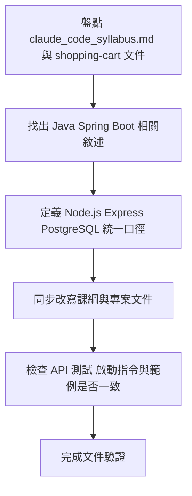
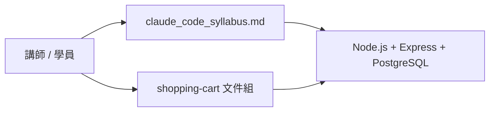
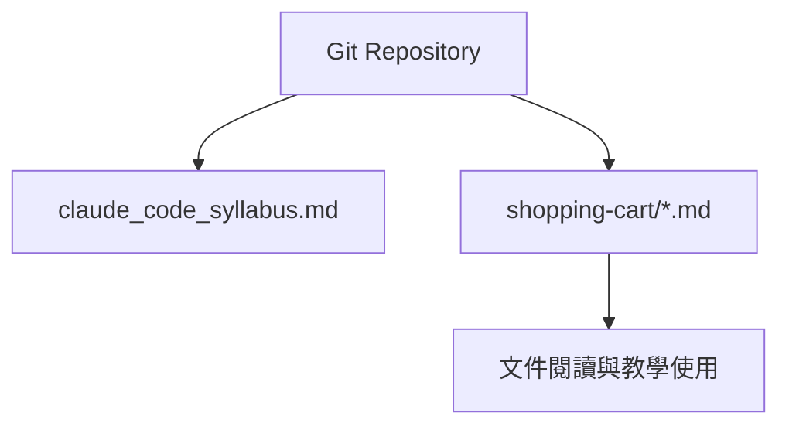
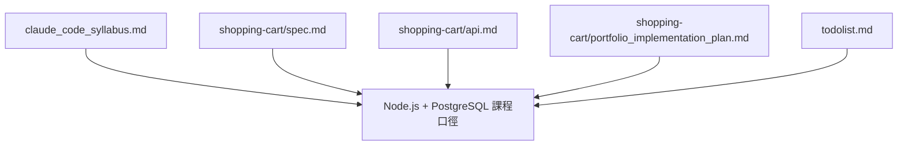
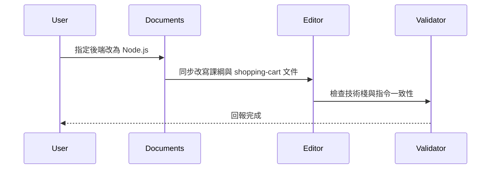
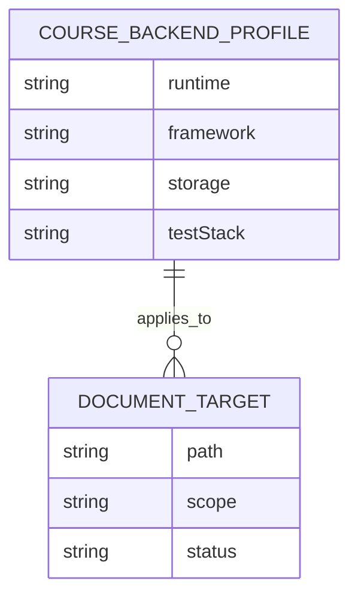
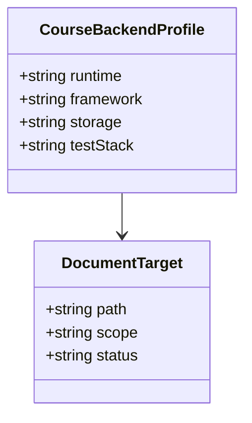
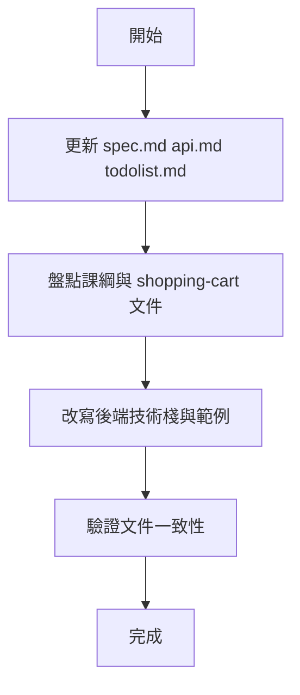
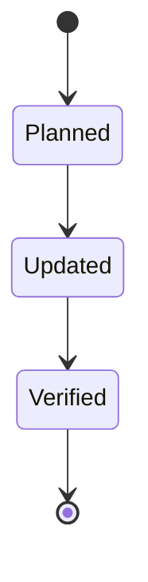

# Claude Code 課綱與 Shopping Cart 文件 Node.js + PostgreSQL 規格

## 1. 架構與選型
- 本輪工作聚焦文件重構，不改動課綱教學網站的互動邏輯。
- `claude_code_syllabus.md` 與 `shopping-cart` 目錄下的文件，需把後端主線統一為 `Node.js + Express + PostgreSQL`。
- 文件口徑以「保留 Node.js 低門檻開發體驗，同時把資料庫教學重點放在 AI 控制 Docker 安裝與啟動 PostgreSQL」為主。
- 課程中的後端測試、啟動指令、資料初始化、API 串接範例、Skill 掃描案例與 Review 範例，都需同步改成 Node.js 生態。
- 第 `1-3` 節需明確改成：用自然語言指揮 Claude 產出 `docker-compose.yml`、啟動 PostgreSQL 容器、驗證 healthy 狀態、再回填後端連線設定。
- 課綱章節圖若因內容更新而重生，需保留既有檔名與引用路徑，優先覆蓋對應圖檔，避免 `claude_code_syllabus.md` 與教學網站失聯。

## 2. 資料模型
- `CourseBackendProfile`
  - `runtime`
  - `framework`
  - `storage`
  - `testStack`
  - `commands[]`
- `DocumentTarget`
  - `path`
  - `scope`
  - `status`
  - `notes`

## 3. 關鍵流程


## 4. 虛擬碼
```text
read syllabus and shopping-cart docs
find backend references tied to Java, Spring Boot, PostgreSQL, Maven, and JUnit
replace them with Node.js, Express, PostgreSQL, Docker Compose, npm, Vitest, and Supertest equivalents
normalize examples, commands, and architecture diagrams
verify no major document still describes the old backend as the primary path
```

## 5. 系統脈絡圖


## 6. 容器/部署概觀


## 7. 模組關係圖（Backend / Frontend）


## 8. 序列圖


## 9. ER 圖


## 10. 類別圖（後端關鍵類別）


## 11. 流程圖


## 12. 狀態圖

