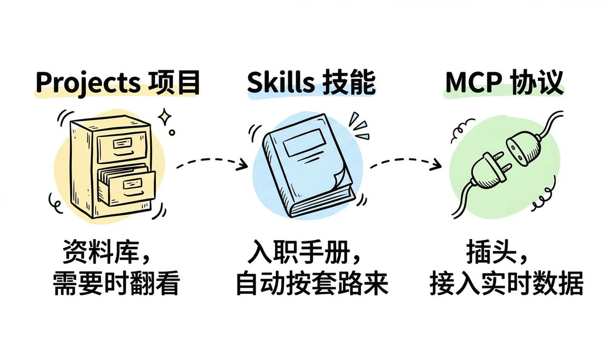
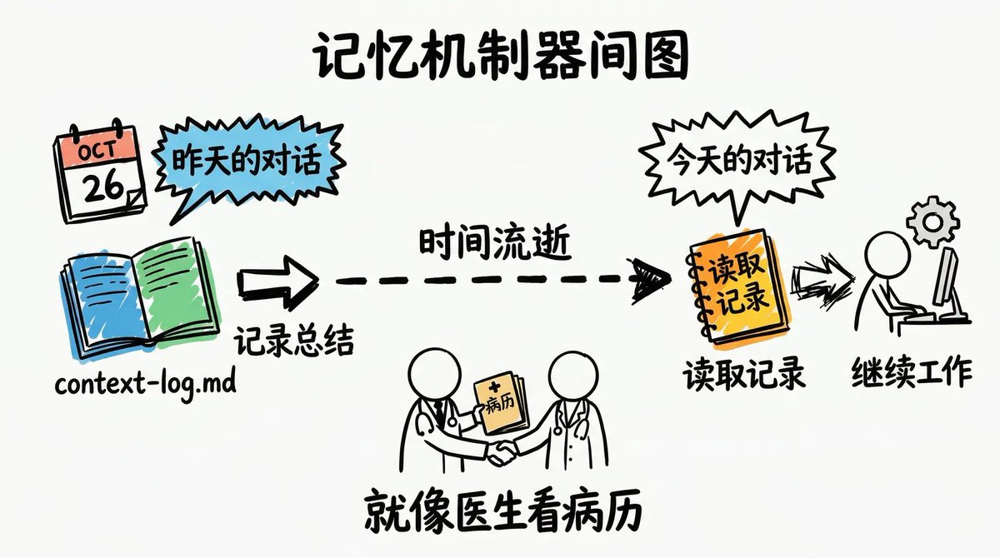
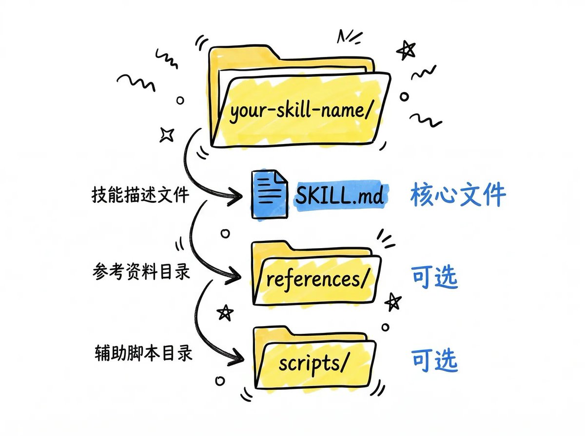
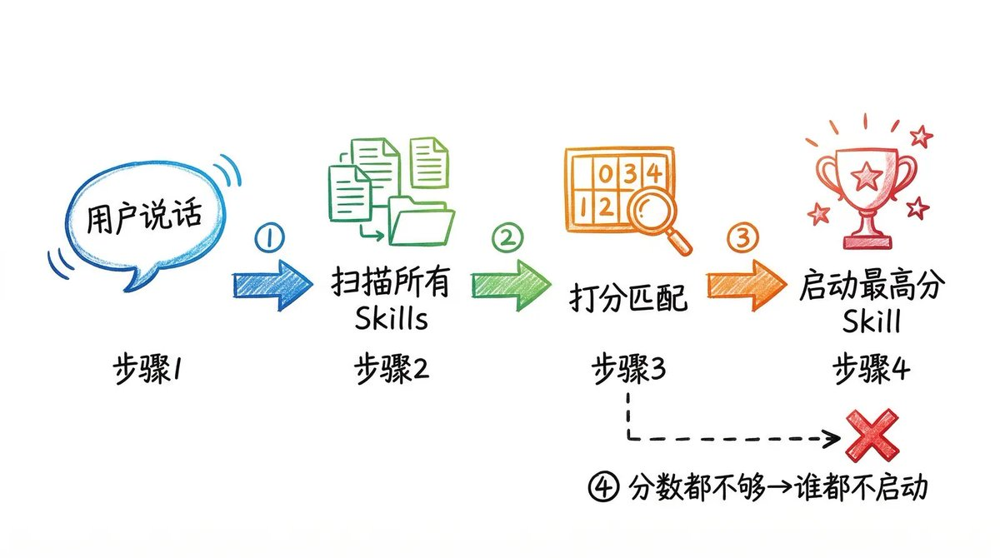

# Claude Skills 喂饭级教程，99%的人不会用Skill

來源貼文：https://x.com/imaxichuhai/status/2032397341701906735
X Article：https://x.com/i/article/2032391190646296576
作者：阿西_出海（2.0版） (@imaxichuhai)
發布時間：2026-03-13T10:04:20.000Z

## 摘要
很多人都不知道如何正确使用 Claude，每次打开 Claude 都要重新输入一遍指令，比如

## 封面

## 文章內容
很多人都不知道如何正确使用 Claude，每次打开 Claude 都要重新输入一遍指令，比如
“用我们的品牌语气写”、“按这个格式整理”、“记得加上这些要点”。昨天说过，今天还得说，明天继续说。这些重复的指令累积起来，一个月能烧掉好多 token。
最近 hooeem 分享了一篇 Claude Skills 经验，我结合自己平时使用 Claude 的心得，写成了这篇 Claude 使用教程。
通过本文你将学到如何只用 10 分钟搭建 Skill，如何正确的使用 Skill。
这篇文章把 Skills 的核心逻辑拆得很细。不需要懂编程，你看完之后对 Claude Skills 的理解会超过 99% 的人。
## 要点概览：
1. 基础入门： Skills 是什么，10 分钟搭好第一个
1. 进阶配置：多个 Skills 怎么配合不打架
1. 实战优化：五种常见问题和解决方法
1. 长期使用：怎么让 Skills 跨会话稳定工作
# 1. 基础入门
用 Claude 之前，先搞清楚这 3 个东西有啥区别：
Projects（项目） 就像个资料库，你扔进去一份品牌手册，Claude 需要的时候会翻出来看看。
Skills（技能） 就像个新员工入职手册。你教 Claude 一次“遇到这种事该怎么办”，以后它就自动按这个套路来。
MCP（模型上下文协议） 就像一个插头，它让 Claude 能接入实时数据源（你的日历、数据库、收件箱），然后 Skills 告诉 Claude 该如何处理这些数据。
## 什么时候需要做个 Skill?
如果同样的指令你已经重复输入三次以上了，那就该搭个 Skill 了。或者你想让 Claude 在某个领域变得专业，那创建 Skills 就能让它成为你的行业专家。
## Skill 怎么搭？
其实一个 Skill 就是你电脑上的一个文件夹，文件夹里有个文本文件。就这么简单。
Skill 是一个包含 SKILL.md 文本文件的文件夹，这个文件夹要遵循三条规则：
1. 根文件夹的命名规则：全小写，单词之间用短横线连接。比如 invoice-organiser、email-formatter、csv-cleaner。不能有空格、不能用下划线、不能有大写字母。
2. SKILL.md 是核心。这个文件名要注意区分大小写。不是 skill.md，不是 README.md，必须是 SKILL.md。你所有的指令都写在这里。
3. references/ 文件夹是可选的。如果你的指令里要引用很长的文档（比如品牌手册、模板之类的），别直接塞进 SKILL.md，单独放在这个 references/ 子文件夹里就行。
搞定这三样之后，把整个文件夹扔进你电脑的 ~/.claude/skills/ 目录，Claude 就能自动识别了。

## 在哪用 Skill？这个问题比大多数教程说的都重要
Claude Code（给程序员用的）
这是命令行版本，程序员用它来处理代码、批量操作文件这类技术活儿。Skills 文件可以放在项目目录下的 .claude/skills/，也可以放在全局目录 ~/.claude/skills/。它能访问文件系统、执行 bash 命令、运行代码。
Claude Desktop(CoWork)（给普通人用的）
这是桌面版，可以帮你处理文档、整理文件、写邮件这些日常工作。Skills 通过桌面界面工作，可以跟你的屏幕、应用程序、文件进行交互。用的是同样的 SKILL.md 格式，但运行环境不一样。
不确定要不要搭 Skill? 用下面这段话问 Claude，它会帮你分析：
> 我想让你帮我判断一下,我是否需要创建一个 Claude Skill。

流程是这样的:

1. 问我:我在使用 AI 助手时最常重复的 3-5 个任务是什么。
   对每个任务,问我:
   - 我通常在开始时会给什么指令?
   - 每周重复这个任务多少次?
   - 输出结果是否每次都需要遵循特定的格式、语气或结构?

2. 在我描述完每个任务后,根据以下标准给它打个"Skill 就绪度"分数(1-10 分):
   - 重复频率(越高越适合)
   - 指令复杂度(指令越具体越适合)
   - 输出一致性要求(格式要求越严格越适合)

3. 把我的任务按"Skill 就绪度"从高到低排序。

4. 针对得分最高的任务,告诉我:
   - 为什么这是我第一个 Skill 的最佳候选
   - 这个 Skill 需要包含什么内容
   - 如果自动化它,每周能节省多少时间
   - 它更适合用 Claude Code 还是 Claude Desktop(CoWork)

现在开始问我第一个重复任务吧。
# 10 分钟搭好第一个 Skill
## 第 1 步：先明确这个 Skill 要做什么
先回答 2 个问题：
这个 Skill 到底做什么？
别说“帮我处理数据”这种泛泛而谈的话，要表达的很具体，比如：“把乱七八糟的 CSV 文件整理干净，表头规范化，日期统一改成 YYYY-MM-DD，空行全删。”
最后要达到什么效果？
最好准备一个例子给 Claude 看，让它知道要做成什么样。
比如处理数据，就拿一份实际的乱数据和处理好的数据做对比，这样能更直观理解。
很多 Skill 做不好就是因为一开始没说清楚想要什么。你描述得越清楚，做出来的效果就越准。
如果不确定自己有没有说清楚，可以用下面这段话问 Claude，它会帮你一步步理清思路：
提示词：
> 你是一个 Skill 定义专家。你的工作是采访我,直到我们对要构建的 Claude Skill 有一个清晰明确的定义。你不能让我用模糊的回答蒙混过关。

按以下流程进行采访:

阶段 1 - 任务定义
问我:"你想自动化什么任务?"
在我回答后,对我的回答进行压力测试:
- 如果我的回答很模糊(比如"帮我处理邮件"),要反驳我,
  让我准确描述这个 Skill 应该做什么,要有具体的输入和具体的输出。
- 不断追问"能再具体点吗?"直到任务描述具体且可执行。
- 用一句话向我确认最终的任务定义。

阶段 2 - 触发词
问我:"你实际会对 Claude 说什么来激活这个 Skill?
给我 5 种不同的说法。"
在我回答后:
- 建议 3-5 个我可能漏掉的触发词。
- 问我关于负面边界的问题:"哪些听起来相似的请求不应该触发这个 Skill?"

阶段 3 - 质量标准
问我:"给我展示或描述一下,这个任务的完美输出是什么样的。"
在我回答后:
- 让我描述失败的输出是什么样的(这样我们知道要避免什么)。
- 问我关于边缘情况:"这个 Skill 可能收到的最奇怪或最烂的输入是什么?
  应该怎么处理?"

阶段 4 - 总结
把所有内容整理成一份结构化的"Skill 定义简报",包含以下部分:
- Skill 名称(用短横线连接的小写格式)
- 一句话目的
- 触发词(正面的)
- 负面边界(什么时候不该触发)
- 输入描述
- 输出描述
- 质量标准(什么算"做好了")
- 需要处理的边缘情况

展示这份简报,让我确认或修改后再继续。

现在开始阶段 1。
## 第 2 步：设置触发条件
在 SKILL.md 文件的开头，需要写一段配置信息。
格式是这样的：
> ---
配置内容写在这里
---
就是在文件开头用两行 --- 把配置内容包起来。这段配置是用来告诉 Claude：你说什么话的时候，它应该启动这个 Skill。
举个例子：
> ---
name: csv-cleaner
description: 把乱糟糟的 CSV 文件转换成干净的电子表格。当用户说"清理这个 CSV"、"修一下表头"、"格式化这些数据"或"整理这个表格"时使用这个 skill。不要用于 PDF、Word 文档或图片文件。
---
写配置的时候要注意三点：
第一点：用第三人称写
写“处理文件……”，不要写“我可以帮你……”。就像在给别人介绍这个工具能做什么。
第二点：把触发词写清楚 
Claude 比较谨慎，不会随便启动 Skill。所以你要明确写出用户可能说的话，比如“清理表格”、“整理数据”这些具体的词。
第三点：说明什么情况不该启动
告诉 Claude 哪些情况不要启动这个 Skill。比如你的 Skill 是处理表格的，就要说明“不要用于处理图片或 PDF”。这样可以避免 Skill 在不该出现的时候跳出来。
特别提醒：description 这一行是最关键的。写得不够清楚，Skill 就启动不了；写得太宽泛，又会在不该启动的时候启动。
如果觉得自己写不好，可以用下面这段话让 Claude 帮你生成：
提示词：
> 你是 Claude Skills 的 YAML 前置信息专家。你的工作是为 SKILL.md 文件顶部编写最有效的 YAML 触发块。

这是我的 Skill 定义:
[在这里粘贴你的 Skill 定义简报,或用 2-3 句话描述你的 Skill]

按照以下严格规则生成 YAML 前置信息:

1. "name" 字段必须用短横线连接的小写格式(只能用小写字母和连字符,
   不能有空格或下划线)。

2. "description" 字段必须"强势" - 意思是要积极地列出触发场景,
   因为 Claude 对 skill 激活很保守。包括:
   - 用一句话清楚地总结这个 skill 做什么
     (用第三人称:"处理..."而不是"我可以...")
   - 至少 5-7 个用户可能说的明确触发词,
     格式为:"当用户说'[短语1]'、'[短语2]'、'[短语3]'...时使用这个 skill"
   - 负面边界:"不要用于[X]、[Y]或[Z]。"
   - 上下文线索:"当用户上传[文件类型]并要求[操作]时也要激活。"

3. 整个描述保持在 300 字以内,但每个字都要有用。

只输出 YAML 块(在 --- 标记之间),可以直接粘贴到 SKILL.md 文件中。
不需要解释。

然后,在 YAML 块下面,提供一个"触发置信度报告",评分:
- 相关请求的激活可能性:X/10
- 误触发风险(不该触发时触发):X/10
- 常见说法的覆盖率:X/10

如果任何分数低于 7/10,建议具体的改进方法。
## 第 3 步：告诉 Claude 具体怎么做
在前面那两行 --- 下面，就是写正文的地方了。这里要把整个工作流程说清楚，让 Claude 知道该按什么顺序做事。
写的时候注意两点：
第一，列出步骤
把整个任务拆成一步一步的操作，比如你要让 Claude 清理表格数据，就这么写：
1. 先打开文件，看看里面是什么结构
1. 找到真正的表头在哪一行
1. 把空行和没用的行都删掉
1. 把日期统一改成 YYYY-MM-DD 格式
1. 输出整理好的文件，顺便说一下改了什么
第二，给个实际例子
这个特别重要。你给 Claude 看一个“处理前”和“处理后”的真实例子，它马上就懂了。
就像你教人做菜，光说“把肉炒熟”不如直接给他看一张“生肉”和“熟肉”的对比图。
提示词：
> 你是 Claude Skill 指令编写者。你的工作是为 SKILL.md 文件生成完整的指令主体,要清晰、有序、不超过 500 行。

这是我的 Skill 定义:
[粘贴第 1 步的 Skill 定义简报]

这是已经写好的 YAML 前置信息:
[粘贴第 2 步的 YAML 块]

现在生成完整的指令主体,放在 YAML 块结束的 --- 下面。
严格遵循以下规则:

结构规则:
1. 以一段"概述"开始,说明这个 skill 做什么、什么时候激活,
   是写给 Claude 看的(不是给人类读者看的)。
2. 在"## 工作流程"标题下把工作流程拆成编号步骤。每个步骤必须:
   - 一个清晰的动作
   - 用祈使句("读取文件..."而不是"文件应该被读取...")
   - 足够具体,只有一种解释方式
3. 包含"## 输出格式"部分,明确说明最终输出应该如何结构化
   (文件类型、格式、章节、语气等)
4. 包含"## 边缘情况"部分,告诉 Claude 如何处理:
   - 缺失或不完整的输入
   - 模糊的请求
   - 冲突的指令
   - 意外的文件格式或数据类型

示例规则:
5. 在"## 示例"标题下至少包含 2 个具体例子:
   - 示例 1:一个简单的"正常路径",显示正常输入 → 预期输出
   - 示例 2:一个边缘情况,显示异常输入 → Claude 应该如何处理
   每个示例必须显示实际的输入和实际的预期输出,不是抽象描述。

质量规则:
6. 总长度:目标是 100-300 行。删掉任何不直接指导 Claude 
   如何执行任务的内容。
7. 永远不要用模糊的语言,比如"适当处理"或"格式化得好看"。
   每个指令都必须具体且可测试。
8. 如果 skill 需要引用外部文件(品牌指南、模板),
   添加"## 参考资料"部分,指令:"在开始任务前从 references/ 
   目录读取[文件名]。"

输出完整的指令主体为 markdown 格式,可以直接粘贴到 SKILL.md 文件
的 YAML 前置信息下面。

在指令之后,提供一个"质量检查清单",确认:
- [ ] 每个步骤都是单一、明确的动作
- [ ] 至少包含 2 个具体示例
- [ ] 覆盖了边缘情况
- [ ] 明确定义了输出格式
- [ ] 总长度在 500 行以内
- [ ] 没有模糊或可解释的语言
## 第 4 步：如果有很长的参考资料怎么办？
有时候你的 Skill 需要参考一份很长的文档，比如公司的品牌手册、写作模板之类的。这种情况下，别把整份文档都塞进 SKILL.md 里，会显得特别乱。
正确做法是：把这份文档单独保存成一个文件，放在 references/ 文件夹里。然后在 SKILL.md 的指令里告诉 Claude：“需要的时候去 references/ 文件夹里找某某文件”。
但有个重要规矩：参考文件只能有一层。
什么意思呢？就是你不能让“参考文件 A”里面再去引用“参考文件 B”。Claude 读到这种套娃式的引用会出问题，可能会漏掉信息。所以记住：所有参考文件都直接放在 references/ 文件夹里，互相之间不要交叉引用。
如果你手头有现成的文档（品牌手册、模板、标准流程之类的）想让 Skill 使用，下面这段提示词可以帮你把它们整理成合适的格式：
提示词：
> 你是 Skill 参考文件组织器。我有一些文档需要我的 Claude Skill 
在执行过程中引用。你的工作是为 references/ 目录准备它们。

这是我的参考文档:
[粘贴或上传你的品牌指南/模板/标准操作流程/样式表/任何参考材料]

对每个文档执行以下操作:

1. 评估:这个文档是否足够短,可以直接包含在 SKILL.md 文件中
   (相关内容少于 50 行)?如果是,建议内联它而不是创建单独的参考文件。

2. 压缩:如果需要作为单独的参考文件,只提取与 Skill 任务直接相关的部分。
   删除所有序言、背景上下文和 Skill 永远不需要的信息。
   目标是减少 50%+ 的内容,同时保留所有可操作的指令。

3. 格式化:用以下方式结构化压缩后的参考文件:
   - 清晰的 markdown 标题
   - 规则和约束用项目符号
   - 关键要求用粗体
   - 顶部有"快速参考"摘要(不超过 10 行),捕捉最重要的规则

4. 命名:为每个参考文件建议一个短横线连接的小写文件名
   (例如 brand-voice-guide.md、email-template.md)。

5. 链接:写出我应该在 SKILL.md 文件中添加的确切行来引用这个文档,
   例如:"在开始任务前,从 references/brand-voice-guide.md 读取品牌语气指南"

6. 验证:检查"单层深度"规则。标记任何链接到或依赖于另一个参考文件的
   参考文件。如果发现,将它们合并成一个文件。

输出每个准备好的参考文件的完整内容,可以直接保存到 references/ 目录。
## 第 5 步：组装和部署
你现在有了所有组件。是时候把它们组装起来了。
你的文件夹结构应该是这样的：
your-skill-name/
├── SKILL.md          (第 2-3 步的 YAML 头部 + 指令)
└── references/       (可选,来自第 4 步)
    └── your-ref.md
把文件夹放到你电脑上的 ~/.claude/skills/ 里。
最好再检查一遍，确保没有漏洞。下面这段提示词可以帮你做最后的质量检查：
提示词：
> 你是 Claude Skill 质量保证审核员。我构建了一个完整的 SKILL.md 文件,
我需要你在部署前审核它。

这是我完整的 SKILL.md 文件:
[粘贴你的整个 SKILL.MD 文件]

运行以下审核检查并报告结果:

## 1. YAML 前置信息审核
- [ ] name 字段存在且是有效的短横线连接小写格式
- [ ] description 字段存在且超过 50 字
- [ ] description 用第三人称写的
- [ ] 至少列出了 5 个触发词
- [ ] 定义了负面边界(什么时候不激活)
- [ ] description 足够"强势"(Claude 真的会在相关请求时触发这个 skill 吗?)
评分:X/10

## 2. 指令清晰度审核
- [ ] 每个步骤都是单一、明确的动作
- [ ] 没有模糊语言("适当处理"、"格式化得好看"、"根据需要")
- [ ] 指令用祈使语气("读取文件"而不是"文件应该被读取")
- [ ] 顺序逻辑正确(没有步骤依赖于后面步骤的信息)
- [ ] 总指令长度在 500 行以内
评分:X/10

## 3. 示例质量审核
- [ ] 至少包含 2 个示例
- [ ] 示例显示实际的输入和实际的输出(不是抽象描述)
- [ ] 至少包含一个边缘情况示例
- [ ] 示例是现实的(代表真实世界的使用)
评分:X/10

## 4. 边缘情况覆盖审核
- [ ] 处理了缺失/不完整的输入
- [ ] 处理了模糊的请求
- [ ] 处理了意外的文件类型或数据格式
- [ ] skill 知道什么时候该要求澄清 vs. 做出合理假设
评分:X/10

## 5. 参考文件审核(如果适用)
- [ ] 所有引用的文件都只有一层深
- [ ] 没有循环引用
- [ ] SKILL.md 中的引用指令清晰("在开始前读取 X")
评分:X/10

## 总体部署就绪度:X/50

如果任何部分得分低于 7/10,为失败的部分提供具体的重写。
输出修正后的文本,可以直接粘贴到文件中。

如果总分是 40+/50,确认:"准备部署。"
如果低于 40,按优先级顺序列出部署前需要的关键修复。
# 自动化构建你的第一个 Skill
如果上面所有步骤感觉太费力，还有个简单的办法。
Anthropic 构建了一个叫 skill-creator 的元技能，通过对话为你构建 Skills。
怎么用？举个例子：
1. 开个新对话，跟 Claude 说：“用 skill-creator 帮我做个【你想做的事】的 skill。”
1. 上传相关资料
1. 回答它的问题。skill-creator 会问你：具体怎么做？遇到特殊情况怎么办？什么样的结果才算合格？
1. 它自动生成所有文件。包括格式规范的 SKILL.md、写得很到位的触发条件、整个文件夹结构，全都给你打包好。
1. 保存到电脑里。把生成的文件夹放到 ~/.claude/skills/ 目录，就完事了。
下次你让 Claude 执行该任务时，你的 Skill 会自动触发。
# 2. 进阶配置
当你的 Skills 越来越多，就需要考虑怎么让它们更好地配合工作了。
到目前为止，你写的 Skill 都是用大白话告诉 Claude 该做什么。这对大部分任务都够用了。
但有些事情，光靠自然语言说不清楚。比如：
- 要做精确的数学计算
- 要处理大量数据
- 要批量修改文件
这时候就需要用到“脚本”了，也就是让 Claude 运行一段代码来完成这些任务。
## 什么时候用指令，什么时候用脚本？
用指令的情况：
需要 Claude 做判断、理解语言、调整格式。比如“用我们的品牌语气改写这段话”、“把会议记录分个类”、“起草一封邮件”。
用脚本的情况：
需要精确计算、处理文件、转换数据。比如“算出这些数字的平均值”、“从 XML 文件里提取特定信息”、“把文件夹里所有图片都改成 800x600”。
两个都用的情况：先用脚本处理数据，再用指令写总结。比如“先用脚本清理这个 CSV 文件，然后写一份人能看懂的报告”。
## 脚本怎么跟 Skill 配合？
其实很简单：你在 SKILL.md 里告诉 Claude“什么时候运行哪个脚本”，脚本文件就放在 scripts/ 文件夹里。
完整例子：
data-analyser/
├── SKILL.md
├── references/
│   └── analysis-template.md
└── scripts/
    ├── parse-csv.py
    └── calculate-stats.py
在你的 SKILL.md 中，你这样引用脚本：
## 工作流程

1. 读取上传的 CSV 文件以了解其结构。

2. 运行 scripts/parse-csv.py 清理数据:
   - 命令:`python scripts/parse-csv.py [input_file] [output_file]`
   - 这会删除空行、规范化表头、强制执行数据类型。

3. 在清理后的数据上运行 scripts/calculate-stats.py:
   - 命令:`python scripts/calculate-stats.py [cleaned_file]`
   - 这会输出:每个数值列的平均值、中位数、标准差和异常值。

4. 读取统计输出,按照 references/analysis-template.md 中的模板
   写一份人类可读的摘要。突出显示任何会让非技术读者担心的异常或异常值。
## 写脚本要注意什么？
一个脚本只做一件事。比如清理数据就是清理数据，别又清理又计算，那应该分成两个脚本。
别把路径写死。脚本应该能接受参数，比如“处理哪个文件”、“结果存到哪”，这样才灵活。别在代码里写死“一定要处理 data.csv”。
出错要说清楚。如果文件打不开、格式不对，脚本要明确告诉你哪里出问题了。这样 Claude 才能把错误信息传达给你。
在脚本开头写个说明。就像使用说明书一样，告诉别人：这脚本是干嘛的、需要什么输入、会输出什么、可能会报什么错。
如果你需要给 Skill 写脚本，可以用下面这段话让 Claude 帮你生成：
提示词：
> 我有一个 Claude Skill,需要可执行脚本来处理需要计算而不是语言处理的任务。

这是我当前的 SKILL.md:
[粘贴你的 SKILL.MD]

这些是不能仅用指令处理的计算任务:
[描述每个需要脚本的任务,例如:
- "解析 XML 文件并提取特定字段"
- "计算数值数据的统计摘要"
- "调整和压缩文件夹中的图片"]

对每个任务,构建一个遵循以下规则的脚本:

1. 语言:除非任务特别需要另一种语言,否则使用 Python。
   Python 在 Claude Code 和 CoWork 环境中都可用。

2. 接口:接受所有输入作为命令行参数。不要硬编码文件路径。
   将输出打印到 stdout 或写入指定的输出文件。

3. 错误处理:捕获所有常见的失败模式(缺失文件、格式错误的数据、错误类型),
   并以 Claude 可以解析的清晰错误消息退出。

4. 文档:在顶部包含一个注释块,说明:
   - 脚本做什么
   - 必需的参数
   - 预期的输出格式
   - 可能的错误条件

5. 依赖:尽可能只使用 Python 标准库。如果需要外部包,
   在 requirements.txt 中列出它们。

生成脚本后:

6. 更新 SKILL.md 工作流程,用 Claude 应该使用的确切命令语法引用每个脚本。

7. 向 SKILL.md 添加错误处理指令:如果脚本失败,Claude 应该告诉用户什么?

输出:
- 每个脚本文件,可以保存到 scripts/
- 更新的 SKILL.md,包含脚本引用
- requirements.txt(如果需要外部包)
# 多个 Skills 打架怎么办？
当你做到第五个 Skill 的时候，就会发现问题了：它们开始打架。
比如你想让邮件起草器帮你写邮件，结果品牌语气检查器跳出来了。或者你只想格式化一段代码，代码审查助手却自作主张开始挑毛病。两个 Skills 都觉得“这事归我管”。
Skill 越多，这种情况越严重。
为什么会这样？
你每次跟 Claude 说话，它都会把所有 Skills 扫一遍，看看哪个最合适。过程是这样的：
1. 读一遍所有 Skill 的描述
1. 给每个 Skill 打分，看谁跟你的要求最匹配
1. 分最高的那个就启动了
1. 如果所有 Skill 分数都不够高，就谁都不启动
问题就出在这：如果两个 Skills 的触发词太像，可能会启动错的那个。描述写得太模糊，不该启动的时候也会启动。描述写得太窄，该启动的时候又不启动。
## 怎么让 Skills 和平共处？
规则 1：各管各的地盘
每个 Skill 要有自己明确的职责范围，不能跟别的 Skill 重叠。品牌语气检查器就管语气，邮件起草器就管写邮件，内容重塑器就管格式转换。井水不犯河水。
规则 2：说清楚“我不管什么”
每个 Skill 的描述里，要明确写出“哪些事我不管”。比如邮件起草器要说“我不管品牌语气检查，也不管内容重塑”。品牌语气检查器要说“我不管从零写邮件，也不管重塑内容”。
规则 3：每个 Skill 有自己的专属词
每个 Skill 要有只属于它的触发词。“检查语气”就只能启动品牌语气检查器，“起草邮件”就只能启动邮件起草器。如果你发现两个 Skill 用了同一个触发词，那肯定有一个的范围定义有问题。
怎么找出冲突？
如果总是启动错的 Skill，问题基本都出在描述上。下面这段话可以帮你检查所有 Skills 有没有冲突：
提示词：
> 我部署了多个 Claude Skills,遇到了冲突(错误的 Skills 触发、
Skills 该触发时不触发,或功能重叠)。

这是我所有已部署 Skills 的 YAML 描述:

SKILL 1:
[粘贴 SKILL 1 的完整 YAML 描述]

SKILL 2:
[粘贴 SKILL 2 的完整 YAML 描述]

SKILL 3:
[粘贴 SKILL 3 的完整 YAML 描述]

[根据需要添加更多]

运行以下冲突分析:

## 1. 领地地图
为每个 Skill 用一句话定义其领地。
将领地可视化为列表并识别任何重叠。

## 2. 触发词碰撞测试
列出每个 Skill 的所有触发词。
标记任何可能匹配多个 Skill 的短语。
对每个碰撞,建议哪个 Skill 应该拥有该短语,
并为另一个建议替代方案。

## 3. 负面边界审核
对每个 Skill,检查其负面边界是否明确排除了所有其他 Skills 的领地。
标记任何缺失的排除项。

## 4. 模糊请求测试
生成 10 个可能匹配多个 Skills 的现实用户请求(模糊的)。
对每个,预测哪个 Skill 会触发以及这是否是正确的选择。

## 5. 死区检查
识别任何不会触发任何已部署 Skills 但可能应该触发的常见用户请求。

## 6. 推荐修复
对发现的每个问题,提供修正后的 YAML 描述,
可以直接粘贴到 SKILL.md 文件中。

以结构化报告形式呈现发现,按优先级排列修复。
# 参考文档太多怎么办？
前面讲过基础做法：一个参考文件，不要套娃引用，内容尽量精简。
但如果你的 Skill 要用到一大堆资料呢？
比如 50 页的品牌手册、30 页的风格指南，还有一堆模板。全都塞给 Claude，它会被撑爆的。
这时候就要想办法按需加载，只让 Claude 读当前任务需要的那部分资料，其他的先不管。
提示词：
> 我有一个 Claude Skill 需要引用多个大型文档。
我需要帮助设计参考文件架构,让 Claude 只加载每个请求需要的内容。

这是我的 Skill 需要访问的文档:
[列出每个文档及其大致长度和目的,例如:
- 品牌语气指南(50 页,涵盖语气、词汇、格式)
- 邮件模板(10 个不同情况的模板)
- 客户列表及偏好(200 条记录)
- 风格手册(30 页,涵盖视觉和书面风格)]

这是我的 SKILL.md:
[粘贴你当前的 SKILL.MD]

设计一个参考架构:

1. 将大型文档拆分成可以独立加载的聚焦子文件。

2. 为每个主要文档创建一个"快速参考"版本(不超过 30 行),
   涵盖 80% 的用例。

3. 为 SKILL.md 编写条件加载指令,告诉 Claude 根据请求类型
   读取哪些参考资料。

4. 确保维持"单层深度"规则(没有参考文件链接到另一个参考文件)。

5. 估计相比每次加载所有内容的 token 节省。

输出:
- 完整的文件夹结构图
- 每个参考文件(压缩和格式化)
- 更新的 SKILL.md,包含条件加载指令
- Token 效率估算
# 3. 实战优化
## Skill 常见的 5 种问题
开始测试之前，先搞清楚 Skill 一般会出什么问题，常见的有 5 种问题：

## 问题 1：没反应
什么情况：
你明明说了该触发 Skill 的话，Claude 却不调用 skill。
因为你的描述写得太含糊了。Claude 很谨慎，你说的话跟描述对不上号，它就不敢启动。如果描述里没写清楚关键词，那永远启动不了。
怎么查：
看你的描述里面有没有你刚才说的那些词？比如你说“清理这个表格”，但描述里只写了“CSV 文件”，那就对不上。
怎么修：
把描述写得更明确。多加几个触发词。把可能说的话都列上。宁可写得太详细，也别写得太模糊。
## 问题 2：过度反应
你问 Claude 别的事，结果某个 Skill 却跳出来了。比如你想写邮件，格式检查器却跑出来了。
因为你描述写得太宽泛，或者没说清楚“什么情况不该启动”。结果啥都能匹配上。
怎么查：
看看你说的话里，哪些词跟这个 Skill 的描述对上了。然后想想这些词是不是应该被排除掉。
怎么修：
加上“负面清单”。明确写“不要用于【某某某任务】”。把触发词改得更具体，只针对这个 Skill 真正该干的事。
## 问题 3：启动了但结果不对
Skill 确实启动了，但输出的结果跟你想的不一样。差不多，但总觉得哪里不对。格式不对、语气不对，或者漏了步骤。
为啥会这样：
你的指令写得不够清楚，有歧义，Claude 理解成了另一个意思。
怎么查：
重新读一遍你的指令，找出那些有歧义的句子。
怎么修：
把模糊的话改成具体的要求。比如“格式化得好看”改成“每个部分用二级标题，每段第一句加粗，每段不超过 3 行”。说得死死的，不留任何理解空间。
## 问题 4：正常情况行，特殊情况崩
Skill 处理干净整齐的数据时完美运行。但你给它点奇怪的东西，比如数据不全、格式乱七八糟、少了字段，它就不行了。
因为你没考虑到各种意外情况。
怎么查：
故意给 Skill 喂最烂的数据。缺字段、多字段、格式错误、文件损坏、中英文混杂。看看哪里会出问题。
怎么修：
针对每种崩溃情况，加一条具体的处理规则：“如果【出现这种情况】，就【这么办】。”
## 问题 5：没要求的也给你做了
Skill 完成了你要求的任务，但还自作主张加了一堆你根本没要求的事情。
为啥会这样：
你只告诉 Claude 该做什么，没告诉它不该做什么，Claude 有时候就会做得太多。
怎么查：
看看那些多出来的内容。然后检查你的指令里有没有明确说“只做这些，别的不要”。
怎么修：
加上明确的范围限制：“除非用户要求，否则不要加任何解释、评论或建议。只输出【指定的格式】，其他一概不要。”
提示词：
> 我的 Claude Skill 没有按预期工作。我需要帮助诊断和修复问题。

这是我完整的 SKILL.md:
[粘贴你的 SKILL.MD]

这是发生的情况:
- 我输入的内容:[粘贴你提出的确切请求]
- 我的预期:[描述预期行为]
- 实际发生的:[描述实际行为]

根据 5 种失败模式诊断:

1. 无声技能(从未触发) — YAML 描述是否足够强以匹配我的请求?
2. 劫持者(错误请求时触发) — 描述是否太宽泛?缺少负面边界?
3. 漂移者(输出错误) — 指令是否含糊?
4. 脆弱技能(边缘情况崩溃) — 我的输入是否是未覆盖的边缘情况?
5. 过度成就者(添加未请求的内容) — 是否缺少范围约束?

对识别出的失败模式:
- 准确解释导致失败的原因
- 提供具体修复(修正的 YAML、指令或边缘情况处理)
- 显示 SKILL.md 的修正部分,可以直接粘贴
- 建议一个测试提示来验证修复是否有效
# 怎么测试 Skill？
Claude Skills 2.0 自带了专业测试工具：
评估功能（Evals）：写几个测试用例，明确告诉系统“这种情况应该怎么做”。系统会自动测试你的 Skill，给你打分：通过或失败。
性能跟踪（Benchmarks）：记录你的 Skill 通过率、花了多少 token（成本）、运行速度。你改了第 3 版之后，能看到是真的变好了，还是只是你觉得好了。
版本对比（A/B 比较器）：两个版本的 Skill 放一起盲测，用数据说话，看哪个更好。
触发测试（描述优化器）：直接告诉你，用户说某句话的时候，你的 Skill 会不会正确启动。
一直改，一直测，直到连续两次测试都没啥明显进步了，那就说明你的 Skill 已经很成熟了。
# 长期使用
Skill 做好了，测试通过了，部署上线了。
接下来要考虑的是：它能不能在长期使用中保持稳定？能不能跨多次对话都好用？
## 让 Claude 记住上次干到哪了
如果你用 Skill 做长期项目（写书、开发应用、管理多周任务），Claude 的记忆会满，它会忘记昨天的事。
解决办法很简单，在你的 SKILL.md 里加一条指令：
“每次对话开始时，先读一下 context-log.md 文件，看看我们上次做到哪了。每次对话结束时，写一份总结：完成了什么、还剩什么没做。“
就这样。Claude 每次都会先看“上次的笔记”，然后从中断的地方继续干活。
就像医院换班，新来的医生先看病历，知道病人什么情况、做了什么治疗、接下来该干嘛。你的 AI 也一样。
## 最后说两句

你可以继续每天打开 Claude，重复输入昨天的指令、前天的指令、大前天的指令。几分钟几分钟地浪费，积累成几小时、几周。
或者，现在花 10 分钟搭个 Skill，以后再也不用重复输入了。
会用 Skills 的人，把 Claude 当成一个为自己量身定制的专业助手。
不会用的人，只是把它当聊天框。
今天就动手吧。挑一个你最常重复的任务，按照上面的步骤做一遍。部署好之后，计时看看下次省了多少时间。
然后再做第二个。
建议从简单的开始。先让 AI 帮你整理发票、格式化数据这种小事，别一上来就想搞复杂系统。慢慢来，一步步摸索。
本文基于 hooeem 内容深度整理：
https://x.com/hooeem/status/2031755971265974632
> 🫶感谢看到这里，如果对你有帮助，欢迎关注我的 X 账号👉@imaxichuhai，我会持续分享AI 思考、AI 工具使用体验等内容。
也欢迎关注我的公众号：

## 文章圖片

